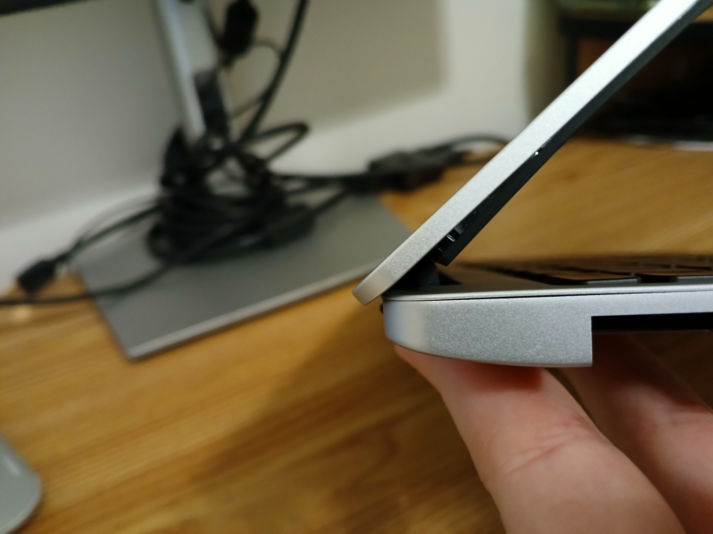
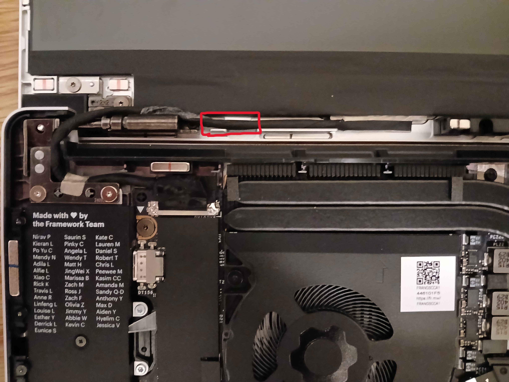

I was recently assembling a new DIY Framework 13 laptop, and the bezel was giving me more trouble than I anticipated. I encountered two problems, and both of them had to do with how the cables were routed underneath the bezel. Apparently this is a really common problem with no clear answers in the official guide, so I wanted to write up this quick guide in case others get stuck, too.

## Laptop Lid Won't Open

In my first attempt at installing the bezel, the display cable got pinched between the bezel's thick plastic piece and the bottom part of the display hinge. So when I closed the laptop lid, the cable stuck out ever so slightly out the back, something I didn't notice until later. When I then screwed the input cover into place and tried to open the laptop back up, there was a lot of tension between 40 and 70 degrees, and it felt like the bezel would snap if I applied any more force to the lid. To solve this, I:

1. Closed the lid,
2. Unscrewed the fasteners on the bottom of the laptop,
3. Gently removed the input cover, and
4. Laid the laptop flat upside down for a few minutes.

This made it easier for me to then remove the bezel without snapping it, and I was back to square one.

## Bottom Corner of the Bezel Detaches

In my second attempt, I made sure the cable wasn't sitting *below* the hinge, as that would cause it to get pinched again. But when I reinstalled the bezel, the bottom-left corner of the bezel still wasn't sitting flush with the display, and it would constantly pop out after I pressed it back in:

The DIY guide said:


If the bottom of the Bezel doesn't seem to fit, lift it back off and check that the cables are seated correctly on both sides. If the Bezel doesn't seem to fit at all, please contact support and do not force it into place.


Cool, except the guide didn't show how the cables were *supposed* to be routed.

If you take the bezel off and look along the bottom edge of the display, you should see plastic channels/clips right next to the cables. There are two sets of these slots, one on the left side and one on the right, for their corresponding cables coming out of the motherboard. Each cable is supposed to be routed through those channels/guides on the laptop cover. If they aren't, just take the cables and push them into those channels. Moreover, the cables should sit directly above the metal hinges that attach the top cover to the chassis—not directly on _top_ of the hinges (sandwiched between the hinge and bezel), and definitely not _below_ the hinges (where they'll get pinched). Here's what the correct routing looks like:

<figure>
  
  <figcaption>Note the raised plastic notches—you want to push the cable into this channel so it sits snug. Also, observe that the left part of the cable is above the hinge.</figcaption>
</figure>

Once your cables are routed correctly, you should be ready to reinstall the bezel. I recommend working from the bottom to the top rather than top down. That way, you ensure that the cables are seated correctly before moving on.
