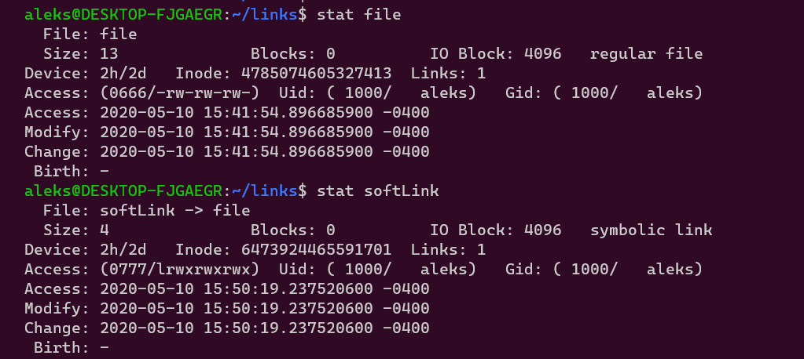
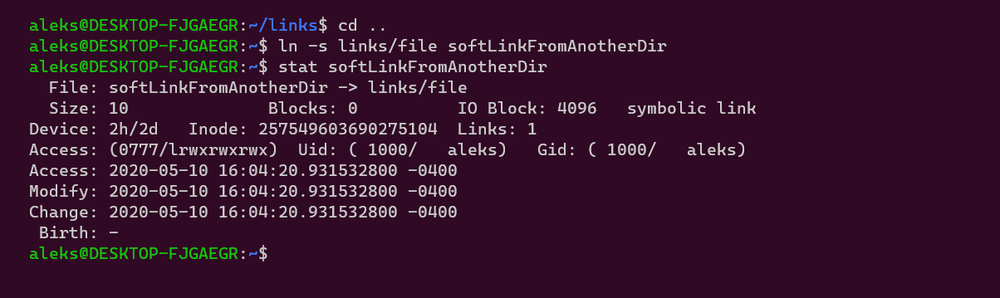

You may have heard the terms symlink or hard link in the context of Unix and Unix-like operating systems. But why do we need them, and what are the differences?

## Prerequisite Knowledge

For this tutorial, you'll need access to a Linux shell and familiarity with the following commands:

- `touch` and `echo` (and the output redirection operator `>`) for creating files
- `ls` for listing files in a directory.
- `cat` for printing the contents of a file.
- `stat` for viewing information about a file.
- `ln` for creating links (you'll learn how to use this).

## What Are File Links?

When we talk about files in English, we typically picture a folder, binder, or some other container that directly stores documents or information. But files in the _computer_ sense are nothing more than named entries in a directory.

A file does not directly store or point to its data. Instead, a file points to an intermediate data structure in computer memory called an **inode**.

Each file is associated with an inode, and inodes are packed full of rich information about the file's data, including:

- File attributes:
  - size in bytes
  - user/group to which it belongs
  - date created
  - date last modified
  - read/write/execute permissions
- Pointers to blocks on the hard disk containing the raw data.

So you can think of a file system roughly as follows:

```
Directory --> File (Name) --> Inode --> Raw Data on disk
```

<dfn>Linking</dfn> is the process of "referencing" or pointing to an inode in memory. That is, a "link" is just a pointer to an inode. When we create a file for the first time, the name that we assign it becomes the first link to its corresponding inode. Diagrammatically speaking, the link is the arrow between a file and its inode:

```
File (Name) --> Inode
```

Let's create a file with `echo Hello, links > file` and view information about its inode using the `stat` command:


Observe the line that reads `Inode: 4785074605327413`. This is an <dfn>inode number</dfn>: a unique numerical ID associated with an inode that's generated when the inode is first created.

Importantly, there can be multiple links to a single inode. The <dfn>link count</dfn> of an inode tracks the number of files that are pointing to it. Above, we see that the inode associated with `file` has a link count of `1`. This should make sense: If creating a file in turn creates an inode somewhere in memory that's associated with the file's data, then surely the inode's initial link count should be `1` and not `0`.

Keep an eye on that `1`—it'll change as we continue.


Have you ever heard that "deleting" a file in the traditional sense doesn't imply that the data is irretrievably lost? It's true! In technical terms, a file is considered to have been _truly_ deleted when its link count reaches zero. At that point, the space the file occupied is marked as writeable. But until that data is overwritten, computer forensic specialists could potentially recover its contents. To really delete a file, you'd need to [write over it with zeroes](https://www.lifewire.com/what-is-the-write-zero-method-2626052).



Directories themselves are special kinds of files—a sort of catalog of files. As it turns out, the starting link count for a new directory is actually `2`, not `1`. This is because **`.`** (which you can observe using `ls -a`) is a reference to the current directory. Thus, there are two references to every new directory: The directory name itself, and then the link **`.`** within that directory. Confused? [Take a look at this answer](https://Unix.stackexchange.com/a/101516/311005).


## 1. Symbolic Links

A <dfn>symbolic link</dfn> (also known as a "soft link" or "symlink") is a file like any other, but its data is special. Whereas regular files can be created at will—initially empty or with some contents—symbolic links cannot be created out of thin air. Rather, to create a symbolic link, you must associate it with some other file. Thus, a symbolic link's raw data is actually the path (relative or absolute) to its target file.

To create a soft link on a Unix system, you use the `ln` (link) command and supply the `-s` flag (for "symbolic"), followed by the original file name and the name of the soft link, in that order:


Now, let's run the stat command again on both files:



Observe the following:

- The original file (`file`) and the soft link (`softLink`) have different inode numbers. This means that they're actually two different files.
- The original file's link count didn't change. Again, this is because the soft link is an entirely new file that points to a different inode.
- The original file and the soft link have different file sizes. The original file's contents are `Hello, links` (`12` characters). Including the newline character from when we ran `echo`, this constitutes `13` bytes (hence `Size: 13`). As we mentioned above, a soft link's data is the path of the original file. In this case, it's just the string `file`, which has four characters and is therefore four bytes (hence `Size: 4`).

Let's also look at their contents using the `cat` command:


Even though the symbolic link's underlying data is the _path_ of the original file, running the cat command effectively _resolves_ or _follows_ the symbolic link and prints the contents of the original file: `Hello, links` instead of `file`. Naturally, this implies that if the original file's contents change, the result of running `cat softLink` will also change.


1. Change the contents of the original file. Note how its size changes, whereas the symbolic link's file size remains the same. However, both print the same text when `cat`-ed.
2. Create a file with a longer name. Then, create a symbolic link to that file. Can you determine what the size of the symbolic link will be in bytes?


### Symbolic Links to Files in a Different Directory

Let's see what happens if you create a soft link to a file that's not in the same directory:



This time, the symbolic link's file size is no longer `4` bytes. Rather, it's `10`: the length of the string `links/` (which is `6`) plus the length of the target file name itself (`4`).

### Link Rot

Because a symlink's data is the _path_ to the original file, there are two implications:

- If the original file is renamed or moved, the soft link will break.
- If the original file is deleted, the soft link will break.

<dfn>Link rot</dfn> is the official term for this "breaking" behavior. It refers to the fact that symlinks can end up pointing to nonexistent inodes.

Here's an example showing what happens when we move the original file:


Notice these two lines in particular for the soft link:

```
File: softLink -> file
Size: 4
```

The symbolic link is unaware of the fact that we moved the original file! So what happens if we `cat` the two files?


While the original file's contents are printed just fine, the terminal hints that something is wrong. We can see this with the `ls` command—the soft link's name now appears in red to indicate that it's rotten.

Before we move on to discussing hard links, note that there's an additional command you can use: `readlink`. According to the [man page for readlink](https://linux.die.net/man/1/readlink), this command prints the value of the symbolic link, which we know to be the path of the target file. Let's run this on our rotten symlink:


There's our problem! The symbolic link is still pointing to the original file name, in the same directory. But that file no longer exists because we moved it.

## 2. Hard Links

On the other hand, a <dfn>hard link</dfn> acts as an alias for the target file. It has the same file size and the same inode number but a different name. Creating a hard link for a target file will increment the link count for that file's inode. For these reasons, hard links are also known as physical links.

To create a hard link in Linux, we use the `ln` command and supply the `-P` flag (for "physical"):


Notice that both the original file and the hard link are `13` bytes in size, have the same inode number, have the same permissions, and have a link count of `2`. There are two links to the original file's inode: the original file itself, and the hard link we just created manually. In fact, notice that the results of `stat`-ing both the original file and the hard link are identical.

Unlike a soft link, a hard link will not rot if we change the original file's name or move it to a different directory because it points to that file's inode, whereas a soft link references the file's path. It also will not rot if we _delete_ the original file. Here's an example of moving the file:


Let's delete the target file and `cat` the hard link:


If we think back to what "deleting" a file really means, this should make sense: A file is not truly deleted until its corresponding inode's link count reaches zero. In this case, creating a hard link for the file increments its inode's link count to `2`. When we delete the original file, the link count goes down to `1`. Only if we now delete the hard link will the file reach a link count of zero and disappear.

### Limitations of Hard Links

[Hard links have two limitations](http://blog.serverbuddies.com/hard-links-have-two-limitations/) that symbolic links do not:

- You can't create a hard link to a directory, but you _can_ symlink to it.
- You can't create a hard link to a file that's on a different volume/disk partition.

It's a tradeoff: While symbolic links do not face these limitations, they are prone to rotting if the original file is renamed, moved, or deleted.

## Example: Linking Executables

So far, we've looked at creating hard links and soft links to plaintext files. More often, you'll be creating links to executables in Unix, which are just special kinds of files.

Recall from before that running `cat` on a soft link or hard link would essentially "follow" that link to the underlying file's inode and print its contents. This isn't behavior unique to the `cat` command, though. If we invoke any other command on a link, or we try to run it as an executable, it'll once again resolve itself to the referenced file.

If you take a look at `/usr/bin/`, you'll find many soft links to executables:


You can also create a custom link:


As expected, invoking the symlink invokes the underlying executable.

## Additional Exercises

1. What do you expect will happen if you change the permissions of a hard link using `chmod`? What about changing the permissions of a soft link?
2. What happens if you create a hard link to a soft link?

## References and Further Reading

- [Hard vs Soft Links in Linux (Linux Links)](https://www.youtube.com/watch?v=4-vye3QFTFo)
- [Explaining Soft Link And Hard Link In Linux With Examples](https://www.ostechnix.com/explaining-soft-link-and-hard-link-in-linux-with-examples/)
- [What is the difference between a symbolic link and a hard link?](https://stackoverflow.com/questions/185899/what-is-the-difference-between-a-symbolic-link-and-a-hard-link)
- [How to take advantage of symbolic links in Windows 10](https://www.techrepublic.com/article/how-to-take-advantage-of-symbolic-links-in-window-10/)
- _Modern Operating Systems_ by Tanenbaum, Chapter 4.2.4


