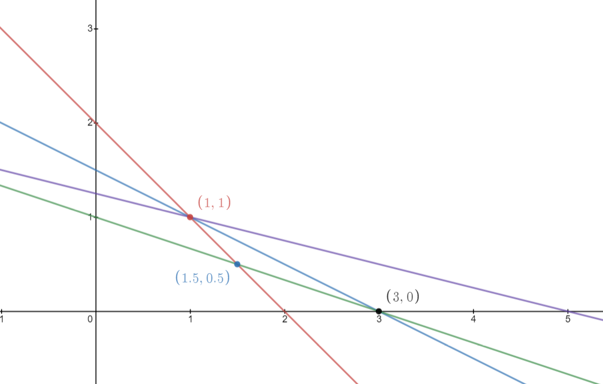
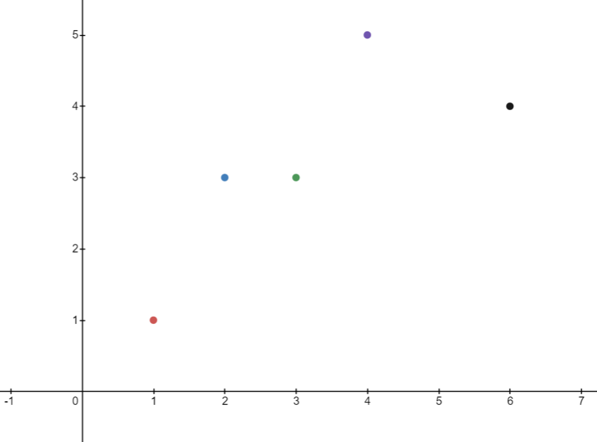
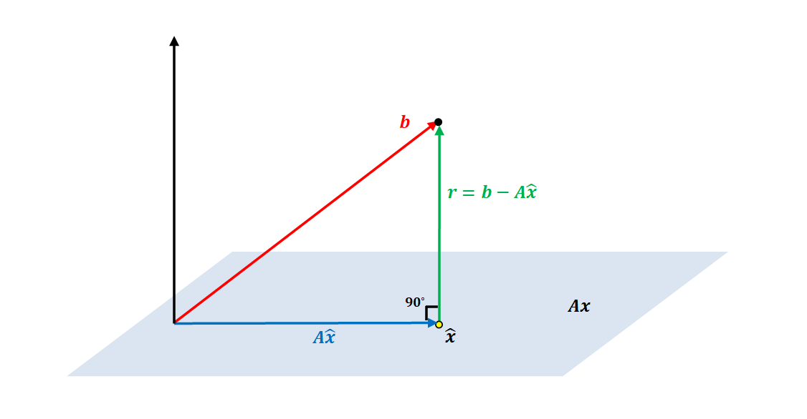
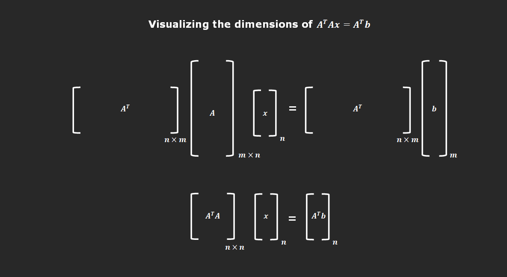
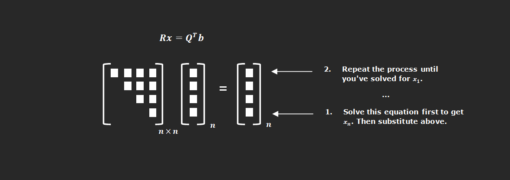

The method of least squares is a technique for solving systems of equations, but it can be difficult for beginners to grasp if not explained well. It's something that you'll remember by heart once you understand the intuition behind how it's derived. In this post, we'll look at the problem that motivates the least squares method and gain an intuitive understanding for how it works under the hood.

## What Is the Least Squares Method?

The **method of least squares** finds an approximate solution to a system of equations for which there is no exact solution. Let's look at why we need least squares with this simple example:

$$
x_1 + x_2 = 2 \\
x_1 + 2x_2 = 3 \\
x_1 + 3x_2 = 3 \\
x_1 + 4x_2 = 5
$$

We have four equations and two unknowns. We could perform row reduction, but since we only have two unknowns in this case ($x_1$ and $x_2$), we can also solve by substitution.


  At this point, you should be asking yourself: Which two pairs of equations should we use to solve for $x_1$ and $x_2$? Hang onto that thought—it's part of the issue of having more equations than unknowns. If we just had two equations and two unknowns, then we wouldn't run into this problem.


Let's rewrite the first equation in terms of $x_1$:

$$
x_1 = 2 - x_2
$$

Then, let's plug this into the second equation:

$$
(x_1) + 2x_2 = 3\\
(2 - x_2) + 2x_2 = 3\\
2 + x_2 = 3\\
x_2 = 1
$$

We have $x_2$, so now let's find $x_1$:

$$
x_1 = 2 - x_2\\
x_1 = 1
$$

At this point, we may be tempted to conclude that our solution is the following:

$$
x_1 = 1, x_2 = 1
$$

This happens to satisfy the first and second equations by design since we used them directly. It also satisfies the fourth equation by pure coincidence. But if you plug $x_1 = 1$ and $x_2 = 1$ into the third equation, you'll get a contradiction:

$$
x_1 + 3x_2 = 1 + 3 = 4 \neq 3
$$

So what went wrong?

The truth is that **there is no unique solution to this system of equations**. We can verify this visually by plotting our equations, which are really just lines in 2D (you can think of $x_2$ as our "$y$" and $x_1$ as our "$x$," or vice versa):

As this graph illustrates, there is no single point at which all of the lines intersect, meaning there's no solution that satisfies all four equations simultaneously. What we found is the red dot, $(1, 1)$. As we saw earlier, there are three equations for which this is a solution (blue, purple, and red in the graph above).

## Overdetermined Systems Don't Have a Unique Solution

The system of equations above is called an **overdetermined system**; such a system has more equations ($4$) than unknowns ($2$). If we denote the matrix's dimensions as $m \times n$, then an overdetermined system is one where $m > n$. Visually, this looks like a tall and thin matrix.

Here's the matrix form of our system above:

$$
Ax = b: \begin{bmatrix}
1 & 1 \\
1 & 2 \\
1 & 3 \\
1 & 4
\end{bmatrix}
\begin{bmatrix}
x_1 \\
x_2
\end{bmatrix} =
\begin{bmatrix}
1 \\
3 \\
3 \\
5
\end{bmatrix}
$$

As an exercise, try to find the inverse of the matrix $A$. (Spoiler: It's not possible!) This is [because $A$ is not a square matrix](https://people.richland.edu/james/lecture/m116/matrices/inverses.html). In general, **the matrix of an overdetermined system is not invertible**, meaning we can't solve for $x$ using the following traditional method:

$$
x = A^{-1}b
$$

This leads us to an important conclusion: An overdetermined system does not have a single, unique solution.


  **Takeaway**: If $Ax = b$ is an overdetermined system, then $A$ is not an invertible matrix. Consequently, there's no unique solution $x = A^{-1}b$.


As a direct consequence of this, an overdetermined system can either have:

- Infinitely many solutions, or
- No solutions at all (like in our example).

Here's an example where there are infinitely many solutions, if you're wondering how that's possible:

$$
x_1 + x_2 = 3\\
2x_1 + 2x_2 = 6\\
3x_1 + 3x_2 = 9
$$

This is an overdetermined system because there are three equations but only two unknowns. Notice that the second and third equations are just scaled up ($\times 2$ and $\times 3$) versions of the first one. This means that they're all the same line, and thus there are infinitely many points of "intersection."

## How Do We Solve Overdetermined Systems?

So far, we've seen that we can't solve an overdetermined system in the traditional sense. So what do we do? Let's look at the general form of an overdetermined system $Ax = b$. As a matrix equation, it looks like this:

$$

\begin{bmatrix}
a_{11} & a_{12} & \dots & a_{1n} \\
a_{21} & a_{22} & \dots & a_{2n} \\
\vdots & \dots & \ddots & \vdots \\
a_{m1} & a_{m2} & \dots & a_{mn}
\end{bmatrix}

\begin{bmatrix}
x_1 \\
x_2 \\
\vdots \\
x_n
\end{bmatrix}

=

\begin{bmatrix}
b_1 \\
b_2 \\
\vdots \\
b_m
\end{bmatrix}

$$


  **Note**: Although this system looks rectangular because of my notation, keep in mind that $m>n$.


As we've seen, this system has no *unique* solution—either there's no solution whatsoever, or there are infinitely many solutions. From a *computational* standpoint, neither of those are simple problems to solve. We like working with rectangular systems, where $m = n$, because they are computationally simpler to solve (relatively speaking).


  **Takeaway**: Overdetermined systems present a computationally difficult problem to solve because they have either infinitely many solutions or no solutions at all.


But we don't just throw up our arms in defeat if we're given an overdetermined system. Instead, we try to do our best—to find a value for $x$ such that no other $x$ will get us closer to approximating $b$. This is known as the **least squares solution** to $Ax = b$. It's not an *actual* solution like what we're used to. Rather, a least squares solution is about as close to a "real" solution as we can hope to get.


  **Takeaway**: A least squares solution is an *approximate* solution to a system of equations for which a unique solution does not exist.


## Least Squares Visualized

Before we look at the generalized graph of the least squares method, let's look at a simple example that you'll come across frequently in statistics classes on least squares regression. Suppose you're given this two-dimensional data set of $(x, y)$ pairs:

$$
(1, 1), (2, 3), (3, 3), (4, 5), (6, 4)
$$

Don't confuse these $x$ variables with the ones we saw earlier—just pretend for a second that you're back in algebra class and learning how to plot in the $xy$-plane.

If we plot these data points, we'll get the following graph:

These points appear to follow a linear shape, but it's not possible to plot a straight line that fits all of the points. But clearly, we can draw a **best-fit line** that at least gets as close to all of the points as possible:


  **Spoiler**: The solution is $y = 0.59459459x + 1.2972973$.


We won't concern ourselves right now with how that equation was actually obtained. Let's just represent it in its most generic form:

$$
y = \theta_1(x) + \theta_2
$$

We were given several $(x, y)$ pairs, so we can plug those into the above equation to get a *set of equations* that we want to solve in order to find the values for $\theta_1$ and $\theta_2$:

$$
1 = \theta_1(1) + \theta_2\\
3 = \theta_1(2) + \theta_2\\
3 = \theta_1(3) + \theta_2\\
5 = \theta_1(4) + \theta_2\\
4 = \theta_1(6) + \theta_2
$$

Our goal is to find values for $\theta_1$ and $\theta_2$ that will minimize the error of estimating the trend in the data with the imperfect equation $y = \theta_1x + \theta_2$. In other words, this is a least squares problem—we can't get an exact solution, so we try to find a "solution" that's as good as possible.

Let's represent this problem in matrix form:

$$
\begin{bmatrix}
1 & 1 \\
2 & 1 \\
3 & 1 \\
4 & 1 \\
6 & 1
\end{bmatrix}
\begin{bmatrix}
\theta_1 \\
\theta_2
\end{bmatrix} =
\begin{bmatrix}
1 \\
3 \\
3 \\
5 \\
4
\end{bmatrix}
$$

This was really an overdetermined system, $A\theta = b$, disguised as a bunch of $(x, y)$ data pairs! We have more equations than unknowns. This alone tells us that there is no unique solution and that we must find a least squares solution instead.


  Curious how I plotted the line for this particular problem? You'll learn more about [least squares curve fitting](/blog/least-squares-fitting) in the next post in this two-part series.


Let's generalize this problem. We start with an $m \times n$ system:

$$
\begin{bmatrix}
a_{11} & a_{12} & \dots & a_{1n} \\
a_{21} & a_{22} & \dots & a_{2n} \\
\vdots & \dots & \ddots & \vdots \\
a_{m1} & a_{m2} & \dots & a_{mn}
\end{bmatrix}

\begin{bmatrix}
x_1 \\
x_2 \\
\vdots \\
x_n
\end{bmatrix}

=

\begin{bmatrix}
b_1 \\
b_2 \\
\vdots \\
b_m
\end{bmatrix}
$$

And we consider the case where $n = 2$—that is, our solution will have just two components, $x_1$ and $x_2$ (these were $\theta_1$ and $\theta_2$ in the concrete example above):

$$
\begin{bmatrix}
a_{11} & a_{12} \\
a_{21} & a_{22} \\
\vdots & \vdots \\
a_{m1} & a_{m2}
\end{bmatrix}

\begin{bmatrix}
x_1 \\
x_2
\end{bmatrix}

=

\begin{bmatrix}
b_1 \\
b_2 \\
\vdots \\
b_m
\end{bmatrix}
$$

If $n = 2$ like it is here, $Ax$ ends up being a plane in a 3D space:

Notice that the vector $b$ falls outside this plane. In plain English, this means that there's no $x$ such that $Ax = b$. If we imagine for a second that we live in the 3D space of this graph, our walking surface would be limited to the plane itself. In other words, we would have no way of reaching $b$; the best that we could do is to navigate the plane itself.

Okay, so we can't get to $b$... Bummer. But can we get close? We sure can! And in fact, geometrically, that's exactly what the method of least squares does—it finds the point in the plane $Ax$ that's closest to $b$. From the image, we see that the closest point to $b$ is right under it—where the orthogonal projection of $b$ onto the plane actually touches the plane.

Let's define two things:

- $\hat{x}$ is the point in the plane $Ax$ that, when plugged in for $x$, gets us closest to $b$. It's what we call the least squares solution to $Ax = b$. Visually, it's on the plane $Ax$ and directly under $b$.
- $r = b - A\hat{x}$ is the residual vector, which is orthogonal to the plane $Ax$ as you can see above.

Now, let's revisit our matrix equation, $Ax = b$. We'll rewrite it using $A$'s column vectors, $a_1$ and $a_2$. Note that this changes absolutely nothing:

$$
\begin{bmatrix} a_1 & a_2 \end{bmatrix} \begin{bmatrix} x_1 \\ x_2 \end{bmatrix} = \begin{bmatrix} b_1 \\ b_2 \end{bmatrix}
$$

As we saw in the image earlier, the vector $r$ is clearly orthogonal to the plane $Ax$. By definition, this means that $r$ must be orthogonal to all vectors in the plane. And we know two vectors that lie in the plane: $a_1$ and $a_2$.

Now, if two vectors are orthogonal, then their dot product is zero. So let's write that out explicitly (using the [matrix notation for a dot product](https://mathinsight.org/dot_product_matrix_notation)):

$$
a_1^T r = 0\\
a_2^T r = 0
$$

These two are simultaneously true. We can express this using the following equivalent notation:

$$
\begin{bmatrix} a_1 & a_2 \end{bmatrix}^T r = A^T r = 0
$$

Time to start plugging some things in. Recall from above that we defined $r$ to be $b - A\hat{x}$:

$$
A^T r = 0\\
A^T(b - A\hat{x}) = 0\\
A^Tb - A^TA\hat{x} = 0
$$

Now move $A^TA\hat{x}$ to the other side. Doing so gives us this important equation:

$$
A^TA\hat{x} = A^Tb
$$


  **Summary**: The $\hat{x}$ here is known as the **least squares solution** to the system $Ax = b$. It's the point of intersection between the plane $Ax$ and the orthogonal projection of $b$ onto that plane.


At this point, you may have two related questions:

### 1. Why didn't we just multiply both sides of $Ax = b$ with $A^T$ and replace $x$ with $\hat{x}$ in the first place?

Well, sure—we could've done that. And in fact, now that we know that $A^TA\hat{x} = A^Tb$ gives us the least squares solution $\hat{x}$, this is indeed what we'll do in the future. In hindsight, though, we had no good reason to do so from the get-go. We only arrived at this trivial conclusion after considering the geometry of the problem, and by working through some algebraic substitution and simplification.

### 2. How does this actually change the problem?

This is a good question! After all, we multiplied both sides by the same quantity, $A^T$.

Recall that the matrix $A$ of an overdetermined system $Ax = b$ is tall and thin ($m > n$), and is therefore not invertible. How does multiplying both sides of the equation by $A$'s transpose change the situation?

Well, if we do that, here's what will happen to the dimensions of the problem:

Since this is a rectangular $n \times n$ system, we can solve for it by multiplying both sides by the inverse of $A^TA$:

$$
A^TA\hat{x} = A^Tb\\
\hat{x} = (A^TA)^{-1}A^Tb
$$

### The Pseudoinverse of a Matrix

And on that note, it's time for a quick definition.

This is the least squares solution to $Ax = b$ when it's an overdetermined system:

$$
\hat{x} = (A^TA)^{-1}A^Tb
$$

This is the solution to $Ax = b$ when it's a rectangular system:

$$
x = (A^{-1})b
$$

Notice the similarity? For this reason, we call $(A^TA)^{-1}A^T$ the **pseudo-inverse** of $A$.

## Least Squares and QR Decomposition

In practice, when working with floating-point systems, you should **never** compute the inverse of a matrix; doing so can result in a considerable [loss of significance](https://en.wikipedia.org/wiki/Loss_of_significance).

With a rectangular system $Ax = b$, it's true that the solution is $x = A^{-1}b$, but that's not how we actually compute it. Instead, we use a process known as Gaussian Elimination, which avoids computing $A^{-1}$ altogether.

Similarly, with an overdetermined system $Ax = b$, it's again true that the least squares solution is $x = (A^TA)^{-1}A^Tb$. But we shouldn't use this directly. In practice, what is often done instead is to first rewrite $A$ as a product of two special matrices to avoid the need for computing $A$'s pseudoinverse. Those two matrices are:

- $Q$, an $m \times n$ [orthonormal matrix](http://www.eng.fsu.edu/~dommelen/courses/aim/aim03/topics/linalg/matrices/inv/node2.html).
- $R$, an $n \times n$ upper-triangular matrix.

This process is known as [QR factorization](https://en.wikipedia.org/wiki/QR_decomposition) (or "decomposition"). It's exactly analogous to the process of factorizing numbers that you're already familiar with—for example, that $8 = 4 \times 2$. Except now, it's just with matrices: $A = QR$. QR factorization is what we call a "[numerically stable algorithm](https://en.wikipedia.org/wiki/Numerical_stability)," which is desirable because it helps us minimize the loss of significance due to our computations.

There's a pretty good [YouTube tutorial on QR factorization](https://www.youtube.com/watch?v=6DybLNNkWyE) if you're interested in learning more about it; I'll leave that up to you as an exercise since the explanation would require its own blog post.

But here's the important takeaway: Once you perform QR factorization and get $A = QR$, you can substitute this into the equation we saw earlier.

$$
A^TAx = A^Tb \\
(QR)^T(QR)x = (QR)^Tb
$$

Recall that $(XY)^T = Y^TX^T$:

$$
R^TQ^TQRx = R^TQ^Tb
$$

Next, we can use an important property of orthonormal matrices. If $Q$ is an orthonormal matrix, then $Q^TQ = I$, the identity matrix. And that simplifies the above quite a bit:

$$
R^TRx = R^TQ^Tb
$$

We have an $R^T$ on both sides, so those cancel and leave us with this:

$$
Rx = Q^Tb
$$

Now, we have an upper-triangular, rectangular system of equations that can easily be solved via back-substitution. What are the dimensions here?

- $R$ is an upper-triangular $n \times n$ matrix.
- $x$ is an $n$-vector.
- $Q$ is an $m \times n$ matrix (and thus $Q^T$ is $n \times m$).
- $b$ is an $m$-vector.

Once again, the dimensions work out to produce an $n \times n$ system. Notice how this system is conveniently set up such that all the computer has to do is work from the bottom up, first solving for $x_n$, then substituting that in the equation above and solving for $x_{n-1}$, and so on, all the way up until $x_1$:

And that's a much more numerically stable process than using $A$'s pseudo-inverse directly. In fact, notice that factorizing $A$ as $QR$ helped us to avoid computing the pseudo-inverse altogether!

## Summary

Here's the gist of what we covered in this post:

- Least squares finds the best approximation to a system of equations for which a unique solution does not exist.
- You find the least squares solution by solving for $\hat{x}$ in $A^TA\hat{x} = A^Tb$.
- You should use QR decomposition to rewrite $A$ as the product of two matrices: $A = QR$.
- Plug $A = QR$ into $A^TA\hat{x} = A^Tb$ and find $\hat{x}$ with back-substitution in $R\hat{x} = Q^Tb$.

And that's it! Hopefully things are starting to make a little more sense now.

[In another post](/blog/least-squares-fitting), we'll look at practical least squares applications and solve least squares data fitting problems by hand (and with Python!).


