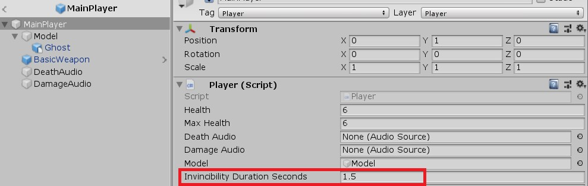
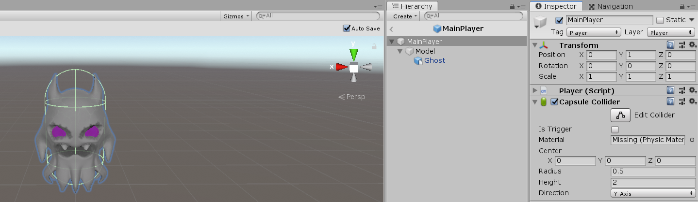
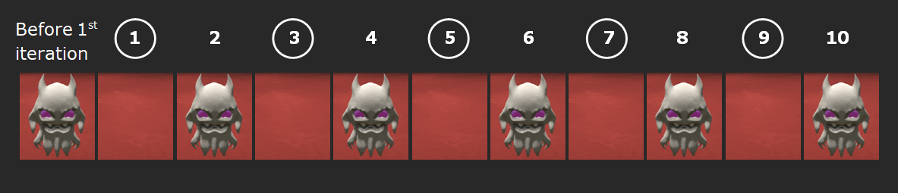

Many games, both old and new, use a popular mechanic known as **invulnerability frames** (aka i-frames) to make your player temporarily invincible when you take damage or perform some special action, like rolling or consuming a power-up. You'll find this mechanic in games like Dark Souls, Super Mario, The Binding of Isaac, and many others.

In this post, we'll look at how to create invulnerability frames in Unity. We'll also optionally make the player flash throughout the duration of their invulnerability. To keep things simple, I'll assume that you already have a method that can be used to grant your player temporary invulnerability (e.g., `LoseHealth`, `Roll`, and so on).

If you want to see this mechanic in action, check out [Embody](https://github.com/cap4053-cheeky-pixels/EmbodyGame), a game I developed with some classmates for the Artificial Intelligence for Games class at the University of Florida.



## Invulnerability Frames with Coroutines

The naive (wrong) approach is to run a `for` loop with an intentional delay between each iteration:

```csharp
void BecomeTemporarilyInvincible()
{
    for (int i = 0; i < invincibilityDurationSeconds; i += Time.deltaTime)
    {
        // do stuff here
    }
}
```

If you do this, the player's invulnerability frames will run out almost immediately as soon as they start, no matter how large of a number `invincibilityDurationSeconds` may be. Why is that?

In game development, you have to keep in mind that everything happens within a **frame update**. What this means is that most game engines have an `Update` method that runs the entire game's logic in "ticks." So, if you have a `for` loop like the one above, it'll complete all of its iterations in a single frame. Thus, any changes that need to last for a certain period of time—like invulnerability—will complete in a single frame and will therefore be imperceptible.

Instead, we want to use [coroutines](https://docs.unity3d.com/Manual/Coroutines.html) to implement invincibility frames in Unity. A coroutine is simply a method that runs in parallel to the main update loop and resumes where it left off in the next update.

We'll start by adding this method somewhere in our Player script:

```csharp {data-file="Player.cs" data-copyable=true}
private IEnumerator BecomeTemporarilyInvincible()
{
    // logic goes here
}
```

Notice that this method returns an `IEnumerator`; all coroutines in Unity do that.

We'll use a private member variable to keep track of whether the player is invincible:

```csharp {data-file="Player.cs" data-copyable=true}
private bool isInvincible = false;
```

When the player becomes invincible, we flip this flag to true:

```csharp {data-file="Player.cs" data-copyable=true}
private IEnumerator BecomeTemporarilyInvincible()
{
    Debug.Log("Player turned invincible!");
    isInvincible = true;
}
```

Of course, our code doesn't do anything meaningful just yet. You're probably wondering:

1. How do we start the coroutine in the first place?
2. How do we keep the coroutine running for a set amount of time?
3. How do we make the player flash while they're invulnerable to damage? (Optional)

All great questions! We'll address each one in turn.

### 1. Make the Player Invulnerable (Start the Coroutine)

Ready for this? It's actually really simple!

```csharp
void MethodThatTriggersInvulnerability()
{
    if (!isInvincible)
    {
        StartCoroutine(BecomeTemporarilyInvincible());
    }
}
```

For example, if players become invulnerable in your game when taking damage, you might do something like this:

```csharp {data-file="Player.cs" data-copyable=true}
public void LoseHealth(int amount)
{
    if (isInvincible) return;

    Health -= amount;

    // The player died
    if (Health <= 0)
    {
        Health = 0;
        // Broadcast some sort of death event here before returning
        return;
    }

    StartCoroutine(BecomeTemporarilyInvincible());
}
```

We immediately return if the player is already invincible. If they're not invincible, the player loses health. If the player died as a result of losing health, we set their health to zero, potentially fire off a death event, and return. Finally, if the player took damage but is still alive, we use `StartCoroutine` to initiate the coroutine that grants the player temporary invincibility.

If you want to initiate the invulnerability frames some other way, like when the player rolls or picks up a power-up, simply call `StartCoroutine` in that method like I demonstrated above.

### 2. Remain Invulnerable for a Fixed Period of Time

Our coroutine looks like this so far:

```csharp {data-file="Player.cs" data-copyable=true}
private IEnumerator BecomeTemporarilyInvincible()
{
    Debug.Log("Player turned invincible!");
    isInvincible = true;
}
```

Hmm... We don't want our player to be invulnerable to damage forever—that would be a pretty game-breaking "feature"! Instead, we want invulnerability to last for a fixed number of seconds and then wear off.

First, declare this private member variable at the top of your script:

```csharp {data-file="Player.cs" data-copyable=true}
[SerializeField]
private float invincibilityDurationSeconds;
```

Note that `SerializeField` lets you edit private members through the Unity inspector without having to make them public in your script. This is useful if you want to play around with the number while your game is running. That way, you don't have to tweak it in the script and restart your game.

Before we use this variable, we must initialize it via the inspector pane or in our `Start` method:



Then, we can simply use it like so:

```csharp {data-file="Player.cs" data-copyable=true}
private IEnumerator BecomeTemporarilyInvincible()
{
    Debug.Log("Player turned invincible!");
    isInvincible = true;

    yield return new WaitForSeconds(invincibilityDurationSeconds);

    isInvincible = false;
    Debug.Log("Player is no longer invincible!");
}
```

We pause a coroutine in Unity using `yield return new WaitForSeconds`, passing in the number of seconds to wait. After that time elapses, Unity will resume executing the coroutine, running any code after the `yield` statement. In our case, once execution resumes, the `isInvincible` flag will be set to `false`, and the coroutine will terminate until it's called again sometime in the future. Excellent!

Technically, this is really all that you need to implement invincibility frames in Unity. But what if you want to split the invulnerability across several time segments (simulated frames) so you can run some logic while the player is invincible? Currently, we really only have one invulnerability "frame" that acts as a delay between when we set `isInvincible` to `true` and when we set it to `false`.

If all you want to do is prevent the player from taking damage while they're invulnerable, and you don't want to run any other logic during that invulnerability, you're pretty much done—the next two sections are optional for you.

Otherwise, read on to learn how to create true invulnerability frames in Unity.

### 3. Creating Discrete Invulnerability Frames

To create discrete invulnerability frames, we're going to have to modify our coroutine slightly. Instead of yielding once for the entire duration, we're going to need to yield in increments using a loop.

Before we do that, let's add a second member variable at the top of our script:

```csharp {data-file="Player.cs" data-copyable=true}
[SerializeField]
private float invincibilityDeltaTime;
```

Again, go ahead and initialize this new variable via the Unity inspector or in `Start`. I recommend using values of `invincibilityDurationSeconds = 1.5` and `invincibilityDeltaTime = 0.15`, but you can use others, too.

Now, let's rewrite our coroutine to use a loop instead of just yielding once:

```csharp {data-file="Player.cs" data-copyable=true}
private IEnumerator BecomeTemporarilyInvincible()
{
    Debug.Log("Player turned invincible!");
    isInvincible = true;

    for (float i = 0; i < invincibilityDurationSeconds; i += invincibilityDeltaTime)
    {
        // TODO: add any logic we want here
        yield return new WaitForSeconds(invincibilityDeltaTime);
    }

    Debug.Log("Player is no longer invincible!");
    isInvincible = false;
}
```

Notice that we're no longer yielding for the entire duration of the invulnerability but instead for whatever time increment we specified:

```csharp
yield return new WaitForSeconds(invincibilityDeltaTime);
```

Essentially, we've broken up the entire invulnerability duration into discrete "frames" using a loop. The total duration still ends up being roughly `invincibilityDurationSeconds`, assuming you split up the interval evenly. I say roughly because the actual amount of time waited may not precisely match the amount of time specified. You can read more about this [in the Unity docs on WaitForSeconds](https://docs.unity3d.com/ScriptReference/WaitForSeconds.html).

How many frames do we have? With `invincibilityDurationSeconds = 1.5s` and `invincibilityDeltaTime = 0.15s`, this loop will run `1.5s / 0.15s = 10` times. In other words, we get 10 invulnerability frames (i-frames).

Feel free to play around with these numbers to find the sweet spot for your game. You could even change them programmatically based on the player's current stats (like how i-frames scale with your equipment load in Dark Souls 1-3).

Now that we have discrete invulnerability frames instead of just one big "frame" that waits for the full duration in one go, we can throw in whatever logic we want—like making the player model flash!

### 4. Making the Player Flash While Invulnerable

Making a player flash while they're invulnerable is a classic approach in old/retro games, as well as in games like The Legend of Zelda, Super Mario, The Binding of Isaac, and more. This is a great way to provide **visual feedback** to your user so they know to take advantage of their invincibility.

The easiest way to make a player flash in Unity is to repeatedly scale their model (or sprite, for 2D) between `0` and `1`. First, we need to actually get ahold of the player model:

```csharp {data-file="Player.cs" data-copyable=true}
[SerializeField]
private GameObject model;
```

For this tutorial to work, the Player should consist of a root object (e.g., `MainPlayer`) that has a Collider and the Player script attached to it. Nested under that object should be the player's model (e.g., `Model`) as a separate object, with whatever shaders, materials, sprites, etc. that you're using (in my case, that's the angry-looking ghost):



**This is important**! We're going to scale the sprite/model. You should not treat the root player object as the model. If you do, this could lead to some very game-breaking bugs, as we'd effectively end up scaling the collider too.

In your editor, drag and drop the model object into the appropriate slot in the Player script so that the script has access to it.

Next, we'll add a method that lets us easily scale this model:

```csharp {data-file="Player.cs" data-copyable=true}
private void ScaleModelTo(Vector3 scale)
{
    model.transform.localScale = scale;
}
```

And finally, we'll actually do the model scaling in our coroutine:

```csharp {data-file="Player.cs" data-copyable=true}
private IEnumerator BecomeTemporarilyInvincible()
{
    Debug.Log("Player turned invincible!");
    isInvincible = true;

    for (float i = 0; i < invincibilityDurationSeconds; i += invincibilityDeltaTime)
    {
        // Alternate between 0 and 1 scale to simulate flashing
        if (model.transform.localScale == Vector3.one)
        {
            ScaleModelTo(Vector3.zero);
        }
        else
        {
            ScaleModelTo(Vector3.one);
        }
        yield return new WaitForSeconds(invincibilityDeltaTime);
    }

    Debug.Log("Player is no longer invincible!");
    ScaleModelTo(Vector3.one);
    isInvincible = false;
}
```

Depending on the numbers you select for `invincibilityDurationSeconds` and `invincibilityDeltaTime`, you could end up in a situation where the player turns invisible on the frame where we set its scale to zero. So, we forcibly scale the model to one at the very end:

```csharp
Debug.Log("Player is no longer invincible!");
ScaleModelTo(Vector3.one); // here
isInvincible = false;
```

How many times will the player model flash? Since it alternates between two visibility states (visible or invisible) across a total of 10 invulnerability frames, there will be `10 / 2 = 5` flashes in total:



Again, you can tweak the number of frames and flashes by playing around with the numbers.

That's it—you're all set to use invincibility frames in Unity!

## Can You Use This Approach in Other Game Engines?

Yes and no.

In game engines like Unreal, there is unfortunately no support for coroutines. As an alternative to this approach, you can keep track of the time that has elapsed since invulnerability was initiated, across multiple `Update` frames, using simple deltatime calculations. (This approach differs from the naive one mentioned in the intro because it doesn't use a loop.)

Godot, on the other hand, [does have them](https://docs.godotengine.org/en/3.1/getting_started/scripting/gdscript/gdscript_basics.html#coroutines-with-yield).

I hope you found this tutorial helpful!

## Attributions

This post's social media preview image uses the Unity logo under fair use; it is under the copyright of Unity Technologies. I am not affiliated with Unity.
