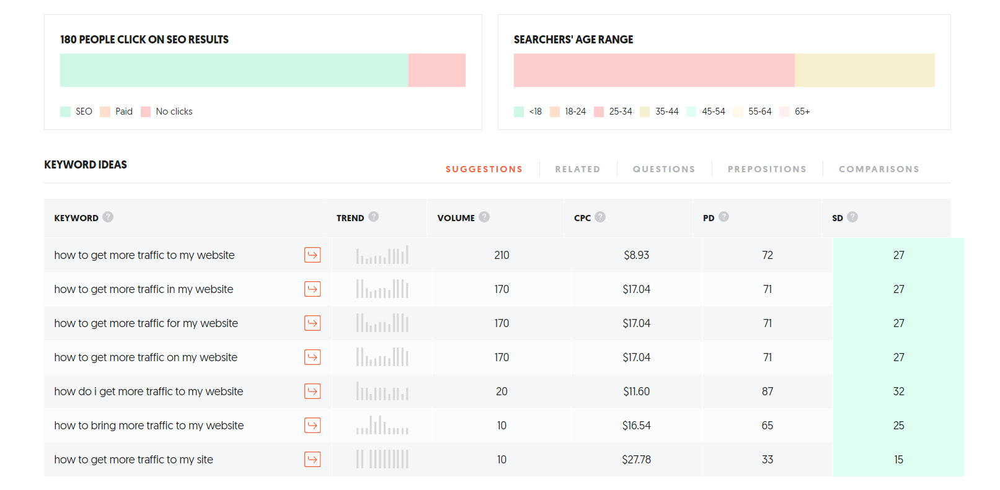
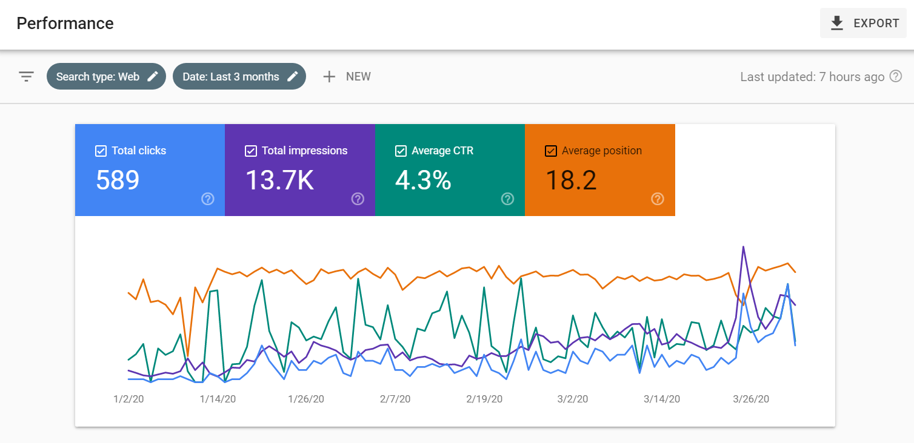
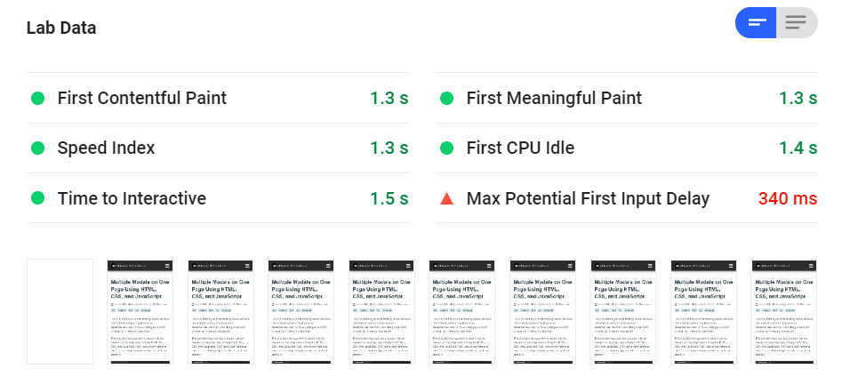
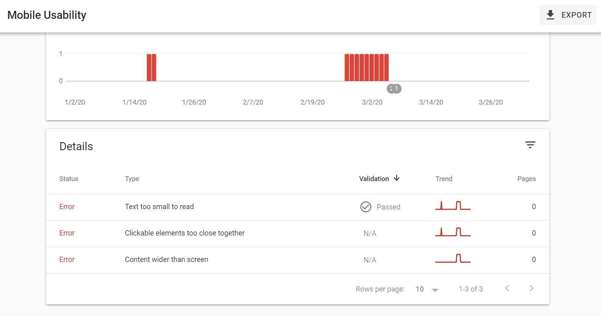

**Search engine optimization** (SEO) is the art of making strategic improvements to a site's content or performance in order to rank higher in search results and attract more traffic.

If you're just getting started with blogging—and even if you've been doing it for a while—you may not know how to get more traffic on your website. You may have heard about SEO before or done a bit of reading on the subject. It's a massive industry, and trying to write an exhaustive guide on SEO blogging best practices would require an entire book (or two... or lots).

Instead, what I hope to do here is share some SEO blogging tips based on my own experience and knowledge of SEO. I do regular freelance editing work with digital marketing agencies, and most of their content happens to be about SEO best practices in their industry. So I've certainly picked up some solid tips here and there as I've read their content.

But I've also done some independent reading and research to improve my own blog's SEO. Some of those attempts have led to a substantial increase in traffic to my blog posts:

<figure>

<figcaption>March 25th happened to be the day on which I used <a href="#9-add-schema-markup-json-ld-to-your-blog">tip #9</a>.</figcaption>
</figure>

Let's look at some ways you can drive more traffic to your site.

## 1. Create Useful, High-Quality Content

At the end of the day, one of the best SEO blogging tips is a recommendation straight from Google itself: **Create high-quality content**. After all, what use is there in repeating what countless other people have already documented ad nauseam, or churning out low-quality posts for the sake of inflating your blog's apparent value?


  Creating compelling and useful content will likely influence your website more than any of the other factors discussed here. Users know good content when they see it and will likely want to direct other users to it.


Ask yourself this question as you're working on a blog post: If I came across this years ago as I was trying to learn more about X, how would I feel as a reader? Would I be frustrated that it simply regurgitates what millions of other blog posts have already failed to teach me? Or would I be thrilled to have finally found a comprehensive resource unlike others on the market?

You want to delight your readers by creating genuinely useful or entertaining content. It doesn't matter how much effort you put into improving your blog's SEO if your content is junk—your site will just drown in a sea of similar low-quality content.

While we're on the topic of creating quality content, you'll also want to sprinkle in a healthy dose of **evergreen content** on your blog. [Evergreen content stands the test of time](https://ahrefs.com/blog/evergreen-content/) and is usually more consistent at driving traffic to your website because it remains a topic of interest no matter what the current trends may be in your space. In contrast, if you focus on writing about topics that are only relevant in the current month or year, you may certainly get a lot of traffic, but you'll also need to keep up as times change and refresh your now-outdated content.

Finally, ask yourself a second, equally important question: Am I rushing my content just for the sake of getting it published as soon as possible, or am I putting in as much time and effort as it takes to really dig deep and provide value to my readers, even if it means delaying a post until it's truly ready to go live? Quality is far more important than quantity for an SEO-friendly blog. It's not a race—put in the time and effort, and you'll reap the rewards.

## 2. Use Your Primary Keyword Naturally

Your **primary keyword** is the keyword that you've selected that you want your site to rank well for. It should be used wherever it's natural to do so—in your title tag, URL, meta description, headings, and, of course, the actual body itself. This increases that keyword's **density** on your page—the number of times it's used as a percentage of all words—which helps search engines like Google to perceive the relevancy of your content.

However, what you shouldn't do is stuff your keyword anywhere and *everywhere*. Treat your primary keyword like you would salt: Use it excessively, and your dish will be ruined. Use it sparingly and judiciously, and it'll add flavor to an otherwise bland meal.

<figure>

<figcaption>Google's exaggerated (but nonetheless illustrative) example of <a href="https://support.google.com/webmasters/answer/66358?hl=en">keyword stuffing</a>.</figcaption>
</figure>

As far as SEO blogging tips are concerned, this is one to live by: Don't engage in **keyword stuffing**—it's a cardinal sin, and Google *will* strike your page if it suspects that you're engaged in this practice. Your blog's ranking will be less than favorable, to put it lightly.

I get it: There's a keyword that you really, *really* want to rank for. But you have to keep in mind how your content is going to sound if it repeats the same words two, three, four times in the same paragraph. Robotic, desperate, mentally unstable—these are just a few of the words that come to mind when I read the cigar example.

To create SEO-friendly content, focus on using your primary and secondary keywords naturally. If you can't come up with a way to squeeze them into your writing, flag those paragraphs and come back later. Sometimes, all it takes is a slight shift in perspective—like posing a question or using a passive voice—to incorporate your keyword naturally into your writing.

Speaking of keywords... How do you pick the right ones for your blog post?

## 3. Use Keyword Research Tools

Do you just compose the first title that comes to mind and hope that you'll somehow show up on the first page of Google? If so, you need to rethink you approach—because chances are that you could be trying to compete with sharks that have been swimming in those waters far longer than you have.

<figure>

<figcaption>Good luck ranking for this keyword, unless you have tons of backlinks and a good domain score.</figcaption>
</figure>

You need to first gauge the demand for a particular topic of interest. You want to try to rank for keywords that have high volume and low competition. Alternatively, you can try to rank for keywords that have low volume and low-to-medium competition that are still related to your primary topic, but with a much narrower scope. Try using **long-tail keywords**—search phrases that are multiple words in length. They're effective in competitive spaces because they target a very specific **search intent**.

<figure>

<figcaption>You're much more likely to rank for this granular, long-tail keyword.</figcaption>
</figure>

As an analogy, trying to rank for the first keyword in the screenshots above would be like a fisherman going out to sea with a small net, docking next to a large fishing vessel, and trying to catch big game. Using a more targeted approach is akin to that same fisherman staying near the shore and spearfishing—he'll see fewer (and smaller) fish, sure, but he'll also have fewer competitors.

Of course, this isn't a skill you'll develop overnight, and all of this is much easier said than done (if it were trivial, people wouldn't be paid to do SEO work professionally!). The "competition" bit is the hardest to measure if you don't have access to the data or fancy (often paid) tools. So your best bet, as a casual blogger, is to **focus on keyword volume and relevancy**.

A good first step is to use Google itself and enter a few phrases that you would use as a reader if you were to search for whatever topic you're writing about. To some extent, you can rely on Google's search suggestions for keyword inspiration, but this has one notable drawback: It doesn't give you any numbers for *how many* people are searching for those topics.


Your next best bet is to use either a free or paid keyword research tool to glean keyword volume and cost-per-click (CPC) data as a rough estimate of a keyword's value and competitiveness.


  CPC is the average amount of money that marketers pay to rank their content for a particular keyword via Google Ads. The higher the CPC for a keyword, the more likely it is that it's viewed as a valuable source of traffic among your competitors.


Back when it was free, [Keywords Everywhere](https://keywordseverywhere.com/) did wonders for me and was an excellent source of keyword data. Unfortunately, it's now a paid-only tool.

However, there are still lots of [free SEO tools](https://neilpatel.com/blog/free-seo-tools/) that you can use to do basic keyword research. My two favorite options are Google Trends and Neil Patel's Ubersuggest.

[Google Trends](https://trends.google.com/trends/?geo=US) is actually a hidden gem. It's a free SEO tool that you can use to gauge interest in a search term. You can narrow this down by geography, compare multiple keywords side by side, specify a time frame, and even narrow down the search method (e.g., Web Search vs. Image vs. YouTube). While this is far from being a sophisticated tool, it's nonetheless insightful.


[Ubersuggest](https://app.neilpatel.com/en/ubersuggest/) is also useful because it lets you run SEO audits to see if your site has any critical errors that could be hurting your ranking. It also has a basic keyword planner and research tool built in that gives you volume and CPC data, as well as a rough estimate of a keyword's search difficulty (that is, the difficulty of trying to rank for that keyword without paying for ads).



The really great thing about Ubersuggest is the **Keyword Ideas** section, where you'll see related variations of the keyword that you searched for. This is super handy for finding better keywords and identifying potentially lucrative long-tail keywords.

## 4. Set Up a Google Search Console Account

Even before your site starts getting traffic, it's a good idea to set up a Google Search Console Account. It's 100% free and allows you to claim ownership of your website so you can track metrics like the number of impressions, number of clicks, your click-through rate, and your average position in Google search results.



You also get a breakdown of the following by number of impressions and clicks:

- Search queries used to land on your page.
- Specific pages and how well they're performing.
- The countries from which your traffic originates.
- The devices used on your website (desktop, mobile, or tablet).
- The number of impressions and clicks, broken down by date.

The first metric in that list—the queries that are generating impressions and clicks—is especially useful because you may sometimes find that you're still getting impressions and clicks for a related keyword that you're not yet targeting. This can allow you to tweak your SEO for one or more blog posts and try to rank for secondary keywords [without disrupting your position on your primary keywords](https://www.linkedin.com/embed/feed/update/urn:li:ugcPost:6600036584249262080).

## 5. Create SEO-Friendly Title Tags

The title tag is what shows up in search engine results and in the browser tab when your page is opened. It's one of the most important elements for SEO because it tells users—and search engines—what your page is about. This helps Google to determine how relevant your blog post is to a user's search intent.

Here are some tips for writing SEO-friendly blog titles:

- Try to keep it under 60 characters (though [the real display length is currently 600 pixels](https://moz.com/learn/seo/title-tag)).
- Use your primary keyword as early as possible to ensure that it's prominently visible.
- Describe the benefit or advantage provided by your content that separates it from the noise.
- Avoid stuffing multiple keywords into the title.

If you're not sure about any of these for a blog post, you can use a tool like [Portent's SERP Preview Tool](https://www.portent.com/serp-preview-tool/) to test different URLs, title tags, and meta descriptions.

Learn more about writing effective title tags:

- [How to Create Search Engine Friendly Title Tags](https://neilpatel.com/blog/title-tags-seo/)
- [Moz SEO Learning Center - Title Tag](https://moz.com/learn/seo/title-tag)
- [What Are Title Tags and Do They Matter?](https://www.woorank.com/en/edu/seo-guides/title-tag-seo#how-do-i-use-title-tags-for-seo)

## 6. Improve Your Site's Load Speed and Mobile Usability

If you want to run an SEO-friendly blog, you shouldn't just focus on the quality of your content and all of the other considerations we've looked at so far; you also need to monitor your site's performance and user experience (UX). You never know who your reader is going to be tomorrow—you don't want to introduce any unnecessary barriers that could make them bounce and hurt your traffic!

To improve your blog's SEO, you'll want to make sure that it loads quickly on all devices (mobile, desktop, tablet) and remains usable on all devices, especially mobile.

### Page Load Speed SEO

**Page load speed** is an important metric considered by search engines like Google, and optimizing it is definitely important for an SEO-friendly website. Use a free tool like [PageSpeed Insights](https://developers.google.com/speed/pagespeed/insights/) to identify performance bottlenecks on your site:



Here's how to improve page load speed on your blog:

- Use modern image formats like WebP for images and GIFs
- Properly size images. Cloudinary has an excellent (free) [website speed test tool](https://webspeedtest.cloudinary.com/), with a focus on scoring your images based on their actual vs. rendered resolution.
- Defer loading of resource-intensive assets like images and videos until the user has scrolled to them (e.g., using the `IntersectionObserver` API).
- Reduce the number of scripts and unnecessary third-party dependencies (e.g., jQuery, Bootstrap, FontAwesome). Alternatives: Vanilla JS, pure CSS, and SVGs.
- Use an efficient cache policy for assets like stylesheets, images, and scripts (this may be out of your hands—for example, GitHub Pages has a caching policy set to just 10 minutes).
- Avoid an excessive DOM size, if possible.

Of course, this is just for starters—there's a lot more that you can do beyond this.

### SEO Blogging Tips for Mobile Usability

While we're on the topic of improving your blog's user experience, you also shouldn't ignore mobile users just because you're developing primarily on a desktop device. An SEO-friendly blog definitely needs to provide a frictionless, responsive mobile experience.

In fact, Google uses **mobile-first indexing**, meaning if your site performs poorly on mobile devices but works great on desktp devices, [you'll still rank poorly in search results](https://neilpatel.com/blog/mobile-first-indexing/).

Nearly everything we do these days is going mobile—in fact, roughly 17% of the clicks and 15% of the impressions that I've gotten on my own blog have come from mobile devices. That's a sufficiently large reader base that I wouldn't want to ignore. Fortunately, I built my site with a [mobile-first approach](https://www.uxpin.com/studio/blog/a-hands-on-guide-to-mobile-first-design/) to avoid the headache of trying to squeeze in mobile at the last minute.

Not sure about your blog's mobile user experience? The first obvious step is to actually test it yourself on a mobile device that you own. You can use a well-established, secure service such as [ngrok](https://ngrok.com/) if you want to run your localhost on your phone, for example.

Beyond manual testing, you can take advantage of the free [Mobile Usability Report](https://support.google.com/webmasters/answer/9063469?hl=en) right there in your Google Search Console account:



If clickable elements are too close on the mobile version of your site, or if the font size is too small to be read, or if there are any other issues affecting your site, those will be flagged as errors, and they could end up hurting your ranking on Google if they remain unfixed.

Most of your SEO efforts for mobile usability will have nothing to do with keywords and content optimization—the meat of the work here concerns *design*.

For example, your font size should scale such that it's decently large on wide resolutions but small enough on mobile devices so your headings don't take up, say, 50% of the limited real estate in a user's palm. At the same time, your font size shouldn't be so small on mobile that it's difficult to read. If you're not sure where to get started with this, Smashing Magazine published an excellent guide on how to add [responsive and fluid typography](https://www.smashingmagazine.com/2016/05/fluid-typography/) to your site.

You'll also want to settle for a [web-safe font stack](https://www.cssfontstack.com/) instead of linking to that fancy type that you've been eyeing on Google Fonts for so long. The performance gain here is noticeable, but it will only save you one or two points in PageSpeed Insights, so you could consider it negligible. Only go for a non-native font if it's a strong part of your brand identity.

Finally, you should keep in mind that there are thousands of device vendors out there—Apple, Microsoft, Samsung, Canonical, and more. If it fits into your budget, consider subscribing to a service like [BrowserStack](https://www.browserstack.com/). I personally haven't purchased their paid plan; I used the free trial to test how my site looks on Mac and Linux devices since I'm on Windows.

As a final word of caution, don't forget to always test any changes that you introduce on a mobile device, no matter how miniscule they may seem. When developing your site, it's far too tempting to forget about mobile and focus on the desktop experience. Use your browser's dev tools to select specific mobile device resolutions with which to test your site.

## 7. Repurpose Old Content

Do you feel like you've run out of content ideas?

There's a pervasive belief among bloggers, entrepreneurs, and artists that their work needs to be truly novel to be received well by their audiences and users. The truth is that there's very little untapped innovation out there waiting to be discovered.


Just because you've already written about a certain topic doesn't mean that you can't *continue* writing about it. Break up your existing content into bite-sized blog posts offering advice, sharing mini-tutorials, or providing value in some shape or form. SEO-friendly content isn't just about providing one-off gems that do really well: They're about developing a strategy that provides *continuous* value to your readers.

One effective strategy is to [create a content pyramid](https://www.webmechanix.com/seo-without-backlinks/). Basically, you'll want to have a single piece of content on a certain topic of interest that goes above and beyond in delivering in-depth insights and quality. Then, create related pieces of micro-content and have them link back to that one post that you really want to drive traffic to. Like the stones at the base of a pyramid, these smaller pieces of content will help prop up your higher quality piece so it performs better than it would've on its own.

Here are some ideas for repurposing your blog content:

- Start a YouTube channel and create a video for some or all of your old posts. This will keep your content fresh and help attract traffic from an additional source.
- Create a free e-book that compiles some of your best advice on a subject, or that offers new insights you haven't yet shared with your readers. You could use this as an opportunity to collect readers' emails and, with their permission, set up an email campaign to send them regular content updates.

Learn more about [repurposing old content for SEO](https://neilpatel.com/blog/does-repurposing-content-work-heres-a-data-driven-answer/).

## 8. Cross-Post Your Articles on Other Sites

You definitely want to drive organic search traffic to your blog through SEO, but this is by no means the only way to grow your reader base. Another effective strategy is to syndicate your content on other sites and link back to the post on your own website. But there are some important factors to consider before you do this.

### Give Google Time to Index Your Blog Post

You published your latest masterpiece. Do you immediately run off to other sites and repost it? If so, you could very well be killing traffic to your site because Google will flag those pieces as **duplicate content**. It'll have to pick which one it considers to be the original piece, and that may end up not being your own blog post, which is not what you want.

Instead, what you want to do is give Google time to index your site and only repost your content about a week after it's appeared in search results. Be sure to add a **canonical link** to your blog post's `head` element; this helps Google to identify the "real deal" among seemingly duplicate content on different sites:

```html
<link rel="canonical" href="myawesomeblog.com/blog/a-blog-post" />
```

### Target Niche Forums and Social Media

Some of the best places to link back to your own content include StackExchange, Quora, and Reddit.

**StackExchange** and **Quora** both have very, very high domain authority for anything that seems like a question—so high that you'll usually see their links pop up in the #1 and #2 positions in Google search results. This is especially true for StackOverflow questions.


If you've written a blog post answering a question that doesn't seem to have many high-quality answers on Quora or StackExchange, you could post your own answer on an existing question that's attracted considerable traffic (e.g., in the thousands). If you provide an insightful answer, you may end up driving some traffic to your blog.


  **Note**: If you're answering a question on StackOverflow, or any other forum where the quality of posts is moderated, be sure to include the full source code so your answer isn't flagged as incomplete. You could omit some details about how your solution works and link back to your blog post for anyone who wants to understand it better.


Another potential gold mine is **Reddit**, but you do have to be cautious when reposting your content in a sub. Redditors don't tend to appreciate overt self-advertisement, especially if you don't have a lot of karma. Your goal is to just be a nice guy (not the `/r/niceguys/` kind of nice) and help people. For example, if you spot a thread where a user is asking for advice or has encountered a problem that one of your blog posts happens to address, you can offer your perspective in the comments and link to that relevant post. This is more likely to be received well than if you were to simply create a standalone post promoting one of your articles, without any context. The idea here is to actually get involved in a sub and engage with people instead of merely trying to use them for your own gain.

And then, of course, you have certain social media like Twitter, Medium, and LinkedIn. The latter is a great option for any in-depth, informative articles you've written, especially if they're geared toward working professionals or if you're offering career advice. Beyond those, there are more niche sites where you could share your posts, like Dev.to for technical content.

At the end of the day, this SEO blogging tip is only effective if you target the right audiences with the right kinds of tailored content. Don't expect to just advertise yourself in some corner of the internet and strike gold the next day. Be patient, and you'll be rewarded.

## 9. Add Schema Markup (JSON-LD) to Your Blog

Sometimes, search engines need a helping hand to understand what a piece of content is about.

Google already relies on the structure of your page—your title tag, the description, headings, and the actual body content—to understand what you're writing about and whether that's relevant to a search query a user has entered.

But you can also include **schema markup** in your HTML to inform search engines of the type of content you've published and any of its particular details, such as the headline, the author, the date published or modified, and so on. Here's an example from [Google's docs on structured data](https://developers.google.com/search/docs/data-types/article#examples):

```html {data-copyable=true}
<script type="application/ld+json">
    {
      "@context": "https://schema.org",
      "@type": "NewsArticle",
      "mainEntityOfPage": {
        "@type": "WebPage",
        "@id": "https://google.com/article"
      },
      "headline": "Article headline",
      "image": [
        "https://example.com/photos/1x1/photo.jpg",
        "https://example.com/photos/4x3/photo.jpg",
        "https://example.com/photos/16x9/photo.jpg"
       ],
      "datePublished": "2015-02-05T08:00:00+08:00",
      "dateModified": "2015-02-05T09:20:00+08:00",
      "author": {
        "@type": "Person",
        "name": "John Doe"
      },
       "publisher": {
        "@type": "Organization",
        "name": "Google",
        "logo": {
          "@type": "ImageObject",
          "url": "https://google.com/logo.jpg"
        }
      },
      "description": "A most wonderful article"
    }
</script>
```

Simply stick this anywhere in your HTML for each blog post that you publish.

If you're using a static site generator like Gatsby or Jekyll, you should be able to define this as a template in one place so you don't have to copy-paste it for every single blog post. For example, my website was built with Jekyll, and I have the following in my `_layouts/post.html` layout file:


```html {data-file="_layouts/post.html" data-copyable=true}
<script type="application/ld+json">
  {
    "@context": "https://schema.org",
    "@type": "BlogPosting",
    "mainEntityOfPage": {
      "@type": "WebPage",
      "@id": "{{ site.url }}{{ page.url }}"
    },
    "headline": {{ page.title | escape | jsonify }},
    "image": ["{{ site.url }}/assets/images/posts/{{ page.slug }}/thumbnail.png"],
    "datePublished": {{ page.date | jsonify }},
    "dateModified": {{ page.last_updated | jsonify }},
    "author": {
      "@type": "Person",
      "name": "{{ site.author }}"
    },
    "publisher": {
      "@type": "Organization",
      "name": "{{ site.title }}",
      "url": "{{ site.url }}",
      "logo": {
        "@type": "ImageObject",
        "url": "{{ site.url }}/assets/images/favicon.png"
      }
    },
    "description": {{ page.description | strip_newlines | strip | jsonify }}
  }
</script>
```


Use Google's [Structured Data Testing Tool](https://search.google.com/structured-data/testing-tool/u/0/) to verify that your schema markup is free of errors.

## Wrap-Up: How to Get More Traffic with SEO

So clearly, there's quite a bit involved in creating an SEO-friendly blog, and it's certainly not something you can roll out overnight. But everyone has to start somewhere! Put these best practices to use and keep an eye on your key metrics. Be wary of trying too many things at once, especially if there's chance that you may introduce breaking changes.

I hope these tips help you get more traffic on your website. Good luck!


