Have you ever wondered how a website remembers who you are when you navigate between different pages or close the site and come back later? What does that "Remember me" checkbox really do? Why do you need to log back into your account when you use a different browser or device, and what does logging out actually do?

To answer all these questions, we need to understand **HTTP cookies**—you know, those things that a support rep once told you to clear, along with [your hard-earned money](https://en.wikipedia.org/wiki/Cache_(computing)). In this introductory guide, we'll learn what HTTP cookies are, how they get created, how to work with cookies in JavaScript, some security issues related to cookies, and much more.



## Prerequisites

- A basic understanding of [the HTTP protocol](https://developer.mozilla.org/en-US/docs/Web/HTTP/Overview).
- Experience using developer tools in a modern web browser.
- Basic experience with JavaScript.

We'll briefly review some of these topics.

## How the Web Works: The HTTP Protocol

<!-- ## How Does a Website Remember Who You Are? -->

To end users, a website may seem like one cohesive experience thanks to login functionality, especially in a [single-page application](https://developer.mozilla.org/en-US/docs/Glossary/SPA) that doesn't route you to a different page when you click a link. Even in traditional multi-page applications, certain information seems to follow you around as you navigate from one page to another:

- The fact that you're currently logged in.
- Your shopping cart, if you're on an e-commerce website.
- Certain kinds of user preferences and local settings.
- Personalized advertisements based on prior browsing sessions.

But in reality, a website is nothing more than a collection of distinct resources that are hosted on a web server—a computer whose job is to listen for incoming requests from clients and serve up the requested content. There is no inherent relationship between different pages of a site other than the fact that they are all hosted on the same domain.

For example, when you loaded this article that you're reading right now, your browser requested the page's HTML document from my web server. The server then responded with the page itself as well as some metadata describing its response (known as <dfn>HTTP response headers</dfn>—more on these shortly). As the browser began parsing the page to build the [Document Object Model (DOM)](https://developer.mozilla.org/en-US/docs/Web/API/Document_Object_Model), it encountered other resources along the way—like images, stylesheets, JavaScript, fonts, and more—and requested those resources from the server. Thus, navigating to a different page on a site initiates a new HTTP request to fetch that resource (and potentially any related resources) from the web server.

### HTTP Is Stateless

The HTTP protocol by itself is <dfn>stateless</dfn>, meaning a server does not keep track of any of your prior HTTP requests for the purposes of matching future requests to previous ones. Likewise, the HTTP protocol has no notion of logins or user credentials. So how does a server know who you are when you navigate from one page to another? For example, how does it persist your signed-in state?

Browsers have a few different options for tracking your identity, as well as managing what's known as your <dfn>session state</dfn>: information about your current browsing session. In this article, we'll explore one storage API that allows clients and servers to share state: HTTP cookies. Before we look at cookies, let's review HTTP request and response headers so we can understand how cookies are used.

### HTTP Request and Response Headers

The HTTP protocol is driven by client requests and server responses: A user agent (like a user's browser) sends a request to a server; the server then responds with the requested resource. Both requests and responses can specify a body, such as a form payload to deliver or the resource to return. But requests and responses also include metadata describing themselves; these are known as <dfn>HTTP headers</dfn>.

For example, an HTTP request will typically specify these headers (among others):

- `User-Agent`: the client making the request (e.g., `AppleWebKit/537.36`).
- `Accept`: MIME types for content that the client will accept (e.g., `text/html`).
- `Accept-Language`: the client's preferred language and locale (e.g., `en-US,en`).

Conversely, servers send back an HTTP response containing the requested resource along with metadata describing the response. This information appears in response headers. For example, servers may tell a browser:

- How the request was handled, via [HTTP response status codes](https://developer.mozilla.org/en-US/docs/Web/HTTP/Status).
- `Content-Type`: the type of content returned (e.g., `application/json`).
- `Cache-Control`: for how long the content should be cached by the client.

You can view request and response headers for any HTTP request using the Network tab in your browser's developer tools. If a resource loaded on the page, you're almost sure to find the request under the Network tab.

Since the HTTP protocol is stateless, HTTP requests sent by your browser need to contain all information that the server needs to identify you. This is especially important if you're trying to access gated resources that require authentication, like the settings page under your profile. Cookies play an essential role in this process.

## What Is an HTTP Cookie?

If you search "what is a cookie," chances are that you'll come across a definition like this:

> A cookie is a piece of data that a browser stores on your computer.

While this definition is accurate, it doesn't give you any sense of what a cookie really is or how it's used. First, it helps to understand what a cookie *isn't*. HTTP cookies are not:

- Processes that run in the background.
- Malware or spyware.
- Delicious snacks.

Rather, <dfn>HTTP cookies</dfn> are inert pieces of string data. Cookies can be used to store any value that needs to be shared between a client and server application, such as information identifying you as a user or your preferences and settings. This allows a server-rendered application to personalize the content that it returns to your browser.

Use cases for cookies include:

- Cookie authentication, where a special type of cookie known as a [session cookie](#1-session-cookies) is used to persist a user's signed-in state between page requests using a unique identifier; this token is typically also mirrored in a database for persistence.
- Content gating for anonymous users. A server can increment a cookie counter each time a user accesses an article. Eventually, the user hits a quota, and the server returns a gated view of the page when the user attempts to view more content. Accessing the page incognito or [clearing your cookies](#clearing-cookies) may allow you to bypasses this restriction.
- Persisting a shopping cart between pages. Most e-commerce sites generate a session token on the server side and set a cookie to this value. The database can then track the products associated with that session, which usually expires after a set amount of time.
- Content personalization, tracking, and digital advertising. We'll learn more about this in the section on [advertising cookies](#3-advertising-cookies).

### Exploration: HTTP Cookies in the Wild

The best way to understand cookies is to actually inspect the cookies in your browser for a site. For this article, I've prepared the following demo page that sets three cookies in your browser once you open it: https://http-cookie-demo.netlify.app/.

Follow these steps:

1. Navigate to the demo site or another site that you frequent.
1. Open your browser's developer tools (Windows: <kbd>Ctrl+Shift+I</kbd>, Mac: <kbd>Cmd+Shift+I</kbd>).
2. Navigate to the `Application` tab (`Storage` in Firefox and Edge).
3. Expand `Cookies` in the left-hand panel.
4. Click a site from the list to view the cookies that are associated with it.

You should see something like the following image:


Here's another example of cookies, this time from my Google account (I've intentionally blurred sensitive values out of an abundance of caution):

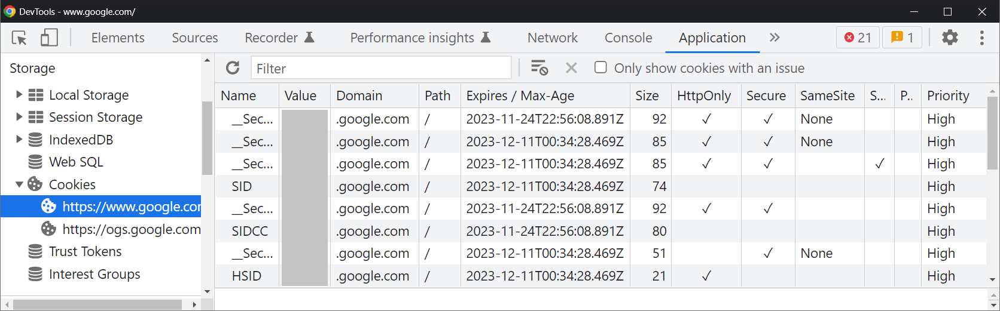

True to their definition, cookies are in fact just data stored in your browser. We'll learn more about [where cookies are stored](#where-are-cookies-stored) in a later section.

### HTTP Cookie Attributes

Notice that each cookie has several attributes, like a name, value, domain, expiration date, and so on. The most common cookie attributes are summarized in [Table 1](#table-1) below. For a more comprehensive breakdown, see [the MDN documentation on cookies](https://developer.mozilla.org/en-US/docs/Web/HTTP/Cookies). We'll take a closer look at some of these attributes as we explore cookies in more detail.

<div class="scroll-x">
  <table id="table-1">
    <caption>Table 1: HTTP cookie attributes</caption>
    <thead>
      <tr>
        <th scope="col">Attribute</th>
        <th scope="col">Description</th>
        <th scope="col">Example</th>
      </tr>
    </thead>
    <tbody>
      <tr>
        <td>Name</td>
        <td>The name of the cookie. Cookies can be given any arbitrary name. This name is the key in the cookie's key-value pair.</td>
        <td><code>Set-Cookie: name=value;</code></td>
      </tr>
      <tr>
        <td>Value</td>
        <td>The value of the cookie. Cookies can store any string value, but a cookie can only be associated with one value.</td>
        <td><code>Set-Cookie: name=value;</code></td>
      </tr>
      <tr>
        <td>Domain</td>
        <td>The domain with which the cookie is associated. A page may load cookies from multiple domains if it requests resources from different domains. This is common with <a href="#3-advertising-cookies">advertising cookies</a>.</td>
        <td><code>Set-Cookie: name=value; Domain=example.com;</code></td>
      </tr>
      <tr>
        <td>Path</td>
        <td>The URL path with which the cookie is associated. If a requested URL's path does not match a cookie's path, that cookie will not be sent to the server in the request.</td>
        <td><code>Set-Cookie: name=value; Path=/;</code></td>
      </tr>
      <tr>
        <td>Expires</td>
        <td>An HTTP date and time specifying when this cookie expires.</td>
        <td><code>Set-Cookie: name=value; Expires=2023-11-20T17:50:52.000Z;</code></td>
      </tr>
      <tr>
        <td>Max-Age</td>
        <td>An alternative to the <code>Expires</code> header. Specifies an expiration time as a number of seconds from the time of the cookie's creation. A cookie with a negative or zero age expires immediately.</td>
        <td>The following cookie expires in one day: <code>Set-Cookie: name=value; max-age=86400;</code></td>
      </tr>
      <tr>
        <td>HTTPOnly</td>
        <td>If specified, prevents the cookie from being read with JavaScript. This attribute helps protect users against <a href="#httponly-cookies">session hijacking via cross-site scripting</a>.</td>
        <td><code>Set-Cookie: name=value; HTTPOnly;</code></td>
      </tr>
      <tr>
        <td>SameSite</td>
        <td class="rhythm"><p>Used to control whether a cookie should be sent in cross-site requests (e.g., if Site B sends a request to Site A). This attribute can take one of three values:</p>
          <ul>
            <li>None</li>
            <li>Lax</li>
            <li>Strict</li>
          </ul>
          <p>By default, most browsers set cookies to be <code>SameSite=Lax</code> if an explicit value is not provided. We'll learn more about this attribute in the section on <a href="#2-cross-site-request-forgery">cross-site request forgery</a>.</p>
        </td>
        <td><code>Set-Cookie: name=value; SameSite=Lax;</code></td>
      </tr>
      <tr>
        <td>Secure</td>
        <td>If specified, prevents the cookie from being sent by browsers over an insecure connection (HTTP), requiring the use of SSL and HTTPS.</td>
        <td><code>Set-Cookie: name=value; Secure;</code></td>
      </tr>
    </tbody>
  </table>
</div>

You may also see a column in your dev tools named `Size`. This is not a cookie attribute; rather, it refers to the total number of bytes required to store the cookie's name-value pair in the browser's database. For example, a cookie with a name of `name` and a value of `value` would have a size of `9` because the strings `name` and `value`, each consisting of simple ASCII characters, occupy nine bytes in total.

## How Are HTTP Cookies Created and Used?

In the previous sections, we learned that a cookie is a piece of data stored in your browser and associated with a particular domain. Now, it's time to learn how cookies get created in the first place.

### The `Set-Cookie` HTTP Response Header

At the beginning of this article, we reviewed the HTTP protocol and learned that a server responds to client requests with not only the requested resource but also HTTP headers describing how the server handled that request. One such header is the [`Set-Cookie` response header](https://developer.mozilla.org/en-US/docs/Web/HTTP/Headers/Set-Cookie), which instructs the user agent to store a cookie. The response may contain as many `Set-Cookie` headers as needed, one for each cookie that should be set. Below is a sample HTTP response message instructing the client to set three cookies:

```
HTTP/2 200
Content-Type: text/html; charset=UTF-8
Date: Mon, 21 Nov 2022 10:01:21 GMT
Set-Cookie: name1=value1; Domain=example.com; HTTPOnly
Set-Cookie: name2=value2; Domain=example.com; Max-Age=10
Set-Cookie: name3=value3; Domain=example.com; Secure
```

For example, if you open [the demo site](https://http-cookie-demo.netlify.app/) and inspect the network request for the HTML document, you should see three `Set-Cookie` request headers:

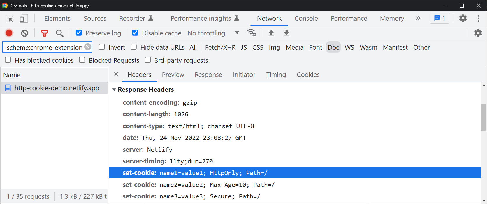

In fact, cookies are so common in response headers that browsers make it easier for you to find them in dev tools so you don't have to go digging through the response headers. Just switch from the `Headers` pane to the `Cookies` pane to see them in table form:

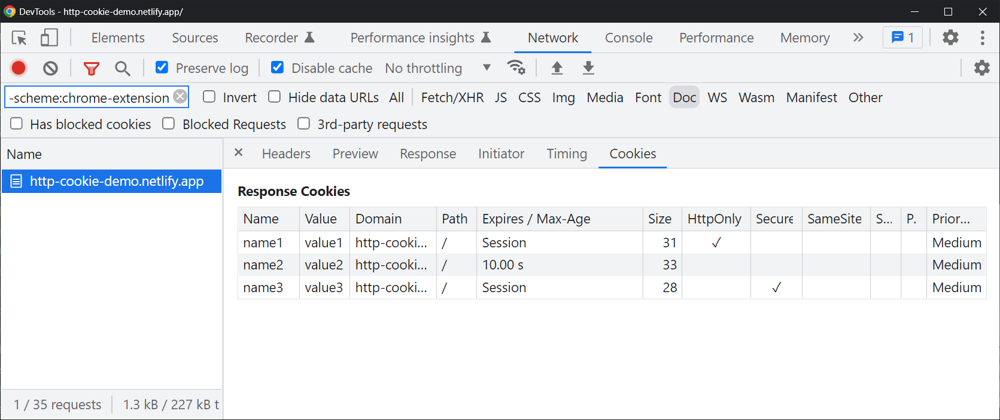

While parsing the server's response, the browser will encounter these `Set-Cookie` headers and save them to the user's disk, typically in a database file. Note that the `Set-Cookie` header is merely a suggestion, so it's up to the browser to decide whether to save the cookie. Normally, browsers will save cookies by default unless users block cookies in their privacy settings.

Finally, note that popular HTTP server libraries provide APIs for setting cookies in responses. For example, Express.js allows you to set cookies via [the `res.cookie` method](https://expressjs.com/en/4x/api.html#res.cookie):

```js
res.cookie('name', 'value', { domain: 'example.com', httpOnly: true });
```

### The `Cookie` HTTP Request Header

As I mentioned earlier in this post, the HTTP protocol is stateless, meaning a web server does not keep track of any information about your prior HTTP requests. If all we ever did was instruct the client to set cookies, that wouldn't be very exciting. In that case, we could just as well use `localStorage` or [any other client-side storage API](#storage-apis-similar-to-cookies) to store that data instead of relying on cookies, and the server wouldn't care.

However, what makes cookies so special is that browsers include them in subsequent requests that they send to the server; this is done via the [`Cookie` request header](https://developer.mozilla.org/en-US/docs/Web/HTTP/Headers/Cookie). The server can then read those cookies to identify the user and even personalize the response that it sends back to the client. Cookies can be sent back and forth like this, modified, deleted, and even updated as many times as needed. Effectively, cookies extend the HTTP protocol by allowing client and server applications to share state.

Below is a sample HTTP request message containing a cookie header:

```
GET / HTTP/2
Host: example.com
User-Agent: Mozilla/5.0 (Windows NT 10.0; Win64; x64)
Cookie: name1=value1; name2=value2; name3=value3
```

Using [the same demo site as before](https://http-cookie-demo.netlify.app/), if you now reload the page, you should see the cookies included in the `Cookie` request header:

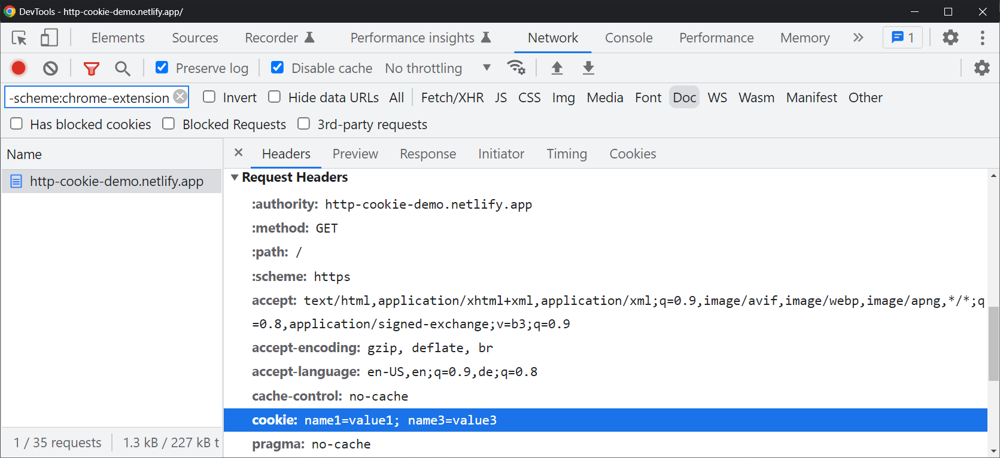

Once again, we can inspect both the request and response cookies in table form by switching to the `Cookies` pane:

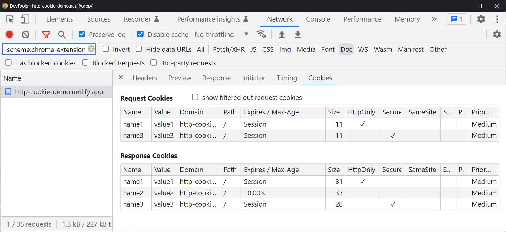


If you pay close attention, you may notice that the second cookie is missing from these request headers. This is because I waited 10 seconds before reloading the page, so the cookie with a max age of 10 seconds expired. Expired cookies don't exist; naturally, they can't be included in request headers.


Only the names and values of the cookies are sent to the server. This is because the server doesn't care about the other attributes. For example, servers are not responsible for managing a cookie's expiration—that's the browser's job. So a server would have no use for the `Expires` or `Max-Age` attributes. Likewise, if a server received a cookie in the request headers, then it doesn't matter whether the cookie is `HTTPOnly` (since we are already in an HTTP context) or if it's `Secure`.

HTTP server libraries also provide APIs for reading cookies from client requests. For example, in Express.js with the cookie-parser middleware enabled, you can access cookies under the [`req.cookies`](https://expressjs.com/en/4x/api.html#req.cookies) object, which contains key-value pairs for cookies:

```js
// Check if a cookie with a name of 'name' exists
if (req.cookies.name) {}
```

### Remember Me: Saving Login Info with Cookies

Now that we know what cookies are and how they're created, we should be able to understand how the famous `Remember me` checkbox keeps you logged in.

When you log in to a site, what you're really doing is submitting a form (typically `method="POST"`) to some login endpoint (e.g., `example.com/login`) on a web server. The web server will then process that HTTP request in a common server-side language, such as Node.js or Python. Because the HTTP request includes your form data, the server can parse that data to determine if you enabled the `Remember me` checkbox. Thus, it can use this information to decide whether to send back a cookie to persist your logged-in state for some amount of time.


Alternatively, some sites forego this checkbox and store "essential" cookies by default. You may have seen cookie banners that ask you to customize your cookie settings; most of them require that you at least opt into these essential cookies, with other cookies—like [those used for marketing purposes](#3-advertising-cookies)—being optional.


## Types of Cookies: Session vs. Persistent

There are two general types of cookies, each defined by its expiration or max age.

### 1. Session Cookies

By default, if a cookie does not have an explicit `Expires` or `Max-Age` attribute, it is treated as a <dfn>session cookie</dfn>, also known as a <dfn>temporary cookie</dfn>: a cookie that expires after the current browsing session ends. For example, the following HTTP message instructs the browser to create three cookies, two of which (`name1` and `name3`) are session cookies because neither an expiration nor a max age was specified:

```
HTTP/2 200
Content-Type: text/html; charset=UTF-8
Date: Mon, 21 Nov 2022 10:01:21 GMT
Set-Cookie: name1=value1; Domain=example.com; HTTPOnly
Set-Cookie: name2=value2; Domain=example.com; Max-Age=10
Set-Cookie: name3=value3; Domain=example.com; Secure
```

In Chrome dev tools, session cookies are identified by a keyword of `Session` under the `Expires / Max-Age` column. There are two session cookies in our example:


Note that it's up to the browser to define what "current browsing session" means; in most browsers, a browsing session ends when you fully shut down your browser (i.e., close all tabs). At that point, session cookies may get cleared.

Why do I say *may*? Because [there's a catch](https://textslashplain.com/2019/06/24/surprise-undead-session-cookies/): Some browsers give you the option of restoring your previously open tabs when you launch them in the future. Thus, in some cases, browsers may restore session cookies even after your browsing session has ended.

### 2. Persistent Cookies

Unlike session cookies, persistent cookies have an explicit expiration or max age; your browser will automatically clear these cookies in the background once they expire. For example, the following HTTP message instructs the browser to create a cookie that expires five seconds after its creation:

```
HTTP/2 200
Content-Type: text/html; charset=UTF-8
Date: Mon, 21 Nov 2022 10:01:21 GMT
Set-Cookie: name2=value2; Domain=example.com; Max-Age=10
```

"Persistent" here is a bit of a misnomer—these cookies do not stick around forever. For example, in Chrome, the maximum allowed age for persistent cookies is [400 days](https://chromestatus.com/feature/4887741241229312).

## Working with Cookies in JavaScript

So far, we've looked at how servers can create cookies via the `Set-Cookie` response header and how user agents include cookies in their requests via the `Cookie` header, allowing servers to personalize the content they return. This is the traditional method of creating cookies in web applications, and it allows us to create progressively enhanced user experiences that function without JavaScript. However, we can also programmatically create, read, update, and delete cookies on the client side using JavaScript.

### Reading Cookies

Most of the cookies associated with a document are accessible under `document.cookie`:

```js {data-copyable=true}
console.log(document.cookie);
```

This is one big string containing `name=value` pairs of cookies strung together with semicolons. Here's an example:

```
key1=value1; key2=value2; key3=value3; ...
```

The rest of the cookie attributes we learned about will not appear in this string. Rest assured that those attributes *will* get set internally in the browser's [cookie database](#where-are-cookies-stored).

To find the value for a cookie with a particular name, we need to split the string and find the first entry starting with the given name followed by an equals sign:

```js
const getCookieValue = (name) => {
  return document.cookie
    .split('; ')
    .find((cookie) => cookie.startsWith(`${name}=`))
    ?.split('=')[1];
}
```

See the MDN docs on cookies for [more examples](https://developer.mozilla.org/en-US/docs/Web/API/Document/cookie#examples).

You may be wondering why I said *most* cookies are accessible under `document.cookie`. That's because there are certain types of cookies (known as HTTP-only cookies) that, for security reasons, cannot be viewed with JavaScript. We'll learn about this in [security issues with cookies](#security-issues-with-http-cookies). In the example we've been using so far, `name1` is an HTTP-only cookie that cannot be viewed with JavaScript:

```
HTTP/2 200
Content-Type: text/html; charset=UTF-8
Date: Mon, 21 Nov 2022 10:01:21 GMT
Set-Cookie: name1=value1; Domain=example.com; HTTPOnly
Set-Cookie: name2=value2; Domain=example.com; Max-Age=10
Set-Cookie: name3=value3; Domain=example.com; Secure
```

Thus, if you log `document.cookie` within 10 seconds after loading the page, you should see `name2=value2; name3=value3` (the order may be different).

### Creating, Updating, and Deleting Cookies

There's also a `document.cookie` setter method that allows you to create, update, and delete cookies with JavaScript.

Here's an example of creating a cookie with JavaScript:

```js {data-copyable=true}
document.cookie = 'name=value'
```

While you would expect the above line of code to replace the whole cookie string, this new cookie will actually get *concatenated* to the existing cookie string (or take the place of an existing cookie, if it has the same name) because `document.cookie` is a setter method, not a property. The example below creates three cookies in succession:

```js
document.cookie = 'a=1';
// a=1
console.log(document.cookie);

document.cookie = 'b=2';
// a=1; b=2
console.log(document.cookie);

document.cookie = 'c=3';
// a=1; b=2; c=3
console.log(document.cookie);
```

You can't create multiple cookies in one go; you must call the setter method once for each cookie you want to set.

As we learned before, when you just specify the name and value of a cookie, it gets created as a session cookie by default. You can also optionally specify an expiration or max age, like in the example below:

```js {data-copyable=true}
document.cookie = 'name=value; expires=Su, 20 Dec 2020 20:20:20 UTC'
```


  **Note**: If "today" is past the above date when you're reading this, the code won't work. And that's because of the next point.


To delete a cookie with JavaScript, you need to set its expiration date to be in the past:

```js {data-copyable=true}
document.cookie = 'name=value; expires=Fri, 24 Jul 2020 04:00:00 UTC'
```

Or give it a negative `Max-Age`:

```js {data-copyable=true}
document.cookie = 'name=value; max-age=-1'
```

We'll look at some other ways to delete cookies later in this article.

### The CookieStore Web API

The `document.cookie` API isn't a very convenient way to work with cookies. For example, as we saw, if you want to find a cookie with a particular value, you need to split `document.cookie` with `; ` as the delimiter, find the cookie that starts with the given name, and return its value. And if you want to delete a cookie, you'll need to set its expiration to be in the past. It would be nice if we didn't have to think about these low-level concerns when working with cookies.

Thankfully, there's an experimental web API being developed that makes it easier to work with cookies: the [CookieStore API](https://developer.mozilla.org/en-US/docs/Web/API/Cookie_Store_API). This API exposes a global `cookieStore` manager that allows you to create, read, update, and delete cookies in a more readable format. For example, to create a cookie with this API, you would now do this:

```js
cookieStore.set({
  name: "name",
  value: "value",
  expires: Date.now() + utcMillisecondsFromNow,
  domain: "example.com",
});
```

Whereas before you would've needed to work with strings:

```js
document.cookie = `name=value; max-age=${Date.now() + utcMillisecondsFromNow}; domain=example.com;`;
```

Similarly, to delete a cookie, you just need to provide its name:

```js
cookieStore.delete("name");
```

Note that while CookieStore is currently an experimental client-side API, some server-side runtimes (like Deno) and libraries provide similar APIs to make it easier for developers to work with cookies. For examples of this, see [the Deno standard library cookie utilities](https://deno.land/std@0.166.0/http/cookie.ts).

## Security Issues with HTTP Cookies

Cookies are an important part of the web, but they can also pose security and privacy issues. For example, authentication cookies are normally a useful feature on the web, but they can also be stolen or otherwise exploited by attackers to impersonate an unsuspecting victim. Moreover, since cookies can be used to store personally identifiable information about users based on their activity on a website, they may be used to show users intrusive advertisements that follow them around the web. Let's take a closer look at some of these issues and ways to mitigate them.

### 1. Cookie Theft: Session Hijacking

There is nothing special about you and your browser when you access a particular site. The only way a web server knows who you are is by reading the information contained in your HTTP request. If someone were to get ahold of your session cookies for a site, they could copy those cookies locally, access that same site, and impersonate you. The server, none the wiser, would think that the request came from you. Fortunately, there are a few precautions we can take to protect against session hijacking.

#### `HTTPOnly` Cookies

Imagine a scenario where an attacker manages to inject a malicious script into Site A through a [cross-site scripting (XSS) attack](https://owasp.org/www-community/attacks/xss/). This malicious script would have access to the page's context, so it could read `document.cookie` and send that value to the attacker's server. If one of those cookies was used to authenticate a user to the site, the attacker could now impersonate the victim.

Thankfully, cookies offer an attribute to protect against XSS-based session hijacking. If you compare the value of `document.cookie` to the cookies listed in your browser's developer tools, you may be surprised to find that some cookies are missing from the string. Those "hidden" cookies are known as `HTTPOnly` cookies; a cookie that has an `HTTPOnly` attribute cannot be read with JavaScript, so it won't appear in `document.cookie`.


Session cookies—especially those used in cookie authentication—are commonly marked as `HTTPOnly` to protect users against session hijacking via XSS.

#### The Same-Origin Policy

Since cookies from different domains are all stored on the same browser and on the same computer, you may be wondering:

1. Can Domain A instruct the browser to set cookies for Domain B?
2. Can Domain A read cookies from Domain B?

The answer to both is *no* thanks to the [same-origin policy](https://developer.mozilla.org/en-US/docs/Web/Security/Same-origin_policy), which prevents a different origin from reading data from another origin programmatically. Without the same-origin policy, a malicious origin could interfere with a user's session or even hijack the user's browsing session. The same-origin policy builds on HTTP-only cookies to provide an additional layer of defense against session hijacking.

### 2. Cross-Site Request Forgery

In [cross-site request forgery (CSRF)](https://owasp.org/www-community/attacks/csrf), an attacker tricks a user into making a malicious HTTP request while their session cookies are still lingering in their browser. If the vulnerable site uses session cookies to authenticate its users, then a CSRF request could exploit this to request unauthorized changes to the user's account, carry out unwanted transactions, and much more, all via simple HTTP requests.


For most sites, browser requests automatically include any credentials associated with the site, such as the user’s session cookie, IP address, Windows domain credentials, and so forth. Therefore, if the user is currently authenticated to the site, the site will have no way to distinguish between the forged request sent by the victim and a legitimate request sent by the victim.


CSRF attacks are one of the reasons why users are cautioned to not open suspicious emails: If an attacker identifies a vulnerable GET endpoint on a site for which the victim has an account, the mere act of the victim opening the malicious email would initiate an HTTP request to that endpoint. Even for POST requests, an attacker could create a hidden form with CSS and show a button tricking the user into submitting a malicious payload. However, thanks to improvements in browser security, this is not as much of an issue nowadays as it used to be. And that's thanks to the `SameSite` cookie attribute.

#### `SameSite` Cookies

To protect users against cross-site request forgery, developers can use [the `SameSite` cookie attribute](https://web.dev/samesite-cookies-explained/). This attribute determines whether a cookie should be included in a request that originates from a third-party site, which is one that has a different eTLD+1 domain than another site. You can learn more about how this cross-site determination is made in the following article: [Understanding "same-site" and "same-origin"](https://web.dev/same-site-same-origin/#site).

For example, suppose `site.a.com` has a public API endpoint (e.g., `site.a.com/settings/update`) that can be used to change a user's account settings. Requests to this endpoint will only be processed if they include a session cookie authenticating the user. Ordinarily, requests are made to this endpoint via the front end of `site.a.com`, such as when a user submits a form, and these are known as same-site requests. The cookies included in same-site requests are known as <dfn>first-party cookies</dfn>.

As we've learned, session cookies should be marked as `Secure` and `HTTPOnly` as a best practice to protect against session hijacking. But this is not enough to protect against cross-site request forgery. To understand why, suppose a user has an unexpired session cookie for their `site.a.com` account. If this user now visits another site—say `site.b.com`—that site could make a `POST` request with JavaScript to `site.a.com/settings/update` and include a malicious payload in the body of the request, such as to delete the user's account. Without same-site cookie restrictions, this cross-site request originating from `site.b.com` would include the user's cookies for `site.a.com` in its `Cookie` header by design. Those cookies would now be referred to as <dfn>third-party cookies</dfn> from the perspective of `site.b.com`. Even though `site.b.com` can't *read* the third-party cookies for `site.a.com` for security reasons, it *can* force them to be included in requests to that site, allowing it to make potentially malicious requests on behalf of unsuspecting users. The user returns to `site.a.com`, only to discover that their account is no longer recognized!


While [cross-origin resource sharing (CORS)](https://developer.mozilla.org/en-US/docs/Web/HTTP/CORS) will prevent `site.b.com`'s script from reading the response returned by `site.a.com`, it won't prevent the request itself from going through. This is a common misconception. CORS does *not* protect against CSRF attacks.


Now, imagine the same scenario, but this time the user's session cookie has a `SameSite` attribute of `Lax` or `Strict`. When the user visits `site.b.com`, it will attempt to make a malicious request to `site.a.com` just as before. But this time around, the cross-site request will *not* include the user's cookies for `site.a.com`. So the request will (presumably) be rejected by the back end server upon seeing that there is no cookie authenticating the user.

It used to be the case that cookies without a `SameSite` attribute were treated as `SameSite=None` by default. This meant that cookies would be included in all cross-site requests, potentially exposing users to CSRF vulnerabilities. Nowadays, for security reasons, browsers treat all cookies without an explicit `SameSite` attribute as `Lax` by default to protect against CSRF attacks. The main difference between `SameSite=Lax` and `SameSite=Strict` is that `Lax` allows cookies to be included when a user navigates from `site.b.com` to `site.a.com` (such as by following a link or changing the URL in their address bar), whereas `Strict` always limits the cookie to a same-site context.

Typically, cookies that need to track users across different sites will set `SameSite=None` explicitly. Otherwise, they'll default to `Lax`, rendering those cookies useless in a third-party context. That segues nicely into our next topic of discussion: advertising cookies.

### 3. Advertising Cookies

Advertising cookies are used by [digital advertising networks](https://en.wikipedia.org/wiki/Advertising_network) like Google AdSense to show users personalized content, as well as to share user information with advertisers within the network to collect usage data and analytics. A website is part of an ad network like Google AdSense if it's paying that network to show ads on its behalf around the web.

The following quote from Google's ad policy clarifies how Google AdSense stores cookies:


We also use one or more cookies for advertising we serve across the web. One of the main advertising cookies on non-Google sites is named 'IDE' and is stored in browsers under the domain `doubleclick.net`.


Here's a breakdown of how advertising cookies work:

1. A user visits a site (e.g., `example.com`) that's part of an ad network (e.g., Google AdSense, which has a domain of `doubleclick.net`).
2. The site has ads embedded in its markup, such as in an `iframe`, `img`, or `video`. Those ads are hosted on the ad network's domain (in this case, `doubleclick.net`).
4. On page load, the user's browser requests those third-party resources from the ad network just like it would request any other resource on the web.
5. **Key step**: The ad network sends the requested ads to the user, along with an advertising cookie in the response header. As we learned, this cookie must have `SameSite=None`, or else it won't be included in this cross-site request.
6. The browser stores the cookie and associates it with the ad network's domain (e.g., `doubleclick.net`).
7. When the user visits another site that requests resources from the same ad network, the cookie will be sent along to the ad network in the HTTP request headers. The ad network can then return personalized content based on that user's identity.


  **Note**: Steps 4–6 may not occur if you're in private browsing, have an adblocker enabled, or have enabled [Enhanced Tracking Protection in Firefox](https://blog.mozilla.org/blog/2019/06/04/firefox-now-available-with-enhanced-tracking-protection-by-default/).


This is why people sometimes find that personalized ads are following them around the web no matter where they go. For example, if you're shopping online for dog toys and later visit a social media site with ads enabled, you may see ads for dog toys or related products in a sidebar. It's not a coincidence—it's an advertising cookie in action, and many users rightly view this as an invasion of privacy.

In the screenshot below, I located the `IDE` advertising cookie on StackOverflow, a site I chose only because I know it uses Google AdSense:

<figure>
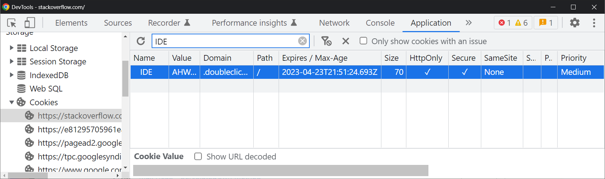
<figcaption>Note the use of <code>SameSite=None</code>. Without that attribute, the cookie will be treated as <code>SameSite=Lax</code> and will never be included in cross-site requests to the ad network, rendering it useless.</figcaption>
</figure>

Time for an experiment, assuming you're willing to accept advertising cookies:

1. Launch Google Chrome. Firefox's privacy protections are aggressive, which is normally a good thing—but it will interfere with this learning experience.
2. Visit a popular website and temporarily disable your adblocker.
3. Open your devtools and try to find any cookies that seem to be from a Google domain. Look for `.doubleclick.net` in the `Domain` column (see the screenshot above).
4. Visit another website that you suspect will show ads, and disable your adblocker again.
5. Open your devtools and check if there are any cookies from the same ad network.

In this example, you'll want to filter the list of cookies to search for `IDE`. It should be exactly the same on the second site as it was on the first one you visited. I tested this again with Quora:

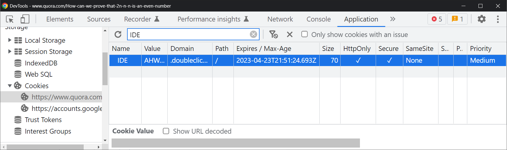

Everything is the same, down to the cookie's expiration date and time.

As we learned, this is because the advertising cookie is not associated with StackOverflow's or Quora's domain—it's associated with the ad network's domain (in this case, `doubleclick.net`). So as long as this cookie remains on your computer, it'll follow you around on other sites that request content from the same ad network. This is something to be wary of if you're concerned about your privacy online—hence why so many people use ad blockers to browse the web.

## Where Are Cookies Stored?

By design, cookies don't sync between browsers—after all, they're just inert pieces of string data. Thus, cookies set in Chrome have nothing to do with cookies set in Firefox, Edge, or any other browser. This is why you'll be prompted to log into your account if you try visiting a site or app with a browser that you don't normally use.

Most browsers store their cookies in an SQLite database file, which you can inspect using an open-source app like [DB Browser for SQLite](https://sqlitebrowser.org/). Note that the location of your cookies will vary by browser and operating system.

### Chrome

Chrome stores its cookies in an SQLite database file named `Cookies`. The location of this file depends on your operating system. The following locations were verified on Chrome 107 but may have changed since then:

- Windows: `%LocalAppData%\Google\Chrome\User Data\Default\Network\Cookies`
- Mac: `~/Library/Application Support/Google/Chrome/Default/Network/Cookies`
- Linux: `~/.config/google-chrome/Default/Network/Cookies`

This database consists of two tables: a `cookies` table and a `meta` table:

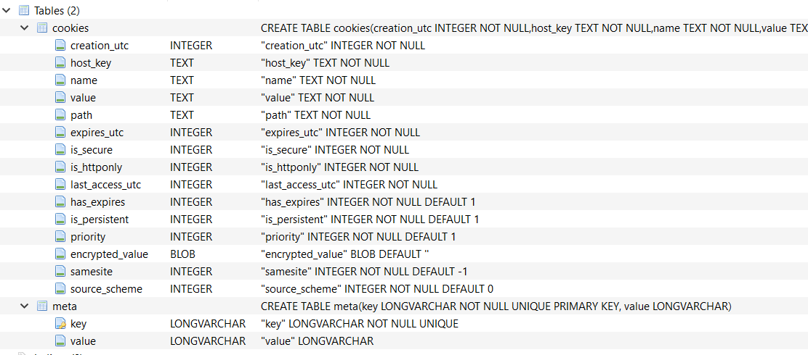

Here's some sample data from the `cookies` table:

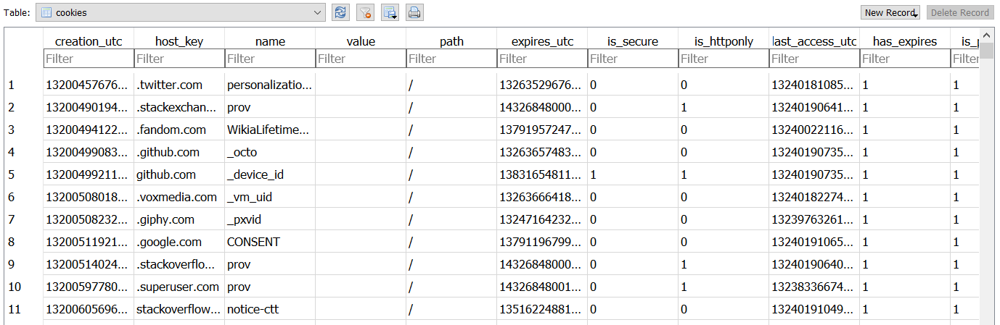

### Firefox

Like Chrome, Firefox stores its cookies in an SQLite database file. Here's how to find it:

1. Click the hamburger menu in the top-right to open your Firefox settings.
2. Go to `Help > Troubleshooting Information`.
3. Locate `Profile Folder` in the table. Click the `Open Folder` button.
4. Scroll down and find `cookies.sqlite`.

For example, on Windows 10, you'll find your Firefox cookies under `%AppData%\Mozilla\Firefox\Profiles\<your_firefox_profile>\cookies.sqlite`.

### Microsoft Edge

Edge stores its cookies not in a single file but rather as separate files under `%LocalAppData%\Microsoft\Windows\INetCookies`:

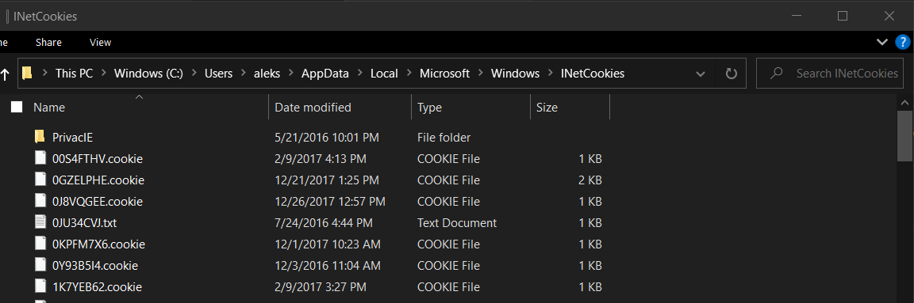

You can open these files with a plaintext editor like Notepad.

## Clearing Cookies

Occasionally, when users encounter problems with accessing a resource or page on a website, they may be instructed to use another browser or, in some cases, clear their cookies. Now that we have more experience with cookies, we have several ways of clearing them:

1. Via developer tools, which we used quite a bit in this tutorial.
2. In your browser's settings, usually under History.
3. With JavaScript, by setting its expiration date to be in the past.
4. Through your operating system's file system (by deleting the cookie files from disk).

The first, third, and fourth options are the most advanced; they allow you to only delete cookies from a particular domain as opposed to all cookies across all domains.

The screenshot below illustrates how to delete all cookies for a site via the storage API:

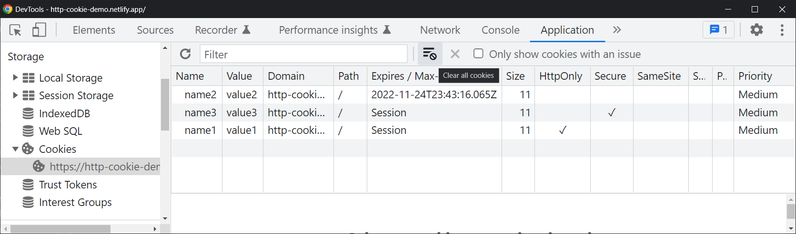

If you've been following along, you should now understand what happens when you clear your cookies. Remember: Most web servers uses authentication cookies to ensure that you're allowed to view the pages that you're requesting. They may also use cookies to personalize your website experience by storing certain settings and preferences. So if you clear your cookies for a website, two things will happen:

1. If the site used cookies for authentication, you'll be logged out the next time you visit it. This is because the browser won't send any cookies to the server when you request that page, so the server won't know who you are until you log back in.
2. Certain client-side preferences may get cleared for that website.

In practice, most user settings are stored in an website's database rather than just in cookies. So, when you clear your cookies on the client side, the associated settings may be left untouched on the server side, and they should be restored when you log back in.

## Storage APIs Similar to Cookies

Cookies are just one client-side storage API. Others include:

- [The Web Storage API](https://developer.mozilla.org/en-US/docs/Web/API/Web_Storage_API): `localStorage` and `sessionStorage`.
- [IndexedDB](https://developer.mozilla.org/en-US/docs/Web/API/IndexedDB_API), typically used for large amounts of data.

However, if the data you're storing needs to be used on the server side to return personalized content to users, then you should use cookies. Otherwise, data from other web storage APIs won't automatically be sent to the server at request time.

Here's a breakdown of the major differences between cookies and the Web Storage API:

<div class="scroll-x">
<table>
    <thead>
        <tr>
            <th scope="col">Storage</th>
            <th scope="col">Expiration</th>
            <th scope="col">Use cases</th>
        </tr>
    </thead>
    <tbody>
        <tr>
            <td>localStorage</td>
            <td>None, but users can manually clear it via dev tools or the console (<code>localStorage.clear()</code>).</td>
            <td>Storing data on the client side that the server does not need (e.g., preferences, settings).</td>
        </tr>
        <tr>
            <td>sessionStorage</td>
            <td>Until the end of the current browsing session (i.e., until you shut down your browser).</td>
            <td>Storing data specific to the user's current browsing session.</td>
        </tr>
        <tr>
            <td>Cookies</td>
            <td>Current browsing session, if an expiration/max age is not specified.</td>
            <td>Sharing state between client and server. Included in request headers.</td>
        </tr>
    </tbody>
</table>
</div>

## Final Thoughts

Cookies are an integral part of the modern web and allow clients and servers to share state in the otherwise stateless HTTP protocol. At the end of the day, a cookie is just an inert piece of string data representing some named value that expires after a certain duration. Servers can set cookies through HTTP response headers, and clients forward the cookies associated with the requested domain to the server. While cookies have many legitimate use cases, they can also be misused and exploited, and advertising cookies pose concerns for privacy-conscious users.


