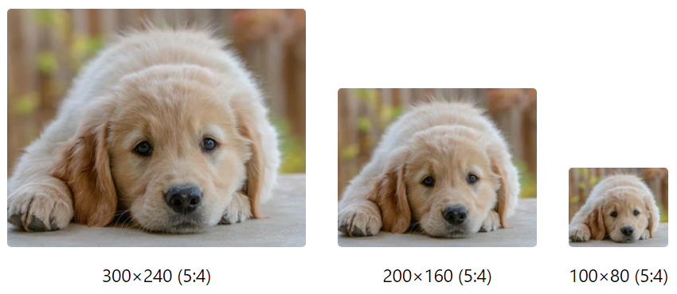
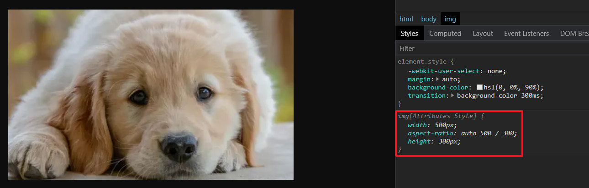
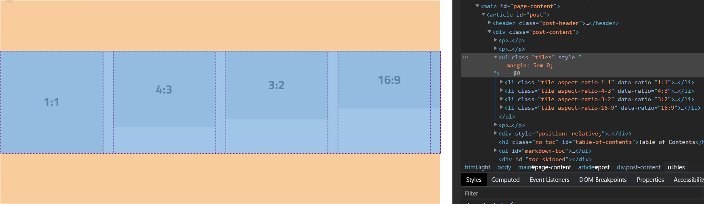
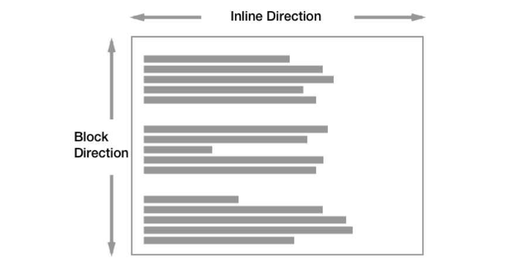
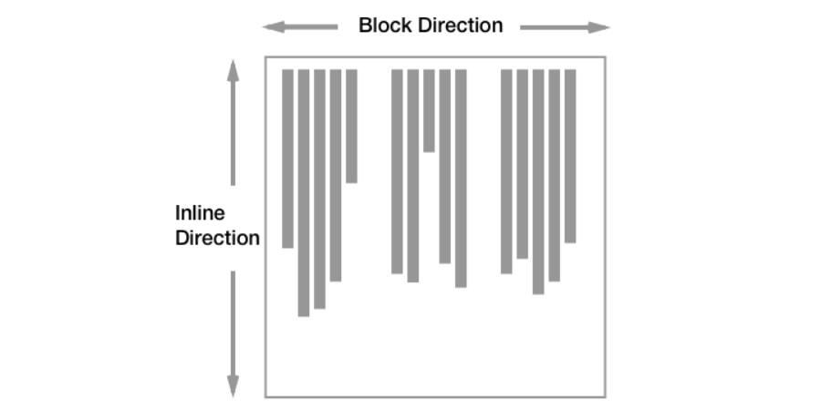

<style>
  .demo-tiles {
    display: grid;
    padding: 0;
    grid-template-columns: repeat(auto-fit, minmax(150px, 1fr));
    gap: var(--size-spacing-0);
  }

  .demo-tile {
    position: relative;
    background-color: var(--color-surface-2);
    color: var(--color-text-emphasis);
    border-radius: var(--size-spacing--3);
    font-weight: var(--font-weight-body-bold);
  }

  .demo-tile::after {
    content: attr(data-ratio);
    position: absolute;
    left: 0;
    top: 0;
    width: 100%;
    height: 100%;
    display: flex;
    align-items: center;
    justify-content: center;
  }

  .demo-square-grid {
    --gap: var(--size-spacing-0);
    display: grid;
    grid-template-columns: repeat(3, 1fr);
    gap: var(--gap) var(--gap);
  }

  .demo-square-grid > * {
    aspect-ratio: 1;
    background-color: var(--color-surface-2);
    color: var(--color-text-emphasis);
    position: relative;
  }

  .demo-square * {
    width: 100%;
    height: 100%;
    object-fit: cover;
    object-position: center;
  }

  .demo-square figure {
    --offset: 0;
  }

  .demo-document {
    writing-mode: vertical-rl;
    width: 100%;
    height: 200px;
  }

  .demo-parent {
    width: 100%;
    display: flex;
    align-items: center;
    flex-direction: column;
    justify-content: space-evenly;
    background-color: var(--color-surface-1);
    color: var(--color-text-emphasis);
    height: 100%;
  }

  .demo-child {
    padding: 10%;
    background-color: white;
    color: black;
  }

  .demo-grid {
    padding: 0;
    display: grid;
    grid-template-columns: 1fr 2fr;
    width: 100%;
    column-gap: 1em;
  }
</style>

If you're not sure how to define aspect ratios in CSS, or if you have no clue what an aspect ratio is to begin with, then you're in luck. This tutorial covers everything that you need to know about creating aspect ratio boxes in CSS, using both a modern approach and an old one with a percentage padding trick. Once you understand aspect ratios and how to define them, you'll be able to do all kinds of neat things—like creating `nxn` square grid layouts, responsively sizing embedded media, reserving space for images, and much more.



## What Is an Aspect Ratio?

An **aspect ratio** describes the relationship between an element's width and height and is expressed as a ratio, like `16:9` (or, equivalently, `16/9` in fractional notation). Below are examples of popular aspect ratios, rendered using plain HTML and CSS:

<ul class="demo-tiles">
  <li class="demo-tile aspect-ratio-1-1" data-ratio="1:1"></li>
  <li class="demo-tile aspect-ratio-4-3" data-ratio="4:3"></li>
  <li class="demo-tile aspect-ratio-3-2" data-ratio="3:2"></li>
  <li class="demo-tile aspect-ratio-16-9" data-ratio="16:9"></li>
</ul>

Intuitively, an aspect ratio of `w:h` says that an element has `w` units of width for every `h` units of height. For example, if an element has an aspect ratio of `16:9` and is `32` units wide, then we know that its height must be `18`. Squares are one of the best examples of this behavior—they have an aspect ratio of `1:1`, meaning their width and height are always the same.

## Why Are Aspect Ratios Useful?

In CSS, aspect ratios are especially useful because they allow us to scale elements (like images) responsively so that they always maintain their dimensions and never become distorted.

<figure>

<figcaption>Photo credit: <a href="https://unsplash.com/photos/og0C_9Mz6RA">Bill Stephan, Unsplash</a>.</figcaption>
</figure>

Aspect ratios allow us to change one dimension of an element (e.g., its width) while the other dimension scales accordingly, without us having to worry about doing the math ourselves. This makes aspect ratios well suited for creating responsive layouts that rely on images.

While images are the most popular example where aspect ratios come in handy, they're not the only application of this concept. For example, you can use aspect ratios to size YouTube embeds responsively so they scale with the device width. And you can also use aspect ratios to create dynamically sized grids with CSS, like the once-dreaded [3x3 square grid layout](#example-3-a-3x3-square-grid-of-images-cropped).

## How to Define Aspect Ratios in CSS

There are two ways we can create aspect ratios in CSS: a modern approach and the traditional approach with percentage padding. We'll discuss how each one works before looking at some real-world examples.

### Approach 1: Using the `aspect-ratio` CSS Property

[Originally shipped in Chrome 88](https://developer.chrome.com/blog/new-in-chrome-88/), the `aspect-ratio` property in CSS is a fancy new way of setting aspect ratios on any element with just a single rule:

```css
.element {
  aspect-ratio: 16 / 9;
}
```

This gives the targeted element a computed aspect ratio of `16/9`. As the element's width changes, its height will scale accordingly to allow it to maintain this particular aspect ratio.

Note that you don't have to use fractional notation—you can also pass in the reduced form:

```css
.element {
  /* roughly the same as 16/9 but with rounding errors */
  aspect-ratio: 1.78;
}
```

Keep in mind that while we usually discuss this in the context of images, `aspect-ratio` can be applied to any HTML element and not just to images.

For images specifically, this new property has an interesting application. When you [set a width and height on images](/blog/setting-width-and-height-on-images/) via the HTML attributes `width` and `height`, browsers like Chrome use these two properties to compute an appropriate `aspect-ratio` for the image, applying it in the user-agent stylesheet. This allows the browser to maintain the image's dimensions as it is resized and to reserve the right amount of vertical space for the image before it loads in, minimizing layout shifts. You can observe this in your dev tools for any image that has a width and height:



The only thing to keep in mind with this approach is that [browser support for the `aspect-ratio` property](https://caniuse.com/?search=aspect-ratio) is experimental (as of this writing). For this reason, we should also learn how to create aspect ratios the old-fashioned way, which relies on a trick with percentage padding.

### Approach 2: Aspect Ratios with Percentage Padding

To create aspect ratio boxes in browsers that don't yet support `aspect-ratio`, we need to understand how percentage values for padding relate to the dimensions of an element's parent.

Typically, we want to allow an element's width to change, but we also want to express the height in such a way that the element maintains a certain aspect ratio as it is resized. For this reason, it helps to invert the aspect ratio and express the element's _height_ as a fraction of its _width_. For an aspect ratio of `16:9`, this means we're looking at the inverse ratio `9:16`, which says:

> There are 9 units of height for every 16 units of width.

Notice that we haven't actually changed the definition of aspect ratio. It's two sides to the same coin: We can either think of aspect ratio as expressing an element's width relative to its height, or we can think of it as expressing the height relative to the width. The latter allows us to express the element's height as a percentage of its width: `9/16 = 0.5625`, or `56.25%`.

Thus, we know that for an element with an aspect ratio of `16:9`, the height is always going to be `56.25%` of its width. Given an element's width, all we need to do is multiply it by this percentage, and we'll get the height that is needed for the element to maintain that particular aspect ratio (in this case, `16:9`) regardless of its concrete width. Now, we just need some way to define an element's height as a percentage of its width. And that's done with **percentage padding**.

For reasons that we'll [explore in detail later](#why-it-works-percentage-padding-and-css-aspect-ratios), percentage values for `padding` (and also `margin`!) are defined relative to the width of an element's containing block, or its nearest block-level parent. For example, if an element's containing block has a width of `500px`, then a child element with `padding: 10%` will get `50px` of padding all around.

How does this help us? Well, we know that an element's height is influenced by its vertical padding. So what if we zero out the element's height and use only padding to control its height? And specifically, what if we set the vertical padding to be the percentage we worked out earlier? That would give us a height that's expressed relative to the width of the containing block. As long as the element takes up 100% of its parent's width, we've expressed that element's height as a percentage of **its own width**—and that's precisely the definition of aspect ratio!

```css
.element {
  height: 0;
  padding-bottom: 56.25%; /* or top—doesn't matter! */
}
```

While this may seem counter-intuitive, there are good reasons for why percentage padding works the way it does. As I noted above, we'll look at some of those reasons later on. For now, this is all that we need to know in order to create aspect ratio boxes in CSS the old-fashioned way.

## CSS Aspect Ratio Examples

With the boring stuff out of the way, we can look at some fun applications of aspect ratios in CSS. Each example below shows two approaches: the modern way using `aspect-ratio` and the older trick with percentage padding.

### Example 1: Responsive YouTube Iframes

Let's say you want to embed a YouTube video on your page, and you know that [YouTube videos have an aspect ratio of `16:9`](https://support.google.com/youtube/answer/6375112). You don't want to give the iframe a _fixed_ width and height—rather, you want its width to fill its container and for its height to scale responsively. Like this:

<div class="demo-tile aspect-ratio-16-9" data-ratio="Pretend this is a YouTube iframe" role="img" aria-label="A rectangular region of the page is shown in the shape roughly resembling a YouTube embed iframe. It always maintains a 16:9 aspect ratio."></div>

For both code samples, we'll work with this common markup:

```html {data-file="youtube-iframe.html" data-copyable=true}
<iframe src="..." class="youtube-iframe"></iframe>
```

#### Modern Approach

With CSS's `aspect-ratio` property, we can style the iframe directly:

```css {data-file="youtube-iframe.css" data-copyable=true}
.youtube-iframe {
  aspect-ratio: 16 / 9;
}
```

That's it! As we'll see in the remaining examples, this new property makes it trivial to define aspect ratios in CSS, even for more complex layouts.

#### Percentage Padding

We can achieve the same result using the padding trick that we learned. It requires a bit more work and some additional markup. We'll need two elements: an aspect ratio box for the parent container (e.g., a `<div>`), and the iframe itself nested as a child:

```html {data-file="youtube-iframe.html" data-copyable=true}
<div class="embed-container">
  <iframe class="youtube-iframe">...</iframe>
</div>
```

To create an aspect ratio box with `16:9`, we set the box's height to be zero and its vertical padding to be `56.25%`, just as we learned before. Again, this says that the box's height should be `56.25%` of its containing block's width (which in this case is assumed to be the page width).

The final step is to relatively position the container and absolutely position the iframe so that it doesn't influence the container's height. And here's the CSS that'll do that for us:

```css {data-file="youtube-iframe.css" data-copyable=true}
.embed-container {
  position: relative;
  height: 0;
  padding-bottom: 56.25%;
  overflow: hidden;
}

.embed-container .youtube-iframe {
  position: absolute;
  top: 0;
  left: 0;
  width: 100%;
  height: 100%;
}
```

That's it! Your YouTube iframe will now maintain a `16:9` aspect ratio on all device widths.

### Example 2: Creating a 3x3 Square Grid with CSS

With our knowledge of how to create aspect ratios in CSS, we can easily create a [3x3 square layout](https://tobiasahlin.com/blog/common-flexbox-patterns/#3x3-grid-constrained-proportions-11) with either Flexbox or CSS Grid. We'll work with this common markup and CSS:

```html {data-file="grid.html" data-copyable=true}
<ul class="square-grid">
  
  <li class="square"></li>
  
</ul>
```

```css {data-file="grid.css" data-copyable=true}
.square-grid {
  width: 100%;
  display: grid;
  grid-template-columns: repeat(3, 1fr);
  gap: 16px;
}
```

Once again, we can take one of two approaches, depending on which browsers we need to support. Either way, we'll get the same 3x3 square grid in the end:

<ul class="demo-square-grid" aria-hidden="true">
  
  <li></li>
  
</ul>

#### Modern Approach

To make each grid item a square, we just have to give them an aspect ratio of `1/1`:

```css {data-file="grid.css" data-copyable=true}
.square {
  aspect-ratio: 1 / 1;
}
```

This says that the grid item's width and height should always be the same.

#### Percentage Padding

With the percentage padding trick, we once again zero out the element's height. This time, we give it a vertical padding of `100%`, which means that its height is always the same as its width:

```css {data-file="grid.css" data-copyable=true}
.square {
  height: 0;
  padding-bottom: 100%;
}
```

You can now put whatever absolutely positioned content you want in these squares, relatively position the list items, and crop any overflowing content. Speaking of which...

### Example 3: A 3x3 Square Grid of Images (Cropped)

One of the more common use cases you'll run into is creating a square image grid with CSS, where each image is cropped to fit a perfect `1:1` grid item. This builds on the previous example where we created a generic square grid with CSS grid, so the markup is still the same.

Regardless of which approach you take, you'll get a `3x3` grid of images that are perfectly centered to a `1:1` (square) aspect ratio. Images that are too big will be cropped and centered:

<ol class="demo-square-grid" aria-hidden="true">
  
  <li class="demo-square"></li>
  
  
  <li class="demo-square"></li>
  
  
  <li class="demo-square"></li>
  
</ol>

#### Modern Approach

As before, we'll style the squares to have a `1:1` aspect ratio. But we'll also want to set the width and height of the nested images to be `100%`. Finally, we'll use `object-fit` and `object-position` to ensure that overflowing images are cropped and centered:

```css {data-file="image-grid.css" data-copyable=true}
.square {
  aspect-ratio: 1 / 1;
}

.square img {
  width: 100%;
  height: 100%;
  object-fit: cover;
  object-position: center;
}
```

Notice that we don't have to mess with absolute positioning or zero-out the `.square`'s height. This new property allows us to define aspect ratios in CSS much more intuitively.

#### Percentage Padding

With the percentage padding trick, the CSS for the grid is the same. But we need to absolutely position the images so that they don't influence each `.square`'s height. And, as before, we also need to use `object-fit` and `object-position` so that overflowing images are cropped.

```css {data-file="image-grid.css" data-copyable=true}
.square {
  height: 0;
  padding-bottom: 100%;
  position: relative;
}

.square img {
  /* Don't influence parent's height */
  position: absolute;
  top: 0;
  left: 0;
  /* Size fully */
  width: 100%;
  height: 100%;
  /* Center image and crop overflowing bits */
  object-fit: cover;
  object-position: center;
}
```

## Why It Works: Percentage Padding and CSS Aspect Ratios

So far, we've looked at _how_ padding can be used to create aspect ratios, but you may still be wondering _why_ this works the way it does.

As I mentioned earlier, the reason we're able to create responsive aspect ratios with padding is because percentage values for `padding` (and `margin`) are defined relative to the width of an element's containing block. This is the case for block layouts, [flex layouts](https://www.w3.org/TR/css-flexbox-1/#item-margins), and [grid layouts](https://drafts.csswg.org/css-grid-1/#item-margins). Unfortunately, the W3 specification does not actually go into detail regarding why this decision was made, so [the best we can do is speculate](https://stackoverflow.com/questions/11003911/why-are-margin-padding-percentages-in-css-always-calculated-against-width/).

One possible reason for this is that using a single reference axis (the containing block's width or height, but not both) gives you predictable results with `padding: x%` and `margin: x%`, ensuring that you get the same exact value on all four sides of the box model for a given element, just as you would with other units (e.g., `em` or `px`). So, regardless of whether an element is perfectly square, you'll get the same amount of percentage-based padding or margin on all sides. One could argue, however, that this isn't a good motivation. With concrete units like `em`, `rem`, and `px`, it definitely makes sense for the amount of padding to be the same on all four sides when you use the shorthand of `padding: 5px`. But there's nothing suggesting that the same should hold for percentages since these are responsive units. Moreover, this does not address why the containing block's width was chosen over its height since either one would do just fine.

A more logical reason is the [causality dilemma](https://en.wikipedia.org/wiki/Chicken_or_the_egg) (aka the chicken or the egg). Let's pretend that percentage values for vertical padding actually referenced the containing block's height, rather than its width. If that were the case, we'd get an infinite loop:


The same does not apply to the width of a containing block. By definition, a block-level element such as a `div` will fill up 100% of the available width in the [inline direction](https://developer.mozilla.org/en-US/docs/Web/CSS/CSS_Flow_Layout/Block_and_Inline_Layout_in_Normal_Flow#Elements_participating_in_a_block_formatting_context). If children exceed this width, they will simply overflow—the parent will not stretch. Hence, the infinite calculation problem does not exist in the horizontal axis.



1. A containing block's height is affected by the heights of its children.
2. A child sets its `padding-top` to be some percentage (e.g., `50%`).
3. The height of the containing block must change since the child is now taller.
4. If the height of the containing block increases, the child's padding must increase, too.
5. Repeat steps 2-4 infinitely.

Another reason is that this CSS trick allows us to define responsive aspect ratios since; prior to the introduction of `aspect-ratio`, there was no other way to achieve the same result. If percentage values for vertical padding were based on the containing block's height and not its width, then we'd have no way of doing this with responsive units.

### The Curious Case of Flexbox and CSS Grid

We learned that percentage padding for an element is relative to the width of its containing block. But what happens if the element in question is a flex item or grid item, like with the grid examples we looked at earlier? In that case, is the containing block the grid itself?

The simple answer is no. And the key to understanding this is to learn about **block formatting contexts** (BFCs):


Everything on a page is part of a formatting context, or an area which has been defined to lay out content in a particular way. A block formatting context (BFC) will lay child elements out according to block layout rules, a flex formatting context will lay its children out as flex items, etc. Each formatting context has specific rules about how layout behaves when in that context.


MDN notes that flex items and grid items create their own block formatting context, separate from the flex/grid container:


If the position property is static, relative, or sticky, the containing block is formed by the edge of the content box of the nearest ancestor element that is either a block container (such as an inline-block, block, or list-item element) or establishes a formatting context (such as a table container, flex container, grid container, or the block container itself).


And the W3 specs back this up:


A flex item establishes an independent formatting context for its contents. However, flex items themselves are flex-level boxes, not block-level boxes: they participate in their container’s flex formatting context, not in a block formatting context.


Thus, for flex and grid items, you can think of the containing block as an invisible content region that wraps the items. This formatting context is very easy to identify in your dev tools, appearing as a dotted outline around each flex or grid item:



We can prove this in a simple experiment with two grid items that have the same aspect ratio but whose formatting contexts have different widths, per the `grid-template-columns` property:

<ul class="demo-grid" aria-label="A grid of two items, one of which is 1fr and the other is 2fr">
  <li class="demo-tile aspect-ratio-16-9" data-ratio="16:9"></li>
  <li class="demo-tile aspect-ratio-16-9" data-ratio="16:9"></li>
</ul>

If the formatting context for grid items were the grid parent itself, then the two items would have the same padding-based height. But they don't because each item has its own formatting context.

### Percentage Padding in Horizontal vs. Vertical Writing Modes

So far, I've asserted that percentage padding and margins reference the width of their containing block. While this is true, it only tells half the story. Percentages may also refer to the height of the containing block, depending on the document's writing mode.

By default, a web page is set up to use a **horizontal writing mode**, where text flows from left to right (LTR). This is thanks to the `writing-mode` CSS property, which can take on these values:

<div class="scroll-x">
  <table>
    <thead>
      <tr>
        <th scope="col">Value</th>
        <th scope="col">Description</th>
      </tr>
    </thead>
    <tbody>
      <tr>
        <td><code>horizontal-tb</code></td>
        <td>Content flows horizontally, from top to bottom (default).</td>
      </tr>
      <tr>
        <td><code>vertical-rl</code></td>
        <td>Content flows vertically, from the right edge of the page to the left.</td>
      </tr>
      <tr>
        <td><code>vertical-lr</code></td>
        <td>Content flows vertically, from the left edge of the page to the right.</td>
      </tr>
    </tbody>
  </table>
</div>

With vertical layouts, paragraphs appear sideways—you'll have to tilt your head to read them:

<p aria-hidden="true" style="writing-mode: vertical-rl; height: 200px; width: 100%; display: flex; align-items: center; line-height: 1.3;">
  Hello, World! This is a paragraph with writing-mode: vertical-rl set in its CSS. Neat, huh? Notice how the text flows from the right side of the page to the left.
</p>

[The MDN docs](https://developer.mozilla.org/en-US/docs/Web/CSS/CSS_Flow_Layout/Block_and_Inline_Layout_in_Normal_Flow#Elements_participating_in_a_block_formatting_context) use the following diagrams to clarify these two writing modes:

<figure>

<figcaption>Horizontal writing mode (default).</figcaption>
</figure>

<figure>

<figcaption>Vertical writing mode.</figcaption>
</figure>

Here's the important point: if we switch over to a vertical writing mode, and we use percentage values for padding or margin, these percentages will actually be defined relative to the _containing block's height_, not its width! This comes straight from the CSS specs:


As a corollary, percentages on the margin and padding properties, which are always calculated with respect to the containing block width in CSS2.1, are calculated with respect to the inline size of the containing block in CSS3.


Here, **inline size** is defined as follows:

> A measurement in the inline dimension: refers to the physical width (horizontal dimension) in horizontal writing modes, and to the physical height (vertical dimension) in vertical writing modes.

To verify this, we can set up a mini sandbox document with a single parent and child element:

```html {data-file="test.html" data-copyable=true}
<div class="parent">
  <div class="child">Child</div>
</div>
```

And style it like this:

```css {data-file="test.css" data-copyable=true}
body {
  writing-mode: vertical-rl;
  width: 100%;
}

.parent {
  width: 100%;
  height: 200px;
}

.child {
  padding: 10%;
}
```

The result is shown below, with some additional CSS to make things prettier and easier to identify. Using your dev tools, you can verify that the child `<div>` has a padding of `20px`, which is precisely `10%` of the containing block's height (`200px`):

<div class="demo-document" aria-hidden="true">
  <div class="demo-parent">
  Parent (200px tall)
  <div class="demo-child">
    Child
  </div>
  </div>
</div>

So percentage padding isn't always relative to the containing block's width! This is the case the majority of the time since most documents use the default writing mode, but if you've set yours to be vertical, then padding and margin percentages are going to be relative to the containing block's _height_. Thus, our understanding of percentage padding and margin should really be the following:

> Percentage values for padding and margin are relative to the containing block's dimensions in the **inline direction**. For horizontal layouts, this is the containing block's width. For vertical layouts, this is the containing block's height. (See the reference diagrams above.)

## Final Thoughts

Hopefully, you now have a better understanding of how to define responsive aspect ratios in CSS for all kinds of elements, including images, videos, and more. As a bonus, you now know how percentage values work for padding and margins and that they depend on the document's writing mode. You also know how to create aspect ratios in CSS with the more modern approach.



## References and Further Reading

- [Maintain the aspect ratio of a div with CSS](https://stackoverflow.com/questions/1495407/maintain-the-aspect-ratio-of-a-div-with-css)
- [W3 Schools How TO - Aspect Ratio](https://www.w3schools.com/howto/howto_css_aspect_ratio.asp)
- [Why are margin/padding percentages in CSS always calculated against width?](https://stackoverflow.com/questions/11003911/why-are-margin-padding-percentages-in-css-always-calculated-against-width/11004839)
- [How to set the margin or padding as percentage of height of parent container?](https://stackoverflow.com/questions/4982480/how-to-set-the-margin-or-padding-as-percentage-of-height-of-parent-container#:~:text=If%20you%20set%20an%20element's,to%20height%20instead%20of%20width.)
- [Common CSS Flexbox Layout Patterns with Example Code](https://tobiasahlin.com/blog/common-flexbox-patterns/)


