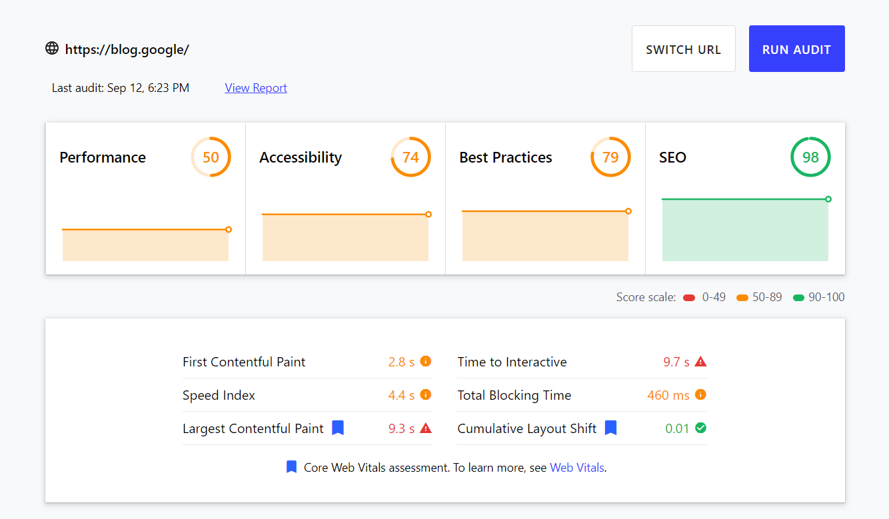
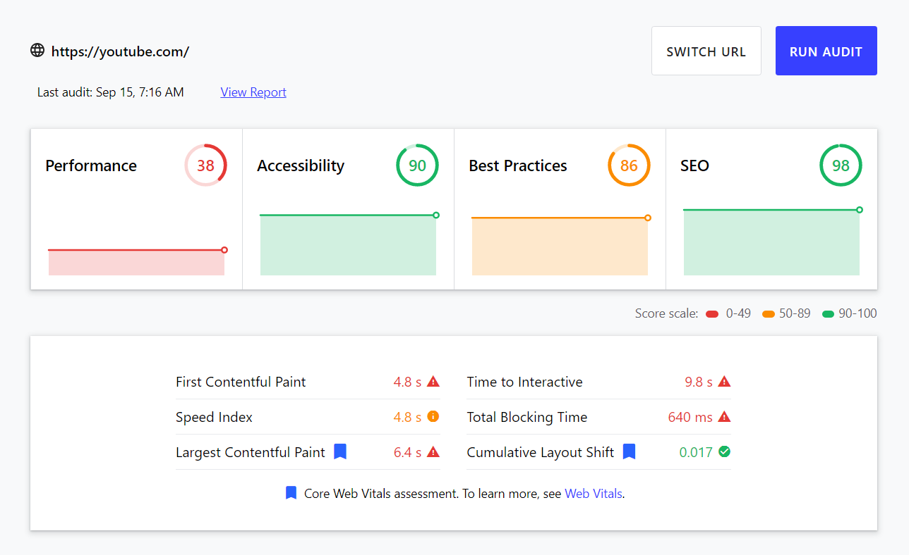
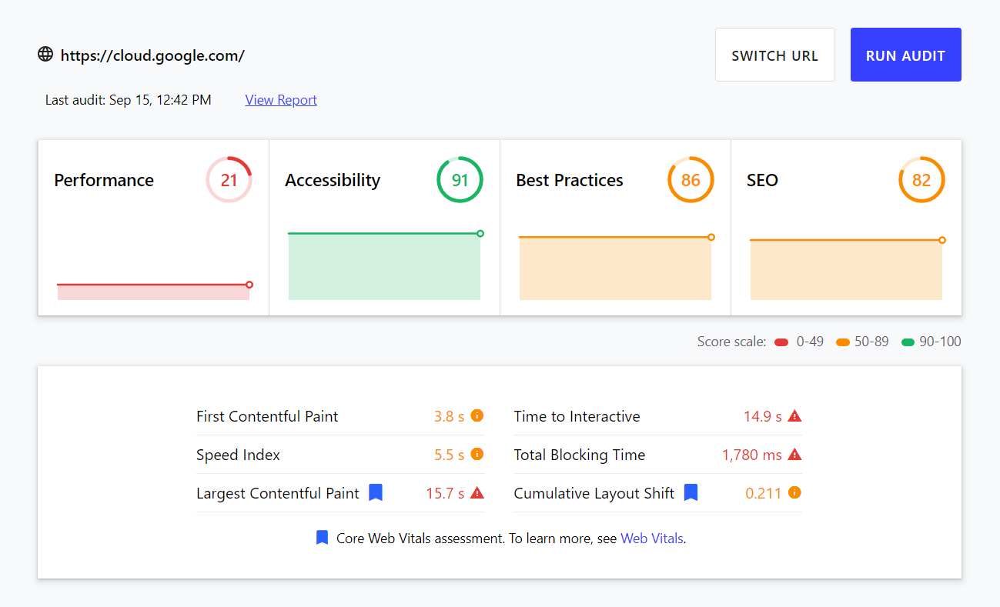
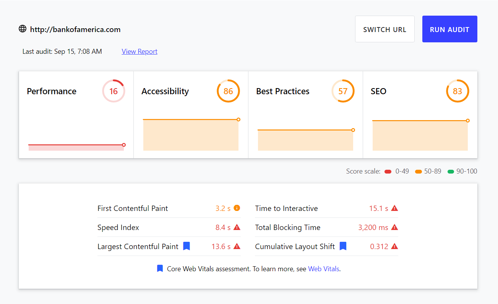
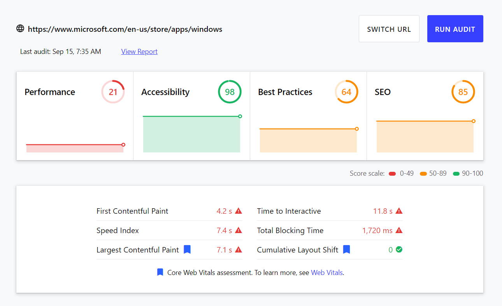
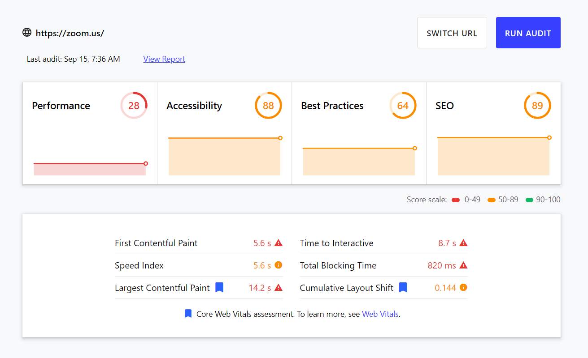
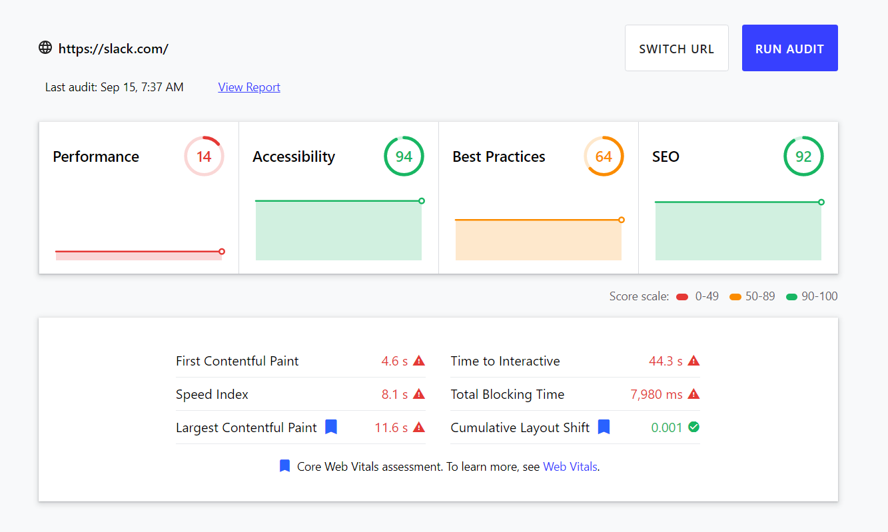
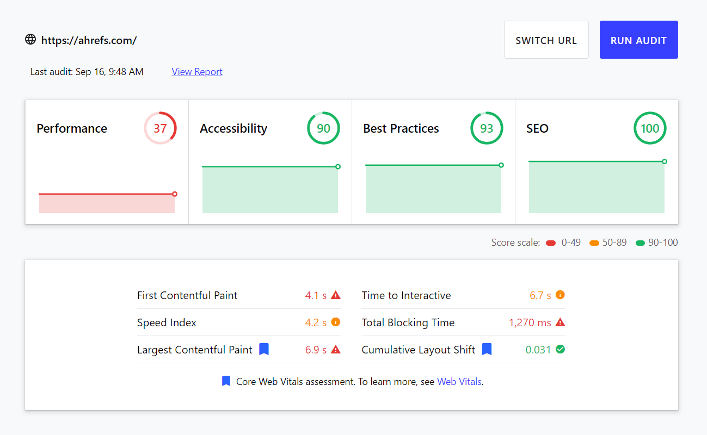
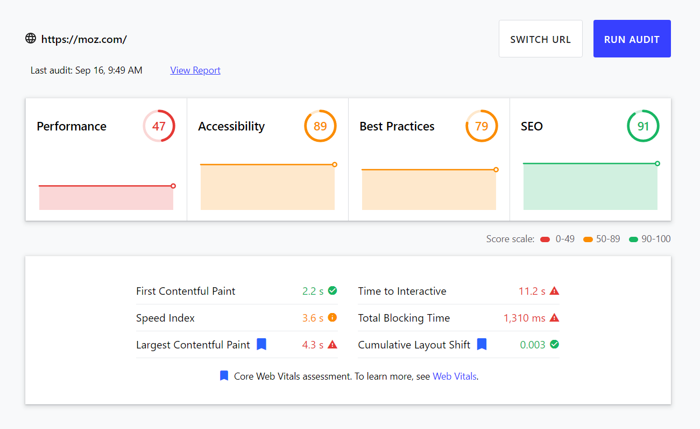

About halfway through writing an exhaustive guide on web performance and Lighthouse, I stopped to wonder: Does any of this actually matter? Is web performance really as important as people claim it is? That prompted me to do a bit of digging... And the results were enlightening.



## Big Brands, Slow Websites

I recently read a post on Dev.to about how [Google doesn't follow its own rules](https://dev.to/renaissancetroll/google-doesn-t-follow-their-own-rules-2lo8). In an accompanying video, the author runs Google's [Web.dev Lighthouse tool](https://web.dev/measure/) on a few Google domains, including the tool itself.

Here's what you get when you run the tool on Google's own blog:

And when you run it on YouTube:

And the Google Cloud Platform landing page:

You get the idea. To be fair, though, this isn't just a problem with Google's websites...

Speaking from personal experience, I know that the Bank of America website is painfully slow. And a quick Lighthouse audit confirms this observation:

The Microsoft Store is apparently not much better:

Neither is Zoom's landing page:

And neither is Slack's:

The landing pages of SEO authorities like Ahrefs and Moz are similarly slow:


There's no particular reason why I decided to run audits on these websites and not others. These are just the ones that came to mind as I was writing this article.


## And Yet, They Rank Well

What accounts for the fact that most of these websites have terrible performance and yet they rank well on Google? It's mainly two things:

- [Branded traffic](https://www.semrush.com/kb/819-branded-vs-non-branded-keywords).
- Quality content.

Big brands get most of their traffic through brand recognition and popularity, neither of which require significant SEO efforts (beyond having a landing page and some social media profiles). Most of the time, an established company won't need to try hard to rank #1 on Google for its own name. Try Googling any brand, like `slack` or `zoom`, and you'll find that their websites rank #1. Note that some users will still discover these companies through non-branded search terms like "video conferencing" (for which Zoom ranks #1).

[Quality content](https://www.crazyegg.com/blog/what-is-high-quality-content/#:~:text=So%20quality%20content%20is%20anything%20that%20Google%20decides%20is%20worth%20sharing.&text=It's%20content%20that%20people%20want,or%20around%20the%20water%20cooler.) is the more subjective measure. First, note that "content" usually refers to a company blog where you share knowledge and insights related to your industry, but it could also refer to other types of media (like a YouTube channel). The goal is to publish content that addresses the needs of your audience, giving them precisely the information they were searching for.

Take Ahrefs and Moz, for example. They both offer software, e-books, tutorials, guides, and much more to help marketers and even laypeople understand SEO. Sure, their sites may not be the fastest around, but their content is credible and informative. In Google's eyes, that matters much more than seeing pretty green colors on a Lighthouse report.

When you think about it, this makes sense. After all, you could have the fastest website on the internet while spamming low-quality content, and you likely would not rank well on Google. So page load speed isn't everything.

## So Does Web Performance Matter?

Should you even care about web performance if slow sites can still rank well? Is a slow website really that big of a deal? The answer is _sort of_—it's a bit more nuanced than a simple yes or no.

To answer this very question (among many others), the online marketing blog Backlinko conducted [a study of more than 11.8 million Google search results](https://backlinko.com/search-engine-ranking). And one of its most surprising findings suggests that [page loading speed does not have a correlation with ranking on Google](https://backlinko.com/search-engine-ranking#page-loading-speed).

How is this possible? After all, tons of online resources on SEO and marketing have repeated the same adage time and time again: faster websites tend to rank better on Google. But perhaps the importance of page load speed has been exaggerated.

Here's a quote from Google's official announcement of the so-called Speed Update in early 2018:


The “Speed Update,” as we’re calling it, will **only affect pages that deliver the slowest experience to users** and will only affect a small percentage of queries. It applies the same standard to all pages, regardless of the technology used to build the page. The intent of the search query is still a very strong signal, so **a slow page may still rank highly if it has great, relevant content**.


Translation? Focus on producing high-quality and relevant content that matches your users' [search intent](https://ahrefs.com/blog/search-intent/) instead of obsessing over web performance (unless your site is terribly slow). Your page load speed will still be important, but other factors—like content quality and relevance—will outweigh it. Google goes on to emphasize that page load speed is just a rough heuristic that measures a website's **user experience**:

> We encourage developers to think broadly about how performance affects a user’s experience of their page and to consider a variety of [user experience metrics](https://web.dev/user-centric-performance-metrics/).

So, judge the quality of your website not by whether you get a perfect 100 on Lighthouse but rather by how well you meet _the underlying metrics that Lighthouse considers_. These metrics are positively correlated with a **good user experience**, which is what everyone is really aiming for at the end of the day.

Let's be real: Even if you're a big brand that can afford to lose some traffic, nobody enjoys a sluggish browsing experience. Consider that:

- Layout shifts are annoying (especially if they occur as you're trying to click something).
- Unresponsive inputs are annoying (e.g., on login screens or during checkout).
- Websites that consume megabytes of data just on the initial load alone are annoying.
- Ads, popups, and third-party scripts that block the main thread are annoying.

These are all assessed by a typical Lighthouse audit. So while it's far from perfect, Lighthouse is still a good tool for measuring your website's performance—and, in turn, your average user experience.

Of course, this doesn't mean that your user experience will be exceptional if you pass a Lighthouse audit. In fact, you can still get away with [building the most inaccessible site possible with a perfect Lighthouse score](https://www.matuzo.at/blog/building-the-most-inaccessible-site-possible-with-a-perfect-lighthouse-score/).

## Where Does That Leave the Rest of Us?

Earlier, we saw that some big companies are able to rank at the top of Google search results despite having slow websites. This is usually thanks to some combination of reputable branding and a solid content marketing strategy. But everyone must start somewhere—a big brand was once a little brand, with a much tighter budget and fewer resources to work with.

Because small businesses and blogs can't rely on brand recognition alone to rank well on Google, it's probably still worthwhile for them to invest some time and effort in improving their site's performance so they can at least create a good user experience for the handful of visitors that they do have. A good user experience makes it easier for users to interact with your site or product, potentially bringing you more business.

In practice, you likely won't focus on improving your site's performance just for the sake of getting a better score on a Lighthouse audit. Rather, you'll want to focus on improving your **conversion rate**—the percentage of visitors to your site who take a certain desired action, like filling out a form, subscribing to a newsletter, checking out products, or anything else that you care about. In doing so, you may find that you actually need to improve your site's performance or risk losing business. For example, if your checkout page is so slow and sluggish that users become frustrated and leave, then optimizing that page's performance may help you reduce your cart abandonment rate. Similarly, if your landing page uses heavy assets like videos or 3D graphics but the majority of your visitors use low-end devices, then you probably won't have any choice but to improve your site's performance.

As a long-term strategy for SEO, you should also focus on **publishing high-quality content** to supplement whatever products or services you offer. Understand your audience's search intent, and publish relevant articles that address their needs, questions, and fears. Higher quality content tends to generate more backlinks from other sites, which could help lift your [domain authority](https://moz.com/learn/seo/domain-authority) in Google's eyes and drive more traffic to your site.

## The Importance of Web Performance

A faster website won't automatically rank high on Google by virtue of its performance alone. Still, page load speed _is_ something that you should consider if you care about your user experience. Be sure to balance your efforts—you shouldn't optimize your page load speed at the _expense_ of your content quality or branding. But you also shouldn't neglect it entirely, to the point that users ditch your site in favor of a competitor's.


