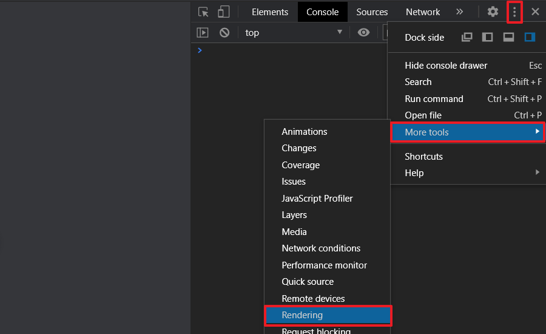
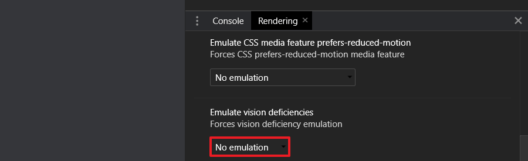
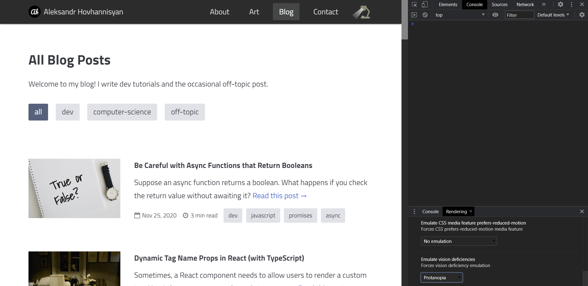
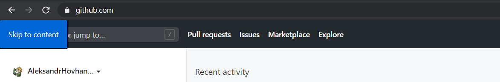
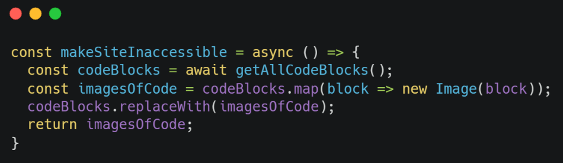

All kinds of people use the web—a good developer's job is to create not only beautiful but also *accessible* user experiences. You can fix some basic accessibility issues by [writing semantic HTML](/blog/semantic-html-accessibility/), but this will only get you so far. Eventually, you'll come to realize that web accessibility isn't just about checking off a few boxes on an audit or scoring 100 on your Lighthouse report.

More importantly, you'll find that accessibility auditing tools like Lighthouse only do a superficial review of the most common accessibility issues, like skipped heading levels, anchors without text, or images without alt text. In fact, you can [build an inaccessible site with a perfect Lighthouse score](https://www.matuzo.at/blog/building-the-most-inaccessible-site-possible-with-a-perfect-lighthouse-score/), so it's certainly not a perfect tool.

In practice, there are more accessibility failures that you'll need to address if you want to create the best possible user experience on your website. This is even more important if your business needs to abide by [web accessibility laws and policies](https://www.w3.org/WAI/policies/), where accessibility is not a choice but rather a legal requirement.

Here are just a few of the accessibility failures that you'll want to look out for in your apps and websites.



## 1. Color Is Used to Convey Meaning

Up until a few months ago, I was guilty of relying on color alone to distinguish my links from the rest of my text. But this is not accessible to people with color blindness:


  Color is not used as the only visual means of conveying information, indicating an action, prompting a response, or distinguishing a visual element.


[Some designers insist that link underlines are ugly](https://css-tricks.com/styling-links-with-real-underlines/). But of course, this assumes that your users will be able to distinguish links from their surrounding text *without* some sort of visual indicator like an underline.

This is one of those accessibility concerns that certain tools like Lighthouse won't flag (or even look for in the first place). Yet it's still important to consider if you want to develop a truly accessible user experience.

To help you test this accessibility issue on your site, Google Chrome (v83) recently released a pretty handy dev tool that allows you to [emulate vision deficiencies](https://developers.google.com/web/updates/2020/03/devtools). You can access this tool by clicking the triple-orb menu in your dev tools, navigating to `More tools`, and then selecting `Rendering`:



This will open the `Rendering` tab in your drawer pane (you may need to drag it up to see it). There, you'll want to scroll all the way down to find the section for emulating vision deficiencies:



Click the dropdown, and pick any from the list to test your site for that particular vision deficiency. For example, this is what my blog page looks like if I emulate protanopia (full red-green color blindness):



Now, assuming you've tested this on your site and identified links that rely on color alone, there are a few ways you can make your anchors more accessible to people with vision deficiencies:

1. Use `text-decoration: underline`.
2. Use `border-bottom` with a non-zero thickness (be sure to offset it with an equal amount of top padding).
3. Use an absolutely positioned pseudo-element as the underline (not ideal).

## 2. Visual Order Doesn't Match Focus Order

Elements are arranged statically in HTML, but their ordering isn't necessarily set in stone. For example, you can use the [`order` flexbox property](https://developer.mozilla.org/en-US/docs/Web/CSS/order) to change a flex item's order in the layout or use CSS grid columns and template areas to reposition elements in all sorts of creative ways. Unfortunately, this can create accessibility problems for screen reader users and keyboard users if not done carefully.

Typically, users expect to navigate your content in the order in which it is presented visually: top down, left to right in a horizontal, left-to-right [writing mode](https://developer.mozilla.org/en-US/docs/Web/CSS/writing-mode). But when you rearrange content visually with CSS, you don't change the focus order of the content, meaning the visual order and focus order may be thrown out of sync. This could be considered a violation of [WCAG Success Criterion 2.4.3 (Focus Order)](https://www.w3.org/WAI/WCAG21/Understanding/focus-order.html). Similarly, you need to be careful when using the `tabindex` HTML attribute to change an element's focus order, as this can have the same effect.

## 3. Navigation Can't Be Skipped

You visit a site that has a top navigation bar with plenty of useful links and dropdown menus. But you're really keen on just navigating the main content of the page. Unfortunately, there's no way to skip these navigation links, so your only option is to keep tabbing until you finally reach the main content region.

To address this web accessibility issue, sites like GitHub, Dev.to, Slack, and lots of others use **skip navigation links**: anchors that remain invisible until they receive focus or are encountered in the DOM by a screen reader. When clicked, these anchors will take the user to the main content region of the page.

Since they're aesthetically intrusive, skip-navigation links are typically hidden from view using either negative absolute positioning or the `clip` CSS property. They are later made visible once they receive `:focus` (from keyboard navigation).



A word of caution: Don't hide skip-navigation links with `display: none` or `visibility: hidden`. These will remove the links from your site's [accessibility tree](https://developers.google.com/web/fundamentals/accessibility/semantics-builtin/the-accessibility-tree), so they'll be ignored by screen readers. Moreover, users won't be able to tab over to them, which defeats the purpose of having skip-navigation links.

Developers usually stop here at the navbar and don't consider other navigation-intensive regions of their UIs. For example, if a blog post has a table of contents, a user shouldn't have to tab through ever single link just to skip this section and get to the content. In fact, any time you present a user with content that serves as an aside, you need to ensure that it's *truly* optional.

Audit your website and identify areas of the user interface that have lots of interactive elements or links and that momentarily trap the user's focus in a region of content. Users should be able to skip these so they can jump around your site more easily.


  **Note**: The benefit of using [multiple skip links](https://webaim.org/techniques/skipnav/#multiple) is debatable. Personally, I like to use them, but one could argue that each skip navigation link is, ironically, *one more link* that a user has to tab through. I'd say the benefits outweigh the costs if you have lots of links bunched together.


## 4. Images in Place of Text


If an author can use text to achieve the same visual effect, he or she should present the information as text rather than using an image.


Developers: Please don't post screenshots of your code. They may look pretty, but that's about it. It's a trend popularized by Twitter and Medium, two platforms that have a large developer user base but whose text editors don't support proper syntax highlighting. And on Twitter in particular, you have a character limit to contend with. So, to get around this, people use tools like [Carbon](https://carbon.now.sh/) to create beautiful screenshots of their code, which they can drop into blog posts, tweets, and more:



But this isn't accessible—your alt text can't be the code itself because of special characters, and you rarely even have control over alt text on these platforms to begin with. It's especially egregious if you're using one of these screenshots in a tutorial, where readers will be keen on copying and pasting your code. Congratulations—you've now forced both your sighted and blind users to type things out by hand in an excruciating test of patience.

Instead, you should use normal fenced code blocks if the platform supports them, even if it's without syntax highlighting. If, on the other hand, you're sharing code on social media like Twitter, consider posting an image of your code along with a link to a plaintext copy (e.g., as a [GitHub gist](https://gist.github.com/)). That way, everyone can read and use your code the way that works best for them.

## 5. Scrolling Is Hijacked

The modern web is brimming with possibilities. And one such possibility is that of [destroying your site's accessibility with scroll hijacking](https://envato.com/blog/scroll-hijacking/). **Scroll hijacking** is just as it sounds: "hijacking" the document's scroll event listener and preventing the default behavior of scrolling the page's content. Pages that do this also typically hide the scrollbar from view, making the user experience even more confusing.

Admittedly, this accessibility failure is not actually so subtle. But you'd be surprised by how common it is on the web. For example, back in 2016, Apple was guilty of doing this on its Mac Pro landing page, where your viewport was locked in an interactive widget that revealed various product details as you scrolled. At the very least, it's confusing because people expect a **predictable user experience** from built-in, standard components like scrollbars. But what's even more annoying is that your "scrolling" will be locked in place to a predefined rate, so even if you try to scroll more quickly, you'll still move through the content at the same pace. This can create feelings of tension or friction—like you're trudging through quicksand.

I'm not going to name and shame, but I recently encountered two websites that had scroll hijacking, and they were both terrible to use. One of them was the worst offender—not only did they hijack the scrollbar and completely hide it from view, but they also made it so that scrolling to the very end of the page (wherever that is!) would just cycle you back to the first "slide." It took me a while to figure out that I was not, in fact, looking at infinitely scrolling content.

Takeaway: Just because you *can* do something on the web doesn't mean that you *should*. Scroll hijacking is terrible for accessibility—just don't do it.

## 6. Aria Labels Don't Provide Sufficient Context

Aria labels are tricky to get right, especially in user interfaces that have lots of interactive elements in close proximity. Consider which of these two conveys its meaning more clearly:

- A button whose aria-label is `Close`.
- A button whose aria-label is `Close this X` (replace X with whatever is being closed).

Unless a blind user recalls the context of where they currently are in your page, a button that merely reads "Close" won't tell them much about *what* they're closing. Is it a modal window that they recently opened? Or is it something *inside* the modal window, like a dismissible message or preview? Sighted users can figure this out, but that's only because it's easy to visually discern an element's role based on its surrounding context—an `X` symbol situated in the top-right of a window is likely going to close that window.

Note that the first example may be your only option if your app needs to support internationalization, in which case you may have to sacrifice some specificity in your aria-labels in favor of more reusable, shorter text. Otherwise, if you have lots of closable "things" in your app, you'll find yourself maintaining potentially thousands of strings. But if you can go the extra mile, definitely provide more context in your aria-labels to make your site more accessible.

## 7. Decorative Images Are Not Hidden from Screen Readers

You may have heard that you should always give your images alt text. This is technically true because images without an alt attribute are actually invalid HTML. But what if I told you that the alt attribute should sometimes be empty? These so-called *decorative* (presentational) images don't carry the same meaning as other images, and describing them with alt text wouldn't really anything to the user experience (in fact, it could *annoy* users).

Banner images, profile photos, and article thumbnails are a few examples of images that don't always need alt text. Specifying alt text for these images would not contribute meaningfully to the user experience or convey any important information, aside from the fact that "there's an image (of something) here." Even if you *do* describe the image, it's unlikely that your users will care or benefit from knowing what the image portrays. It's unnecessary noise.

Presentational images should be hidden from screen readers with an empty `alt` attribute:

```html

```

Alternatively, you can use `role="presentation"` to clobber the image's role:

```html

```

Don't abuse this, though. Images that actually convey meaning—like those used in a blog post or tutorial—need to be given non-empty alt text. Note the wording—you can't simply omit the `alt` attribute from an image. All images *must* have an `alt` attribute present. But decorative images should specify an *empty* `alt`.

## Final Thoughts

We only considered a handful of accessibility failures in this article. In reality, there are many more WCAG success criterions covering a wide range of user experiences. Hopefully, you now know how to identify and fix some of the less noticeable accessibility issues you may encounter on the web.


