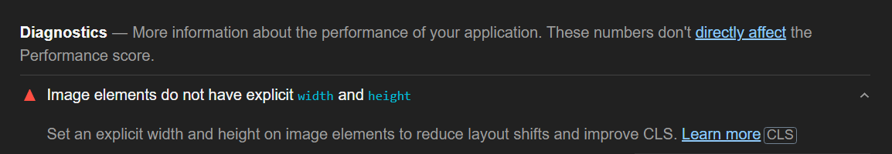
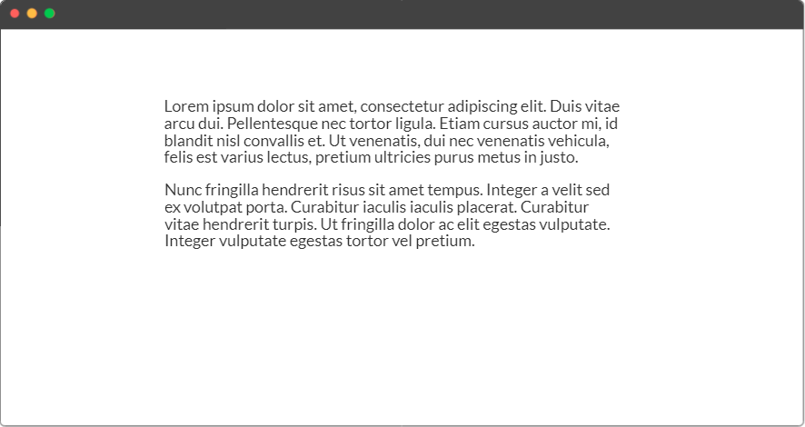
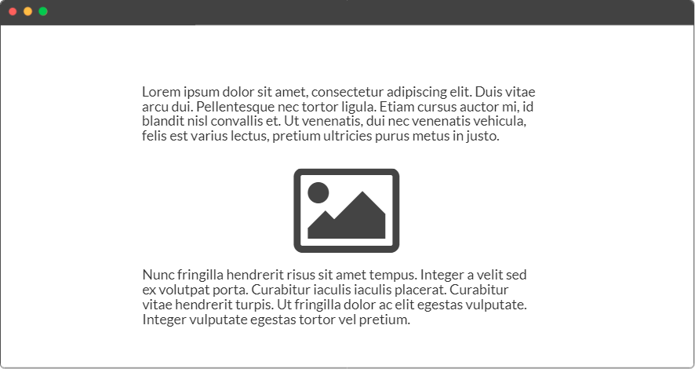
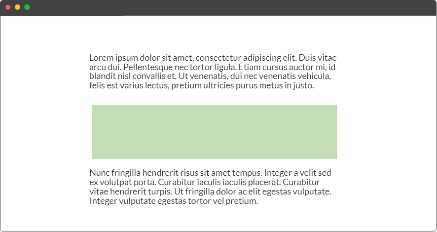


**Note**: While this article focuses on images since they're the most common type of media, the best practices discussed here also apply to videos.


If you're not giving your images an explicit width and height, you may be hurting your [cumulative layout shift (CLS)](https://web.dev/cls/) score. Setting a width and height on images is even more important now that Google uses [Core Web Vitals](https://moz.com/blog/core-web-vitals) as a ranking signal—and cumulative layout shift is just one metric that Google looks at when auditing your site. But what do images have to do with layout shifts, and how does giving them a width and height fix this problem?



## Image Elements Do Not Have Explicit Width and Height

If you've ever [run your site through Lighthouse](https://web.dev/measure/), then you've probably seen this message:

<figure>
  
  <figcaption aria-hidden="true">"Set an explicit width and height on image elements to reduce layout shifts and improve CLS."</figcaption>
</figure>

In short, this means that one or more images on the audited page lack the `width` and `height` HTML attributes and use markup that looks something like this:

```html

```

However, the best practice is to always set a width and height on images, like this:

```html

```

At this point, you probably have many questions:

- What is CLS and why does Lighthouse flag it as a problem?
- How does setting a width and height fix CLS?
- How do I responsively size my images if I give them a fixed width and height?
- Doing this by hand is tedious. Can I automate the process?

I'll answer all of those questions in this article.

## The Problem: Layout Shifts

The message above mentioned something called "CLS"—what's up with that?

CLS stands for **cumulative layout shift**, one of the many metrics that Lighthouse considers in an audit. As its name implies, a layout shift occurs when elements visibly shift around on a page. Typically, layout shifts occur either due to user interactions or as a page is loading.

The "cumulative" part of CLS means that Lighthouse considers layout shifts in the aggregate—many different things can cause layout shifts, and those are factored into a final CLS score. In this article, we'll focus on a specific source of layout shifts: images that don't have a width and height.

### Dimensionless Images Cause Layout Shifts

When the page loads, your browser doesn't know how much vertical space it should reserve for images since this varies from one image to another. Until the image has downloaded, the browser won't have access to that metadata. This means that the your browser renders the page for the first time, dimensionless images will initially collapse to a height of zero until they've been fully downloaded, at which point the browser will correct the space that those images occupy. Thus, elements after the image will initially be positioned above their true location, like the second paragraph in this diagram:



Once the image has downloaded, it will push its siblings down and take its rightful place:



These kinds of layout shifts are unpleasant and can make your design look sloppy and poorly optimized. In the following sections, we'll learn how setting a width and height on images can reduce layout shifts.

## Solution: Set a Width and Height on Images

To prevent these kinds of layout shifts, you should give your images explicit dimensions using the `width` and `height` HTML attributes. As your browser parses the page and constructs the DOM, it will read those attributes off of the image and use them to compute the image's aspect ratio. This allows it to reserve the right amount of vertical space for the image on the first paint, well in advance of when the image has actually downloaded.

That's the short answer, but let's also dig deeper into how this works. I've previously written about [aspect ratio in CSS](/blog/css-aspect-ratio/), but I'll do a quick recap here.

### What Is an Aspect Ratio?

An **aspect ratio** describes the relationship between an element's width and height. Common aspect ratios include `16:9`, `4:3`, and `1:1`. For example, an aspect ratio of `1:1` says that the width and height of an element are always the same (i.e., it's a square), whereas an aspect ratio of `16:9` says that the element has `16` units of width for every `9` units of height.

You may not have considered how aspect ratios impact web performance, but they're *really* important. Aspect ratios allow us to size images properly so that they don't cause layout shifts.

### Reserving Space for Images with `aspect-ratio`

Modern browsers automatically apply the `aspect-ratio` CSS property to any element that has an explicit `width` and `height` set as HTML attributes. For example, if your image is `1280x750`, then you'd set its width and height to be those values, like this:

```html

```

Your browser would then use those two numbers to compute the image's aspect ratio, applying this CSS as part of the user-agent stylesheet:

```css
img {
  aspect-ratio: auto 1280 / 750;
}
```

Below is an example showing an image that's been given width and height attributes of `500` and `300`, respectively; the browser uses these attributes to compute the image's aspect ratio and applies that CSS, which can be inspected in dev tools:

<figure>

<figcaption>Photo credit: <a href="https://unsplash.com/photos/og0C_9Mz6RA">Bill Stephan, Unsplash</a></figcaption>
</figure>

Here's the key point to understand about aspect ratios: If you know only one dimension of an element and its aspect ratio, then you can easily compute the other dimension. If I tell you that the width of an image is `1200px` and its width is always twice its height, then you know that the image must be `600px` tall.

Because your browser already knows the width of the image's containing block, and it knows the image's aspect ratio because you've given it a width and height as HTML attributes, it can calculate the precise height that the image will occupy once it's been downloaded in the future. Thus, the browser can **reserve that amount of space ahead of time**, preventing a layout shift from occurring later on.

Using the same diagrams from before, we would have an initial frame with two paragraphs and a collapsed image. The rectangle between the paragraphs represents the space that the browser has reserved for the image that has not yet loaded. It knows precisely how much space to reserve thanks to the image's aspect ratio:



Once the image loads in, it simply occupies that placeholder space without shifting any of the surrounding content:


Lighthouse is happy, and so are your users!

### Responsive Images and Aspect Ratios

To recap, this markup:

```html

```

Produces this user-agent CSS:

```css
img {
  width: 1280px;
  height: 750px;
  aspect-ratio: auto 1280 / 750;
}
```

If you were to just stop here, your images would always render at the fixed `width` and `height` that you've specified. But this is not desirable because the width of the source image may actually be wider than the content area in which the image renders (especially on mobile), causing overflows.

The solution involves two steps. The first is to restrict the image's maximum width to that of its containing block, like so:

```css
img {
  max-width: 100%;
}
```


  Sometimes, you'll see `width: 100%` used instead of `max-width: 100%`. I don't recommend this because it can stretch narrower images, making them blurry.


This allows the image to resize its width responsively as the device width changes. But the height is still fixed to whatever value you set via HTML. The second step is to give the image a height of `auto`, allowing it to resize its height relative to the current rendered width:

```css
img {
  max-width: 100%;
  height: auto;
}
```

But the `height` that you set here will override the height that the browser applied when you set the HTML attribute. So why would you want to do this? Doesn't this defeat the purpose of setting the width and height HTML attributes in the first place?

The key point to understand is that we haven't overridden the `aspect-ratio` property computed by the browser; we've only changed the image's *rendered* height. We can set any responsive width and height in our image's CSS while preserving the aspect ratio generated by the user-agent stylesheet.

Essentially, the width and height attributes are meant for **initializing an image's aspect ratio**, not for dictating the width and height at which it renders—that's the job of CSS. Once an image has loaded in, if you want to apply some custom CSS to size it differently, you can do so without changing the image's intrinsic aspect ratio sizing.

It's a win-win: Your CLS score improves because you're no longer shifting content after images once they load in, but you still get to size your images responsively so that they always assume the width of the content area and size their height automatically based on their aspect ratio.

## Automate Setting Width and Height on Images

If you're not using any frameworks, I have some bad news: You have to set a width and height on your images by hand if you want Lighthouse to stop flagging this issue. This can be tedious if you have lots of images.

However, if you're using frameworks like Gatsby, Next.js, Jekyll, 11ty, and many others, then you're in luck: Many of these frameworks and static site generators offer image plugins that automatically set a width and height for you at build time. As long as you use your framework's image plugin correctly, you should get responsive images that have a width and height set.

## Summary

You need to put in a bit of work to render images properly on the web. While it sounds like a simple matter of just throwing in a valid source and setting an alt attribute for accessibility, you should also set a width and height on your images to minimize layout shifts.

Liked this post? You may also want to check out my other [web performance articles](/tags/webperf/).

## Additional Resources

While you're at it, I also recommend checking out these resources:

- Smashing Magazine: [Setting Height And Width On Images Is Important Again](https://www.smashingmagazine.com/2020/03/setting-height-width-images-important-again/)
- Mozilla: [Do This to Improve Image Loading on Your Website](https://www.youtube.com/watch?v=4-d_SoCHeWE)
- Web.dev: [Optimize Cumulative Layout Shift](https://web.dev/optimize-cls/)
- Web.dev: [Displays images with incorrect aspect ratio](https://web.dev/image-aspect-ratio/#check-the-image's-width-and-height-attributes-in-the-html)


