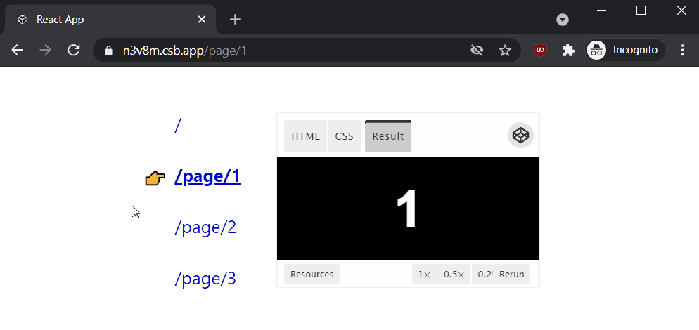
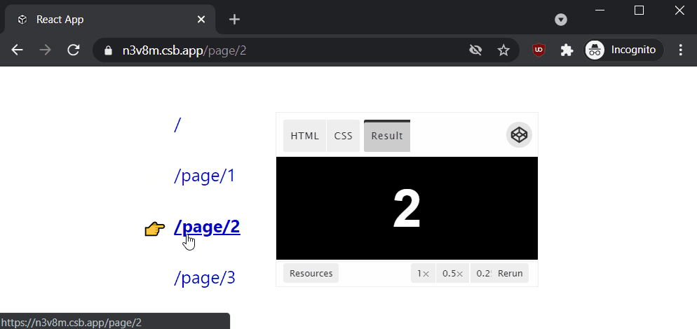
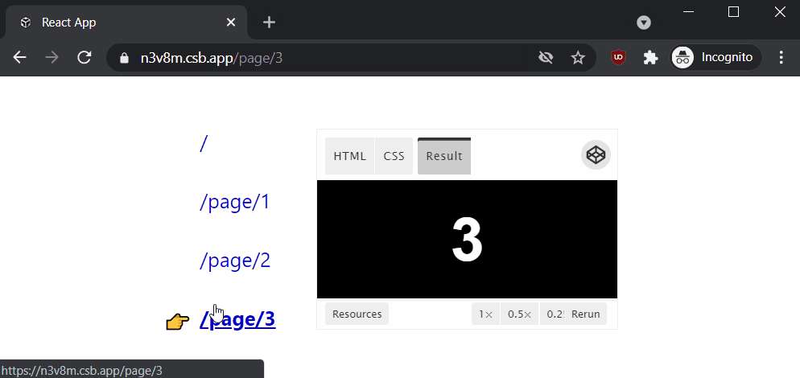
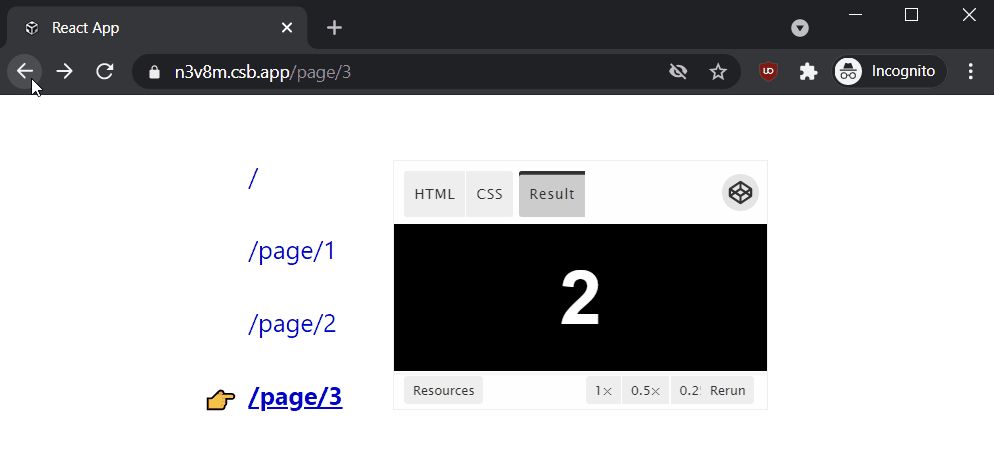
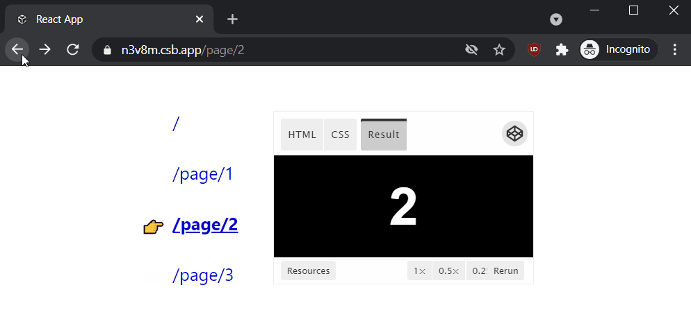

You're using iframes to embed content on a page in React.

*What could possibly go wrong*, you wonder. Apparently, a whole lot!

In this post, we'll fix a bug where iframes in React interfere with your browser's back-navigation.



## Demo: Rendering Iframes in React

I've created a [CodeSandbox demo](https://n3v8m.csb.app/) for this article. For our purposes, though, we can pretend that the markup is something simple, like this:

```jsx
const Page = ({ contentId }) => {
  return (<main>
    <nav>{/* some page navigation here */}</nav>
    <iframe src={`/embed/url/${contentId}`} />
  </main>);
}
```

Notice that the iframe has a dynamic `src` attribute, meaning its content changes as you navigate to a different page in the app. You're always working with the same iframe, though; it's just re-rendering and pointing to a different URL.

## Bug: Iframes Interrupt Back Navigation in the Browser

The first page loads the right iframe:



You then visit the second page, and it updates the iframe:



Finally, you visit the third page, and it too renders the correct iframe:



At first glance, everything seems to be working correctly.

But now, let's try going back to the previous page using our browser's back button:



Hmm... It doesn't work as expected! When you first click the back button in your browser, the iframe *itself* navigates backward, pointing to the embedded content that you saw on the previous page. But the app didn't navigate—it's still on the old page! In other words, the page and its corresponding iframe are out of sync by one step. When you press back again, you're finally routed to the correct page:



Effectively, you have to press the back button *twice* whenever you want a legitimate page navigation.

It's worth noting that this issue isn't necessarily unique to React projects, although it's most obvious in a single-page app where routing is a little different than in a traditional website. If you have three different pages in vanilla HTML and JavaScript, then you're rendering three different iframes, and you shouldn't see this issue (unless you have a single page and are navigating within it, like with anchors).

## Takeaway: Iframes Share Browsing History with the Page

As it turns out, this bug has a simple explanation—and, in the case of React, an elegant solution.

Whenever you reuse an iframe and only change its `src` attribute to point to some other content, it's treated as a content navigation, and the iframe's current `src` gets pushed onto the browser's `window.history` stack. When you later try to navigate backward, your browser pops the top of the history stack, navigating the iframe itself.

You can verify this by logging `window.history` on every render. You should see that the `length` goes up by two each time you visit a different page. One of those items comes from the iframe's navigation; the other is the actual page navigation itself.

## Solution: Remount the Iframe (with a Key)

A framework-agnostic solution is to destroy the iframe and recreate it every time you need to change its `src`, rather than reusing the same iframe you were working with before and merely changing its source attribute. You can easily do this in vanilla JavaScript by replacing the iframe node with a new one:

```js
const parentNode = document.querySelector('.iframe-container');
const oldIframe = document.querySelector('iframe');
const newIframe = oldIframe.cloneNode();
newIframe.src = 'some/other/source';
parentNode.replaceChild(newIframe, oldIframe);
```

But in our case, we're working with React. And we actually have a simpler solution: Giving the iframe a `key` that changes whenever it re-renders!

```jsx
<iframe
  key={contentId}
  src={`embedded/content/${contentId}`} />
```

Let's go over why this works.

First, note that `key` is a unique pseudo-prop that can be passed to any element that you render anywhere in the tree. I say pseudo-prop because you typically don't do anything with this prop yourself; it's not even accessible under `props.key`. Rather, React uses the `key` prop *under the hood* as part of its [reconciliation process](https://overreacted.io/react-as-a-ui-runtime/#reconciliation) to determine whether an element is logically the same between two renders. If React doesn't see the same element, it will unmount and remount that element instead of re-rendering it.

Now, what do I mean by "logically" the same? Well, React uses a very basic heuristic to compare two UI snapshots: If the location of an element in your code is unchanged from Render 1 to Render 2, then React assumes that it's working with the same element that it saw in the previous render, even if the element's UI or state has changed. Thus, React doesn't fully unmount and remount the UI (which is rarely what you'd want anyway since state would get lost). Rather, it simply re-renders the component. This works great for most cases, and you usually don't have to worry about adding a `key` prop to your elements.

However, there *are* certain situations where you want a component to fully unmount whenever its UI changes. That actually happens to be the case in our scenario. We have an iframe, and it re-renders whenever its `src` changes. As we saw, this pushes items onto the browser's history stack, which is undesirable because it interrupts legitimate page navigation history.

To solve this problem, we need to **remount the entire iframe** instead of only re-rendering it. This is why the code above works: We can force a component to remount by giving it a key that's unique on every render. In this case, a suitable key would be whatever is causing the iframe's source to change between renders. You can use the content ID (or even the full URL if you want). On each render, React will see a different iframe and remount it, preventing the iframe from pushing items onto the browser's `history` stack.

And voila—the page navigation should now be in sync with the iframe.

## And That's It!

I hope you learned something new—I sure did when I first encountered this bug! It's a good reminder that the `key` prop isn't just useful inside loops, like when you're mapping an array to elements. Sometimes, you also need to give an element a key to forcibly remount it.


