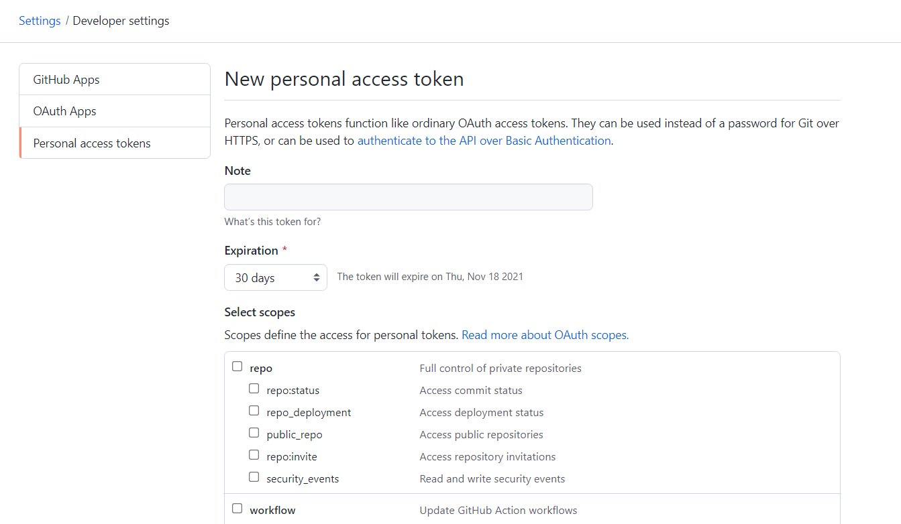

So you want to add comments to your static blog? Well, it's _static_ for a reason. Comments usually require a form, server, and database, all of which feels like a lot of work just to have strangers on the internet tell you how bad and wrong you are.

A popular option is to use a third-party provider and embed some scripts on your site, but these usually have some notable drawbacks: tracking cookies and ads, inflexible markup and styling, and more.

Alternatively, you could do what I do on my blog: Use a GitHub repo as a makeshift comment system and fetch the comments with a serverless function. While this tutorial uses Netlify as the serverless provider, the underlying logic applies to most other hosting providers too: You can use Vercel, AWS, Cloudflare, whatever.



## Using GitHub as a Comment System

Instead of storing comments in a JSON file or with a third-party service, I use the GitHub Issues API as my makeshift comment system. If I want to enable comments for one of my posts, I open a new issue in my project's public GitHub repository, jot down the issue number, and assign that to a variable in the post's front-matter block (I author my content in Markdown):


```md {data-file="src/_posts/my-post.md" data-copyable=true}
---
commentsId: 42
---
```


I also store this issue number in a `data-` attribute somewhere in the post's HTML so I can later read it with JavaScript when readers click my "Load comments" button. With most static site generators, you should be able to do this at the layout level for all of your posts.


```html
<section id="comments" data-issue-id="{{ commentsId }}"></section>
```


### Wait, What?

It may seem a little strange to use GitHub issues as a comment system, but hear me out! While there are lots of existing comment systems and platforms that you can integrate into your site, they all have their own problems.

Static comment systems (e.g., [Staticman](https://github.com/eduardoboucas/staticman)) are the simplest to set up, but they require you to rebuild your site for new comments to appear. This is too much maintenance—I want my users to be able to post comments and have them show up immediately upon refreshing the page. I don't want to have to rebuild my site every time a new comment is posted.

At the same time, I want to be able to moderate comments and delete them if they're abusive. For this reason, Disqus tends to be a popular option since it gives you full admin permissions and control over comments. But it also comes with ads and tracking that I absolutely don't want my users to have to worry about.

A more neutral option is [utterances](https://utteranc.es/), a GitHub app that allows users to log into your site with their GitHub account via OAuth and post comments directly. While utterances works, it has limited theming and customization options (unless you write your own CSS overriding their markup). I also don't want my readers to have to trust yet another app, especially just to post a comment on my site.

On the other hand, there are lots of advantages to fetching the comments yourself from a GitHub issue. The GitHub interface already has built-in Markdown formatting, reactions, and content moderation. I can edit or delete comments that are abusive, and I can close or disable comments for a post whenever I want. I can even swap out the repo in the future. Users can delete or edit their comments at will and don't have to be concerned about their privacy. Best of all, I have full control over the markup and CSS since I'm the one rendering the comments on the client side. This makes GitHub issues a good (albeit unconventional) option for showing comments on a developer blog. You don't need to pay anything to use it, and it's a trusted platform.

## Making API Calls on Static Sites with Serverless Functions

My [old comment system](/blog/jekyll-comment-system-github-issues/) used the same strategy I outlined earlier, but it made unauthenticated API requests on the front end, which run into a rate limit of 60 requests per hour. This is a typical limitation for static sites—you can't use API keys on the front end because anyone can inspect network requests and steal your credentials. So my old comment system wasn't very scalable or reliable. Authenticated GitHub requests, on the other hand, get a much more generous rate limit of [5000 requests per hour](https://docs.github.com/en/rest/overview/resources-in-the-rest-api#rate-limiting).

The typical solution is to host a custom server—written with Express, Flask, or one of the many other web server frameworks—and to have it proxy the API requests for you. Now, instead of sending your request directly to the external API, you first send it to a dedicated REST endpoint that you've set up on your server, and it makes the authenticated request for you and forwards the response.

Instead of deploying an entire server to make what is essentially just one API call, we can write and deploy a <dfn>serverless function</dfn>: a lightweight endpoint hosted on a third-party server that accepts an incoming request and returns a response. You could use AWS Lambda, Vercel Functions, Cloudflare Workers, and many other popular providers, but in this tutorial I'll show how to write a [Netlify Function](https://www.netlify.com/platform/core/functions/). The underlying implementation won't differ too much between these providers.

Under the hood, a Netlify function [is really just an AWS lambda](https://www.netlify.com/blog/2018/03/20/netlifys-aws-lambda-functions-bring-the-backend-to-your-frontend-workflow/); it gets registered at build time as an API endpoint to which you can send requests, just like with a traditional web server. When a request comes in for a particular endpoint, Netlify calls your lambda with any query parameters and other data the client sent it, executing the function on the server side. This is great because it allows you to easily deploy a static site and enhance it with server-side functionality as needed. And since these functions run on a server, you can safely make authenticated API requests without leaking private API keys or other secrets.

### Writing a Serverless Function

Now that we're clear on why I'm using serverless functions and the GitHub API for my comment system, let's start setting things up and writing some code. We'll set up a basic Netlify function that can can fetch comments for a post, given an issue number as a query param. We'll want to eventually be able to invoke the function on the client side like this:

```js
await fetch(`/.netlify/functions_dir/endpoint/?id=123`)
```


This endpoint will differ from one provider to another, so adjust your code accordingly.


By default, [Netlify looks for functions under `BASE_DIRECTORY/netlify/functions`](https://docs.netlify.com/functions/configure-and-deploy/), but you can tell it where to find your functions in your `netlify.toml` config:

```toml
[functions]
  directory = "./path/to/functions"
```

Create a directory for functions in your project and update your config accordingly.

Now, let's say we want to hit an endpoint like `/.netlify/functions/comments?id=123` on the front end. The important bit here is `comments?id=123` since the rest of it is just the path to your Netlify functions directory. The name of the function is `comments`, and it accepts a single query string parameter (`id`). To create a function for the `comments` endpoint, all we need to do is add a file of the same name to our functions directory. For example, if your functions directory is `functions`, then any of the following would be valid:

- `functions/comments.js`
- `functions/comments/comments.js`
- `functions/comments/index.js`

Like most other hosting providers, Netlify [supports a number of languages for serverless functions](https://docs.netlify.com/functions/configure-and-deploy/#languages-and-language-settings), including JavaScript, TypeScript, and Go. I'll stick with JavaScript for this tutorial to keep things simple.

Then, all we need to do is export an async function from that file:

```js {data-file="functions/comments.js" data-copyable=true}
export default async function getCommentsForPost(request) {
  // logic goes here
};
```

This function accepts the HTTP request as a web-standards-compatible [`Request` object](https://developer.mozilla.org/en-US/docs/Web/API/Request), which means we can read query parameters off of it:

```js {data-file="functions/comments.js" data-copyable=true}
export default async function getCommentsForPost(request) {
  const issueNumber = new URL(request.url).searchParams.get('id');
};
```

Your function can then return a [`Response` object](https://developer.mozilla.org/en-US/docs/Web/API/Response).

### Testing Serverless Functions Locally

For now, I'm just going to send the issue number back to the caller so I can test that my function is working:

```js {data-file="functions/comments.js" data-copyable=true}
export default async function getCommentsForPost(request) {
  const issueNumber = new URL(request.url).searchParams.get('id');
  return new Response(JSON.stringify({ issueNumber }), { status: 200 });
};
```

We can test this function locally using [Netlify Dev](https://www.netlify.com/products/dev/). Install the [`netlify-cli` package](https://www.npmjs.com/package/netlify-cli) either locally or globally to get started. Then, execute it from the root of your Netlify website:

```bash {data-copyable=true}
npx netlify dev
```


Other providers have similar CLI tools. For example, Cloudflare Workers use [Wrangler](https://developers.cloudflare.com/workers/wrangler/), and AWS Lambda has the [SAM CLI](https://docs.aws.amazon.com/serverless-application-model/latest/developerguide/using-sam-cli-local-start-lambda.html).


This will start up a local Netlify dev server that simulates an actual production environment. It will even read environment variables from your `.env` file (which we'll create shortly) and install your plugins locally. There are [lots of other commands](https://cli.netlify.com/) that you can invoke with the CLI, but the one that we care about is `netlify functions:invoke`. This allows you to simulate a Netlify function call in your terminal on demand without having to write any front-end JavaScript.

With your Netlify dev server running, invoke this command to test your serverless function:

```bash {data-copyable=true}
npx netlify functions:invoke --querystring id=123
```

You'll be prompted to select the function to run. If this is your first time creating a Netlify function for your site, there should only be one listed. After you select the function, it will be called and you should see the following response in your terminal:

```json
{ "issueNumber": "123" }
```

## Fetch Comments from GitHub

Now that we know the basics, we can actually fetch comments from GitHub using the provided issue number. We'll return those comments in the body of our response so that our front-end code can `fetch` this endpoint and map the returned values to a list of comments in the UI (or render an error, or do whatever else it wants to).

### 1. Create a Personal Access Token on GitHub

To get started:

1. Go to your GitHub profile.
2. Navigate to `Settings > Developer settings`.
3. [Create a personal access token](https://docs.github.com/en/authentication/keeping-your-account-and-data-secure/creating-a-personal-access-token) for basic API authentication.

{eleventy:formats="png,webp"}

You don't need to check any of the scopes since this token is only needed for basic API authentication, not for performing other actions related to your GitHub account. You can also set the personal access token's expiration to be whatever you want. Be sure to copy the access token after you create it so you can add it to your local and Netlify production environment variables in the next step.

### 2. Configure Environment Variables

Create a gitignored `.env` file in your project and add the access token that you just copied. You can name the variable whatever you want:

``` {data-file=".env" data-copyable=true}
GITHUB_PERSONAL_ACCESS_TOKEN = YourToken
```


Some providers don't require adding an `.env` file. For example, with Cloudflare Workers, you define your secrets only in the Cloudflare dashboard, and Wrangler reads those secrets.


This is all you'll need to authenticate your local API requests. You don't need to install a package like `dotenv`—Netlify Dev will take care of loading your environment variables for you when you start up the server. Be sure to add `.env` to your `.gitignore` if it's not already there.

You may be wondering, though: If we don't push our `.env` file to our repo, how will Netlify know what values to use for a production build? That's where we'll need to mirror these environment variables in our Netlify dashboard.

To authenticate production API requests, you can either import environment variables from an `.env` file [using the Netlify CLI](https://www.netlify.com/blog/2021/07/12/managing-environment-variables-from-your-terminal-with-netlify-cli/#import-environment-variables-from-a-file), or you can configure the environment variables manually through the Netlify UI. I'll briefly go over how to do the latter, but feel free to use the CLI instead.

Go to your Netlify UI dashboard and find `Settings > Build & Deploy > Environment`. Under the Environment Variables section, create a new variable for your GitHub access token, just like you did locally (use the same name):

{eleventy:formats="png,webp"}

Note that any environment variables you configure on Netlify will remain private; they won't appear in deploy logs or previews unless you print them and make your deploy logs public. You'll want to double-check that your Sensitive Variable Policy is set to `Require approval`. You can find this directly below the Environment Variables section.

### 3. Authenticate with the GitHub API

We'll use GitHub's official [Octokit JavaScript SDK](https://github.com/octokit/octokit.js) to authenticate and make API requests. You technically don't _need_ to do this, but there's really no reason not to, especially since server-side packages won't get included in any client-side bundles.

Install the following packages:

- [`@octokit/auth-token`](https://www.npmjs.com/package/@octokit/auth-token)
- [`@octokit/core`](https://www.npmjs.com/package/@octokit/core)
- [`@octokit/rest`](https://www.npmjs.com/package/@octokit/rest)

Then, go back to your Netlify function and update it to set up an authenticated Octokit client in the module scope:

```js {data-file="functions/comments.js" data-copyable=true}
import { Octokit } from '@octokit/rest';
import { createTokenAuth } from '@octokit/auth-token';

// Check env
if (!process.env.GITHUB_PERSONAL_ACCESS_TOKEN) {
  throw new Error('Missing environment variable: GITHUB_PERSONAL_ACCESS_TOKEN');
}

// Authenticate with GitHub Issues SDK
const auth = createTokenAuth(process.env.GITHUB_PERSONAL_ACCESS_TOKEN);
const { token } = await auth();
const octokit = new Octokit({ auth: token });
```

With that out of the way, we can start building out our function. Let's do some basic validation:

```js {data-file="functions/comments.js" data-copyable=true}
export default async function getCommentsForPost(request) {
  let issueNumber = new URL(request.url).searchParams.get('id');
  if (!issueNumber) {
    return new Response(JSON.stringify({ error: 'You must specify an issue ID.' }), { status: 400 });
  }
  try {
    // rest of the tutorial code will go here
  } catch (e) {
    console.log(e);
    return new Response(JSON.stringify({ error: 'Unable to fetch comments for this post.' }), { status: 500 });
  }
}
```

We first parse the `id` query parameter from the Request object and check if it was provided. If it wasn't, then we return a 400 Bad Request. In our case, this would only happen if we forgot to pass in an ID via query params.

All of the remaining code in this tutorial will go inside the `try` block so we can catch and handle errors appropriately. I'll omit code we've already written for brevity. Alternatively, you can just [grab the final code](#final-code).

### 4. Check the Rate Limit

Now that we've authenticated the Octokit client and verified that we have an ID to query, we'll first check our rate limit and return an error status preemptively if we can't make any more API requests. Note that this request itself doesn't count toward your rate limit.

```js {data-file="functions/comments.js" data-copyable=true}
const { data: rateLimitInfo } = await octokit.rateLimit.get();
const remainingRequests = rateLimitInfo.rate.remaining;
console.log(`GitHub API requests remaining: ${remainingRequests}`);
if (remainingRequests === 0) {
  return new Response(JSON.stringify({ error: `API rate limit exceeded.` }), {
    status: 503
  });
}
```

We're also logging the number of requests remaining. You can check in on this from time to time in your Netlify dashboard under the `Functions` tab, where you can see real-time requests for your deployed functions:

{eleventy:formats="png,webp"}

Locally, you'll see messages get logged in your `netlify dev` server in your terminal. At this point, you can test that the correct value is getting logged for the number of requests remaining (it should start at `5000` if you have not yet made any API calls).

### 5. List Comments for a GitHub Issue

Finally, we'll use the authenticated Octokit client to fetch all comments for this issue. We'll need to paginate the results, but thankfully Octokit has a helper to do that for us:

```js {data-file="functions/comments.js" data-copyable=true}
const response = await octokit.paginate(
  octokit.issues.listComments,
  {
    owner: site.issues.owner,
    repo: site.issues.repo,
    issue_number: parseInt(issueNumber, 10),
    sort: 'created_at',
    direction: 'desc',
    per_page: 100, // max supported by API
  },
  (response) => response.data.map((comment) => ({
    user: {
      avatarUrl: comment.user.avatar_url,
      name: comment.user.login,
      isAuthor: comment.author_association === 'OWNER',
    },
    dateTime: comment.created_at,
    isEdited: comment.created_at !== comment.updated_at,
    body: markdownToHtml(comment.body),
  }))
);

return new Response(JSON.stringify({ data: response }), { status: 200 });
```

`Octokit.paginate` takes three arguments:

1. The endpoint to call,
2. The parameters to pass to that endpoint, and
3. A mapping function that takes the response and allows you to reshape it.

Here, I'm sorting comments in the same order as they appear in the GitHub UI (oldest comments first). I'm passing along all the info for my GitHub username, repo name, and the issue number.

In the mapping function, I'm returning some custom information about each comment based on the API response. For example, if a comment's creation date differs from its update date, I'll return a boolean `isEdited` so I can mark the comment as "Edited" in the UI.

Note this line in particular for the mapped comments:

```js
body: markdownToHtml(comment.body)
```

This is just a placeholder to indicate that you can use whatever Markdown library you want to convert the text to HTML. Alternatively, you can use `comment.body_html` directly to get GitHub's custom HTML, although I don't recommend doing this as you have no control over that markup.

### 6. Sanitize Comments to Prevent XSS

Since the GitHub API doesn't sanitize comments for us, you'll need to install an HTML sanitizer like [`sanitize-html`](https://www.npmjs.com/package/sanitize-html) and use it to sanitize the parsed body of the comment before returning it:

```js
body: sanitizeHtml(markdownToHtml(comment.body))
```

Otherwise, if you don't do this, you could open yourself up to XSS attacks. You've been warned!

You'll want to do the same thing for usernames:

```js
name: sanitizeHtml(comment.user.login)
```


You may also want to extend the default list of allowed tags and attributes for the sanitizer. See the [sanitize-html docs](https://www.npmjs.com/package/sanitize-html) for examples of how to do this.


### 7. Call the Serverless Function

You can now test your serverless function by invoking it locally with the Netlify CLI.

At this point, you'll want to write some client-side JavaScript to make a request to your lambda. Here's an example of what that might look like:

```js {data-file="src/assets/scripts/index.js" data-copyable=true}
export class CommentsError extends Error {
  constructor(message) {
    super(message);
    this.name = 'CommentsError';
  }
}

export const fetchComments = async (id) => {
  try {
    const response = await (await fetch(`/.netlify/functions/comments?id=${id}`)).json();
    if (response.error) {
      throw new CommentsError(response.error);
    }
    const comments = response.data;
    return comments;
  } catch (e) {
    if (e instanceof CommentsError) {
      throw e;
    }
    throw new CommentsError('An unexpected error occurred.');
  }
};
```

Rendering the comments is beyond the scope of this tutorial, as I don't want to impose any markup, styles, or other conventions on you. The whole point of this tutorial is to have full control over those aspects!

As a reminder, if you use a static site generator that supports Markdown, you'll want to track the GitHub issue ID in the post's front matter and then set it as a `data-` attribute somewhere in your HTML. That way, your client-side JavaScript can look it up and pass it along to the API call as a query parameter when it calls your serverless function.

## Final Code

Here's all of the code we wrote in this tutorial:

```js
import { Octokit } from '@octokit/rest';
import { createTokenAuth } from '@octokit/auth-token';

if (!process.env.GITHUB_PERSONAL_ACCESS_TOKEN) {
  throw new Error('Missing environment variable: GITHUB_PERSONAL_ACCESS_TOKEN');
}

const auth = createTokenAuth(process.env.GITHUB_PERSONAL_ACCESS_TOKEN);
const { token } = await auth();
const octokit = new Octokit({ auth: token });

export default async function getCommentsForPost(request) {
  let issueNumber = new URL(request.url).searchParams.get('id');
  if (!issueNumber) {
    return new Response(JSON.stringify({ error: 'You must specify an issue ID.' }), { status: 400 });
  }

  try {
    // Check this first. Does not count towards the API rate limit.
    const { data: rateLimitInfo } = await octokit.rateLimit.get();
    const remainingRequests = rateLimitInfo.rate.remaining;
    console.log(`GitHub API requests remaining: ${remainingRequests}`);
    if (remainingRequests === 0) {
      return new Response(JSON.stringify({ error: 'API rate limit exceeded.' }), {
        status: 503,
      });
    }

    const response = await octokit.paginate(
      octokit.issues.listComments,
      {
        owner: site.issues.owner,
        repo: site.issues.repo,
        issue_number: parseInt(issueNumber, 10),
        sort: 'created_at',
        direction: 'desc',
        per_page: 100,
      },
      (response) => response.data.map((comment) => ({
        user: {
          avatarUrl: comment.user.avatar_url,
          name: sanitizeHtml(comment.user.login),
          isAuthor: comment.author_association === 'OWNER',
        },
        dateTime: comment.created_at,
        dateRelative: dayjs(comment.created_at).fromNow(),
        isEdited: comment.created_at !== comment.updated_at,
        body: sanitizeHtml(markdown.render(comment.body)),
      }))
    );
    return new Response(JSON.stringify({ data: response }), { status: 200 });
  } catch (e) {
    console.log(e);
    return new Response(JSON.stringify({ error: 'Unable to fetch comments for this post.' }), { status: 500 });
  }
}
```

It's changed a lot since I originally wrote this tutorial, but the core idea has remained the same. Try it out on my site, and let me know what you think!
