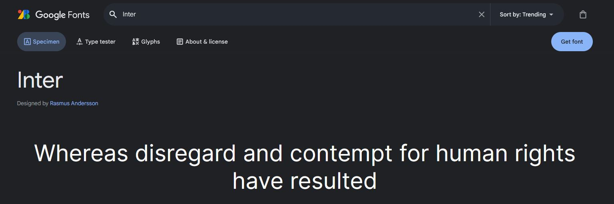
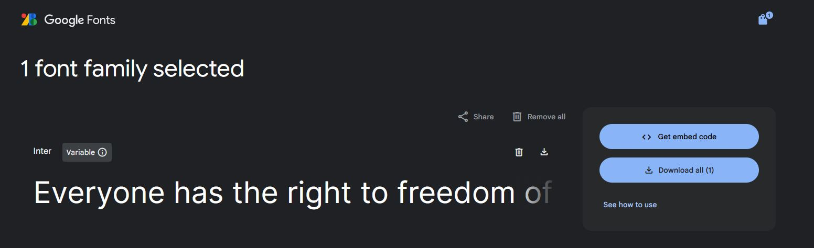
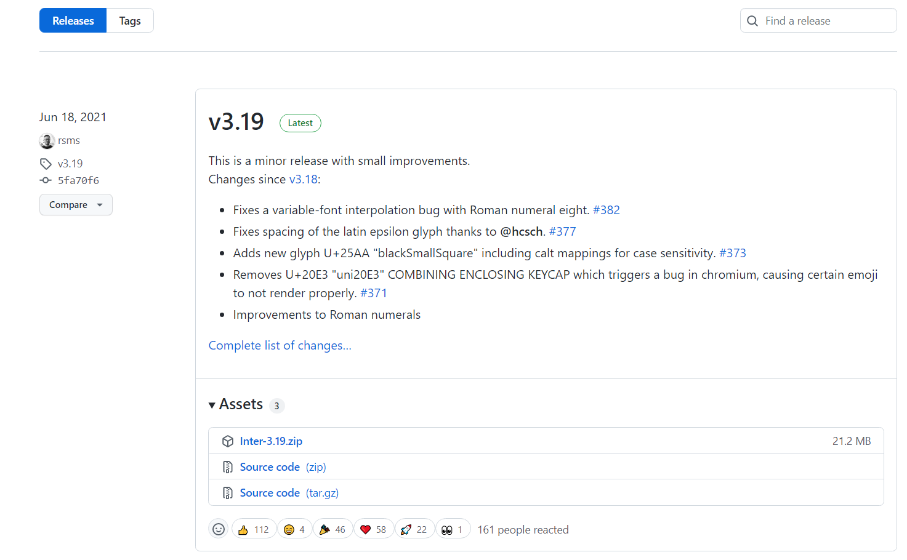
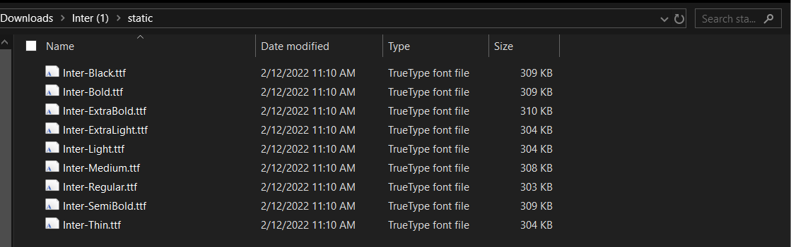
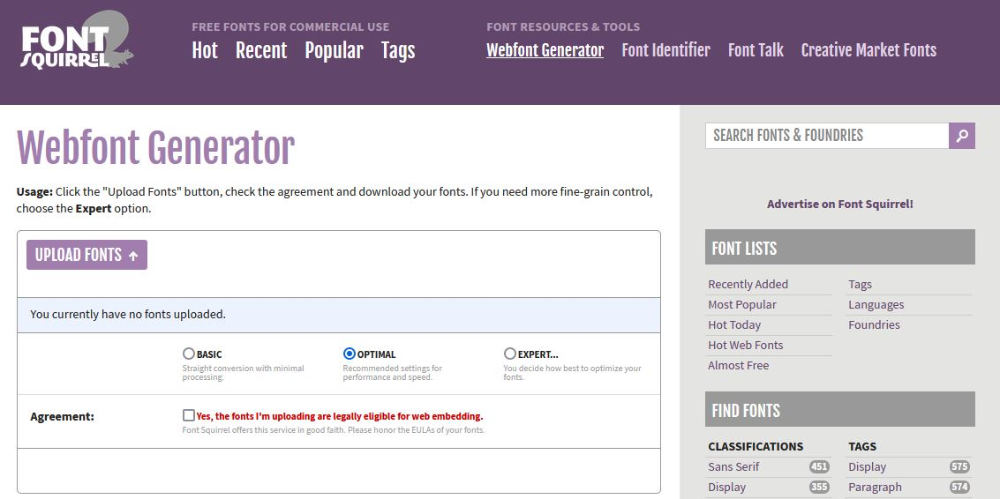

On January 20, 2022, a Munich court ruled that linking to Google Fonts [violates the GDPR in Germany](https://rewis.io/urteile/urteil/lhm-20-01-2022-3-o-1749320/) because it allows any user's IP address to be traced back to their physical address, which is considered personal data under the GDPR. Whether or not you agree with the ruling, it has important implications because it means that German businesses may be unwittingly opening themselves up to lawsuits and fines if they're linking to Google Fonts on their sites.

It's unclear whether other European countries will follow suit, and there are certainly more invasive sites and platforms that don't receive the same treatment. But this isn't about what I think or whether the ruling is just—this is the new reality for German businesses and developers, and they'll need to adapt accordingly.

One way to avoid this problem entirely is to just self-host the Google Fonts you need. Not only does this avoid exposing your users' personal information to Google's servers, but it's also much faster than requesting fonts from the Google Fonts CDN. And in the unlikely event that Google Fonts ever goes down, your site won't be impacted.

Many good articles have already been written on how to self-host fonts, so I won't dive deep into all of the considerations. Instead, I'd like to show you a few ways you can download Google Fonts as a first step. I'll also show you how to manually optimize and subset those font files using a CLI tool like [glyphhanger](https://github.com/zachleat/glyphhanger).



## Downloading Google Fonts

There are a few different ways you can download Google Fonts, ranging from trivial to slightly more involved.

### From Google Fonts

The simplest option to use the download button right there on Google Fonts itself (who would've guessed?). First, find the font you want to use and click on its preview. Then, click the `Get font` button to select it.



You can repeat this step as many times as you want, once for each font you want to include on your site; this batches them all together so you can download all their files at once for convenience. Once you're done selecting all of your fonts, simply click the `Download all` button to download them.



Then, just use your operating system's unzip utility to extract the files to the desired location on your computer.


For help on how to use the fonts you downloaded, including instructions on how to include the necessary `@font-face` rulesets in your CSS, see Google Fonts's guide on [installing and managing fonts](https://fonts.google.com/knowledge/using_type/installing_and_managing_fonts).


### google-webfonts-helper

Sia Kiaramalegos covers this tool in her article on [making Google Fonts faster](https://sia.codes/posts/making-google-fonts-faster/#self-host-your-web-fonts-for-full-control). Head over to [google-webfonts-helper](https://gwfh.mranftl.com/fonts), search for your font, customize it to your liking, and download the files. Unlike Google Fonts, this app provides you with `@font-face` rulesets right on the page that you can copy directly into your CSS.


There's one drawback to this tool: It's not guaranteed to have all of the latest font file revisions, so you may run into some issues that the font's designers have already patched elsewhere. For example, the font Inter has [some rendering issues on Mac](https://github.com/majodev/google-webfonts-helper/issues/130) with the version served by the app, whereas the version hosted by Google Fonts has already fixed those issues.

### GitHub

You can typically find and download the complete font family for any Google Font on GitHub since free fonts are almost always open source. Typically, the production-ready font files will be made available under the Releases tab for the repository along with the source code for the font. Here's an example for Inter:

<figure>

<figcaption>GitHub release notes for Inter v3.19</figcaption>
</figure>

## Optimizing Google Fonts

Once you've downloaded your font files, you may find that they take up quite a bit of space—often hundreds of kilobytes.



Loading large fonts can potentially hurt your page load metrics, so it's worth optimizing them before deploying to production. To do this, you can run your font files through a font subsetting tool to remove character sets that you don't intend to use and even convert them to a more modern format, like `woff2`.

If you're not a technical user, you can use a web-based tool like Font Squirrel's [webfont generator](https://www.fontsquirrel.com/tools/webfont-generator) to upload your font files and then download the optimized and subsetted files once it's done.



However, if you're a developer, I highly recommend using the [glyphhanger npm package](https://www.npmjs.com/package/glyphhanger) to optimize fonts from the command line. Assuming you've followed the [installation instructions](https://github.com/zachleat/glyphhanger#installation) and have all the necessary dependencies, simply navigate to the directory containing your font files and invoke the CLI.

Here's an example command:

```{data-copyable=true}
glyphhanger --subset=*.ttf --LATIN --formats=woff2
```

This tells glyphhanger to:

1. Subset all font files that match the glob pattern `*.ttf`.
2. Use only the Latin character set when subsetting the fonts.
3. Output the subsetted font files in `woff2` format.

If your font files are already in WOFF2 format, then you'll need to update the above command accordingly.


Note that you may also wish to use a different character set; this depends on what languages and special symbols you need to support on your site. For example, instead of `LATIN`, you could specify `US_ASCII` to use a smaller character set (though this is not recommended).


The savings from subsetting a font can be substantial, enough to make a difference in your page load speed. Below is the output I got from running the above command on the Inter font files I downloaded from Google Fonts:

```
Subsetting Inter-Black.ttf to Inter-Black-subset.woff2 (was 308.96 KB, now 23.52 KB)
Subsetting Inter-Bold.ttf to Inter-Bold-subset.woff2 (was 308.69 KB, now 24.45 KB)
Subsetting Inter-ExtraBold.ttf to Inter-ExtraBold-subset.woff2 (was 309.29 KB, now 24.45 KB)
Subsetting Inter-ExtraLight.ttf to Inter-ExtraLight-subset.woff2 (was 303.52 KB, now 23.92 KB)
Subsetting Inter-Light.ttf to Inter-Light-subset.woff2 (was 303.14 KB, now 23.88 KB)
Subsetting Inter-Medium.ttf to Inter-Medium-subset.woff2 (was 307.34 KB, now 24.36 KB)
Subsetting Inter-Regular.ttf to Inter-Regular-subset.woff2 (was 302.57 KB, now 22.91 KB)
Subsetting Inter-SemiBold.ttf to Inter-SemiBold-subset.woff2 (was 308.36 KB, now 24.3 KB)
Subsetting Inter-Thin.ttf to Inter-Thin-subset.woff2 (was 303.24 KB, now 22.6 KB)
```


