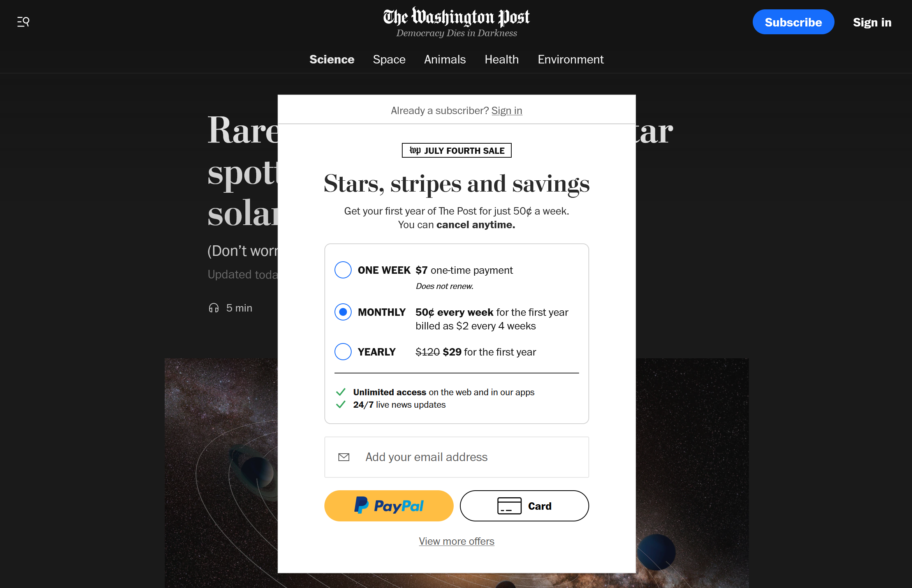

Someone shares an article online, and it eventually makes its way into one of your social feeds. The title, while dubious and verging on clickbait, piques your interest. Though you've walked these roads before, you naively hope that this time will be different. Perhaps this article's sole focus _isn't_ to drive clicks, exploit people's emotions, force sign-ups, deceive users, or sell personal information to advertisers.

Alas, what flickering hope remained is quickly extinguished by one of these:

Legend has it that during one of their executive meetings, the publishers realized that sharing knowledge for free isn't so profitable after all. And so they came up with an ingenious idea: They would try their very hardest to make navigating their website an inaccessible and offensive mess—unless, of course, a user would sign up, accept cookies, enter their payment information, etc.


Well, _yeah_. I have to admit it's easy to take the moral high ground on this issue when you write for fun like I do instead of for profit. But media companies need to make money somehow, unless they're crowdfunded or receive donations from readers, so I do understand the business side of this. However, the fact that so many non-traditional media outlets exist is proof that free content _can_ be profitable if you produce content that people want to consume and are willing to support. And you can do that without annoying people with big banner ads or compulsory subscriptions.


## Just Another Brick in the Paywall

Welcome to gated content, traveler. I hope you're reading this in a future where registration walls and paywalls no longer exist—one where content is free for all to consume. But until then, we have to put up with these sorts of practices on the web.

You shouldn't have to sign up for an account just to read an article, but that's the world we live in: one where knowledge is only conditionally free. We could blame this trend on a number of factors, but the truth is that publications have always been in it for the money. Now, they're just armed with legions of web developers who reluctantly obey their clients, [making the logo bigger](https://www.youtube.com/watch?v=5AxwaszFbDw) until the sweet release of the day's end. If they're not directly charging readers for subscriptions, publications are still making money by selling personal information to advertisers.

Where there's money to be made, there is something supposedly valuable to be guarded and a never-ending stream of analytics to collect. _Democracy dies in darkness_, after all—and paywalls keep the oil lamp burning.

## Bypassing Poorly Gated Content

Some of the worst offenders gate their content the proper way: on the server. Rather than visually hiding the content on the client side, these websites check if you're authenticated and whether you have a subscription to view the requested content. If you're unauthenticated, they'll send you a truncated portion of the content to preview and prompt you to subscribe to read the rest of the article. Even if you inspect the network request for the page or disable JavaScript, you'll find that the server only ever returns the truncated article.

Other platforms take a more naive approach, hiding their content on the client side with JavaScript and CSS. Whether you open the site incognito or normally, the full content _appears_ to be beyond your reach. But since the article is only hidden visually, it's technically not gated—anyone can pull back the curtain. If you open up your dev tools and inspect the markup, you'll actually find the content right there in its entirety:

In short, the wrong way to gate content goes something like this:

1. Return all of the content from your server.
2. On the client side, open a modal prompting the user to log in or subscribe.
3. Visually hide the content with CSS or truncate it with client-side JavaScript.

There are many ways you can bypass content that's gated on the client side:

- Find and delete the right elements in a sea of divs or remove the offending CSS.
- Disable JavaScript and reload the page.
- Log the body text in your console: `console.log(document.body.innerText)`.
- Enable reader mode in Firefox or Safari and reload the page.
- Use an archiving tool or extension like [archive.is](https://archive.is/) or [Bypass Paywalls](https://github.com/iamadamdev/bypass-paywalls-chrome).

The only reason this naive approach to gating works is because most readers don't have the necessary knowledge to work around it—they see a modal blocking their screen, so they assume the content is truly inaccessible. The rest of us are mildly peeved and feel compelled to write an essay about it.

## Democracy Dies Behind a Paywall

I just want to read your article. Is that really so much to ask for? If your content is so good that it must be guarded closely, then you shouldn't have to try to force readers to sign up just so they can read it—they'll happily sign up and promote your work if it's really that noteworthy.

Registration walls and paywalls are so commonplace that I've become desensitized to them. But instead of compelling me to subscribe, paywalls squander any chance they may have had of gaining my loyalty as a reader, and my first instinct when encountering one is to search for a different article to read. Apparently, I'm not alone in this, according to a 2025 Pew Research Center survey of 9,482 U.S. adults:


The survey also asked anyone who said they ever come across paywalls what they typically do first when that happens. Just 1% say they pay for access when they come across an article that requires payment. The most common reaction is that people seek the information somewhere else (53%). About a third (32%) say they typically give up on accessing the information.


Unfortunately, this practice of gating content will likely never die out. So for now, this is our reality:

- The web is a horrible mess of modals, popups, and paywalls.
- Free, high-quality content is difficult (but not impossible) to find.
- Media sites use inaccessible and obtrusive modals to entice subscriptions.

If there's one thing you should take away from this long-winded rant, it's this: Gating content with CSS is naive and ineffective. If you're going to put in the effort to prevent people from reading your content, then you may as well go all in and do it correctly. This has the added benefit of driving users away from your site, encouraging them to seek out and support free publications.
