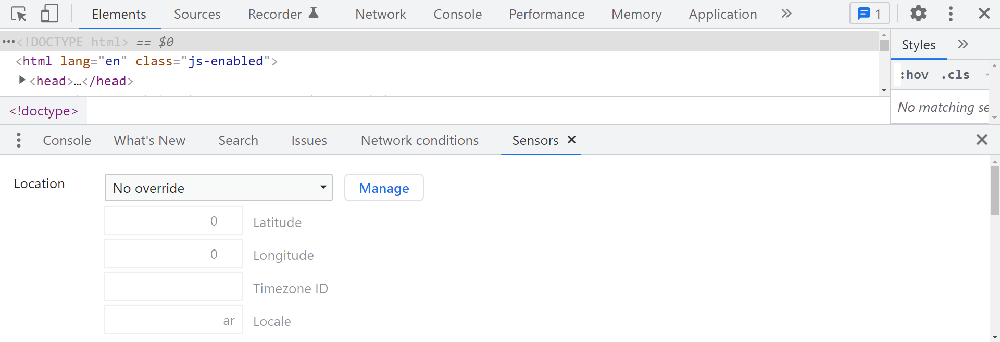
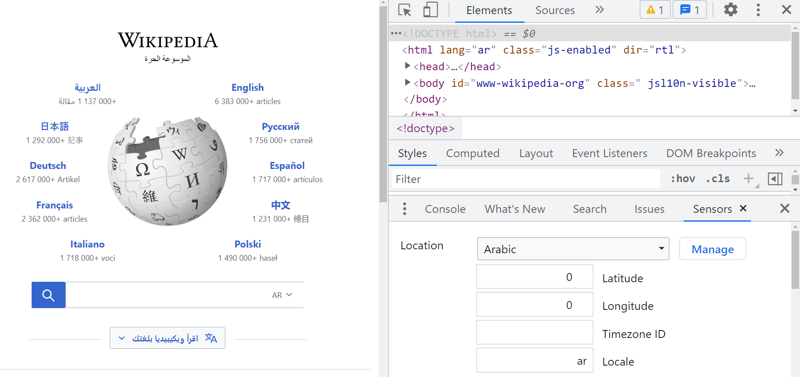

When working on internationalized apps, it's important to test different locales to ensure that the design looks acceptable for a wide range of audiences. For example, I often test a handful of locales to make sure that the features I'm implementing correctly mirror their content in right-to-left (RTL) locales, or that content doesn't overflow its bounds in locales with notoriously long strings (I'm looking at you, Deutsch).

You can test locales in a number of ways. One is to change your browser's default language settings, although it's a little risky to do this if you can't actually read that language. A less reliable option is to directly edit the `lang` and `dir` attributes via your dev tools Element inspector, but this isn't recommended in hot-reload environment since your changes will be wiped as soon as the page refreshes. An alternative is to set up a query parameter in your app that can be used to override the locale. (This is easier if you're using a framework like Next.js.) However, all of these options require too much effort just to test a different locale, which is becoming an increasingly common task in front-end development.

Modern browsers have developer tools that allow us to simulate user preferences, vision impairments, device resolutions, and various other scenarios. As it turns out, Chromium browsers like Google Chrome and Edge allow us to also simulate loading the page in a different locale. This is perfect for when you just want to view a page in a different language without messing with any other settings.

## Changing the Locale in Chrome


Credit: I learned this trick from Kazuya Ito in [their StackOverflow answer](https://stackoverflow.com/a/69149258/5323344) on how to change the browser locale via dev tools in Google Chrome.


To start, you'll want to open up a site that you know is internationalized. Maybe that's the one you're creating at work, or maybe it's a popular site that you use. I'll use Wikipedia for this demo. Here's Wikipedia in English on Chrome:

Open your dev tools, either by right-clicking the page and selecting `Inspect element` or using the keyboard shortcut (<kbd>Ctrl+Shift+I</kbd> on Windows and <kbd>Cmd+Shift+I</kbd> on Mac). Chrome has a command palette that you can invoke using <kbd>Cmd+Shift+P</kbd> or <kbd>Ctrl+Shift+P</kbd>, depending on your OS. Search for `Show sensors`:

Press <kbd>Enter</kbd>, and you should see a new pane pop up that looks like this:

As the name suggests, the [Sensors web API](https://developer.mozilla.org/en-US/docs/Web/API/Sensor_APIs) allows a web site or app to leverage a device's built-in sensors for things like gyroscopes, lighting, accelerometers, geolocation, and more. In Chrome dev tools, the Sensors pane mocks this API, allowing you to simulate a specific device configuration so that when the page tries to read that information, it uses the mocked data rather than the real device data.

Additionally, Chrome's Sensors pane allows us to switch locales. For example, if we select Berlin from the dropdown list and manually refresh the page, we should see the text update to German because the locale for the Berlin option is set to `de-DE` by default:

Cool!

What if we also want to test a right-to-left locale, like Arabic? In that case, all we need to do is click the `Manage` button in the Sensors pane and enter the details for our custom location (if it doesn't already exist). Note that you don't need to enter a latitude or longitude if you're not trying to test geolocation functionality. For this example, I'll create a generic location named Arabic and set its locale to `ar`.

Click `Add`, and close out of the settings view either with <kbd>Escape</kbd> or by clicking the `X` button in the top-right corner. Then, repeat the same steps as before—select your newly created location, and refresh the page:

Not only does the page serve the text in Arabic, but it also flips the text directionality to RTL (since Arabic is one of a handful of RTL languages). You can verify this either visually or by finding `lang="ar"` and `dir="rtl"` in the element inspector.

That's it! Now, you can easily flip-flop between locales without having to mess with your browser or OS settings. This makes it much easier to test RTL and overflow edge cases.


