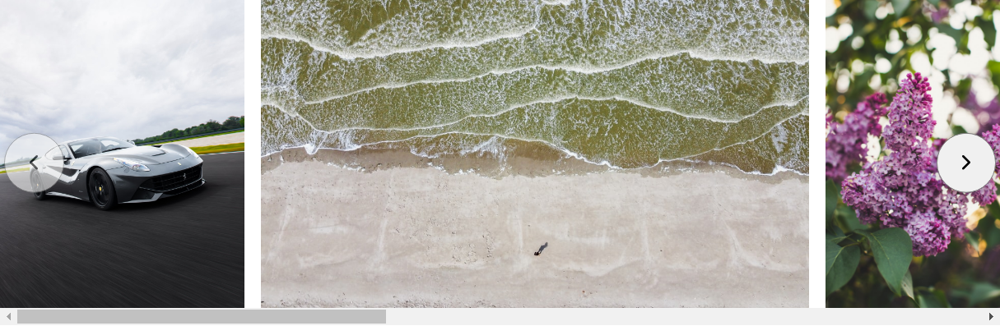

If you've been on the web long enough, you're probably aware that carousels don't have the best reputation. While they're not *inherently* bad, they do tend to be implemented in a way that compromises accessibility. For example, carousels typically lack proper keyboard support and semantics, making it difficult for users to navigate or parse the content. Some carousels also auto-scroll their content, creating an unpleasant experience for users with vestibular disorders. Other implementations rely heavily on libraries and ship more JavaScript than is really needed.

Jared Smith's [Should I Use a Carousel](https://shouldiuseacarousel.com/) demonstrates the frustrating user experience that a poorly engineered carousel can create. It also cites user research suggesting that carousels are ineffective at communicating textual information or compelling users to take action. Furthermore, Vitaly Friedman's article on [designing a better carousel UX](https://www.smashingmagazine.com/2022/04/designing-better-carousel-ux/) illustrates just how much work and research is required to create an acceptable user experience with carousels.

With all of these problems in mind, you may be wondering: Why risk implementing a carousel in the first place? Well, the truth is that while carousels can cause problems if they aren't implemented thoughtfully, they don't _have_ to be bad. Well-engineered carousels can give users a break from the traditional top-down flow of a page, allowing them to browse content horizontally rather than just vertically. Moreover, carousels allow you to present media in a more artistic style than you might be able to achieve with a traditional media gallery or other presentation format.


Carousels don't have to be bad, but we have a culture of making them bad. It is usually the features of carousels, rather than the underlying concept that is at fault. As with many things inclusive, the right solution is often not what you do but what you don't do in the composition of the component.


In this article, we'll learn how to create a progressively enhanced image carousel like the one in the interactive demo below. Try it out! Focus the carousel and use your arrow keys to slide left or right, click the buttons to jump from one image to another, or use your mouse wheel to scroll:

<p style="display: contents"><a href="#carousel-skip-target" class="screen-reader-only" style="left: 50%; transform: translateX(-50%);">Skip carousel</a></p>
<div class="carousel" id="carousel">
  <div
    class="carousel-scroll-container outline-offset"
    role="region"
    aria-label="Image carousel"
    tabindex="0"
  >
    <ol class="carousel-media" role="list">
      
      <li class="carousel-item">
        <figure>
          
          <figcaption>Photo by <a href="{{ image.user.url }}?utm_source={{ site.url }}&utm_medium=referral" rel="noreferrer noopener" target="_blank">{{ image.user.name }}</a> on <a href="https://unsplash.com/?utm_source={{ site.url }}&utm_medium=referral" rel="noreferrer noopener" target="_blank">Unsplash</a></figcaption>
        </figure>
      </li>
      
    </ol>
  </div>
</div>
<div id="carousel-skip-target" style="display: contents"></div>


We'll also look at how to create the traditional type of carousel where [each slide spans the full width](#optional-full-width-slides). This will only require a slight modification to the code.


This article covers everything you need to know to create an image carousel such as this using HTML, CSS, and JavaScript. We'll first render a simple list of images using semantic markup and best practices for performant imagery, taking care to preserve the native aspect ratio of each image. Then, we'll style the list of images as a scrollable carousel and optionally enhance it with CSS scroll snap. At this point, our carousel will be complete and functional on its own. As a final enhancement, we'll write some JavaScript to allow users to jump to the next image via navigation controls. Throughout this tutorial, we'll carefully consider accessibility to ensure that our carousel can be scrolled with arrow keys, that it's narrated appropriately by screen readers, that it works in right-to-left layouts, that the buttons communicate their disabled state, and so much more.


While this tutorial shows you how to implement an _image_ carousel, you can still use videos and other media in place of images. There's nothing specific to images in this implementation other than a single CSS selector.




## HTML: A Semantic Carousel

Semantically, an image carousel is a list of images—typically ordered in an authoring context where users can choose how to arrange their media, but you could also use an unordered list. Below is some static markup that could be used to define such a carousel. I'm using plain HTML in this tutorial, but you could translate this into any templating language you want, such as if you're using a JavaScript framework.

```html {data-file="index.html" data-copyable=true}
<div class="carousel">
  <div
    class="carousel-scroll-container"
    role="region"
    aria-label="Image carousel"
    tabindex="0"
  >
    <ol class="carousel-media" role="list">
      <li class="carousel-item">
        
      </li>
      <!-- more images can go here -->
    </ol>
  </div>
</div>
```


To simplify the markup, I only rendered a single image with placeholder attributes. You can use whatever media you want and update the HTML accordingly.


We'll also use this additional HTML to instantiate the navigation controls for our carousel using client-side JavaScript; this template can go anywhere in your markup since it won't be rendered immediately:

```html {data-file="index.html" data-copyable="true"}
<template id="carousel-controls">
  <ol role="list" class="carousel-controls" aria-label="Navigation controls">
    <li>
      <button
        class="carousel-control"
        aria-label="Previous"
        data-direction="start"
      >
        <svg
          width="24"
          height="24"
          viewBox="0 0 24 24"
          fill="none"
          stroke="currentColor"
          stroke-width="2"
        >
          <polyline points="15 18 9 12 15 6"></polyline>
        </svg>
      </button>
    </li>
    <li>
      <button class="carousel-control" aria-label="Next" data-direction="end">
        <svg
          width="24"
          height="24"
          viewBox="0 0 24 24"
          fill="none"
          stroke="currentColor"
          stroke-width="2"
        >
          <polyline points="9 18 15 12 9 6"></polyline>
        </svg>
      </button>
    </li>
  </ol>
</template>
```


I'm using SVGs from [Feather Icons](https://feathericons.com/) for the buttons; feel free to use your own icons.


There are several things going on here, so let's unpack it all.

### The Outermost Wrapper (`.carousel`)

First, I'm using an outer wrapper div for the layout. This may seem unnecessary, but we'll later want to position the navigation controls absolutely relative to the carousel's scrollport. Since we don't want the buttons to be children within the list of images, it makes more sense to anchor them relative to this parent div. Moreover, we don't want to position these buttons inside the `.carousel-scroll-container` because we're going to set horizontal overflow on that element.

### The Scroll Container and List of Images

The most important part of this markup is the `.carousel-scroll-container`:

```html
<div
  class="carousel-scroll-container"
  role="region"
  aria-label="Image carousel"
  tabindex="0"
>
  <ol class="carousel-media" role="list">
    <li class="carousel-item">
      
    </li>
  </ol>
</div>
```

As recommended in the Inclusive Components article, I'm using a role of `region` for the scroll container and giving it an `aria-label` so that screen readers narrate it appropriately on focus. In this example, a screen reader user should hear something like `Image carousel, region` when navigating to this element. You may also want to add some instructions that are only visible on hover/focus to clarify that users can scroll this region with their arrow keys. See the [Inclusive Components article's section on affordance](https://inclusive-components.design/a-content-slider/#affordance) for how you might accomplish that.

Additionally, `tabindex="0"` allows keyboard users to focus this region by tabbing to it. This allows a user to scroll the container with their left and right arrow keys, which will become more important once we style the carousel to actually overflow horizontally. For a more in-depth discussion of this enhancement, see Adrian Roselli's article on [keyboard-only scrolling areas](https://adrianroselli.com/2022/06/keyboard-only-scrolling-areas.html?ref=sidebar). The use of `tabindex="0"` together with `role="region"` is also covered in the MDN docs on [scrolling content areas with overflow text](https://developer.mozilla.org/en-US/docs/Web/Accessibility/ARIA/Roles/region_role#scrolling_content_areas_with_overflow_text).

The scroll container contains an ordered list of images (`.carousel-media`). Note that I've given this element an explicit role of `"list"`, which may seem redundant since that's already the default role for HTML lists. However, I plan to reset the native list styling with `list-style: none` in a future section, and this [clobbers the native list role when using VoiceOver in Webkit browsers](https://www.scottohara.me/blog/2019/01/12/lists-and-safari.html) (which, according to the WebKit team, [is a feature, not a bug](https://bugs.webkit.org/show_bug.cgi?id=170179#c1)). The main benefit of preserving list semantics here is that screen reader users will be told how many images there are in advance. So it doesn't hurt to add the role defensively.

Navigating these elements with a screen reader will sound something like this:

1. Image carousel, region.
2. List n items.
3. (Alt text narrated) image 1 of n.
4. (Alt text narrated) image 2 of n.

... and so on.

Importantly, the content can be understood and consumed at this point by all users, even before we've begun to style it as a carousel with CSS or make it interactive with JavaScript.

#### Image Markup

We want the markup for each image to look like this:

```html

```

First, I'm setting an [explicit `width` and `height` attribute](/blog/setting-width-and-height-on-images/) on each image. This allows the browser to reserve the correct amount of horizontal and vertical space for the images well in advance of when they download, preventing unwanted layout shifts. This may not seem important now, but it's going to matter in a future section once we enable CSS scroll snap. If we don't give our images a width and height, they will all collapse to an initial zero-by-zero bounding box. Depending on how quickly the page loads, this may sometimes cause scroll snap to latch onto images further down the list when the page mounts—such that by the time the images finish downloading, the carousel may be initialized in a partially scrolled state.

For improved performance, I'm also using the `loading="lazy"` attribute to enable [native lazy loading](https://web.dev/browser-level-image-lazy-loading/), which defers loading images that aren't currently visible. Once we enable overflow scrolling with CSS in a future section, this will defer loading images that are overflowing horizontally beyond the carousel's client window. However, note that in my testing, I occasionally ran into a problem where the lazy loading causes a jarring scroll behavior when combined with CSS scroll snap. If you run into that problem, you may want to remove this attribute from your images (or disable scroll snap since it's optional). An alternative approach with wider browser support would be to lazily load the images with JavaScript by swapping out low-quality image placeholders for the full source, as described in the Inclusive Components tutorial linked to earlier. I've also [previously written about how you can do this](/blog/optimizing-images-for-the-web/#lazy-loading-images-with-javascript) with an `IntersectionObserver`.

Finally, I'm using [`decoding="async"`](https://developer.mozilla.org/en-US/docs/Web/API/HTMLImageElement/decoding) to tell the browser to de-prioritize decoding image data. This can speed up rendering for other content on the page, but it's not an essential enhancement.

#### Navigation Controls

The final element in the markup is this [HTML `<template>`](https://developer.mozilla.org/en-US/docs/Web/HTML/Element/template), which we'll later clone with JavaScript to create an instance of this node and append it to the carousel:

```html
<template id="carousel-controls">
  <ol role="list" class="carousel-controls" aria-label="Navigation controls">
    <li>
      <button
        class="carousel-control"
        aria-label="Previous"
        data-direction="start"
      >
        <svg
          width="24"
          height="24"
          viewBox="0 0 24 24"
          fill="none"
          stroke="currentColor"
          stroke-width="2"
        >
          <polyline points="15 18 9 12 15 6"></polyline>
        </svg>
      </button>
    </li>
    <li>
      <button class="carousel-control" aria-label="Next" data-direction="end">
        <svg
          width="24"
          height="24"
          viewBox="0 0 24 24"
          fill="none"
          stroke="currentColor"
          stroke-width="2"
        >
          <polyline points="9 18 15 12 9 6"></polyline>
        </svg>
      </button>
    </li>
  </ol>
</template>
```

Since we're following a progressively enhanced approach, and the carousel button controls require JavaScript to function, it makes sense to insert them with JavaScript rather than defining them statically in our HTML. That way, if our script fails to load or a user disables JavaScript, we won't bother rendering the buttons. More on this later.

## CSS: Styling the Image Carousel

Our carousel is structured semantically, but it's not very pretty in its current state—it just renders an ordered list of images top-down on the page. Moreover, while setting a `width` and `height` on media is a good practice for aspect ratio sizing, it can cause some unwanted overflow issues, especially on smaller device widths. Below is a very zoomed-out view of what the carousel currently looks like:


We'll fix these issues and more in this section as we bring our image carousel to life. Before we proceed, I recommend adding this standard CSS reset to your project:

```css {data-file="carousel.css" data-copyable=true}
* {
  margin: 0;
  padding: 0;
  box-sizing: border-box;
}
```

### A Horizontal Overflow Container

By default, list items display as block-level elements, which is why we currently see our images stacked one on top of another. In a carousel, we typically want the images to be arranged horizontally in an overflow scroll container. To do this, we can make `.carousel-media` a flex container:

```css {data-file="carousel.css" data-copyable=true}
.carousel [role='list'] {
  /* These are more appropriate in a CSS reset */
  padding: 0;
  list-style: none;
}
.carousel-media {
  /* Arrange media horizontally */
  display: flex;
}
```


I've intentionally omitted spacing from this CSS because I don't want to prescribe any hard-coded values for you to use. In practice, you would pick a spacing variable from your design system and use a Flexbox gap or margins to space the items apart.


This arranges the images horizontally on the page, like so:


Unfortunately, our images are overflowing _the entire page_ horizontally (and vertically!). Enabling horizontal overflow on the carousel is just a matter of setting the `overflow-x` property on `.carousel-scroll-container` to `auto`, which shows a horizontal scrollbar if there's any overflow:

```css {data-file="carousel.css" data-copyable=true}
.carousel-scroll-container {
  /* Enable horizontal scrolling */
  overflow-x: auto;
}
```

This gets us a little closer to the expected result because the page is not overflowing horizontally (although it's hard to tell in the image below because I'm using very high-resolution images):


But because an image's width and height are currently determined by its respective HTML attributes, the images are taking up too much vertical space and overflowing the entire page vertically. We can correct this by setting a fixed height on each list item, setting `height: 100%` on the images, and forcing each image's width to adapt to its height while maintaining its aspect ratio with `width: auto`. I'm going to use a purely arbitrary value of `300px` for the height, but you'll want to update this in your app to be whatever your designers want you to use:

```css {data-file="carousel.css" data-copyable=true}
.carousel-item {
  /* Limit the height of each media item */
  height: 300px;
  /* Prevent media from shrinking */
  flex-shrink: 0;
}
/* Target direct descendant too in case the images have a wrapper parent */
.carousel-item > *,
.carousel-item :is(picture, figure, img) {
  height: 100%;
}
.carousel-item img {
  /* Remove line height (typically done in a CSS reset) */
  display: block;
  /* Responsive width based on aspect ratio */
  width: auto;
}
```


One of those selectors uses the [`:is()` pseudo-class function](https://developer.mozilla.org/en-US/docs/Web/CSS/:is) to avoid having to repeat `.carousel-item`. Be sure to [check browser support](https://caniuse.com/css-matches-pseudo) for this before using it. If browser support is insufficient in your use case, I recommend writing out each selector separately: `.carousel-item picture`, `.carousel-item figure`, and `.carousel-item img`.


Now, the entire page should no longer be overflowing:


Our carousel is looking much better! We can scroll the container horizontally either with pointer events (mouse/touch) or by tabbing to the carousel with our keyboard and using arrow keys. Each image has the same constrained height, but a particular image's width will depend on its intrinsic aspect ratio.

### Enhancing the Carousel with CSS Scroll Snap


**Note**: At the time when I wrote this article, there were various open bugs related to scroll snap in [Chrome](https://bugs.chromium.org/u/3897839768/hotlists/ScrollSnap-Polish), [Firefox](https://bugzilla.mozilla.org/buglist.cgi?quicksearch=scroll+snap), and possibly other browsers as well. For this reason, I consider scroll snap an optional enhancement. I recommend reading this article by Warren Davies to see demos of some of those problems in action: [Why not to use CSS scroll snap](https://alvarotrigo.com/blog/why-not-to-use-css-scroll-snap/). Additionally, I recommend heeding [Adrian Roselli's advice](https://adrianroselli.com/2021/07/scroll-snap-challenges.html): "If you want to use scroll snap properties, test the heck out of them both with users and in browsers."


The default scroll behavior is to slide continuously in the container, but in a media carousel such as this, we typically don't want users to stop midway between two images or in some other random location. Rather, we'd like the carousel to center each image as a user scrolls, providing a series of focal points or destinations along the way. To do this, we can enable [CSS scroll snap](https://web.dev/css-scroll-snap/) on our carousel scroll container. This feature allows us to snap a particular item's focal point into view once a user scrolls close enough to it, as demonstrated in the following video:



Enabling scroll snap is a two-step process. First, we need to tell the scroll container how it should behave with the [`scroll-snap-type` CSS property](https://developer.mozilla.org/en-US/docs/Web/CSS/scroll-snap-type). This property allows us to specify the snapping axis (`x` for horizontal and `y` for vertical) as well as the snapping behavior (`proximity` or `mandatory`), like so:

```css
.element {
  scroll-snap-type: [x|y] [proximity|mandatory];
}
```

We'll use an axis value of `x` since we want to enable scroll snapping in the horizontal direction. For the snap behavior, `proximity` is the default value and allows users to slide continuously as they normally would, but only until they reach a certain threshold; at that point, the container will snap them to an item's focal point. With `mandatory`, the container is forced to always snap to the nearest focal point once a user stops scrolling.

While `mandatory` scroll snapping creates a more consistent user experience by forcing the carousel to behave like a slideshow, it's not perfect. As Max Kohler notes in [Practical CSS Scroll Snapping](https://css-tricks.com/practical-css-scroll-snapping/#aa-scroll-snap-type-mandatory-vs-proximity), `mandatory` can occasionally cause a problem where the browser doesn't allow you to fully scroll to the focal points of the first and last items; instead, it snaps you back to the item that's closest to the center of the carousel's scrollport. It can also cause problems if the scroll snap items overflow their scroll container's client. Finally, I've observed in Firefox 101 that `mandatory` scroll snapping occasionally causes problems with arrow key navigation, where you have to keep the key pressed down or else the scroll container won't budge. For all of these reasons, I recommend using `proximity` instead of `mandatory`.

We'll also enable [smooth scrolling](https://developer.mozilla.org/en-US/docs/Web/CSS/scroll-behavior) for browsers that support it so that the snapping behavior is not so abrupt and jarring:

```css {data-file="carousel.css" data-copyable=true}
.carousel-scroll-container {
  /* Enable horizontal scroll snap */
  scroll-snap-type: x proximity;
  /* Smoothly snap from one focal point to another */
  scroll-behavior: smooth;
}
```

The final step is to tell the container _where_ it should stop on each image: the start, center, or end of that element's bounding box. We can define these focal points using the `scroll-snap-align` property, which accepts a value of `start`, `center`, or `end` (we'll choose `center` since we want our carousel to center the images).

```css {data-file="carousel.css" data-copyable=true}
.carousel-item {
  /* The focal point for each item is the center */
  scroll-snap-align: center;
}
```


You could also set the focal point on any deeply nested child, like the images themselves.


In this case, a `scroll-snap-align` of `center` tells the browser to center the scroll container on whatever item it snaps to. If you're using a Chromium browser, you can inspect the carousel in your dev tools and click the handy `scroll-snap` pill to overlay blue dots on each item; these dots represent the focal points for our scroll-snap carousel:


Since we're using `proximity` for `scroll-snap-type`, we don't need to worry that users might not be able to reach the carousel's edges. However, as an extra precaution, I also recommend that you set the scroll snap alignment to `start` for the first item and `end` for the last item:

```css {data-file="carousel.css" data-copyable=true}
.carousel-item:first-of-type {
  /* Allow users to fully scroll to the start */
  scroll-snap-align: start;
}
.carousel-item:last-of-type {
  /* Allow users to fully scroll to the end */
  scroll-snap-align: end;
}
```

### Optional: Full-Width Slides

The carousel we've been building so far is more akin to a filmstrip, where multiple media may be visible at once but only one is centered at a time. Most carousels in the wild use full-width slides so that only one image is ever shown at a time, like so:

<p style="display: contents"><a href="#slideshow-skip-target" class="screen-reader-only" style="left: 50%; transform: translateX(-50%);">Skip carousel</a></p>
<div class="carousel slideshow" id="slideshow">
  <div
    class="carousel-scroll-container outline-offset"
    role="region"
    aria-label="Image carousel"
    tabindex="0"
  >
    <ol class="carousel-media" role="list">
      
      <li class="carousel-item">
        <figure>
          
          <figcaption>Photo by <a href="{{ image.user.url }}?utm_source={{ site.url }}&utm_medium=referral" rel="noreferrer noopener" target="_blank">{{ image.user.name }}</a> on <a href="https://unsplash.com/?utm_source={{ site.url }}&utm_medium=referral" rel="noreferrer noopener" target="_blank">Unsplash</a></figcaption>
        </figure>
      </li>
      
    </ol>
  </div>
</div>
<div id="slideshow-skip-target" style="display: contents"></div>

If you'd like to implement this variation, all you need to do is force each flex item to take on the full width of its container and use the `object-fit` and `object-position` properties to crop overflowing images. It also makes sense to use mandatory scroll snapping in this case to create a more consistent user experience. I'll use a modifier class of `.slideshow` on the outermost carousel wrapper to scope all of these styles. Below is the CSS needed to implement this variation:

```css {data-file="carousel.css" data-copyable=true}
.slideshow .carousel-scroll-container {
  /* Mandatory scroll snap is more consistent for a slideshow */
  scroll-snap-type: x mandatory;
}
.slideshow .carousel-item {
  /* Or whatever value works for you */
  height: 300px;
  /* Full-width slides */
  width: 100%;
}
.slideshow .carousel-item > *,
.slideshow .carousel-item :is(picture, figure img) {
  /* Cover the slide */
  width: 100%;
  height: 100%;
}
.slideshow .carousel-item img {
  /* Crop and center overflowing images */
  object-fit: cover;
  object-position: center;
}
```

The rest of this tutorial assumes that you're building the original type of carousel presented, not one with full-width slides. However, the code can still be modified to accommodate this layout.

### The Final CSS

Here's all of the code from this section:

```css {data-file="carousel.css" data-copyable=true}
* {
  margin: 0;
  padding: 0;
  box-sizing: border-box;
}
.carousel [role='list'] {
  padding: 0;
  list-style: none;
}
.carousel-scroll-container {
  /* Enable horizontal scrolling */
  overflow-x: auto;
  /* Enable horizontal scroll snap */
  scroll-snap-type: x proximity;
  /* Smoothly snap from one focal point to another */
  scroll-behavior: smooth;
}
.carousel-media {
  /* Arrange media horizontally */
  display: flex;
}
.carousel-item {
  /* Limit the height of each media item */
  height: 300px;
  /* Prevent media from shrinking */
  flex-shrink: 0;
  /* The focal point for each item is the center */
  scroll-snap-align: center;
}
.carousel-item:first-of-type {
  /* Allow users to fully scroll to the start */
  scroll-snap-align: start;
}
.carousel-item:last-of-type {
  /* Allow users to fully scroll to the end */
  scroll-snap-align: end;
}
.carousel-item > *,
.carousel-item :is(picture, figure, img) {
  height: 100%;
}
.carousel-item img {
  /* Remove line height (typically done in a CSS reset) */
  display: block;
  /* Responsive width based on aspect ratio */
  width: auto;
}
```

## Interactivity: Carousel Navigation Controls

In this section, we'll add navigation controls that can be used to programmatically scroll the image carousel. Since we already support arrow key navigation and pointer events, this is more of a nice-to-have feature than an essential one. Most carousels include these navigation buttons, and one could even argue that they improve the user experience by hinting that the container can be scrolled. This is especially true if a user's operating system hides scrollbars by default. Below is a video demo of the final result:



### Creating the Navigation Buttons

As mentioned earlier, we'll insert the navigation controls into the carousel with JavaScript by cloning the HTML template we defined earlier. Our end goal is something that looks like the image below, although note that I'll present a simplified version of the styling and markup to keep this tutorial short and to the point:


We'll start by creating an ES6 class for our carousel. Note that this isn't strictly necessary since you could also use ES modules and compose utility functions together to achieve the same end result. The main benefit of using a class is that we can instantiate as many carousels as needed by passing in new props for each one.

```js {data-file="carousel.js" data-copyable=true}
/**
 * @typedef CarouselProps
 * @property {HTMLElement} root
 * @property {HTMLElement} [navigationControls]
 */

export default class Carousel {
  /**
   * @type {CarouselProps} props
   */
  constructor(props) {
    // `this` binding (you could also transpile class fields)
    this.navigateToNextItem = this.navigateToNextItem.bind(this);

    // Initialize some member variables
    this.root = props.root;
    this.scrollContainer = this.root.querySelector('[role="region"][tabindex="0"]');
    this.mediaList = this.scrollContainer.querySelector('[role="list"]');

    // Init UI
    this._insertNavControls(props.navigationControls);
  }

  /**
   * @param {HTMLElement} controls
   */
  _insertNavigationControls(controls) {
    if (!controls) return;

    const [previous, next] = controls.querySelectorAll('button[data-direction]');
    this.navControlPrevious = previous;
    this.navControlNext = next;

    const handleNavigation = (e) => {
      const button = e.target;
      const direction = button.dataset.direction;
      this.navigateToNextItem(direction);
    };

    this.navControlPrevious.addEventListener('click', handleNavigation);
    this.navControlNext.addEventListener('click', handleNavigation);
    this.root.appendChild(controls);
  }

  /**
   * @param {'start'|'end'} direction
   */
  navigateToNextItem(direction) {
    // we'll fill this in later
  }
}
```

The carousel's constructor accepts two props:

1. `root`: the outermost `.carousel` element.
2. `navigationControls`: the element containing the navigation control buttons.

The constructor then queries all of its relevant children and initializes some member variables for the root, scroll container, and list of media. We've also stubbed out a method named `navigateToNextItem` that we'll later use to programmatically scroll the carousel in either the start or end direction, depending on which button was clicked.

When instantiating our carousel, we'll clone the HTML template that we defined earlier and assign that element to the `navigationControls` prop, like so:

```js {data-file="index.js" data-copyable=true}
import Carousel from './carousel';

// This is the template we defined earlier in our HTML
const carouselControls = document.querySelector('#carousel-controls');

const carousel = new Carousel({
  root: document.querySelector('.carousel'),
  navigationControls: carouselControls.content.cloneNode(true),
});
```

I recommend following this pattern rather than baking the logic for the controls into the carousel class definition itself. This way, the carousel class does not need to worry about cloning the right template or defining the HTML itself. Moreover, this allows you to create the navigation controls however you want. For example, maybe you want to use `document.createElement`, or maybe you already have a pre-built component.


Because we're appending the controls to the carousel's root, they are last in the component's tab order. This means that if the carousel images contain focusable elements like links, a user won't be able to tab to the buttons until they reach the end of the carousel. However, this shouldn't create any usability issues because the buttons are not *necessary* for keyboard users—they're an affordance for mouse and touch users. Keyboard users can still scroll the carousel with their arrow keys.



Screen reader users will hear something like this when navigating the controls:

1. List, navigation controls, 2 items.
2. Previous, button 1 of 2.
3. Next, button 2 of 2.


#### Where Should the Buttons Go?


There is no shortage in available options. We could place the arrow above the carousel, center them vertically/horizontally on the carousel’s slices, or display them under the carousel. Additionally, we could group them and display them together, next to each other, or space them out, and show them on the opposite sides of the carousel.


To start things off, we can position the buttons absolutely relative to the wrapper `.carousel` and center them vertically. Below is the bare-minimum CSS to do that:

```css {data-file="carousel.css" data-copyable=true}
.carousel {
  position: relative;
}
.carousel-control {
  --offset-x: 0;
  cursor: pointer;
  /* Anchor the controls relative to the outer wrapper */
  position: absolute;
  /* Center the controls vertically */
  top: 50%;
  transform: translateY(-50%);
}
/* Don't allow icons to be event targets */
.carousel-control * {
  pointer-events: none;
}
.carousel-control[data-direction="start"] {
  /* Same as left in LTR and right in RTL */
  inset-inline-start: var(--offset-x);
}
.carousel-control[data-direction="end"] {
  /* Same as right in LTR and left in RTL */
  inset-inline-end: var(--offset-x);
}
```

If you need to support older browsers where [logical CSS properties](/blog/writing-better-css/#3-rtl-styling-with-logical-properties-and-values) like `inset-inline-start` and `inset-inline-end` are unavailable, you may want to use the following CSS instead to style the button positioning for left-to-right (LTR) and [right-to-left (RTL)](/blog/changing-locale-in-chrome-with-dev-tools/) writing modes:

```css {data-file="carousel.css" data-copyable=true}
.carousel-control[data-direction="start"] {
  left: var(--offset-x);
}
[dir='rtl'] .carousel-control[data-direction="start"] {
  left: unset;
  right: var(--offset-x);
}
.carousel-control[data-direction="end"] {
  right: var(--offset-x);
}
[dir='rtl'] .carousel-control[data-direction="end"] {
  right: unset;
  left: var(--offset-x);
}
```


**Heads up**: If you're rendering SVG icons for your buttons, you'll need to flip them for RTL with `transform: translateY(-50%) scale(-1)`. Otherwise, the arrows will point in the wrong direction.


This works, and it's a pattern that lots of carousels follow, but note that the buttons also overlap the images. On smaller devices, this could create a problem where the first and last images are partially obscured by the navigation buttons. You may want to use a negative offset or position the buttons statically on either end of the carousel. For example, you could offset each button so that it's centered on the outer edge of the carousel using both a horizontal and a vertical transform:

```css {data-file="carousel.css"}
.carousel-control[data-direction="start"] {
  inset-inline-start: var(--offset-x);
  transform: translate(-50%, -50%);
}
.carousel-control[data-direction="end"] {
  inset-inline-end: var(--offset-x);
  transform: translate(50%, -50%);
}
[dir='rtl'] .carousel-control[data-direction="start"] {
  transform: translate(50%, -50%) scale(-1);
}
[dir='rtl'] .carousel-control[data-direction="end"] {
  transform: translate(-50%, -50%) scale(-1);
}
```

Here's what that might look like:


I'll stick with the original version for the rest of this tutorial, but I wanted to demonstrate that this is something you could adjust as needed. I recommend consulting with your design team to see what they'd prefer.

### Disabling the Controls Based on Scroll Position

Before we write the logic for the button click handler, we should conditionally enable or disable these buttons based on the user's scroll position within the carousel. Otherwise, the Previous navigation button will initially appear active, even though it doesn't do anything. Likewise, if the user scrolls all the way to the end of the carousel, we don't want to enable the Next button.

We can do this by registering a scroll event handler, calculating our scroll position in the carousel, and toggling the `disabled` state of the navigation controls accordingly:

```js {data-file="Carousel.js" data-copyable=true}
_handleCarouselScroll() {
  // scrollLeft is negative in a right-to-left writing mode
  const scrollLeft = Math.abs(this.scrollContainer.scrollLeft);
  // off-by-one correction for Chrome, where clientWidth is sometimes rounded down
  const width = this.scrollContainer.clientWidth + 1;
  const isAtStart = Math.floor(scrollLeft) === 0;
  const isAtEnd = Math.ceil(width + scrollLeft) >= this.scrollContainer.scrollWidth;
  this.navControlPrevious?.disabled = isAtStart;
  this.navControlNext?.disabled = isAtEnd;
}
```


As one of the comments notes, it's not enough to check if the scroll container's `clientWidth` plus its `scrollLeft` is greater than or equal to its `scrollWidth`. While that works in most browsers, it occasionally runs into an off-by-one error in Chrome because `clientWidth` is sometimes rounded down. To correct this, we need to add one and round up the sum of this width and `scrollLeft`. Otherwise, we may run into a situation where the container is fully scrolled but `isAtEnd` evaluates to false. See this StackOverflow question for a similar problem: [How can I determine if a div is scrolled to the bottom?](https://stackoverflow.com/questions/876115/how-can-i-determine-if-a-div-is-scrolled-to-the-bottom).


Then, in the constructor, we'll pass this method along as an event handler for the `scroll` event and invoke it manually. That way, the Previous button is initially disabled:

```js {data-file="Carousel.js" data-copyable=true}
this._handleCarouselScroll = this._handleCarouselScroll.bind(this);
this.scrollContainer.addEventListener('scroll', this._handleCarouselScroll);
this._handleCarouselScroll();
```

Note that in a production app, you'd want to throttle the event handler for the scroll event to avoid firing it too frequently as a user scrolls manually. You could use [`lodash.throttle`](https://github.com/lodash/lodash) to do this or write it yourself and then use it like so:

```js {data-file="Carousel.js"}
// In constructor
const scrollDelayMs = props.scrollDelayMs ?? 200;
this._handleCarouselScroll = throttle(this._handleCarouselScroll.bind(this), 200);
```

That's beyond the scope of this tutorial; the remainder of the code may reference the `throttle` function, so it's up to you to define it.

#### Using `aria-disabled` Instead of `disabled`

This works, but there's a problem: If a keyboard user focuses the `Next` button and scrolls all the way to the end of the carousel, the button will become disabled and focus will be lost. This isn't an issue in most browsers, but in Safari, it may mean that focus blurs to the start of the document. Moreover, a screen reader might not narrate a dynamic change to `disabled`.

To fix these two issues, you may want to consider using the `aria-disabled` attribute instead of `disabled`. Like `disabled`, `aria-disabled` communicates the semantics of a disabled state, but it doesn't prevent a user from focusing the disabled element. If styled to look like a disabled button, `aria-disabled` can create a better user experience since it doesn't reset focus for keyboard users when toggled. You can learn more about the similarities and differences between `aria-disabled` and `disabled` in [Making Disabled Buttons More Inclusive](https://css-tricks.com/making-disabled-buttons-more-inclusive/) by Sandrina Pereira.

Here's the new version of our scroll handler:

```js {data-file="Carousel.js" data-copyable=true}
_handleCarouselScroll() {
  // scrollLeft is negative in a right-to-left writing mode
  const scrollLeft = Math.abs(this.scrollContainer.scrollLeft);
  // off-by-one correction for Chrome, where clientWidth is sometimes rounded down
  const width = this.scrollContainer.clientWidth + 1;
  const isAtStart = Math.floor(scrollLeft) === 0;
  const isAtEnd = Math.ceil(width + scrollLeft) >= this.scrollContainer.scrollWidth;
  this.navControlPrevious?.setAttribute('aria-disabled', isAtStart);
  this.navControlNext?.setAttribute('aria-disabled', isAtEnd);
}
```

Whereas `disabled` prevents the click handler from firing, `aria-disabled` does not, so you may want to check for this in the button click handler to avoid running the click handler in that case (although this optimization isn't really that important):

```js {data-file="index.js" data-copyable=true}
// see _insertNavigationControls
const handleNavigation = (e) => {
  const button = e.target;
  const direction = button.dataset.direction;
  const isDisabled = button.getAttribute('aria-disabled') === 'true';
  if (isDisabled) return;
  this.navigateToNextItem(direction);
};
```

Finally, you can style the disabled state like so:

```css {data-file="carousel.css" data-copyable=true}
.carousel-control[aria-disabled='true'] {
  filter: opacity(0.5);
  cursor: not-allowed;
}
```

Now, in the initial resting state, the `Previous` button is inactive:



Similarly, when we reach the end of the carousel, the `Next` button is inactive:


You may need to tweak the styling to get it right. If an image has a white background, for example, the opacity trick above may not distinguish the disabled state clearly from the enabled state. In that case, you may need to also use another filter (like `contrast`) or change the background color of the button.

### Scrolling the Carousel Programmatically

Currently, there is no JavaScript API that allows us to hook into CSS scroll snap, so programmatically navigating to the next or previous focal point requires some calculations. We'll first review a few different approaches to understand why none of them are ideal before we implement this functionality ourselves. If you'd like to, you can also [skip straight to the solution](#solution-find-the-first-focal-point-past-the-carousels-center).

#### Approach 1: Using an Index Counter

In the Inclusive Components article on implementing a content slider, scrolling the slideshow programmatically was easy because each image occupied the same amount of horizontal space, so moving to the next or previous item was just a matter of keeping a reference to the current image (or its index), getting its next/previous sibling on button click, and scrolling the target image into view by offsetting the carousel by the slide width. That solution also used an `IntersectionObserver` to detect when a user manually scrolled the slides, updating the reference to keep the JavaScript navigation in sync with manual pointer events.

Unfortunately, we don't have the same luxury in our implementation because our carousel images have varying widths. Thus, we would first need to find the first image to the left of the carousel's center and keep a reference to that image as our starting position. We would then look up the previous/next sibling on navigation and scroll it into view.

While that sounds promising, it's also fragile. Recall that we're enhancing our carousel with JavaScript, so users can still scroll it manually with either their arrow keys or a pointer device. A counter- or index-based approach assumes that we always have the correct index/offset at all times. However, if a user scrolls the carousel some other way, we would need to keep those traditional scroll events in sync with our button navigation logic. Otherwise, the next button press might take the user to a completely different location in the carousel.

#### Approach 2: `IntersectionObserver`

We might consider setting up an `IntersectionObserver` to detect when an image is scrolled into view manually so we can update our index and point to the correct location, preparing in advance for the next button navigation. But this won't work either because we have no control over the image dimensions. What if there are two very narrow images adjacent to each other? An `IntersectionObserver` would detect an intersection for _both_ of those images, so we would then need to determine which of those two is the true resting place for scroll snap. This won't work.

#### Approach 3: Scrolling the Full `clientWidth`

Another possible approach is to fully scroll the carousel by its `clientWidth` on each button press:

```js {data-copyable=true}
const isRtl = (element) => window.getComputedStyle(element).direction === 'rtl';

navigateToNextItem(direction) {
  let scrollAmount = this.scrollContainer.clientWidth;
  scrollAmount = isRtl(this.scrollContainer) ? -scrollAmount : scrollAmount;
  scrollAmount = direction === 'start' ? -scrollAmount : scrollAmount;
  this.scrollContainer.scrollBy({ left: scrollAmount });
}
```


More on that `isRtl` helper in a future section.


This would work well if our carousel had equal-width images, but it doesn't. The first problem with this approach is that it doesn't perfectly replicate the behavior of CSS scroll snap. Whereas scroll snap jumps between adjacent focal points, scrolling the carousel by its full `clientWidth` would skip several focal points at a time. As Vitaly Friedman notes in his article, this can create a more unpredictable user experience:


When users feel that the movements of the carousel happen too quickly, they seem to have a hard time understanding how far they have jumped through. So they go back to verify that they didn’t miss anything relevant. While the movements step-by-step are slower, usually they cause fewer mistakes, and every now and again moving forward slowly is perfectly acceptable.


The more concerning problem is that if an image is so wide that it is only partially in view at the end of the carousel—half on one side and half on another—a full jump like this might never allow a user to view the image in its entirety. Maybe your designers would be okay with this, but if the goal is to have the navigation buttons behave similarly to CSS scroll snap itself, this approach should not be considered.

#### Approach 4: `scroll-snap-stop`

In the previous section, we learned that scrolling the container by its full `clientWidth` can cause problems. But what if we could prevent the scroll container from skipping intermediate items and force it to stop at the first one it encounters? Well, there's both good news and bad news.

The good news is that the [`scroll-snap-stop`](https://developer.mozilla.org/en-US/docs/Web/CSS/scroll-snap-stop) CSS property allows us to decide what should happen if scrolling a container would skip one or more items. This property accepts one of two values: `normal` (the default behavior) or `always`. With `normal`, we run into the problem described above, where scrolling the container by its full client width skips several stopping points along the way. By contrast, `always` forces the scroll container to stop at the next item in the direction of travel, preventing intermediate items from being skipped.

With `scroll-snap-stop`, we can use [`Element.scrollBy`](https://developer.mozilla.org/en-US/docs/Web/API/Element/scrollBy) and scroll the container by its full [`clientWidth`](https://developer.mozilla.org/en-US/docs/Web/API/Element/clientWidth), inverting the offset based on the document writing mode and direction of travel. Because a value of `always` prevents the container from overshooting the next item, we don't need to do any calculations ourselves.

```css {data-copyable=true}
.carousel-item {
  scroll-snap-stop: always;
}
```

```js {data-copyable=true}
const isRtl = (element) => window.getComputedStyle(element).direction === 'rtl';

navigateToNextItem(direction) {
  let scrollAmount = this.scrollContainer.clientWidth;
  scrollAmount = isRtl(this.scrollContainer) ? -scrollAmount : scrollAmount;
  scrollAmount = direction === 'start' ? -scrollAmount : scrollAmount;
  this.scrollContainer.scrollBy({ left: scrollAmount });
}
```

In an ideal world, this would be the **simplest and most performant solution**.

Unfortunately, [`scroll-snap-stop` is not yet supported in Firefox 101](https://bugzilla.mozilla.org/show_bug.cgi?id=1312165) (the current version at the time of writing), and it's only been supported in Safari [since version 15+](https://caniuse.com/mdn-css_properties_scroll-snap-stop). I'll update this tutorial once it ships in Firefox and remains stable. While a [CSS scroll snap polyfill](https://github.com/PureCarsLabs/css-scroll-snap-polyfill) does exist, [it doesn't implement `scroll-snap-stop`](https://github.com/PureCarsLabs/css-scroll-snap-polyfill/issues/5). So while this solution is tempting, it has poor browser support and may lead to inconsistent behavior for different users.

Your best bet is to use [the proposed solution](#solution-find-the-first-focal-point-past-the-carousels-center) while you wait for `scroll-snap-stop` to be implemented in Firefox. Alternatively, you could [use feature detection in your JavaScript](https://developer.mozilla.org/en-US/docs/Learn/Tools_and_testing/Cross_browser_testing/Feature_detection#writing_your_own_feature_detection_tests) to check whether `scroll-snap-stop` is supported. If it is, use it to simplify the JavaScript calculations. If it's not, fall back to manual calculations.

#### Solution: Find the First Focal Point Past the Carousel's Center

Rather than keeping track of the current focal point with an index or reference, using an `IntersectionObserver` to keep manual scroll events in sync with button navigation, or using arbitrary displacements until we get it right, we can use a more precise algorithm.

The solution is as follows: On button click, we calculate the distance from the edge of the device viewport to the center of the carousel. We then query all of the carousel items and find the first one in the direction of travel whose focal point is past the carousel's center. Once we've found that item, we scroll it into view using [`Element.scrollIntoView`](https://developer.mozilla.org/en-US/docs/Web/API/Element/scrollIntoView).


This solution offers a number of advantages over the others we've considered:

- It never falls out of sync with manual scroll events since we don't need an index/ref.
- It doesn't care where the carousel is positioned on the page or how it's styled.
- It doesn't need to worry about device orientation or window resize events.
- It can easily support both horizontal LTR and horizontal RTL writing modes.
- It works even if your carousel has full-width slides.

Recall that we already declared this `navigateToNextItem` method on the carousel:

```js {data-file="carousel.js"}
/**
 * @param {'start'|'end'} direction
 */
navigateToNextItem(direction) {}
```

And we registered the click listeners for the buttons in the constructor.

Now, it's time to implement `navigateToNextItem`.

##### Querying All Images in the Direction of Travel

In our carousel's constructor, we initialized a reference to the list of media:

```js {data-file="carousel.js"}
this.mediaList = this.scrollContainer.querySelector('[role="list"]');
```

Since our approach involves comparing the focal point of every carousel item to the center of the carousel itself, our first logical step is to query all of the direct descendants of the media list. We can do this with the special [`:scope`](https://developer.mozilla.org/en-US/docs/Web/CSS/:scope) selector and the direct-descendant selector (`>`):

```js {data-file="carousel.js" data-copyable=true}
/**
 * @param {'start'|'end'} direction
 */
navigateToNextItem(direction) {
  let mediaItems = Array.from(this.mediaList.querySelectorAll(':scope > *'));
}
```


I could've also queried for `img` directly, but this locks us into only using images for our carousel. In practice, a carousel could also have videos or other media.


Note that we also need to consider the direction of travel. There are four scenarios:

- LTR moving right (end).
- LTR moving left (start).
- RTL moving left (end).
- RTL moving right (start).

The important thing to keep in mind is that the DOM ordering remains the same in both LTR and RTL—it's just that the direction of flow changes for the images. In LTR, the first image in the DOM starts at the left of the carousel. In RTL, the first image in the DOM starts at the right.

Currently, we're always querying the media items in their original DOM ordering: the first image is at index `0`, the second image is at index `1`, and so on. If we're moving in the `end` direction, this works out fine because we want to consider the images in their DOM order, from the start of the carousel (both in LTR and RTL). But if we're moving toward the `start` of the carousel, then we need to query the images in the reverse order, from the end of the carousel. Otherwise, the very first image in the DOM would always be our scroll target, throwing off our algorithm.

The diagram below illustrates the problem in LTR, but the same applies to RTL:

<figure>

<figcaption>If we don't reverse the queried images, the carousel will scroll to the far-left image. But we actually want to scroll to the second image from the left because it's the first image in the direction of travel whose focal point is past the center of the carousel.</figcaption>
</figure>

So we'll update our code to reverse the array if we're traveling toward the `start`:

```js {data-file="carousel.js" data-copyable=true}
navigateToNextItem(direction) {
  let mediaItems = Array.from(this.mediaList.querySelectorAll(':scope > *'));
  mediaItems = direction === 'start' ? mediaItems.reverse() : mediaItems;
}
```

##### Comparing the Focal Points

Next, we need to loop over the media items and find the first one whose focal point is past the carousel's center:

```js {data-file="carousel.js" data-copyable=true}
navigateToNextItem(direction) {
  let mediaItems = Array.from(this.mediaList.querySelectorAll(':scope > *'));
  mediaItems = direction === 'start' ? mediaItems.reverse() : mediaItems;

  const scrollTarget = mediaItems.find((mediaItem) => {
    // TODO: return true if this media item is the scroll target
  });
}
```

We're going to use [`Element.getBoundingClientRect`](https://developer.mozilla.org/en-US/docs/Web/API/Element/getBoundingClientRect) to calculate the distance from the device's viewport edge to the center of the carousel and also to the focal point of each media item. To do this, we'll create a helper function that accepts a reference to an HTML element and returns the distance from the viewport edge to the desired focal point:

```js {data-file="carousel.utils.js" data-copyable=true}
/**
 * Returns the distance from the starting edge of the viewport to the given focal point on the element.
 * @param {HTMLElement} element
 * @param {'start'|'center'|'end'} [focalPoint]
 */
export const getDistanceToFocalPoint = (element, focalPoint = 'center') => {
  const rect = element.getBoundingClientRect();
  switch (focalPoint) {
    case 'start':
      return rect.left;
    case 'end':
      return rect.right;
    case 'center':
    default:
      return rect.left + rect.width / 2;
  }
};
```

This code gives us the distance from the left edge of the device viewport to the center of an element, and it works well in a left-to-right layout such as English. However, in a right-to-left layout, we would want the distance from the right edge of the viewport to the focal point of the element. Otherwise, our algorithm wouldn't work correctly. If you know that your app isn't internationalized and never will be, you can ignore this distinction and use the code as-is. But in most other cases, this consideration is important.

In a typical internationalized app, you might have a utility function that returns `true` if an element is in a horizontal right-to-left writing mode and `false` otherwise:

```js {data-file="carousel.utils.js" data-copyable=true}
/**
 * Returns `true` if the given element is in a horizontal RTL writing mode.
 * @param {HTMLElement} element
 */
export const isRtl = (element) =>
  window.getComputedStyle(element).direction === 'rtl';
```


This is the most resilient way of checking an element's directionality because there are multiple ways of setting it. One is to use the [HTML `dir` attribute](https://developer.mozilla.org/en-US/docs/Web/HTML/Global_attributes/dir)—that element and all its children will be in RTL. Another way is to use the [CSS `direction` property](https://developer.mozilla.org/en-US/docs/Web/CSS/direction). Since this property is inheritable, checking the computed styles covers all our bases.


Then, we can update our function to use this utility:

```js {data-file="carousel.utils.js" data-copyable=true}
/**
 * Returns the distance from the starting edge of the viewport to the given focal point on the element.
 * @param {HTMLElement} element
 * @param {'start'|'center'|'end'} [focalPoint]
 */
export const getDistanceToFocalPoint = (element, focalPoint = 'center') => {
  const isHorizontalRtl = isRtl(element);
  const documentWidth = document.documentElement.clientWidth;
  const rect = element.getBoundingClientRect();
  switch (focalPoint) {
    case 'start':
      return isHorizontalRtl ? documentWidth - rect.right : rect.left;
    case 'end':
      return isHorizontalRtl ? documentWidth - rect.left : rect.right;
    case 'center':
    default: {
      const centerFromLeft = rect.left + rect.width / 2;
      return isHorizontalRtl ? documentWidth - centerFromLeft : centerFromLeft;
    }
  }
};
```

Now, we'll import this function and use it to find our scroll target:

```js {data-file="carousel.js" data-copyable=true}
import { isRtl, getDistanceToFocalPoint } from './carousel.utils.js';

// in the Carousel class definition
navigateToNextItem(direction) {
  let mediaItems = Array.from(this.mediaList.querySelectorAll(':scope > *'));
  mediaItems = direction === 'start' ? mediaItems.reverse() : mediaItems;

  const scrollContainerCenter = getDistanceToFocalPoint(this.scrollContainer, 'center');
  const scrollTarget = mediaItems.find((mediaItem) => {
    let focalPoint = window.getComputedStyle(mediaItem).scrollSnapAlign;
    if (focalPoint === 'none') {
      focalPoint = 'center';
    }
    const distanceToItem = getDistanceToFocalPoint(mediaItem, focalPoint);
    // The 1s are to account for off-by-one errors. Sometimes, the currently centered
    // media item's center doesn't match the carousel's center and is off by one.
    return direction === "start"
      ? distanceToItem + 1 < scrollContainerCenter
      : distanceToItem - scrollContainerCenter > 1;
  });
}
```

I'm using `window.getComputedStyle` to read the `scroll-snap-align` property off of each item so I can calculate the distance to its focal point, falling back to a focal point of `'center'` if scroll snap isn't being used (recall that it's an optional enhancement). Note that we also need to account for off-by-one errors here just like we did before with the scroll handler.

##### Scrolling the Target Image Into View

Now that we have a scroll target, we just need to scroll it into view. There are two ways we can do this, depending on browser support.

###### Option 1: `Element.scrollIntoView`

The most straightforward approach is to use [`Element.scrollIntoView`](https://developer.mozilla.org/en-US/docs/Web/API/Element/scrollIntoView):

```js {data-copyable=true}
let focalPoint = window.getComputedStyle(scrollTarget).scrollSnapAlign;
if (focalPoint === 'none') {
  focalPoint = 'center';
}
scrollTarget.scrollIntoView({ inline: focalPoint, block: 'nearest' });
```

Here, `block: 'nearest'` scrolls the entire page to the closest edge of the image carousel in the block direction (either the top of the target image or the bottom, whichever is closest to the viewport). The `inline` option allows us to specify the horizontal focal point for the element that we're scrolling to; it accepts one of three values: `'start'`, `'center'`, or `'end'`. Since these three values coincide with the values for the `scroll-snap-align` CSS property, we read the computed styles directly off of the scroll target and use the scroll snap alignment value as our focal point. Note that this would really only matter if we allowed images to overflow the scroll container's client window or if we didn't use scroll snap alignments of `'start'` and `'end'` for the first and last items, respectively. A simpler approach is to always specify `'center'` for the focal point and allow CSS scroll snap to work its magic:

```js {data-copyable=true}
scrollTarget.scrollIntoView({ inline: 'center', block: 'nearest' });
```

Unfortunately, [browser support for `scrollIntoView`](https://caniuse.com/?search=scrollIntoView) isn't too great. Here's what the table looked like at the time of writing:

<figure>

<figcaption>Source: <a href="https://caniuse.com/?search=scrollIntoView">caniuse.com</a>.</figcaption>
</figure>

This may be especially problematic in Safari, where the object parameter is not recognized, so the carousel will scroll only until the image is visible, preventing us from centering it in view.


In my testing on Safari 15.15, `scrollIntoView` with the object argument actually does work. However, because I've seen so many reports on StackOverflow of this causing issues in Safari, I don't recommend taking this approach until browser support catches up for a few major versions. Again, when in doubt, test with your browsers and users!


###### Option 2: `Element.scrollBy`

Alternatively, we can use [`Element.scrollBy`](https://developer.mozilla.org/en-US/docs/Web/API/Element/scrollBy) to scroll the container manually. To do this, all we need to do is take the carousel's center and subtract it from the scroll target's focal point, giving us either a positive or negative offset. We'll also need to account for RTL, which just flips the sign. Here's the new version of the method:

```js {data-file="carousel.js" data-copyable=true}
/**
 * @param {'start'|'end'} direction
 */
navigateToNextItem(direction) {
  let mediaItems = Array.from(this.mediaList.querySelectorAll(':scope > *'));
  mediaItems = direction === 'start' ? mediaItems.reverse() : mediaItems;

  // Basic idea: Find the first item whose focal point is past
  // the scroll container's center in the direction of travel.
  const scrollContainerCenter = getDistanceToFocalPoint(this.scrollContainer, 'center');
  let targetFocalPoint;
  for (const mediaItem of mediaItems) {
    let focalPoint = window.getComputedStyle(mediaItem).scrollSnapAlign;
    if (focalPoint === 'none') {
      focalPoint = 'center';
    }
    const distanceToItem = getDistanceToFocalPoint(mediaItem, focalPoint);
    if (
      (direction === 'start' && distanceToItem + 1 < scrollContainerCenter) ||
      (direction === 'end' && distanceToItem - scrollContainerCenter > 1)
    ) {
      targetFocalPoint = distanceToItem;
      break;
    }
  }

  // This should never happen, but it doesn't hurt to check
  if (typeof targetFocalPoint === 'undefined') return;
  // RTL flips the direction
  const sign = isRtl(this.root) ? -1 : 1;
  const scrollAmount = sign * (targetFocalPoint - scrollContainerCenter);
  this.scrollContainer.scrollBy({ left: scrollAmount });
}
```

### The Final JavaScript

At long last, we're done! We've successfully mimicked the behavior of CSS scroll snap with JavaScript, allowing users to scroll the image carousel with navigation buttons. Below is all of the code from this part of the tutorial, split by file:

```js {data-file="carousel.utils.js" data-copyable=true}
/**
 * Returns `true` if the given element is in a horizontal RTL writing mode.
 * @param {HTMLElement} element
 */
export const isRtl = (element) => window.getComputedStyle(element).direction === 'rtl';

/**
 * Returns the distance from the starting edge of the viewport to the given focal point on the element.
 * @param {HTMLElement} element
 * @param {'start'|'center'|'end'} [focalPoint]
 */
export const getDistanceToFocalPoint = (element, focalPoint = 'center') => {
  const isHorizontalRtl = isRtl(element);
  const documentWidth = document.documentElement.clientWidth;
  const rect = element.getBoundingClientRect();
  switch (focalPoint) {
    case 'start':
      return isHorizontalRtl ? documentWidth - rect.right : rect.left;
    case 'end':
      return isHorizontalRtl ? documentWidth - rect.left : rect.right;
    case 'center':
    default: {
      const centerFromLeft = rect.left + rect.width / 2;
      return isHorizontalRtl ? documentWidth - centerFromLeft : centerFromLeft;
    }
  }
};
```

```js {data-file="carousel.js" data-copyable="true"}
import { isRtl, getDistanceToFocalPoint } from './carousel.utils.js';

/**
 * @typedef CarouselProps
 * @property {HTMLElement} root
 * @property {HTMLOListElement} [navigationControls]
 * @property {number} [scrollDelayMs]
 */

export default class Carousel {
  /**
   * @param {CarouselProps} props
   */
  constructor(props) {
    // `this` binding for methods
    const scrollDelayMs = props.scrollDelayMs ?? 200;
    this._handleCarouselScroll = throttle(this._handleCarouselScroll.bind(this), scrollDelayMs);
    this.navigateToNextItem = this.navigateToNextItem.bind(this);

    // Initialize some member variables
    this.root = props.root;
    this.scrollContainer = this.root.querySelector('[role="region"][tabindex="0"]');
    this.mediaList = this.scrollContainer.querySelector('[role="list"]');

    // Set up event listeners and init UI
    this._insertNavigationControls(props.navigationControls);
    this.scrollContainer.addEventListener('scroll', this._handleCarouselScroll);
    this._handleCarouselScroll();
  }

  /**
   * @param {HTMLElement} controls
   */
  _insertNavigationControls(controls) {
    if (!controls) return;

    const [previous, next] = controls.querySelectorAll('button[data-direction]');
    this.navControlPrevious = previous;
    this.navControlNext = next;

    const handleNavigation = (e) => {
      const button = e.target;
      const direction = button.dataset.direction;
      const isDisabled = button.getAttribute('aria-disabled') === 'true';
      if (isDisabled) return;
      this.navigateToNextItem(direction);
    };

    this.navControlPrevious.addEventListener('click', handleNavigation);
    this.navControlNext.addEventListener('click', handleNavigation);
    this.root.appendChild(controls);
  }

  _handleCarouselScroll() {
    // scrollLeft is negative in a right-to-left writing mode
    const scrollLeft = Math.abs(this.scrollContainer.scrollLeft);
    // off-by-one correction for Chrome, where clientWidth is sometimes rounded down
    const width = this.scrollContainer.clientWidth + 1;
    const isAtStart = Math.floor(scrollLeft) === 0;
    const isAtEnd = Math.ceil(width + scrollLeft) >= this.scrollContainer.scrollWidth;
    this.navControlPrevious?.setAttribute('aria-disabled', isAtStart);
    this.navControlNext?.setAttribute('aria-disabled', isAtEnd);
  }

  /**
   * @param {'start'|'end'} direction
   */
  navigateToNextItem(direction) {
    let mediaItems = Array.from(this.mediaList.querySelectorAll(':scope > *'));
    mediaItems = direction === 'start' ? mediaItems.reverse() : mediaItems;

    // Basic idea: Find the first item whose focal point is past
    // the scroll container's center in the direction of travel.
    const scrollContainerCenter = getDistanceToFocalPoint(this.scrollContainer, 'center');
    let targetFocalPoint;
    for (const mediaItem of mediaItems) {
      let focalPoint = window.getComputedStyle(mediaItem).scrollSnapAlign;
      if (focalPoint === 'none') {
        focalPoint = 'center';
      }
      const distanceToItem = getDistanceToFocalPoint(mediaItem, focalPoint);
      if (
        (direction === 'start' && distanceToItem + 1 < scrollContainerCenter) ||
        (direction === 'end' && distanceToItem - scrollContainerCenter > 1)
      ) {
        targetFocalPoint = distanceToItem;
        break;
      }
    }

    // This should never happen, but it doesn't hurt to check
    if (typeof targetFocalPoint === 'undefined') return;
    // RTL flips the direction
    const sign = isRtl(this.root) ? -1 : 1;
    const scrollAmount = sign * (targetFocalPoint - scrollContainerCenter);
    this.scrollContainer.scrollBy({ left: scrollAmount });
  }
}
```


**Reminder**: Don't forget to import a throttling function.


```js {data-file="index.js" data-copyable="true"}
import Carousel from './carousel';

const carouselControls = document.querySelector('#carousel-controls');
const carousel = new Carousel({
  root: document.querySelector('#carousel'),
  navigationControls: carouselControls.content.cloneNode(true),
});
```

We also used this additional CSS:

```css {data-file="carousel.css" data-copyable=true}
.carousel {
  position: relative;
}
.carousel-control {
  --offset-x: 0;
  cursor: pointer;
  /* Anchor the controls relative to the outer wrapper */
  position: absolute;
  /* Center the controls vertically */
  top: 50%;
  transform: translateY(-50%);
}
/* Don't allow icons to be event targets */
.carousel-control * {
  pointer-events: none;
}
.carousel-control[data-direction="start"] {
  /* Same as left in LTR and right in RTL */
  inset-inline-start: var(--offset-x);
}
.carousel-control[data-direction="end"] {
  /* Same as right in LTR and left in RTL */
  inset-inline-end: var(--offset-x);
}
.carousel-control[aria-disabled='true'] {
  filter: opacity(0.5);
  cursor: not-allowed;
}
```

You'll likely need to repurpose some of this code if you're using a framework, but the core concepts remain the same, and the utility functions we wrote can be exported from a module and reused in your carousel component.

## What About a Vertical Carousel?

If you want your carousel to scroll vertically, you can still use the code from this tutorial, with some adjustments:

- RTL no longer needs to be considered, but vertical writing mode may need to be.
- You'll need to use `overflow-y` instead of `overflow-x`.
- The scroll snap axis needs to be `y`.
- The flex container needs a `flex-direction` of `column`.
- Instead of restricting the height of the carousel items, restrict their width.
- Reposition the buttons accordingly.
- Update `getDistanceToFocalPoint` to use `getBoundingClientRect().top` and `getBoundingClientRect().bottom`.

Otherwise, the basic idea is still the same: Find the center of the carousel and compare it to the focal point of each item, scrolling the target into view using one of the two methods presented in this tutorial. Alternatively, once browser support has caught up for `scroll-snap-stop`, you can do away with the helper altogether and greatly simplify the code.

## Wrap-Up

While implementing a media carousel may seem like a lot of work, the truth is that it doesn't really require that much code or even a library. The hardest part is researching accessible patterns for creating such a component and accounting for the various edge cases and behaviors. In fact, the final code from this tutorial amounts to about 100 lines of CSS and 120 lines of JavaScript, including comments and whitespace. My goal with this tutorial was to leave no stone unturned, so I wanted to err on the side of providing too much information rather than leaving you wondering why I made certain design and architectural decisions. Hopefully, you now have a clearer understanding of what it takes to implement a progressively enhanced, accessible image carousel.

[View a demo of the code from this tutorial on CodePen](https://codepen.io/AleksandrHovhannisyan/pen/zYRVoeb).

## References and Further Reading

- [_A Content Slider_ by Heydon Pickering](https://inclusive-components.design/a-content-slider/)
- [_Designing a Better Carousel UX_ by Vitaly Friedman](https://www.smashingmagazine.com/2022/04/designing-better-carousel-ux/)
- [_Practical CSS Scroll Snapping_ by Max Kohler](https://css-tricks.com/practical-css-scroll-snapping/)
- [_Keyboard-Only Scrolling Areas_ by Adrian Roselli](https://adrianroselli.com/2022/06/keyboard-only-scrolling-areas.html)
- [_Making Disabled Buttons More Inclusive_ by Sandrina Pereira](https://css-tricks.com/making-disabled-buttons-more-inclusive/)

<template id="carousel-controls">
  <ol class="carousel-controls" role="list" aria-label="Navigation controls">
    <li>
      <button
        class="carousel-control"
        aria-label="Previous"
        data-direction="start">
        
      </button>
    </li>
    <li>
      <button
        class="carousel-control"
        aria-label="Next"
        data-direction="end">
        
      </button>
    </li>
  </ol>
</template>
