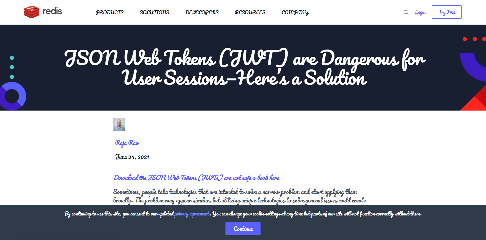
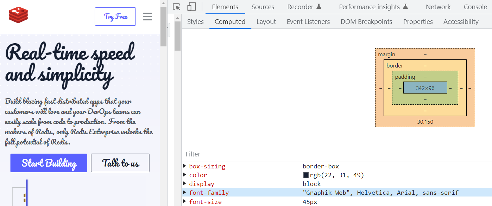
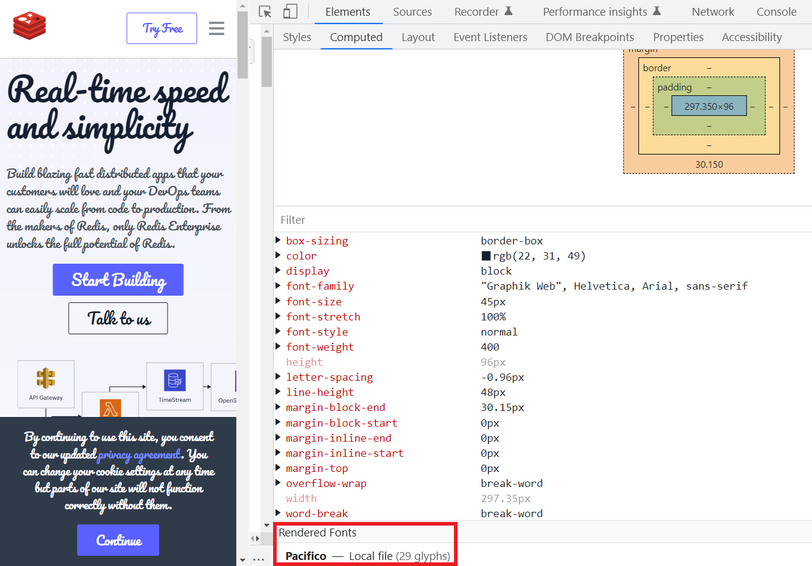
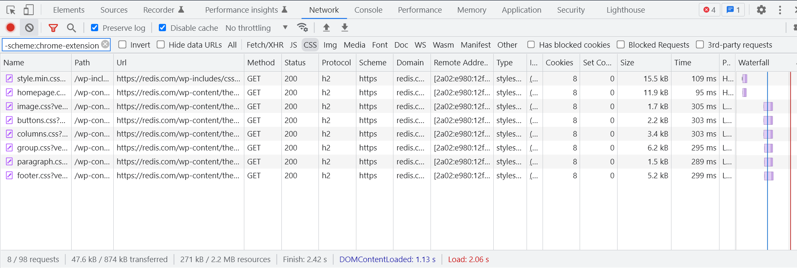
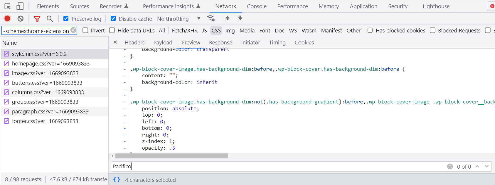
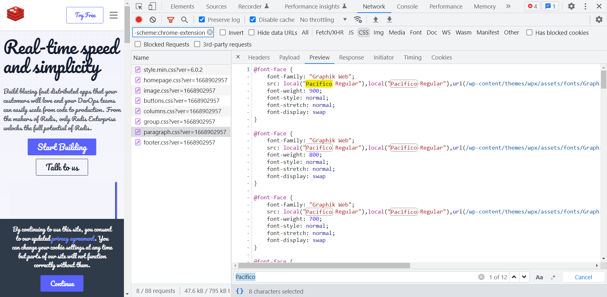


In case it's not clear, this article's goal is not to name and shame! I enjoyed debugging a CSS problem in the wild and wanted to share my thought process.


The other day, I was doing a bit of reading when I came across an article from the Redis blog. When I opened the page, I was not at all expecting to see this:

<figure>
  
  <figcaption>Oh my woff!</figcaption>
</figure>

I then visited the home page, where I encountered the same stylish font:

<figure>

<figcaption>Oh my woff2!</figcaption>
</figure>

Script fonts can be hard on the eyes, but this one had especially thick brush strokes and flourishes that made it difficult to read. Together with the Christmas-themed color palette, the font practically turned the page into a holiday greeting card.

At first, I was troubled by the thought that this might actually be working as designed. But then I realized that a product this big—likely with many monthly visitors—would not make this sort of design decision intentionally, even in the spirit of the holidays. So, having never seen a bug like this before, I set out to investigate what went wrong.

## It Breaks on My Machine

I first checked the page incognito to rule out the possibility that this was some sort of caching issue from a very old visit to the site, but that still gave me the same page. (Also, as I later learned, Redis cache-busts its assets with query parameters.)

Suspecting that this could be another font rendering bug in Chrome on Windows (similar to [bug #1363981](https://bugs.chromium.org/p/chromium/issues/detail?id=1363981)), I opened the site in Firefox—but I got the same result there.

Finally, I visited the site on a different device and, surprisingly, the page rendered just fine! For reference, this is what it's *supposed* to look like:


The fact that this issue was only reproducible on my machine suggested that the site was loading a local font. But how could I verify this?

## Checking the Computed Styles

A handy trick for debugging any CSS problem is to check the `Computed` pane in the element inspector, which lists the final computed values for various CSS properties. This is useful when working with `calc` or `clamp`, viewport units, percentages, and really any dynamic CSS value. But it's also useful for debugging font loading problems.



In this case, the `font-family` property seemed to be `"Graphik Web"`, but that's a red herring. Why? Because authors can give a font file any family name they want in its `font-face` declaration, like this:

```css
@font-face {
  font-family: "Graphik Web";
  src: url("/assets/NotGraphikWeb.woff2") format("woff2");
}

body {
  font-family: "Graphik Web";
}
```

In other words, you can't trust the font family name since it could point to a different file under the hood. However, that was clearly not the case here—if it were, then this issue would've been reproducible on *all* devices, not just mine.

Ignoring this property and scrolling all the way down, I found that the page was actually rendering an entirely different font file:



Note `Pacifico—Local file`. So the page *was* applying a local font! This name rang a bell, and I remembered that I actually *do* have [Pacifico](https://fonts.google.com/specimen/Pacifico/) installed locally—it's the open-source font that I used in my website's favicon.

So that explains *what* was going on and why I could only reproduce the bug on my device. But it doesn't explain *why* the site was requesting this local font file in the first place. Clearly, the designers had wanted to use their self-hosted version of Graphik Web, which is a sans-serif font. Off the top of my head, the only reason I could think of for why this might happen is if someone did this in their `@font-face` declarations:

```css
@font-face {
  font-family: "Graphik Web";
  src: local("Pacifico") url("/path/to/GraphikWeb.woff2");
}
```

This was starting to seem awfully probable...

## Debugging the CSS

Having ruled out the possibility that this is a corrupt font file or that it's time to replace my toaster of a machine, I figured the next logical step would be to pop the hood and take a look at the CSS. I did a quick search for Pacifico in the HTML itself in case the page was using inline styles (for performance), but I didn't find any matches. It was time to dig through the stylesheets themselves:



I checked the first one for `Pacifico` using Preview mode, but no luck there:



Thankfully, all the stylesheets were using a semantic naming convention, so I figured the problematic styles had to live in `paragraph.css` if not in the others. And sure enough, there they were:



Just as I suspected! Below is a snippet of the offending CSS:

```css
@font-face {
  font-family: "Graphik Web";
  src:
    local("Pacifico Regular"),
    local("Pacifico-Regular"),
    url(/wp-content/themes/wpx/assets/fonts/Graphik-Super-Web.woff2) format("woff2"),
    url(/wp-content/themes/wpx/assets/fonts/Graphik-Super-Web.woff) format("woff");
  font-weight: 900;
  font-style: normal;
  font-stretch: normal;
  font-display: swap;
}
```

Here's what happened: The `font-face` ruleset is requesting local fonts first as a best practice to avoid fetching network fonts if a user happens to already have the font locally on their machine. The `local` function accepts the name of the font to search for on the device, usually as a full font family name (e.g., `Pacifico`) or a PostScript name (e.g., `PacificoRegular`, `Pacifico-Regular`, or some other delimited variation). If the browser is able to find a local font file matching this descriptor, then it will skip any sources listed after it. In this example, while the CSS did correctly list the path to the remote copy of Graphik Web (hosted as a static WordPress asset), the browser first detected Pacifico installed on my machine; thus, the font family of `Graphik Web` rendered as Pacifico.

As for *why* the stylesheet requests Pacifico, my guess is that an older version of the site used it, but they forgot to update the `font-face` rulesets during a redesign.

## Be Careful with Local Font Sources

And that concludes this short-lived CSS mystery. The moral of the story is to be careful when declaring font faces: Make sure you're requesting the right local fonts, or certain users may see a drastically different version of the UI than what you designed. At the very least, make sure you're requesting a font from the same category (serif, sans, etc.).

Fortunately, these types of bugs tend to have a very low impact—in this case, you would've only been able to reproduce the issue if you had Pacifico installed on your system, and that's likely a very tiny fraction of the site's visitors. For this reason, the bug likely never caught anyone's attention.
