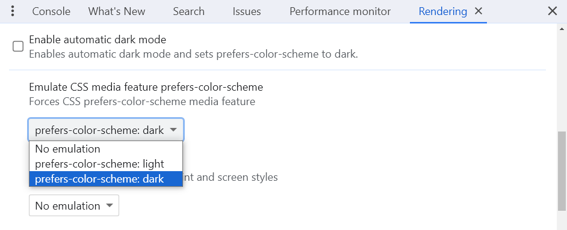

My site has sported a dark mode toggle for as long as I can remember, but the logic for theming has changed quite a bit over the years. In this article, I want to share the culmination of the lessons learned on my quest to create the perfect theme switch component. We'll take a progressively enhanced approach, first supporting light and dark themes with CSS alone and then adding a few lines of JavaScript to allow users to select their preferred theme. Note that other developers have already written articles on this subject; what I'm presenting here is just how I approach theming on my site, with a few key differences.



## Feature Requirements

For my theme toggle, I wanted to:

- Rely on CSS for theming and use JavaScript only as a progressive enhancement.
- Respect system preferences first, then website theme preferences (if set).
- Save the user's preferred theme so it can be restored on subsequent visits.
- Prevent a flash of unthemed content (FOUC) when restoring the saved theme.
- Support forced theming (e.g., an element always uses light or dark mode).

Except for a few minor differences, this implementation is similar to those of other developers. I've linked to [some of those implementations](#further-reading) at the end of this article.

## CSS: Theming with Custom Properties

I'll use CSS custom properties to define the colors for my light and dark themes. For demo purposes and to keep the code short, I'll use black and white for the colors, but you're obviously free to use whatever names and values you want:

```css {data-file="styles.css" data-copyable=true}
/* System preferences */
html {
  color-scheme: light dark;
  --color-surface-0: light-dark(white, black);
}
/* Light theme override */
[data-theme="light"] {
  color-scheme: light;
}
/* Dark theme override */
[data-theme="dark"] {
  color-scheme: dark;
}
```

When styling components, you can now reference these generic variables for background and foreground colors; they'll switch between light and dark themes automatically based on user preferences:

```css
body {
  background-color: var(--color-surface-0);
}
```

Let's take a closer look at what this CSS does.

### System vs. Site Preferences

Before the introduction of the CSS [`light-dark()`](https://developer.mozilla.org/en-US/docs/Web/CSS/color_value/light-dark) function, you would've had to use `prefers-color-scheme` media queries as shown below to detect if a user prefers light or dark colors. Unfortunately, that leads to a lot of code duplication.

```css
@media (prefers-color-scheme: light) {
  html {
    --color-surface-0: white;
  }
}
@media (prefers-color-scheme: dark) {
  html {
    --color-surface-0: black;
  }
}
```

But now that `light-dark()` is supported in all major browsers, we can use it alongside the [`color-scheme`](https://developer.mozilla.org/en-US/docs/Web/CSS/color-scheme) property to greatly simplify the code. To define theme colors that respect system preferences, all we need to do is this:

```css
html {
  color-scheme: light dark;
  --color-surface-0: light-dark(white, black);
}
```

A `color-scheme` value of `light dark` says that we support both light and dark system preferences out of the box. If a user configures their browser or operating system to prefer a light theme and visits our website, the `light-dark()` function will return its first argument (in this case, the light value). Conversely, if the user prefers a dark theme, the function will return the dark value.

Later in this tutorial, we'll write HTML and JavaScript to allow the user to set a custom theme on the `html` tag that overrides their system preferences. This is where the `[data-theme]` selectors will programmatically force a color scheme of either light or dark:

```css
[data-theme="light"] {
  color-scheme: light;
}
[data-theme="dark"] {
  color-scheme: dark;
}
```

Effectively, this forces the `light-dark()` function to return whichever set of values we defined earlier: the light values if `data-theme="light"` or the dark values if `data-theme="dark"`. No media queries required!

The other nice thing about scoping all our override styles under `[data-theme="..."]` rather than `html` is that it allows us to nest themes or force a light or dark theme anywhere on the page:

```html
<html>
  <head></head>
  <body>
    <header>...</header>
    <main>...</main>
    <footer data-theme="dark">...</footer>
  </body>
</html>
```

In this example, the page footer will always have a localized theme override of dark mode that is isolated from the rest of the page. If you've ever worked with contexts in frameworks like React, it's a similar idea: Components will read their theme values from the closest theme "provider." If a component doesn't have `data-theme` on itself, it will simply inherit the values from the closest ancestor (or fall back to the colors inherited from the root element).

### Using Dev Tools to Test Color Schemes

For now, to test that our theme is working, we can add a `data-theme` attribute to the root element and then write some demo CSS. Alternatively, using your browser's developer tools, you can emulate light or dark mode system preferences to verify that the CSS works as expected.

<figure>
  
  <figcaption>Emulating the preferred system color scheme in Chrome dev tools.</figcaption>
</figure>

## HTML: The Theme Picker

So far, we have a site that switches between light and dark themes based on system preferences, using only CSS. But just because a user prefers one theme _in general_ doesn't mean that they'll like the colors we're using on our site—or maybe they're viewing the site under different lighting conditions, so they may prefer a different theme. Either way, we should give users the option to select their preferred theme via a JavaScript toggle.

So how should we go about structuring the HTML? For starters, most websites implement a light-dark mode toggle using the [toggle button](https://www.w3.org/WAI/ARIA/apg/patterns/button/) pattern:

```html
<button
  id="theme-toggle"
  type="button"
  aria-label="Enable dark theme"
  aria-pressed="false"
></button>
```

This pattern works, but a complete implementation requires a lot of extra JavaScript to manage the button's [`aria-pressed`](https://developer.mozilla.org/en-US/docs/Web/Accessibility/ARIA/Attributes/aria-pressed) state and to keep it in sync with a first-time visitor's system preferences. And if that system preference changes while the user is on the page, you'll likely want to listen to the change with the [`MediaQueryList`](https://developer.mozilla.org/en-US/docs/Web/API/MediaQueryList) `addEventListener` method so that your website theme automatically refreshes. Now, don't get me wrong: This _is_ doable. However, not only does it require a lot of extra code, but it also locks you into only ever using two themes: light or dark. If you ever want to add more themes in the future, you'll need to abandon this implementation anyway.

For this reason, I recommend implementing a theme picker using radio buttons or a `<select>`. The latter makes more sense if you have lots of options and need to save on space; I'm using radio buttons in this tutorial since there are only three options to choose from, so it's nice to see them all at once without any interaction.

```html {data-file="index.html" data-copyable=true}
<fieldset id="theme-picker">
  <legend>Theme:</legend>
  <label>
    <input name="theme" type="radio" value="auto" checked>
    Auto
  </label>
  <label>
    <input name="theme" type="radio" value="light">
    Light
  </label>
  <label>
    <input name="theme" type="radio" value="dark">
    Dark
  </label>
</fieldset>
```

And if you're using a `<select>`, your HTML should look something like this:

```html {data-file="index.html" data-copyable=true}
<label>
  Theme
  <select id="theme-picker">
    <option value="auto" selected>Auto</option>
    <option value="light">Light</option>
    <option value="dark">Dark</option>
  </select>
</label>
```

That `Auto` option will come in handy soon; rather than reading a first-time visitor's preferred theme on page load, we'll just set this option as the default and let CSS do all the hard work for us.

### Noscript Styles

One more thing: In case JavaScript is unavailable or fails to load, we can add this noscript style to our document's head:

```html {data-file="index.html" data-copyable=true}
<head>
  <noscript>
    <style>
      #theme-picker {
        display: none;
      }
    </style>
  </noscript>
</head>
```

That way, if JavaScript is unavailable [for whatever reason](https://www.kryogenix.org/code/browser/everyonehasjs.html), we won't show the theme picker to avoid confusing users. After all, we can't get the picker to do anything without JavaScript, unless we use HTML forms and cookies (but that implementation would require a back end).

Now, it's time to write the script for our theme picker.

## JavaScript: Making It Interactive

Typically, as a best practice, you'd link to your JavaScript either at the end of the body or as a `defer`red script in the `head` to avoid blocking the render process:

```html
<html>
  <head>
    <script src="/index.js" defer></script>
  </head>
  <body>
    <!-- ... -->
    <script src="/index.js"></script>
  </body>
</html>
```

Both of these scripts run after the DOM has been fully parsed. Normally, that's what you want so that JavaScript doesn't block rendering, but the problem in our case is that it gives the browser time to render the page _before_ we apply the user's previously saved theme. Thus, the page could momentarily flicker between two themes as it loads, a problem known as a <dfn>flash of unthemed content (FOUC)</dfn>. For example, if a user's system theme preference is dark but they previously saved a light theme preference on our site, then the page would flash from dark (system) to light (website) as it loads. Admittedly, this isn't the end of the world, but it can be a bit unpleasant to look at.

To avoid this problem, we'll write a tiny render-blocking script in the `head` of our document and preemptively set the `data-theme` on `html` before the browser has a chance to render the page's body. That way, by the time the content is rendered, the correct theme will have already been set.

To start, add this script to the head somewhere after your stylesheets and other important assets (so that the JavaScript doesn't delay their parsing):

```html {data-file="index.html" data-copyable=true}
<!-- stylesheets and other critical assets should go above this script -->
<script>
  // ... all of our code goes here
</script>
```


You may want to use the [immediately-invoked function expression (IIFE)](https://en.wikipedia.org/wiki/Immediately_invoked_function_expression) pattern here to avoid leaking any variables from this script into the global/window scope. I use this in my implementation, but I omitted it from this article to minimize indentation.


We'll start by defining some constant variables up at the top of our script:

```js {data-file="themePicker.js" data-copyable=true}
const THEME_OWNER = document.documentElement;
const THEME_STORAGE_KEY = 'theme';
```

This code just grabs a reference to the document root (`html`) and declares another constant that we'll later use to store the user's preferred theme both in `localStorage` and on the `THEME_OWNER` as a `data-` attribute.

Next, we'll check to see if the user previously set a preferred theme for our site. If they did, we'll apply it immediately to prevent the flash of unthemed content:

```js {data-file="themePicker.js" data-copyable=true}
const cachedTheme = localStorage.getItem(THEME_STORAGE_KEY);
if (cachedTheme) {
  THEME_OWNER.dataset[THEME_STORAGE_KEY] = cachedTheme;
}
```

That's it for the render-blocking portion of the code. For the remainder of the script, we'll register a `DOMContentLoaded` event listener so we run that code after the browser has finished parsing the document and constructing the DOM:

```js {data-file="themePicker.js" data-copyable=true}
document.addEventListener('DOMContentLoaded', () => {
  const themePicker = document.getElementById('theme-picker');
  if (!themePicker) return;
});
```

In this event handler, we need to do two things.

### 1. Update the Initial UI

If a user previously chose a custom theme and is returning to our site, we'll want to update the theme picker UI so that the correct radio button is checked by default:

```js {data-file="themePicker.js" data-copyable=true}
const systemThemeInput = themePicker.querySelector('input[checked]');
if (cachedTheme && cachedTheme !== systemThemeInput.value) {
  systemThemeInput.removeAttribute('checked');
  themePicker.querySelector(`input[value="${cachedTheme}"]`).setAttribute('checked', '');
}
```


If you're using a `<select>` instead of radio buttons, you don't need to query the default-checked input and toggle the correct one; you can just set `select.value = cachedTheme`.


On load, we check if there's a cached theme. If so, we uncheck the default checked input in the HTML; then, we check whichever input corresponds to the saved theme. This is one of the really nice things about using a radio button group or select menu for a theme picker: Since we're not using a toggle button, we don't need to query system preferences from inside JavaScript to keep the theme picker's state in sync. The default is `'auto'`; CSS will apply the right theme.

### 2. Listen for Theme Changes

Finally, we'll listen for theme changes and save the user's preference in `localStorage`:

```js {data-file="themePicker.js" data-copyable=true}
themePicker.addEventListener('change', (e) => {
  const theme = e.target.value;
  if (theme === systemThemeInput.value) {
    delete THEME_OWNER.dataset[THEME_STORAGE_KEY];
    localStorage.removeItem(THEME_STORAGE_KEY);
  } else {
    THEME_OWNER.dataset[THEME_STORAGE_KEY] = theme;
    localStorage.setItem(THEME_STORAGE_KEY, theme);
  }
});
```

Note that if a user re-selects the system theme, we just remove the `data-theme` override from the root element and clear `localStorage` so we fall back to system preferences.

That's it! This is all of the JavaScript for the theme picker:

```js {data-file="themePicker.js" data-copyable=true}
const THEME_STORAGE_KEY = 'theme';
const THEME_OWNER = document.documentElement;

const cachedTheme = localStorage.getItem(THEME_STORAGE_KEY);
if (cachedTheme) {
  THEME_OWNER.dataset[THEME_STORAGE_KEY] = cachedTheme;
}

document.addEventListener('DOMContentLoaded', () => {
  const themePicker = document.getElementById('theme-picker');
  if (!themePicker) return;

  const systemThemeInput = themePicker.querySelector('input[checked]');
  if (cachedTheme && cachedTheme !== systemThemeInput.value) {
    systemThemeInput.removeAttribute('checked');
    themePicker.querySelector(`input[value="${cachedTheme}"]`).setAttribute('checked', '');
  }

  themePicker.addEventListener('change', (e) => {
    const theme = e.target.value;
    if (theme === systemThemeInput.value) {
      delete THEME_OWNER.dataset[THEME_STORAGE_KEY];
      localStorage.removeItem(THEME_STORAGE_KEY);
    } else {
      THEME_OWNER.dataset[THEME_STORAGE_KEY] = theme;
      localStorage.setItem(THEME_STORAGE_KEY, theme);
    }
  });
});
```

And with that, our progressively enhanced theme switch is complete.

## Optional Enhancement: CSS `:has`

You may have noticed that our current implementation stores the theme state in two places: once on the root element as a `data-theme` attribute, and implicitly on the theme picker itself as the currently selected option (which the browser manages for us as the user interacts with the radio group). It would be nice if we could consolidate this duplication and store the state on a single element.

Well, I have both good news and bad news.

The good news is that we can do this with [CSS `:has`](https://developer.mozilla.org/en-US/docs/Web/CSS/:has) and the `:checked` pseudo-class:

```css {data-file="styles.css" data-copyable=true}
/* Light override */
html:has(input[name="theme"][value="light"]:checked) {
  color-scheme: light;
}
/* Dark override */
html:has(input[name="theme"][value="dark"]:checked) {
  color-scheme: dark;
}
```

Let's also update our JavaScript to remove all of the `THEME_OWNER`-related code:

```js {data-file="themePicker.js" data-copyable=true}
const THEME_STORAGE_KEY = 'theme';
const cachedTheme = localStorage.getItem(THEME_STORAGE_KEY);

const themePicker = document.getElementById('theme-picker');
if (!themePicker) return;

const systemThemeInput = themePicker.querySelector('input[checked]');
if (cachedTheme && cachedTheme !== systemThemeInput.value) {
  systemThemeInput.removeAttribute('checked');
  themePicker.querySelector(`input[value="${cachedTheme}"]`).setAttribute('checked', '');
}

themePicker.addEventListener('change', (e) => {
  const theme = e.target.value;
  if (theme === systemThemeInput.value) {
    localStorage.removeItem(THEME_STORAGE_KEY);
  } else {
    localStorage.setItem(THEME_STORAGE_KEY, theme);
  }
});
```

The bad news is that this reintroduces the flash of unthemed content that we were originally trying to avoid. Why? Because we can't initialize the default-checked radio input until after the body has been parsed, at which point we can grab a reference to the theme picker element with JavaScript. So with this updated approach, when the page loads for the first time, the CSS will default to reading system preferences, and the system theme may not be the same as the author's previously saved theme.

If you decide to take this approach, note that you'll no longer need to place this script in the `<head>` of your document since the whole point of doing that was to avoid FOUC. In fact, technically, the script only needs to be positioned after the theme picker element in the DOM and not necessarily at the very end of the body. If your theme picker and script appear very early in the DOM, such as in a top navigation bar, you may not even observe any FOUC. I recommend testing this and weighing the pros and cons of each approach before picking one over the other.

## Further Reading

Here are some other articles written on this subject:

- [Sara Joy: "Come to the light-dark() Side"](https://css-tricks.com/come-to-the-light-dark-side/)
- [Joshua Comeau: "The Quest for the Perfect Dark Mode"](https://www.joshwcomeau.com/react/dark-mode/)
- [Bram.us: "The Quest for the Perfect Dark Mode Toggle, using Vanilla JavaScript"](https://www.bram.us/2020/04/26/the-quest-for-the-perfect-dark-mode-using-vanilla-javascript/)
- [Adam Argyle: "Building a theme switch component"](https://web.dev/articles/building/a-theme-switch-component)
- [Salma Alam-Naylor: "The best light/dark mode theme toggle in JavaScript"](https://whitep4nth3r.com/blog/best-light-dark-mode-theme-toggle-javascript/)
