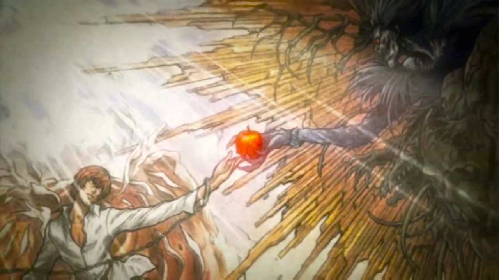

For the four and a half years that I've been running this blog, I haven't ever written an end-of-year reflection post. Part of the reason why is because I like to keep most things private, but the bigger reason is that there wasn't anything interesting going on up until recently. However, 2023 was eventful enough that I think it deserves at least a bit of reflection. In 2023, I:

## Moved to another state


Today is the first day
Of the rest of your days
So lighten up, squirt


Technically, this was in late December 2022. This was my first time moving somewhere new on my own (and living on my own); it was an unfamiliar and stressful experience, but it was for the best and helped me to gain new life skills and gradually step out of my comfort zone. I now reside in Texas, a state that's much flatter, dryer, and hotter than I could've ever imagined.

## Became a U.S. citizen

In August 2023, I attended my naturalization oath ceremony and later [wrote about my experience](https://www.aleksandrhovhannisyan.com/blog/naturalized/). Anyone who has immigrated to the U.S.—or who is a child of immigrant parents—can appreciate the significance of this milestone. After nearly two decades of living here, I can finally enjoy the same rights and freedoms as native-born citizens.

## Bought my first guitar

<figure>

<figcaption>My first guitar. It's an acoustic Fender Squier.</figcaption>
</figure>

This is the first musical instrument I've ever owned. Time will tell if I have the patience to stick with it over the long term; for now, I'm practicing basic [spider exercises](https://www.garnerguitar.com/courses/beginner/course2/spider-exercises) and one-string riffs to get used to positioning my fingers on the fretboard and the feeling of metal strings cutting into my fingertips. Until I develop calluses and learn how to move my fingers independently, I'm going to naturally have a hard time even with the basics. It's a little frustrating, but the one thing motivating me is the dream of maybe one day being able to play my favorite songs.

## Learned how to use vim

Well, [neovim](https://neovim.io/), thanks to [ThePrimeagen's evangelism](https://www.youtube.com/watch?v=w7i4amO_zaE). Honestly, I couldn't stand it at first—hjkl navigation felt unintuitive, and I missed my familiar shortcuts from VS Code. But I powered through, and I eventually got so used to vim that I would habitually try to use its shortcuts in other apps and editors. In fact, this became so annoying at one point that I installed the [Vimium browser extension](https://vimium.github.io/) to seamlessly context-switch between my browser and terminal. I love how lightweight neovim is compared to VS Code—which, in my experience, has become slower and more bug prone over the years (it feels like every update manages to break something new).


Alas, I have yet to figure out how to quit vim.


## Attempted Advent of Code

In my free time, I took a stab at solving some of the Advent of Code challenges from [2022](https://github.com/AleksandrHovhannisyan/adventofcode2022/) and [2023](https://github.com/AleksandrHovhannisyan/adventofcode2023/). I didn't have the time or energy to solve all of the exercises, so I just treated this as an opportunity to brush up on C++ after years of not using that language. I did some other C++ practice on the side, too, like [this heap implementation](https://github.com/AleksandrHovhannisyan/heap) I wrote, for no reason other than reminding myself how that data structure works.

## Wrote six articles

That's much fewer than the 25 I wrote in 2022, but who's counting? (*I am, apparently?*) About a year ago, I decided I would write what I want to write, when I want to write. In 2022, I [burned myself out](/blog/tech-twitter-burnout/) with the self-imposed obligation to write and to constantly keep up with the latest trends in the ever-changing—and increasingly unstable—landscape of web development.

As for how my blog is doing, in 2023 it received 314k clicks and 10 million impressions. I'm not sure if that's more or fewer than in 2022 since I haven't been keeping track of these metrics from year to year, but it's a lot more attention than I ever expected my blog to get when I first launched it years ago.

<figure>

<figcaption>I don't know why so many people are visiting my blog, but I suppose there's nothing I can do to stop them.</figcaption>
</figure>

I don't earn anything from my writing, but that's okay because I'm not trying to sustain myself with it—that's what my job is for! I write because I need an outlet for my thoughts and experiences and enjoy teaching others. I'm sure I could make money off of it if I wanted to, but that would diminish my intrinsic motivation to write.


Perhaps to my detriment, I've also stopped sharing my articles on other sites to take the pressure off and to stop seeking other people's approval of my work. I figure that if I write something good enough, someone will eventually read it—and, if they *really* liked it, share it with others. If not, that's okay.


## Released a highly requested feature at work

At work, one of the biggest projects that I took on for 2023 was the [data table block](https://www.esri.com/arcgis-blog/products/story-maps/constituent-engagement/arcgisstorymapstableblock/) for [StoryMaps](https://storymaps.arcgis.com/). This feature had been highly requested by our users for years and was very well received after launch. You can read more about this in the following article on the ArcGIS blog: [Enhancing visual storytelling with the table block in ArcGIS StoryMaps](https://www.esri.com/arcgis-blog/products/story-maps/constituent-engagement/arcgisstorymapstableblock/).

{eleventy:formats="png,webp"}

To guide our decision-making and settle on a final list of must-have features for the V1 release, I decided to prototype the possibilities with native HTML tables in CodePen:

- [Table block prototype part 1: design requirements, responsiveness](https://codepen.io/AleksandrHovhannisyan/pen/bGmEYqj)
- [Table prototype part 2: row/column hover effects](https://codepen.io/AleksandrHovhannisyan/pen/OJBEveL)

Even though our app uses React (Next.js), I chose vanilla technologies for my prototypes so I could focus on refining the core feature requirements without getting bogged down in the technicalities of React or our custom state management solution.

When it finally came time to work on the feature, I took a rigorous test-driven development approach and decomposed the core functionality of the table block into pure utility functions; this made it much easier to write unit tests and gave me confidence that my changes wouldn't introduce regressions. I paid close attention to performance to ensure that inserting and deleting rows and columns went smoothly, as well as accessibility to allow keyboard users to easily navigate their tables and screen reader users to make sense of their tables.

## Tried out new gear


**Note**: I am not sponsored by any of these products; these are not affiliate links.


### Headphones

I needed a pair of headphones for calls and gaming. After extensive research (*translation: following strangers' advice on Reddit*), I settled on the [Philips SHP9500 over-ear headphones](https://www.usa.philips.com/c-p/SHP9500_00/hifi-stereo-headphones) (now discontinued).

Now that I've used them for seven months or so, I can confidently say that these are the most comfortable headphones I've ever worn; they have almost no clamp, so I can easily wear them for hours without noticing; the ear pads are also very breathable, unlike the faux leather of some headsets, so your ears stay cool. While I'm not an audiophile, I found that these headphones had great soundstaging and sound clarity for their price—much better than those of comparable "gaming" headphones on the market (I'm looking at you, HyperX). One downside is that the headphones are open back, so they're not ideal if others are within hearing distance of you. Also, they don't come with a mic, so you'll need to buy one separately to plug in (like the [V-MODA BoomPro](https://www.amazon.com/V-MODA-BoomPro-Microphone-Gaming-Communication/dp/B00BJ17WKK/) in my photo).

### Mechanical keyboard

I also wanted to try out mechanical keyboards to see what all the hype is about; developers in general seem to have an almost cultish fascination with them. Personally, I'm more used to butterfly and scissor keyboards, like the ones that come with laptops, but I figured I'd keep an open mind. During the holidays, I found a budget-friendly, clickety-clackety [Redragon "Dragonborn" K630](https://www.bestbuy.com/site/redragon-k630-dragonborn-tkl-wired-gaming-mechanical-brown-switch-keyboard-with-backlighting-black/6458716.p?skuId=6458716) that was on sale at Best Buy for $25.

No RGB lighting here—only pink and different lighting modes. Pink on black looks nice, but my favorite lighting mode is *off*... I just don't see the appeal of backlighting.

The key profile is a bit high, and the 60% form factor requires that you use a function key for arrow keys and other keys that full-size keyboards normally support, but I've gotten used to it. I like how much more desk space it frees up compared to the keyboard I was using before. Overall, I think it was a good purchase, especially considering how outrageously overpriced other mechanical keyboards are.

## Read a book (and a half)

### Johnny Got His Gun

I finally got around to reading [*Johnny Got His Gun*](https://en.wikipedia.org/wiki/Johnny_Got_His_Gun), an anti-war novel that I had wishlisted for a while (and abandoned at one point after losing interest). It's a very quotable book that echoes commentary from similar works in this genre.


You can always hear the people who are willing to sacrifice somebody else's life. They're plenty loud and they talk all the time. You can find them in churches and schools and newspapers and legislatures and congress. That's their business. They sound wonderful. Death before dishonor. This ground sanctified by blood. These men who died so gloriously. They shall not have died in vain. Our noble dead. Hmmmm. But what do the dead say? ... Nobody but the dead know whether all these things people talk about are worth dying for or not. And the dead can't talk. So the words about noble deaths and sacred blood and honor and such are all put into dead lips by grave robbers and fakes who have no right to speak for the dead. If a man says death before dishonor he is either a fool or a liar because he doesn't know what death is. He isn't able to judge. He only knows about living.


This was an especially timely read in light of all the world events in 2023; the book explores the idea that surviving a war might be a fate worse than death.


I read this book (and many others in the past) using [Open Library](https://openlibrary.org/), a wonderful website that's part of the Internet Archive initiative to make information free and accessible to all. Unfortunately, Open Library has since been [sued by book publishers](https://www.theverge.com/2023/9/11/23868870/internet-archive-hachette-open-library-copyright-lawsuit-appeal), so you can no longer borrow books through it (at least at the time of this article's writing). I really hope that changes in the future.


### Crafting Interpreters

Towards the end of 2023, I also began working through Robert Nystrom's [*Crafting Interpreters*](https://craftinginterpreters.com/), a free book that teaches you how to build an interpreter from scratch for Lox, a toy programming language. [The entire source code for the book](https://github.com/munificent/craftinginterpreters/)—including solutions to challenge exercises—is available on GitHub. How [munificent](https://github.com/munificent/)!


We learned how to write a recursive-descent parser in undergrad as part of our computer science curriculum, but my skills were still a bit rusty in this area. For example, some of the Advent of Code 2023 problems required parsing structured input with predefined grammars, and my solutions felt unclean. That struggle prompted me to read this book.


Had this book been published a few years sooner, it would've been an invaluable resource. I'm currently at Chapter 6 (parsing) and making slow but steady progress; so far, the book has covered everything we learned in school and more.

## Finished some TV shows

### The Walking Dead

After nearly a year-long delay, Netflix released the eleventh and final season of AMC's The Walking Dead in early 2023. It wasn't the best season by any means, but it also wasn't the worst. I won't spoil any plot points, but anyone who's watched the show knows that it fell off after a certain season and that the early years were some of its best moments. Still, the finale gave us a touching conclusion to the storyline, and it finally resolved an infuriating cliff-hanger that the writers had left unanswered for a few seasons. At the same time, the ending introduced a new cliff-hanger to tease AMC's new follow-up series (one of several). Despite its flaws, The Walking Dead is still one of the best shows you can watch today. If you haven't already seen it, you're really missing out!

### Death Note

<figure>

<figcaption>Image Source: <a href="https://casuistor.tumblr.com/post/149158567691/thoughts-on-the-first-op-of-the-death-note-anime">Thoughts on the First OP of the Death Note Anime</a>.</figcaption>
</figure>

This past year, I also watched the [Death Note](https://en.wikipedia.org/wiki/Death_Note) anime after hearing lots of great things about it. This was my first time watching an anime from start to finish; I was impressed by the character design, beautiful visuals, and [the soundtrack](https://open.spotify.com/album/6xgeHyARBhB5s1wwhc30W6?si=9iDe1Rl9TSOmyZ2vFHAlLg) with its grand orchestra performances and memorable guitar riffs. There were some low points towards the middle of the show where I felt the writing and artistic direction took a comic turn, and sometimes the writers leaned a bit too heavily on [deus ex machina](https://en.wikipedia.org/wiki/Deus_ex_machina) to save characters from impossible situations. But overall, I thought it was a very gripping watch. I had to limit myself to just two to three episodes a week to savor it for as long as possible since the show is only 37 episodes long.

## Listened to over 200 hours of music

For years, I avoided listening to songs from some of my favorite artists because they were associated with painful memories; in 2023, I revisited these songs and found that they actually helped me to gain some closure. I had a lot of catching up to do, especially with Lana Del Rey (I regrettably missed out on her [NFR!](https://en.wikipedia.org/wiki/Norman_Fucking_Rockwell!) era) and Arctic Monkeys (their work took a completely different turn than I expected, but it still sounds great). I also got into some new bands, like Gorillaz, Cage the Elephant, The Strokes, and a few others.

<figure>

<figcaption>My Spotify Wrapped for 2023. It's not entirely accurate since I also listened to music on mobile using YouTube (on Firefox with no ads—because I'm too cheap to pay for Spotify Premium or YouTube Music).</figcaption>
</figure>

## Played new video games

Gaming has always been one of my favorite pastimes. This year, I got into PC gaming with some lightweight indie titles (the few that can run on my eight-year-old laptop).

<figure>

<figcaption>My Steam 2023 year in review. Honorable mentions that didn't make the list: Half-Life 1 (very late to the party) and Iron Lung (a short atmospheric horror game).</figcaption>
</figure>

My most-played game of 2023 was [BattleBit Remastered](https://store.steampowered.com/app/671860/BattleBit_Remastered/); it's a low-poly first-person shooter (FPS) inspired by the Battlefield franchise that can support up to 254 players per server, with map destruction, vehicles, and an extensive progression system. This labor of love was developed by [a team of just three people](https://joinbattlebit.com/meet-the-team/) (one dev!) over the course of seven years, and it was so well optimized that it somehow managed to run on my non-gaming laptop at 30 frames per second. BattleBit borrowed various fan-favorite mechanics from other FPS games, making it an instant hit at launch. My favorite mechanic was push-to-talk VoIP—it made for some hilarious encounters with random players. In many ways, the game made me feel like I was back in the good-old days of Battlefield 3 and Bad Company 2. Sadly, modern Battlefield just isn't what it used to be.

[Brotato](https://store.steampowered.com/app/1942280/Brotato/) was my second go-to game in 2023. In this indie roguelite, you play as a potato that can wield up to six weapons at a time; your goal is to survive progressively harder waves of enemies while earning currency to spend in the shop. The game has five difficulty levels, 44 playable characters, and 83 achievements (49 of which I have unlocked so far). Although Brotato requires some skill to play at higher difficulty levels, I found it to be a great way to unwind at the end of a long day.

On the console side of things, I also got back into [Rainbow Six Siege](https://www.ubisoft.com/en-us/game/rainbow-six/siege) after taking a five-year hiatus from the game. I may or may not have been inspired by a certain Twitch streamer who's been breathing new life into this old game.

## Happy New Year!

Well, that's about it.

On a personal level, 2023 was a good year, but it could've been better in other ways. With all the things going on around the world, it often felt like things were falling apart, and I didn't practice good mental health habits—I spent too much time doomscrolling on social media like Twitter and Reddit, and I didn't spend nearly as much time away from my desk as I should've. So I suppose those are some things to work on in 2024.

