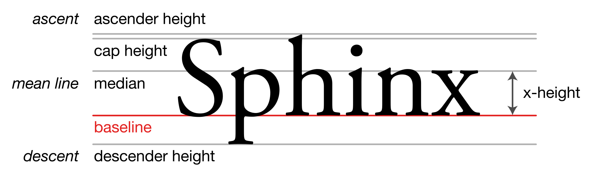

When using web fonts, it's often recommended that you set the `font-display` property to `swap` in your `@font-face` rulesets to prevent the so-called [flash of invisible text (FOIT)](https://fonts.google.com/knowledge/glossary/foit): the momentary flicker that occurs when text is set in a typeface that has not yet been downloaded by the browser. With `font-display: swap`, the browser will first render your text using the fallback typeface you specified in the `font-family` property:

```css
body {
  font-family: PT Serif, Times New Roman, serif;
}
```

In this example, the browser will first set the body text in Times New Roman (or serif, if the former is not installed locally on the operating system). Once the browser finishes downloading the requested web font (PT Serif in this example), it will restyle the text.

Font swapping creates a better user experience in low-bandwidth network conditions. If a web font takes too long to download, at least the user won't have to stare at invisible text while their device slowly downloads the font file; they can browse the page using a system font, and the web font will get swapped in when it's ready.

Unfortunately, this can also introduce another problem: content reflow and layout shifts. If the fallback font and the web font are not metrically compatible, this font-swapping behavior will cause text to shift and jump around on the page as it's reset, hurting your cumulative layout shift (CLS) score. From an end user's perspective, this can be disorienting, especially if they were already in the middle of reading a paragraph of text. And from a design perspective, it looks sloppy and inelegant.

Fortunately, modern CSS allows developers to override font metrics with `@font-face` properties like `size-adjust`, `ascent-override`, and `descent-override`. But before we learn about these properties and how they work, we need a bit of a refresher on web typography and font metrics.



## Defining Fonts on the Web

In CSS, [`@font-face` rulesets](https://developer.mozilla.org/en-US/docs/Web/CSS/@font-face) allow you to describe the characteristics of your font files so that browsers know how to load and apply those typefaces when the files are requested by your CSS. For example, if you've ever included a `<link>` tag to a Google Font, that link was just pointing to one big stylesheet (on a Google server) that contained `@font-face` declarations for your chosen typeface. And if you've ever self-hosted fonts, you've likely had to define `@font-face` rulesets by hand or copy-paste them from your vendor.

A `@font-face` ruleset will typically specify the font family, weight, style, fallback-swapping behavior, and location on the file system. Here's an example of what that might look like:

```css
@font-face {
  font-family: "PT Serif";
  font-style: normal;
  font-weight: 400;
  font-display: swap;
  src: local("PTSerif"), url("/fonts/ptserif-400.woff2") format("woff2");
}
```

While `@font-face` rulesets are most commonly used to define web fonts, they can also be used to customize system fonts. For example, this `@font-face` ruleset defines a subsetted version of Times New Roman with just Arabic numerals (Unicode range `U+0030-0039`). It then loads this font first, followed by Georgia for all remaining characters outside that range. (As for why you might want to do this, see this article: [CSS Georgia Font Stack with Tabular Numbers](https://www.client9.com/css-georgia-font-stack-with-tabular-numbers/).)

```css
@font-face {
  font-family: "numbers";
  src: local("Times New Roman");
  unicode-range: U+0030-0039;
}
body {
  font-family: numbers, Georgia;
}
```

## Font Metrics

On the web, we typically think of typefaces in terms of their font family, weight, and style, but these are just the superficial characteristics that we can observe on a digital screen. Behind the scenes, designers also use a few important metrics to construct their typefaces: a base size, x-height, ascender height, descender height, leading, kerning, and more. Together, these metrics determine how and where glyphs render in a line of text.

<figure>
  
  <figcaption>Common terminology for font metrics. Image credit: <a href="https://commons.wikimedia.org/wiki/File:Typography_Line_Terms.svg">Max Naylor</a>, Public Domain.</figcaption>
</figure>

This subject alone deserves its own article. Instead of covering every detail, I'll summarize some key points and refer you to these external resources:

- [Deep dive CSS: font metrics, line-height and vertical-align](https://iamvdo.me/en/blog/css-font-metrics-line-height-and-vertical-align)
- [Intro to Font Metrics](https://westonthayer.com/writing/intro-to-font-metrics/)
- [Google Fonts Glossary](https://fonts.google.com/knowledge/glossary)

First, all of the glyphs (letterforms) in a typeface are drawn relative to a baseline, like those on lined paper. A typeface's x-height refers to the height of the lowercase letter `x`, which is used as a rough heuristic for the heights of other lowercase letters and, by extension, the typeface itself. For example, typefaces with large x-heights (such as Fira Sans) tend to be taller. Uppercase letters like `S` are characterized by their topmost caps, which sit just below ascenders: the upper parts of lowercase letters, such as the vertical lines in `d`, `h`, `l`. As you can probably guess, descenders are the parts of a letterform that hang below the baseline, like those of `g`, `j`, `y`, and so on.

These metrics influence how much vertical space a piece of text will take up on a page. For example, if a typeface has a tall x-height or ascenders/descenders, then you're going to need to use a bigger `line-height` value to prevent the descenders of one line from touching the ascenders on the next line of text.


This is why it's usually unhelpful to recommend a one-size-fits-all line height in CSS. A line height of `1.5` might look good for one typeface, but it may be too tight or tall for another. There are also other factors to consider, such as line length.


## Overriding Font Metrics with CSS

While font metrics are baked into a typeface's definition, there are various CSS properties that allow stylesheet authors to override those metrics. Among them, the three most important ones that we're interested in are `size-adjust`, `ascent-override`, and `descent-override`.


There's technically also a fourth property, `line-gap-override`, that allows you to override the outer leading (gap) between lines of text. I won't cover that in this article, as it's not as important as the other three.


Each property accepts one of two types of values, as defined in the CSS Fonts specification:


When the descriptor value is 'normal', the corresponding metric value is obtained from the font file directly... When the descriptor value is a percentage, the corresponding metric value is resolved as the given percentage multiplied by the used font size. Negative values are invalid at parse time.


Consider this example:

```html
<p style="font-size: 16px">Example</p>
```

```css
@font-face {
  font-family: "example";
  src: local('Times New Roman');
  size-adjust: 125%;
  ascent-override: 50%;
  descent-override: 25%;
}
p {
  font-family: example;
}
```

Here, the paragraph text would be set in a custom variant of Times New Roman (a system font) with the following resolved metrics:

- Size: `20px` (125% of 16)
- Ascent: `8px` (50% of 16)
- Descent: `4px` (25% of 16)

By using the right values for these three CSS properties, we can minimize layout shifts caused by font loading. But how do we figure out what values to use?

## Generating Perfect Font Fallbacks

In Node.js and JavaScript, [FontKit](https://github.com/foliojs/fontkit) is the de-facto standard library for working with font files. It provides low-level APIs for opening font files, reading font metrics, and even subsetting fonts to generate smaller files. Unfortunately, FontKit is too low level for our purposes. Instead, we'll use a higher level library like [`capsize`](https://github.com/seek-oss/capsize) that's built on top of FontKit:

```
npm install @capsizecss/core @capsizecss/metrics
```


You could also use an alternative library like [Fontaine](https://github.com/unjs/fontaine).


The `@capsizecss/metrics` package exports the metrics (as JavaScript objects) for nearly all known Google Fonts and non-proprietary system typefaces. The `@capsizecss/core` package exports some handy utilities for generating CSS output. One such utility is a function named `createFontStack` that generates CSS `@font-face` declarations for fallback fonts. It does this by reading font metrics and using the three CSS properties we learned about to fine-tune your fallback typefaces so that their metrics match those of your primary typeface more closely, minimizing layout shifts.

For example, let's say we want to load PT Serif for our body font and use Times New Roman as the fallback. We want to calculate the right `size-adjust`, `ascent-override`, and `descent-override` for Times New Roman to ensure that it matches PT Serif as closely as possible. The following code does exactly that by importing the metrics for each font and then assembling a font stack (order matters!):

```js {data-file="script.mjs" data-copyable="true"}
import { createFontStack } from '@capsizecss/core';
import ptSerif from '@capsizecss/metrics/ptSerif.js';
import timesNewRoman from '@capsizecss/metrics/timesNewRoman.js';

const { fontFaces } = createFontStack([ptSerif, timesNewRoman]);
console.log(fontFaces);
```

```css {data-file="output.css"}
@font-face {
  font-family: "PT Serif Fallback";
  src: local('Times New Roman');
  ascent-override: 93.5808%;
  descent-override: 25.7595%;
  size-adjust: 111.0271%;
}
```


Note that you don't have to use this exact `font-family` or `src`; those are auto-generated by the script, and you can customize the output as needed.


This example used a single fallback font, but you can technically pass in as many as you want; capsize will generate `@font-face` rulesets for each fallback in the font stack:

```js {data-file="script.mjs" data-copyable="true"}
import { createFontStack } from '@capsizecss/core';
import georgia from '@capsizecss/metrics/georgia.js';
import timesNewRoman from '@capsizecss/metrics/timesNewRoman.js';
import ptSerif from '@capsizecss/metrics/pTSerif.js';

const stack = createFontStack([
    ptSerif,
    georgia,
    timesNewRoman,
]);

console.log(stack.fontFaces);
```

```css {data-file="output.css"}
@font-face {
  font-family: "PT Serif Fallback: Georgia";
  src: local('Georgia');
  ascent-override: 102.7217%;
  descent-override: 28.2757%;
  size-adjust: 101.1471%;
}
@font-face {
  font-family: "PT Serif Fallback: Times New Roman";
  src: local('Times New Roman');
  ascent-override: 93.5808%;
  descent-override: 25.7595%;
  size-adjust: 111.0271%;
}
```

And just like that, we have `@font-face` rulesets that normalize our fallback fonts so that their metrics match those of our primary font as closely as possible. Now, all that's left to do is to copy this output into your CSS. You could even add this script to your build pipeline to auto-generate that CSS whenever your site is rebuilt. In fact, some front-end frameworks automatically do this for you: [Next.js does it](https://nextjs.org/docs/pages/building-your-application/optimizing/fonts), and [so does Nuxt](https://nuxt.com/modules/fontaine).

## Further Reading

- [Capsize: Flipping how we define typography in CSS](https://github.com/seek-oss/capsize)
- [Fontaine: Automatic font fallback based on font metrics](https://github.com/unjs/fontaine)
- [Improved font fallbacks by Katie Hempenius](https://developer.chrome.com/blog/font-fallbacks/)
- [Font metric overrides for Google Fonts](https://github.com/khempenius/font-fallbacks-dataset)
- [Automatic font matching for minimal CLS tool by Malte Ubl](https://www.industrialempathy.com/perfect-ish-font-fallback/)
- [Fallback Font Generator by Brian Louis Ramirez](https://screenspan.net/fallback)
- [Deep dive CSS: font metrics, line-height and vertical-align](https://iamvdo.me/en/blog/css-font-metrics-line-height-and-vertical-align)
