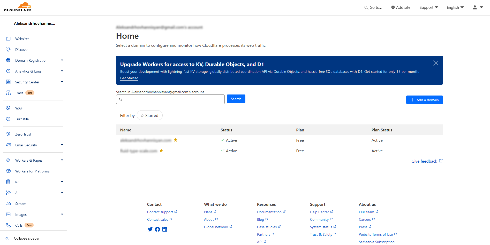

In 2021, when I was beginning to take my site more seriously, I wrote about my experience [migrating from GitHub Pages to Netlify](/blog/github-pages-vs-netlify/). In hindsight, maybe that wasn't anything worth writing home about, but at the time I was learning so much that I was eager to document every little thing I was doing.

Netlify was (and still is) a great hosting provider—and unless that changes, I'll happily recommend their free tier to developers who just want to host a small site and get something out there for others to see. Also, Netlify's dashboard and [CLI tools](https://www.npmjs.com/package/netlify-cli) have a great developer experience, and Netlify has tons of good documentation and tutorials.

Even so, as my site grew, I began to have some reservations about Netlify's pricing.



## Free Until It Isn't

Like most hosting providers, Netlify offers several pricing tiers. The free tier is good enough for small projects like blogs and it served me well for years. My entire site's build output is under 100 MB as I'm writing this, and according to Netlify's usage metrics, all of my projects combined consumed an average of 9 GB per month—just under 10% of the limit.

    <table id="table-1">
    <caption>Table 1: Netlify's Starter tier</caption>
        <thead>
            <tr>
                <th scope="col">Bandwidth</th>
                <th scope="col">Build minutes</th>
                <th scope="col">Serverless invocations</th>
            </tr>
        </thead>
        <tbody>
            <tr>
                <td>100 GB per month</td>
                <td>300 minutes per month</td>
                <td>125k per site per month</td>
            </tr>
        </tbody>
    </table>

Still, within months of migrating to Netlify in 2021, I had already managed to accidentally exceed their allowed number of build minutes for the free tier and had to pay a fee:

![Email from Netlify. Subject line reads: "[Netlify]: Extra usage package purchased for Build Minutes on your account Aleksandr Hovhannisyan's team". Sent on Dec 12, 2021, 5:41 AM. Email body reads: Based on your usage so far this month, we’ve billed you for an additional Build Minutes usage package on account Aleksandr Hovhannisyan's team. This means you can now use an additional 500 build minutes in this billing cycle. Find out more in your dashboard.](./images/overbilled.png)

In Netlify's defense, it was entirely my fault for not monitoring my build usage more closely. I was new to this whole hosting thing back then and didn't realize that I had to be more careful and push less frequently (or manually cancel queued-up builds). And my site ran on Jekyll at the time, which was much slower to build than [my current Eleventy site](/blog/eleventy-the-good-the-bad-and-the-possum/).

I learned my lesson and this never happened again, but that didn't necessarily mean that I was in the clear. Things could've gone worse for me, especially considering how many monthly visitors my site has. For example, I could've woken up one day to [a $104k bill for a simple static site](https://news.ycombinator.com/item?id=39520776) if just one bad actor had decided to DDoS me. And a few months ago, the developer of Cara was [billed $96k by Vercel after the app suddenly went viral](https://www.youtube.com/watch?v=SCIfWhAheVw).

Now, I'm not sharing these stories to vilify Netlify or Vercel—they are both very transparent about their pricing, and it's always the developer's responsibility to monitor usage and look out for warning signs. These platforms have free tiers that are suitable for hobby projects, but anything serious is going to end up costing you more than if you had just hosted it yourself on AWS or rented a virtual private server (VPS).

Still, the thought of getting DDoSed weighed on me for months following these stories. I began to think that maybe I should pay a couple bucks a month to self-host my site on a VPS and either learn how to configure nginx or maybe use an open-source project like [Coolify](https://coolify.io/). That would be a neat learning experience and is something I plan on doing anyway for fun, but I didn't want to risk opening up security holes on my site out of paranoia.

Instead, [like other developers](https://mademistakes.com/notes/done-with-netlify/), I settled on a middle ground and decided to migrate both my website and another side project to Cloudflare.

## Cloudflare Pages

Like Vercel, Netlify, AWS, and other companies in this space, Cloudflare is a hosting provider. But it also offers other cloud storage, proxying, and security services and claims to have more aggressive threat protection. Its competing offering for Netlify and Vercel is Cloudflare Pages, which allows you to host any static site via its GitHub CI integration.

### Pricing

While Cloudflare is comparable to Vercel and Netlify on paper, my understanding is that it has a significant advantage over its competitors—because while those other companies are built on top of AWS (and thus charge you more once you exceed the free tier), Cloudflare owns its infrastructure. As [others explained to me on Twitter](https://x.com/hovhaDovah/status/1828101160219378004), that's why Cloudflare is able to offer this generous free tier:

    <table id="table-2">
    <caption>Table 2: Cloudflare's free tier pricing, as of <time datetime="2024-09-15">September 15, 2024</time></caption>
        <thead>
            <tr>
                <th scope="col">Bandwidth</th>
                <th scope="col">Builds</th>
                <th scope="col">Serverless invocations</th>
            </tr>
        </thead>
        <tbody>
            <tr>
                <td>Unlimited</td>
                <td>500 per month per account</td>
                <td>100k per day per account</td>
            </tr>
        </tbody>
    </table>

Since my site builds in 1.5–2 minutes on average, I was limited to approximately 150 builds per month on Netlify. By contrast, Cloudflare has a fixed number of builds, not build minutes, meaning if a single build takes longer than expected, it won't count more towards your quota than any other build. Granted, I'm never going to come close to 500 or even 150 builds per month, but it's nice to know that I have this safety net in case I decide to host more projects on Cloudflare in the future.

### Ease of Migration

Aside from some minor configuration differences, Cloudflare Pages is fully compatible with a Netlify site. For example, Cloudflare uses the same syntax and file naming convention for 301 redirects, which meant that I could continue to use my `_redirects` file from Netlify. Cloudflare Pages also supports a wide range of static site generators and frameworks.

Additionally, migrating a Netlify Function to a Cloudflare Worker is trivial, as both platforms support the web standard Request/Response API, so my old code for my [makeshift comment system](blog/static-site-comments-github-issues/) was already compatible with Workers. The only thing I had to do was change the export syntax for my handler and the HTTP route configuration in the Cloudflare dashboard so that the function would be called on `/api/comments`. I also needed to install and configure [Wrangler](https://developers.cloudflare.com/workers/wrangler/configuration/)—Cloudflare's CLI for Workers—and enable some Node.js compatibility flags.

### Helpful Community

Like Netlify, Cloudflare has a Discourse forum at [community.cloudflare.com](community.cloudflare.com) where users can ask questions and help each other out. They also have a Discord server that I joined.

## Areas of Improvement

Overall, I'm happy with my decision to migrate to Cloudflare Pages. However, there are some of the things I wish Cloudflare did better and that I miss from Netlify (like their free plugins for identifying dead links, measuring page performance, and more). I just want to emphasize again that this is a free product, so I can't really complain too much.

### DNS Confusion

I blame this mostly on my inexperience with DNS, as it's not something I've had to configure too many times in the past. Something that confused me was the fact that Cloudflare wanted me to add a CNAME record for my apex domain (`aleksandrhovhannisyan.com`) to my domain registrar during the custom domain setup process. However, as my registrar's website explains, you can't a CNAME record for your apex domain—instead, you need an alias record. Cloudflare only explains this _after_ you add the record, not before. I had to add and delete DNS records a few times because I wasn't sure if I was doing things correctly.

### Local Developer Experience

Something I really miss from Netlify is the fact that I could just run `npx netlify dev`, and it would load my site configuration from my `netlify.toml` and launch a local dev server that proxied my front end while also allowing me to locally invoke my lambda functions. With Cloudflare, I need to spin up Wrangler and my front end server separately and wrestle with CORS. However, this is more of an ergonomic concern and not a functional one.

### Dashboard Navigation

Netlify's UI was very clean and organized, while Cloudflare's dashboard is busier because it offers so many different services. This can make it difficult to find the page you're looking for. For example, if you want a Cloudflare Worker to run when someone visits an HTTP route on your website, there are two identical ways to configure this:

1. On the Workers Routes page under your website, and
2. Under Triggers > Routes, after navigating to a worker project.

I often had to jump back and forth between different pages to find what I was looking for.

Another example of this came up when I wanted to redirect my apex domain to the www version of my domain, which required setting up a redirect rule through the dashboard.

Sure, Cloudflare has pre-built templates for common routing configurations, but if you need to do anything custom, you're going to need to figure out whether you need a configuration rule, transform rule, redirect rule, origin rule, page rule, or the very vaguely named "settings." All of those sound very similar but do different things.

### Documentation

So far, my biggest pain point with Cloudflare has been their documentation. I've come across multiple articles that seem to cover the same topics but have slight differences, which usually means I end up with multiple open tabs and more questions than answers. This might be because Cloudflare offers so many different services, or maybe the team isn't aware of these discrepancies, or maybe they are but it's understandably a lot of work to maintain documentation. Who knows.

I've also found that some things aren't documented anywhere. For example, as of April 2024, you should be able to [use `wrangler.toml` to configure a Cloudflare Pages project](https://blog.cloudflare.com/pages-workers-integrations-monorepos-nextjs-wrangler/) and not just worker projects. Unfortunately, the documentation on how to do this does not mention the full list of available keys and values, like how to specify your build command or the build output directory for your site. Those configurations are available in the UI, but their corresponding `wrangler` configs aren't documented anywhere as far as I could tell.

## Summary

Did I really need to migrate to Cloudflare? Probably not.

Do I miss Netlify? A little. Their DX and documentation were _much_ better.

In any case, I learned something new, and I feel a little safer on Cloudflare.
