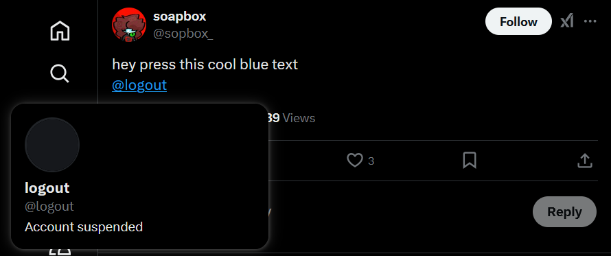
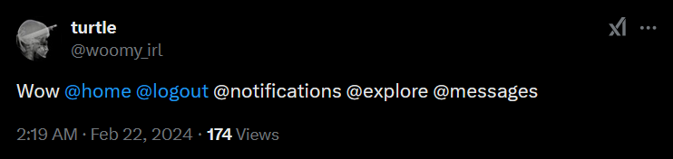
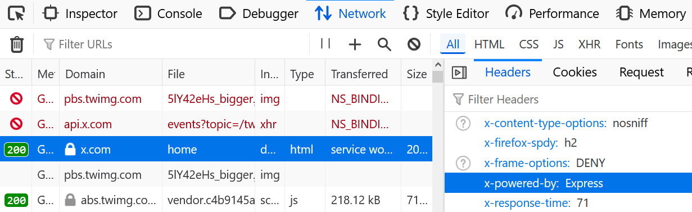

While browsing Twitter—_sorry_, X—I realized something that had never crossed my mind before: All profile pages live under `https://x.com/:username`. And it turns out that this is actually a major design flaw.

{loading="eager"}

## Route Hijacking

The problem with X's routes is that they're flat. _Too_ flat.

1. https://x.com/home takes you to your home page ✅
2. https://x.com/messages takes you to your DMs ✅
3. [https://x.com/:username](https://x.com/:username) takes you to @username's account ⚠️

So what if a username happens to match a reserved route? For example, what's stopping someone from claiming @home and getting assigned the profile URL of https://x.com/home? Well, apparently nothing:



You remember your old friend @Settings, right?



**Achievement unlocked**: Hidden (or extremely popular) profiles. Depending on which route is registered last, you're going to see one of two behaviors:

- Legitimate routes like `/home` point to the hijacker's profile.
- Legitimate routes work, but you can no longer view the conflicting profiles.

Although the second approach is not ideal, it's the lesser of these two evils. The first issue appears to have been patched, so you can no longer navigate to these profile pages directly because the reserved route always takes precedence. That leaves only two options for following these "hidden" accounts:

- Find or compose a tweet mentioning the account and hover over the mention.
- Find the account in someone else's follows list.

If you try to [view @settings's followers](https://x.com/settings/verified_followers), you'll get a routing error:


But you can still view [@home's followers](https://x.com/home/verified_followers), at least for now. And there are lots of them: 1.1 million at the time when I wrote this, to be exact.


The issue hasn't been fully patched, though, because if you click a mention for [@logout](https://x.com/logout), you'll get a prompt to—you guessed it—log out. Likewise, mentions for @home and @settings will take you to `/home` or `/settings`, respectively.

<figure>
    
    <figcaption>It's a feature, not a bug!</figcaption>
</figure>


Thankfully, Twitter has validation in place to prevent you from claiming handles with slashes, like [@settings/deactivate](https://x.com/settings/deactivate). Trust me, I tried 😉 Removing client-side validation and blocking the server-side validation request with dev tools doesn't work. So that's one win for the Twitter devs.


Some usernames—like `tos`, `messages`, `notifications`, and `privacy`—appear to have been reserved correctly. [Their mentions](https://x.com/woomy_irl/status/1760580092324151402) aren't even hyperlinked:



## Why It Happened

Using dev tools, I verified that all responses on Twitter include the `x-powered-by: Express` header, which means the back end uses the popular [Express.js framework](https://expressjs.com/):

{eleventy:formats="png,webp"}

With that in mind, we can assume that Twitter's router looks something like this:

```js
router.get('/:username', (req, res) => {});
router.get('/home', (req, res) => {});
router.get('/settings', (req, res) => {});
router.get('/logout', (req, res) => {});
```

In Express, route handling is done on a first-come, first-serve basis: The first route handler that matches a requested path will be the one that runs. This means that in the above example, a GET request for the `/home` route would call the handler for `/:username` because that route was defined first and matches the requested path. As you might expect, flipping the order wouldn't help because then a GET request for `/home` would give you @home's profile page instead of your feed, effectively breaking the app for everyone.

As a best practice in API design, if you allow users to create public-facing accounts, their profile pages should live under a more specific path, like `/user/:username`, to minimize the risk of collisions with static routes:

```js
router.get('/user/:username', (req, res) => {});
router.get('/home', (req, res) => {});
router.get('/settings', (req, res) => {});
router.get('/logout', (req, res) => {});
```

If you don't do this, then you at least need to reserve these usernames so that users can't claim them when signing up for an account or changing their handle.


From my testing, it seems Twitter _does_ reserve handles now, but `@home`, `@settings`, and `@logout` were created long before that change took effect.


## Why It Matters

Users should **never** be able to hijack static routes during the account creation process, as this affects security and usability.

For example, at one point this bug prevented users from logging out of the mobile app because the legitimate `/logout` link would take them to @logout's profile:


Hey @elonmusk, when you try to logout on the website on mobile it takes you to the @logout account instead


That may seem annoying, and it is. But it's a mild regression compared to opening the app and seeing @home's profile instead of your feed—an actual bug that was reported by multiple users in February 2024:

<figure>
    
    <figcaption>Post on r/Twitter: <a href="https://www.reddit.com/r/Twitter/comments/1azowtv/does_anyone_know_why_my_app_suddenly_opens_these/">"Does anyone know why my app suddenly opens these random account pages when I boot it up?"</a></figcaption>
</figure>

<figure>
    
    <figcaption>Source: <a href="https://x.com/laxxedd/status/1758959888170934625">@laxxedd on X</a></figcaption>
</figure>

Now, imagine if the owner of the @home profile had included a malicious link in their bio or masqueraded as an official person. Sure, the account would've eventually been flagged and suspended, but maybe it would've managed to trick enough users to click the link before getting caught. That's no longer an [oopsie-woopsie](https://knowyourmeme.com/memes/oopsie-woopsie): It's a security loophole.

This bug also reveals an apparent disconnect between how users _think_ navigation works and how it's _actually_ implemented on the web. Ordinary people don't think of URLs the same way developers do, and the lines become even blurrier in a client-side-routed app like Twitter that tries its best to feel native. You open the "app" and you expect to see your timeline. You click a "tab"—not a _link_, mind you—and expect to see a new user interface without a full page reload. So you can't really fault someone for logging in, seeing @home's profile page, and thinking the site or their account has been "hacked."

## Username Parking and Eviction

You might be thinking: Well, Twitter already fixed this bug, who cares? But suppose you've had @username for years, and then one day X decides to add `https://x.com/:username` as an internal route that just happens to conflict. If this route is registered with a lower priority than username routes, it'll point to your profile page—the @home fiasco all over again. But if it's implemented correctly, nobody will be able to view your profile from that point onward. Effectively, this one flaw in X's routing forces you to change your handle. It also means you can compile a list of handles that may one day trigger route collisions and create an account for any that don't already exist, "parking" them in the hopes of hijacking routes in the future.

## Conclusion

All of this could've been avoided if Twitter had isolated profile routes from static routes with a scheme like `/profile/:username` or `/user/:username`, as many social media sites do. For example, Reddit profiles are under `/user/:username`. I suspect that Twitter's decision to use flat URLs was motivated by aesthetics: making profile URLs _short_ instead of _safe_. Technically, that would've still worked if the developers had reserved these handles during account creation. But because they didn't, I'm now a proud follower of @home and @settings.
