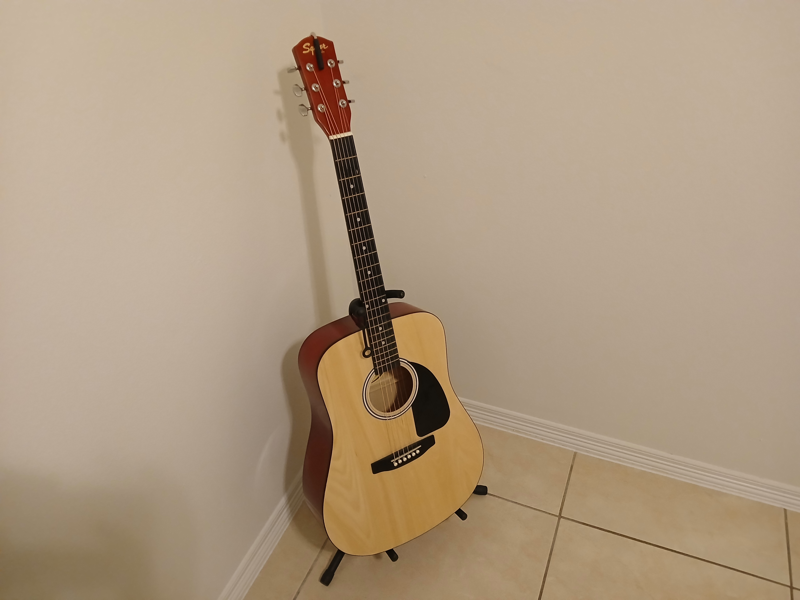
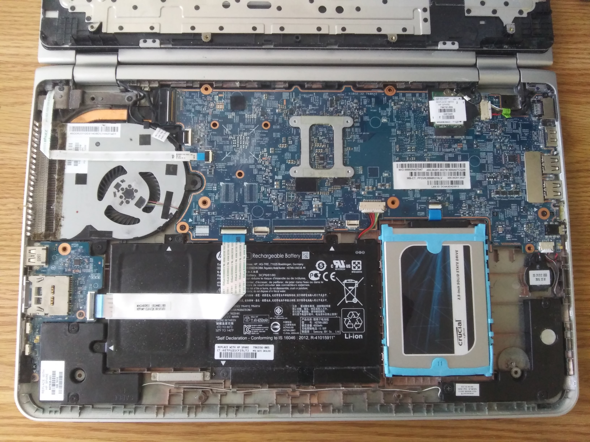
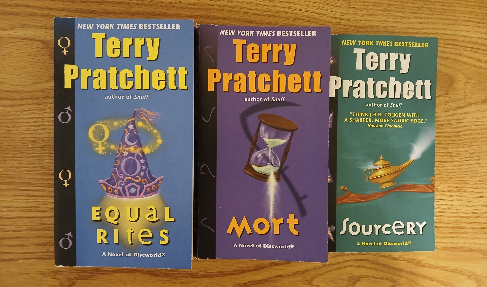
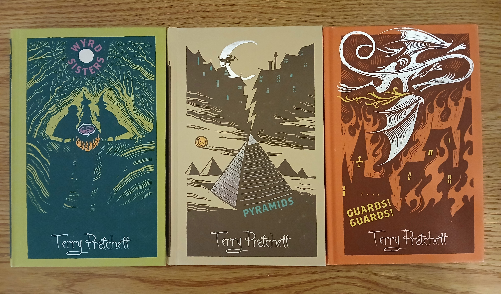
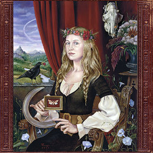
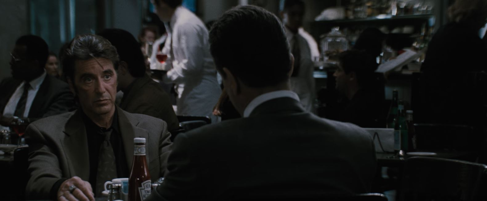
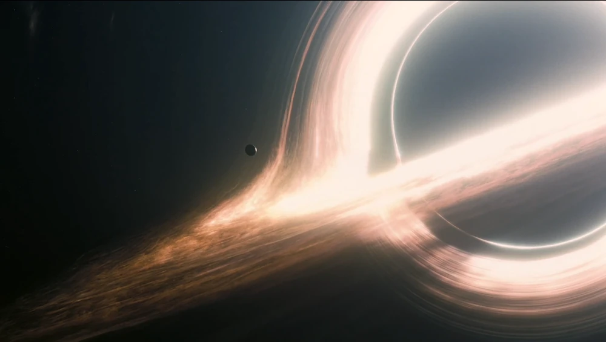
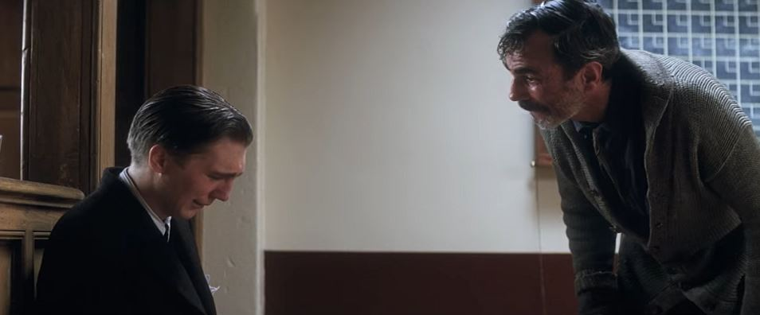
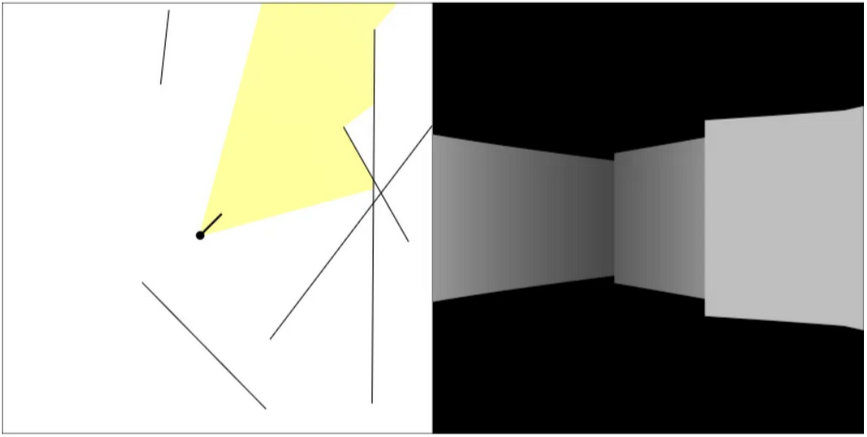
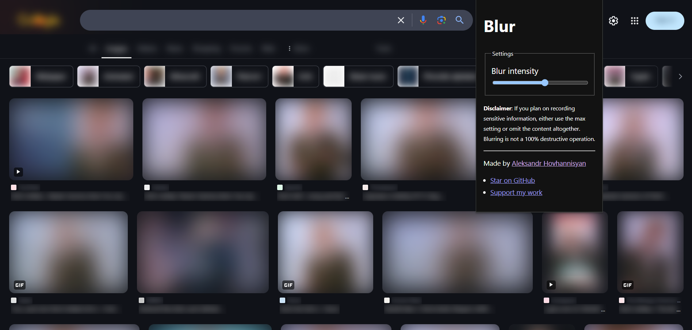

Well, it's that time of the year again.

At the start of 2024, I set this goal for myself:


On a personal level, 2023 was a good year, but it could've been better in other ways. With all the things going on around the world, it often felt like things were falling apart, and I didn't practice good mental health habits—I spent too much time doomscrolling on social media like Twitter and Reddit, and I didn't spend nearly as much time away from my desk as I should've. So I suppose those are some things to work on in 2024.


While I didn't keep that resolution, I did learn and try new things this year.

## I cast my first vote

In 2023, [I became a naturalized U.S. citizen](/blog/naturalized/), so the 2024 presidential election was the first in which I was actually able to vote. Before becoming a citizen, I had never really felt invested in the outcomes of past elections—the way I saw it, there was no point in worrying about something beyond my control. But this time was different since I was no longer watching from the sidelines, and I even stayed up late on election day to watch the polls close. Sure, my vote was a drop in the ocean, but it was a vote nonetheless, and I was proud to have participated.

## I learned to play guitar


One year of guitar practice has taught me that if you suck at doing something, if you just keep practicing regularly, you'll eventually still suck, but slightly less


Growing up, the only musical instrument I'd ever touched was the recorder in the second grade, but I'd always wanted to learn the guitar so I could play songs from my favorite bands. In December 2023, I took the first step towards fulfilling this dream and bought my very first acoustic guitar and learned how to play it using online tutorials, through both figurative and literal pain.

Initially, I used [JustinGuitar](https://www.justinguitar.com/)'s free courses to learn the basics: how to tune a guitar, how to hold a guitar and pick, what a chord is, how to switch between chords, how to do different strumming patterns, and so on. My pinky betrayed me countless times, my fingers were slow and unprotected by calluses, and I was convinced that switching between G and C was impossible. But I powered through and practiced until I gradually improved.

I found these tutorials very helpful as a complete beginner since they gave me a sense of direction and a gentle introduction to guitar. But at the same time, I didn't like that formal and structured course format. Sure, it's important to learn the fundamentals for any skill, but I'd much rather learn all of these same skills by playing songs rather than aimlessly practicing chords and strumming patterns. By analogy, it's a bit like reading about programming theory rather than just coding.


To Justin's credit, each lesson does include song suggestions at the end that can help you practice the concepts introduced in the videos. But not all of those songs interested me.


To that end, I decided it was time to switch things up a bit and learn some songs. And along the way, I stumbled across the [Marin Music Center](https://www.youtube.com/@marinmusic) YouTube channel run by the incredibly entertaining [Stuart Lehman-Brown](https://www.marinmusic.com/bio). His approachable and patient teaching style, coupled with his great taste in music, made it so much more enjoyable to learn guitar.

I've noticed that while I'm good at remembering the chords for songs and strumming on the beat, I struggle a lot with chord switches, both in terms of speed and accuracy. I also still have trouble with hand placement and finger coordination. For now, the following are the only good recordings I've been able to produce. But that's okay—I've only been playing for one year, so I'm sure I'll improve over time.







## I upgraded my laptop

My current personal laptop isn't exactly up to par with modern machines: It's a 2016 HP Envy x360 that, by all standards, has long been overdue for a replacement. I'm actually not sure how I've tolerated this thing for so long considering it originally came with an HDD and only 8 GB of RAM, but it carried me through college and is still going to this day. But I'd be lying if I said it wasn't starting to show its age.

I'm a strong believer in the right to repair and taking care of electronics instead of throwing them away as soon as they show signs of wear and tear. So in 2024, I decided to show my laptop some love and upgrade its internal hardware, something I'd never attempted before. With help from some iFixit tutorials, I replaced the hard drive with an SSD and increased the RAM to 16 GB, and now it's running a lot faster. I'm glad I learned this skill as it'll be useful for the rest of my life.

I plan to squeeze every drop of value out of my laptop before I eventually have to bin it (the CPU is ineligible for a Windows 11 upgrade, so that deadline is October 2025). Based on my research, I think my next machine will most likely be a Framework, as the company's core values align with mine.


Read the full post here: [My First DIY Laptop Upgrade](/blog/laptop-upgrade/).


## I read more books

Years ago, I wrote about the various reasons why I think some people [no longer enjoy reading](/blog/why-you-no-longer-enjoy-reading/). The point of that article wasn't to excuse myself from reading, which was admittedly something I had begun to neglect; rather, it was to discuss why I think reading for the wrong reasons can do more harm than not doing it at all. My biggest gripe with reading today is the culture around it, specifically this idea on social media that it's a competition or, in some ways, a fashion statement.

However, since then, I've been doing a lot of reading and have finished many great books—*The Shadow of the Wind*, *The Little Prince*, *All Quiet on the Western Front*, *Johnny Got His Gun*, and others. In 2024 specifically, I revisited Terry Pratchett's Discworld series and read _Equal Rites_, _Mort_, _Sourcery_, and _Wyrd Sisters_.


Roughly four years ago, I read—and even reviewed, in one of my now-deleted blog posts—the first two books in the Discworld series: _The Colour of Magic_ and _The Light Fantastic_. The only reason I stopped reading the series is because I felt intimidated by the Herculean task of finishing all 41 books. But this time around, I decided to slow down and enjoy the books over the course of however long it takes. After all, I'm in no rush.


Terry Pratchett isn't for everyone, and even as a fan I sometimes find that his jokes are a bit too British for my taste. But overall, I really enjoy how he marries comedy with fantasy and often breaks the fourth wall as he develops the varied themes and characters of the Disc. His writing is also extremely quotable. 

Out of the first six Discworld books that I've read so far, I'd rank _Wyrd Sisters_, _Sourcery_, and _Mort_ as my favorites. I enjoyed the Rincewind storyline the most, so I'm hoping he and the Luggage will return in future books.


I started off reading the electronic and paperback versions of the series, but [this YouTube review](https://www.youtube.com/watch?v=iMm34YCXr30) convinced me to buy the collector's edition. For roughly the same price as the paperbacks, you get books of a much higher quality and with beautiful artwork by illustrator Joe McLaren. I look forward to reading _Guards! Guards!_; I've heard lots of praise for it, and the cover art is gorgeous. You can purchase them individually or in bulk from [Blackwell's](https://blackwells.co.uk/) or [Discworld Emporium](https://www.discworldemporium.com/product-category/books/the-discworld-collector-s-library/). (I'm not sponsored by or affiliated with either store.)



## I listened to new (and old) music

According to my Spotify Wrapped, my top artists for 2024 were:

1. Lana Del Rey
2. Kendrick Lamar
3. The Strokes
4. Joji
5. Arctic Monkeys

With these top songs:

1. "Someday" by The Strokes
2. "Buddy's Rendezvous" (the Lana Del Rey cover)
3. "Between the Bars" by Elliott Smith
4. "SLOW DANCING IN THE DARK" by Joji
5. "Sweet Carolina" by Lana Del Rey

The Strokes was probably my most-played band this year when factoring in YouTube listens. I could listen to _Is This It?_ forever—it's a perfect album.

Also, shout-out to my friend Craig who introduced me to Joanna Newsom. I listened to her a lot, and the only reason she didn't make it onto my Spotify Wrapped is because she's boycotting their payout practices, so all of her work is on YouTube.

<figure>
  
  <figcaption>Benjamin A. Vierling's cover art for Joanna Newsom's album <em>Ys</em>. Source: <a href="https://bvierling.com/album-covers" rel="noopener">bvierling.com</a>. Copyright Drag City Records, USA.</figcaption>
</figure>

["Only Skin"](https://www.youtube.com/watch?v=1iSpddh1U6E) is a good introduction to her discography; it's a beautiful 16-minute folk track that romanticizes pastoral life and explores themes of love and mortality. Her [live performance at Bottletree Cafe (2006)](https://www.youtube.com/watch?v=BEIH7FUwbfE) is also very good.

## I watched (and rewatched) movies

As the world went down the gutter, I turned to comedies for relief. I watched *Palm Springs*, saw the hilariously quotable and irreverent *Superbad* for the first time, and rewatched *Juno* for the Michael Cera encore.

<figure>
    
    <figcaption><em>"Who are you, Seal?"</em> Source: <a href="https://tenor.com/view/superbad-i-am-mclovin-gif-18511886" rel="noopener">Tenor GIFs, <em>Superbad</em></a>.</figcaption>
</figure>

I also rewatched:

- _Braveheart_
- _No Country for Old Men_
- _Zodiac_
- _Sicario_

And watched these movies for the first time:

- _Sicario: Day of the Soldado_
- _The Truman Show_
- _Alien_
- _The Hunger Games_ (I'd only ever read the books)
- _Edward Scissorhands_
- _Big Eyes_

But out of all the movies I saw in 2024, four were my favorites.

### _Heat_ (1995)

<figure>
  
  <figcaption>Scene from <em>Heat</em>, with Al Pacino (left) and Robert DeNiro (right). Copyright 1995 Warner Bros., Warner Bros. Pictures.</figcaption>
</figure>

I've seen lots of heist movies—from _The Town_ (2010) to _Den of Thieves_ (2018)—and I don't think any of them will ever live up to _Heat_. This movie practically defined the genre, and at nearly three hours runtime, it's not just a mindless run-and-gun: the pacing alternates between bursts of [intense action](https://www.youtube.com/watch?v=ZL9fnVtz_lc) and slow-burn exposition.

### _28 Weeks Later_ (2007)

<figure>
  
  <figcaption>Still shot from the opening scene of <em>28 Weeks Later</em>. Copyright 2007 Disney, 20th Century Fox.</figcaption>
</figure>

I can't say for certain, but I have this weird déjà vu of watching _28 Weeks Later_ in the late 2000s as a kid. Rewatching it reminded of how much [the opening scene](https://www.youtube.com/watch?v=SC-eHCYXRqg) had terrified me back then. It was so well executed: the lighting, the suspense, the split-second decisions that characters had to make [in a heartbeat](https://www.youtube.com/watch?v=ST2H8FWDvEA). Although the story is predictable (as most are in this genre), it still holds up well, and I'm always a sucker for a good post-apocalyptic narrative. Hopefully the recently announced [_28 Years Later_](https://www.youtube.com/watch?v=mcvLKldPM08) won't disappoint.


I guess we're skipping _28 Months Later_?


### _Interstellar_ (2014)

<figure>
  
  <figcaption>Gargantua, a planet orbiting a massive black hole in the film <em>Interstellar</em>. Source: <a href="https://interstellarfilm.fandom.com/wiki/Gargantua" rel="noopener">Interstellar Fandom Wiki</a>. Copyright 2014 Warner Bros. Entertainment, Inc. and Paramount Pictures Corporation.</figcaption>
</figure>

_Interstellar_ was always a movie I'd seen clip and memes of but one I never watched until 2024. Due to time dilation, this meant that I had missed out on an entire decade of discourse. When I finally did watch it, I found myself captivated by Christopher Nolan's grand and often terrifying depictions of space, and I felt invested in the fates of the characters—and the lovable TARS—as they raged against the dying of the proverbial light. I was even surprised to learn that many aspects of the movie were based on [actual (albeit incomprehensible) physics](https://www.astronomy.com/science/kip-thorne-and-the-mind-bending-science-of-interstellar/). Although I doubt it'll ever happen in my lifetime, I hope I'll get to see the day when we chart the ends of the universe [to the tune of Hans Zimmer](https://www.youtube.com/watch?v=UDVtMYqUAyw).

### _There Will Be Blood_ (2007)

<figure>
  
  <figcaption>Eli Sunday (left) and Daniel Plainview (right) from the film <em>There Will Be Blood</em>. Source: <a href="https://www.youtube.com/watch?v=s_hFTR6qyEo" rel="noopener">I Drink Your Milkshake! - There Will Be Blood (7/8) Movie CLIP (2007) HD</a>. Copyright 2007 Paul Thomas Anderson, Paramount Vantage.</figcaption>
</figure>

The final movie—and my absolute favorite—was *There Will Be Blood*, starring Daniel Day-Lewis and Paul Dano. One of my favorite things about this film was the tense opening scene—despite lacking dialogue for nearly six straight minutes, it's a masterclass in storytelling, character development, and sound design. In fact, I'd go as far as to say that it's now one of my favorite movies of all time. I'll never forget the way Daniel Day-Lewis so convincingly and frighteningly embodies his character in the iconic milkshake scene pictured above.


Some fun facts that I learned about *There Will Be Blood* after watching it:

- The soundtrack was composed by Jonny Greenwood, best known as the lead guitarist of Radiohead (one of my favorite bands).
- The film's director, Paul Thomas Anderson, also directed the music video for Joanna Newsom's ["Sapokanikan"](https://www.youtube.com/watch?v=ky9Ro9pP2gc).


## I did more hobby programming

As much as I hate to admit it, working full time as a software developer sometimes leaves me with little energy or desire to program in my free time. But I still think it's good to stay sharp and occasionally program outside of work to avoid stagnation.

Here's a brief summary of the things I worked on or learned in 2024.

### Raycasting and animation loops

Inspired by one of [tsoding's Twitch streams](https://www.twitch.tv/tsoding) in which he implemented [3D raycasting in TypeScript](https://www.youtube.com/watch?v=K1xEkA46CuM), I created my own [demo of 2D and 3D raycasting](https://raycasting-from-scratch.netlify.app/) using an HTML canvas and custom JavaScript. I learned a lot in the process, like how to create web components and how to run [performant animation loops](/blog/javascript-game-loop/) in JavaScript with `requestAnimationFrame`. If you want to learn how raycasting works, I highly recommend following Daniel Shiffman's tutorial videos on The Coding Train:

- [#145 — Ray Casting 2D](https://thecodingtrain.com/challenges/145-ray-casting-2d)
- [#146 — Rendering Ray Casting](https://thecodingtrain.com/challenges/146-rendering-ray-casting)

### Unicode deep dive

One of the longest articles I wrote in 2024 was about Unicode, the foundational character set and encoding standard that underlies much of the software that we use everyday. My primary motivation for writing this deep dive was to fill in some of my own knowledge gaps since this had always been a topic that I struggled to understand. And time and time again, I've found that the best way to learn something is to teach it. You can read the article here: [An Introduction to Unicode](/blog/introduction-to-unicode/).

### Cloudflare, Nginx

All the controversy in 2024 surrounding website hosting providers prompted me to [migrate my blog and side projects to Cloudflare](/blog/cloudflare-migration/) out of an abundance of caution. In the process, I learned a lot about DNS management, including how DNS resolution actually works and how to trace DNS queries locally via the command line.

On the side, I also bought a $5 DigitalOcean droplet and used a bunch of online tutorials to learn how to self-host websites using [nginx](https://nginx.org/), in case I ever decide (or need) to do that. Along the way, I also tried out Bun and [Hono.js](https://hono.dev/), a new web server framework built on top of web standards. You can view my toy website here: https://www.hovhadovah.dev/. I'm not sure what I'll end up doing with it; for now, it's just a learning sandbox, so don't be surprised if it breaks or disappears into the ether.

### Web Extensions API

Finally, I created a simple browser extension called [Blur](https://github.com/AleksandrHovhannisyan/blur) that allows you to blur text and images by highlighting any amount of content, right-clicking to bring up the browser context menu, and then clicking the extension's option. You can then control the blur intensity via the extension popup.

This isn't exactly a revolutionary idea—there are tons of other extensions like it, with even more features. But at least this project gave me an excuse to learn how to publish cross-browser extensions as well as how to use the more modern Web Extensions API for Manifest v3. I took the hard route and created a custom build pipeline with Vite that packages and zips the extension for Chrome and Firefox, but I later learned that some frameworks like [WXT](https://wxt.dev/) can already do all of this for you.

I also learned a lot about the DOM's Selection and Range APIs and even published a separate npm package, [`text-range-utils`](https://www.npmjs.com/package/text-range-utils), for querying and manipulating text nodes. I'm not sure how useful it'll be, but I don't think every project needs to have a big impact. If you learned something, then it wasn't a complete waste of time.

## What Next?

Although these end-of-year reviews take a lot of time to write, I find them useful as a reflection tool—especially because I tend to be my worst critic, and it's easy for me to forget what I did or experienced unless I sit down to write.

Anyway, like a lot of people right now, I'm uncertain about the future—from the tech job market to world conflict and the uncertainty around AI, a lot of things could change over the course of a year. And that makes it a little difficult to plan for the future, set goals, or maintain a positive outlook. I could've sworn it wasn't always like this—but maybe that's just the rose-tinted glasses wearing off as I grow older.

That said, I do have a few goals for 2025. For starters, I really want to continue learning guitar—I find it very therapeutic and, most importantly, fun. I've been putting off restringing my guitar, adjusting its action, and learning barre chords, so those are some concrete things to work on this year. I might also attend a live concert nearby, as some of my favorite bands are touring and I've never been to one before. And the usual, of course: learn new things, write more, discover the meaning of life, achieve enlightenment, etc.
