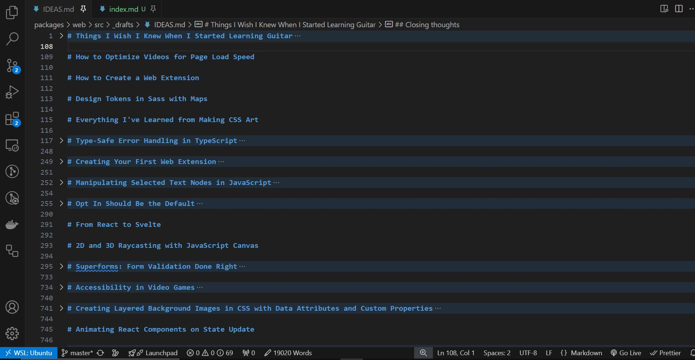

Ben Myers [tagged me](https://benmyers.dev/blog/blog-questions-2025/) in a trend that's circulating online where folks answer questions about why they got into blogging, how they do it, and more. I've never participated in something like this before, aside from my [about page](/about/), so here goes!



## Why did you start blogging?

I've always enjoyed writing, but that's not the only reason why I started my blog. For as long as I can remember, I've used writing as a tool to deepen my own understanding of difficult concepts. In fact, some of my earliest posts were on math and computer science topics from my undergraduate studies that I felt others hadn't explained well, so I wrote about them in the spirit of learning by teaching myself. Over time, I used my blog to write tutorials on technical problems I'd solved at work, as well as essays about tech, life, gaming, and more. Finally, I knew that a blog could benefit my career in the long term, as many of the successful developers I looked up to had blogs of their own.

## What platform do you use to manage your blog? Have you blogged on other platforms before?


See my [tech stack](/colophon/#tech-stack) for a breakdown of the tools I use.


In 2019, when my site was just a plain `index.html` showcasing my projects and skills, I decided that I also wanted to use it as a space to write. That's when I first learned about [Jekyll](https://jekyllrb.com/), a static site generator that allows you to author content in Markdown files. Jekyll opened up a whole new world for me, not only because it allowed me to create a blog but also because it motivated me to learn about web technologies, performance optimization, and much more.

Although it was great at first, Jekyll did have some limitations that made it difficult to use, so I began exploring alternatives. In 2021, I migrated my blog to [Eleventy](https://www.11ty.dev/), a faster static site generator written in Node.js. Eleventy solved many of the pain points I previously had with Jekyll, and it gave me more control over how and where I rendered my content. Fast-forward to today, and I'm still very happy with my setup. Lately I've been itching to try [Astro](https://astro.build/) so I can publish more interactive posts and take advantage of server-side rendering and islands architecture, but [I've found workarounds in Eleventy](/blog/eleventy-code-demos/) that are fine for now.

If you're curious, the source code for my site is [fully available on GitHub](https://github.com/AleksandrHovhannisyan/aleksandrhovhannisyan.com/), with a commit history dating all the way back to when I hosted it on GitHub Pages. I later [used Netlify for a few years](/tags/netlify/), but [now I'm on Cloudflare Pages](/blog/cloudflare-migration/). I don't just mindlessly hop from framework to framework or platform to platform—I use my site as an opportunity to learn new tools and solve problems that affect me personally. So if I change something, it's usually for a good reason.

I haven't written for other publications yet, although I did syndicate my content to Dev.to early on. It's true that publishing on other platforms can be a great way to expand your reach, meet new people, and maybe even earn extra money on the side, and I know lots of folks who do this. But for now, I take comfort in owning my content and making my own editorial decisions. I believe this is more important than ever in a world where content ownership is increasingly seen as a contractual agreement rather than a right.

## How do you write your posts?

I author all of my posts in Markdown.

Each post on my site is a directory with a Markdown file and any relevant assets:

```
packages/web/src/_posts
├── 2025-03-22-post-slug
│   ├── images
│   │   └── image.jpg
│   ├── videos
│   │   └── video.mp4
│   └── index.md
```

In my Markdown, I use [Liquid](https://liquidjs.com/) (a templating language) to [render custom UI components](/blog/packages/custom-markdown-components-in-11ty/) like notes, quotes, and more:


```liquid
---
title: Title
front: matter
---

Paragraph.

Quote.

Note.
```


As for my writing process, I don't really follow one, and I tend to be disorganized. I'll start with a general idea for what I want to write about and jot it down somewhere or email it to myself so I don't forget it. Sometimes I'll let an idea sit there for a few days before revisiting it, but other times I'll just start writing immediately. I'll typically write a few paragraphs at a time, re-read the article from the beginning, and compulsively edit my own work along the way, often jumping around and repeating this an admittedly unhealthy number of times until the wording and flow feel Just Right (they never do, and I need to learn when to move on). Along the way, I'll leave `TODO` placeholders for media, external links, and metadata so I can focus on writing the actual content first. The part I struggle with the most—and that I put off until the very end—is coming up with a good title and description to capture all of the essential ideas in an article.

## When are you most inspired to write?

I don't like rushing content for the sake of posting regularly, and I try to never force myself to publish a post unless I feel good about it. I'll often leave drafts untouched for weeks or months before returning to them. Sometimes, I'll even archive old posts that I'm no longer proud of or that I feel are outdated.

Nearly every article I write starts out in a gitignored `IDEAS.md` file as a brain dump of... well, _ideas_. I later move individual posts over to my content directory once I'm ready to preview, polish, and publish them.



I counted, and there are currently 27 unfinished drafts collecting dust in this one file. For context, this means that roughly a fifth of everything I've ever written for my blog—published or otherwise—is an unfinished draft. So make of that what you will.

## What do you write about?


See my [tags page](/tags/) for a list of topics I've written about.


I write about programming most of the time, usually with a focus on web technologies like HTML, CSS, and JavaScript. Other times, I'll write opinion pieces or [essays](/tags/essay/). Most of my articles are postmortems on things I've learned, tried, or experienced, both in software development and in life. I don't like to limit myself to writing about any particular topic; after all, this is my personal website, and I should feel free to write about anything I want. Again, I'd have to sacrifice some of that freedom to write for other publications.

## Who are you writing for?

I try to write for myself first and foremost. My goal with my blog has always been to document things I've learned and to write about things that interest me; if other folks stumble upon my articles and find them useful, then great! But if they don't, I won't lose any sleep over it.


This was especially the case before people were actually reading my content; a few of my early articles were so embarrassingly off topic that I had to delete them. So I guess I break this promise to myself now and then.


Of course, I also write for anyone who may be searching for solutions to problems that I've personally encountered and solved. I try my best to keep my old content up to date so that my readers aren't misled into following outdated or bad practices.

Admittedly, there _was_ a point in time when I cared about vanity metrics like clicks, but I now recognize that these things don't really matter unless you're trying to make money from your content, and they're also something that will come naturally with time. If you try to force it, the quality of your content may suffer, and people will notice. While sharing my articles on social media did boost engagement early on and helped drive more traffic to my site, it also shifted focus away from why I had started writing in the first place, and I lost touch with the part of myself that had enjoyed writing purely for the joy of it. Since then, I've tried to prioritize quality over quantity, which is partly why I haven't been writing as often as I used to.

As I'm writing this, I only have an RSS feed, with no plan to run a newsletter in the future—I don't like the idea of self-imposed deadlines, and I don't want to deal with the pressure of meeting my readers' expectations.

## What's your favorite post on your blog?


See [my featured posts](/#featured-posts).


One of my favorite posts is [my love letter to the video game Outer Wilds](/blog/outer-wilds-stop-and-smell-the-pine-trees/) (spoilers!). I just remember finishing the game one night and being so moved by it that I knew I had to sit down and write about it. Beyond just telling a story about the game, I also enjoyed the creative process of taking in-game screenshots and finding the right scenes and quotes to feature in the article. I didn't care if this type of post was "on brand" for my blog—I just wanted to get my thoughts out and to praise a piece of media that had resonated with me.

On the more technical side, I'm most proud of ["An Introduction to Unicode"](/blog/introduction-to-unicode) and ["An Interactive Guide to JavaScript Events"](/blog/interactive-guide-to-javascript-events/), two deep dives I wrote to share everything I'd learned about these subjects. Unicode and UTF character encoding were always a mystery to me, and I couldn't find many resources that explained these concepts at an elementary level and cohesively, so I wrote the very article that I wish I had when I first set out to learn about it. Likewise, I wrote my article on JavaScript events to clear up some of my own misconceptions about event handling. In the process of writing that article, I came up with a way to embed interactive code demos in my blog without using Codepen, and I published my solution as an [npm package](https://www.npmjs.com/package/eleventy-plugin-code-demo). I also used this article as the basis for a virtual workshop at my workplace.

## Any future plans for your blog?

Inspired by [Molly White's](https://www.mollywhite.net/) website design, I recently redesigned my site to move my links from a primary navigation bar to a sidebar. I'd like to add more pages in the future, and this redesign allows me to do that without ever running out of space. For example, I've been [teaching myself how to play guitar](/blog/2024-in-review/#i-learned-to-play-guitar) for a little over a year now, and I'd like to eventually have a page on my site where I can share those recordings and look back on the progress I've made. I've also been thinking about self-hosting all of [my Codepen demos]({{ socials.codepen.url }}), as my site is not only a blog but also a sandbox where I experiment with CSS and web design (see [CSS Art](/art/)).

A few months ago, I also added a [notes page](/notes/) where I occasionally publish short-form content. Again, I'm the intended target audience for this—I don't want to dig through my browser history every time I want to remember how to do something, so I'll publish a note with code snippets that I can quickly copy and paste. These have been very useful so far, and I plan to publish more of them in the future.

## Your turn

I guess this is where I'd pass the question off to folks I know, but I feel awkward about singling people out, and I don't want to name-drop or make others feel excluded. So if you're reading this and want to chime in, consider this an open invitation to do so.