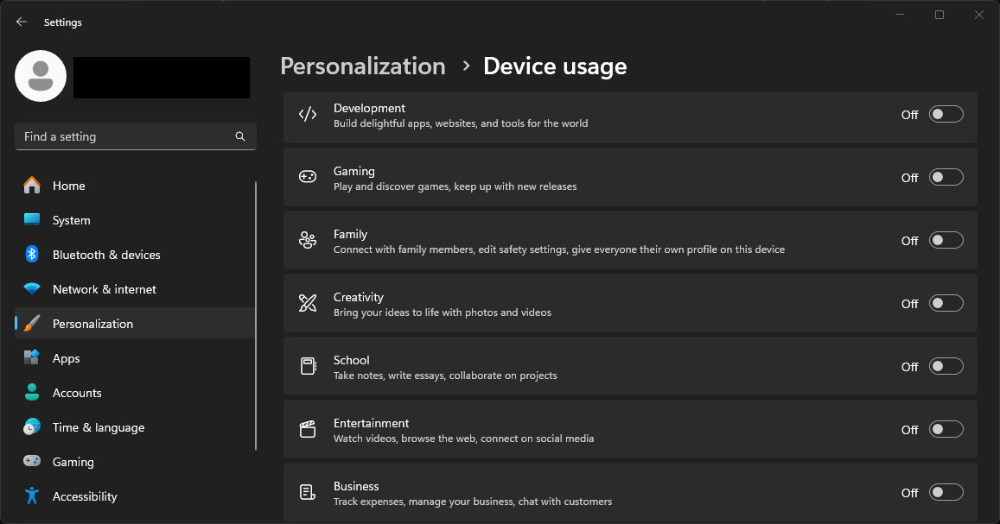
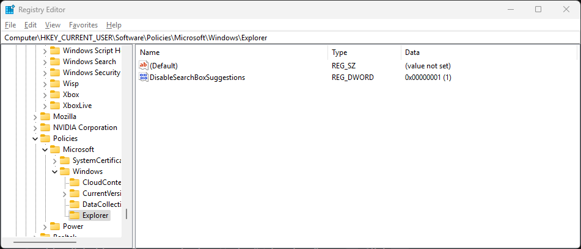
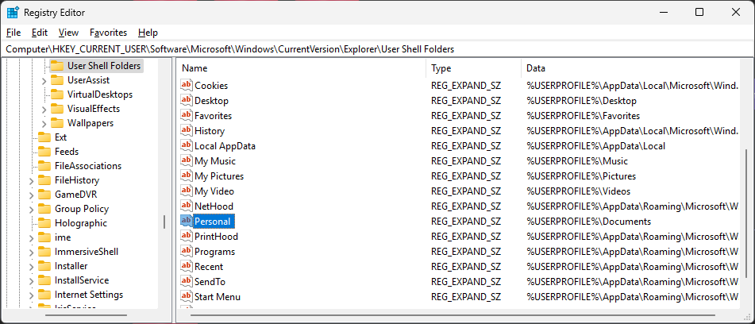

I've been using Windows since the XP days, but over the years, I've witnessed its gradual fall from grace. Now, Windows 11 feels like the culmination of the many bad practices in modern software: ads posing as helpful notifications; personalized feeds in search and on your lock screen; bloatware that you almost certainly don't need; and pre-enabled settings that disregard your privacy. I'm sure most casual users just accept that things have to be this way, but they don't.

In this guide, I'll walk you through some sensible (but opinionated) defaults for Windows settings. Where possible, I've included direct links to individual pages using Microsoft's [reserved URI scheme](https://learn.microsoft.com/en-us/windows/apps/develop/launch/launch-settings-app#ms-settings-uri-scheme-reference); clicking a direct link will open that page in your Settings app if you're on Windows. I've also linked to similar guides at the end.



## Recommended Settings

### 1. System

**Direct link**: [`ms-settings:system`](ms-settings:system)

| Setting        | Value |
| -------------- | ----- |
| Nearby sharing | `Off` |

### 2. Bluetooth & devices

**Direct link**: [`ms-settings:bluetooth`](ms-settings:bluetooth)

| Setting   | Value                         |
| --------- | ----------------------------- |
| Bluetooth | `Off`. Enable only as needed. |

### 3. Personalization

#### Lock screen

**Direct link**: [`ms-settings:personalization-lockscreen`](ms-settings:personalization-lockscreen)

| Setting                                                                                  | Value  |
| ---------------------------------------------------------------------------------------- | ------ |
| Personalize your lock screen > Get fun facts, tips, tricks, and more on your lock screen | `Off`  |
| Lock screen status                                                                       | `None` |

Everything else is up to you.

#### Start

**Direct link**: [`ms-settings:personalization-start`](ms-settings:personalization-start)

| Setting                                                                                 | Value |
| --------------------------------------------------------------------------------------- | ----- |
| Show recently added apps                                                                | `Off` |
| Show most used apps                                                                     | `Off` |
| Show recommended files in Start, recent files in File Explorer, and items in Jump Lists | `Off` |
| Show recommendations for tips, app promotions, and more                                 | `Off` |
| Show account-related notifications                                                      | `Off` |

#### Taskbar

**Direct link**: [`ms-settings:taskbar`](ms-settings:taskbar)

This one's completely down to preference. I like to hide Search, Task View, and Widgets. You can keep the search bar; I just find it redundant as a power user since the Windows key on my keyboard does the same thing.

#### Device usage

**Direct link**: [`ms-settings:deviceusage`](ms-settings:deviceusage)

Disable all of the settings on this page:

The only way they'd be on is if you enabled them during Windows 11 installation.

### 4. Apps

#### Installed apps

**Direct link**: [`ms-settings:appsfeatures`](ms-settings:appsfeatures)

Remove any bloatware you don't recognize. Common apps you might want to remove include but are not limited to:

- Copilot
- Feedback Hub
- Tips
- Weather
- To Do
- News/MSN
- Microsoft Solitaire Collection

#### Advanced app settings

| Setting                  | Value      |
| ------------------------ | ---------- |
| Choose where to get apps | `Anywhere` |
| Archive apps             | `Off`      |

#### Startup

**Direct link**: [`ms-settings:startupapps`](ms-settings:startupapps)

Remove any apps you recognize that you don't want to start every time your PC starts. For example, I don't use Microsoft Edge as my browser, so I turned it off.

### 5. Privacy & security

#### Find my device

**Direct link**: [`ms-settings:findmydevice`](ms-settings:findmydevice)

| Setting        | Value                                                                                                                                                                                                 |
| -------------- | ----------------------------------------------------------------------------------------------------------------------------------------------------------------------------------------------------- |
| Find my device | Optional. I don't like to have location tracking enabled all the time, but you may want to do this if you have reason to suspect your laptop may get stolen. Otherwise, I'd recommend turning it off. |

#### General

**Direct link**: [`ms-settings:privacy-general`](ms-settings:privacy-general)

| Setting                                                                     | Value |
| --------------------------------------------------------------------------- | ----- |
| Let apps show me personalized ads by using my advertising ID                | `Off` |
| Let websites show me locally relevant content by accessing my language list | `Off` |
| Let Windows improve Start and search results by tracking app launches       | `Off` |
| Show me suggested content in the Settings app                               | `Off` |
| Show me notifications in the Settings app                                   | `Off` |

#### Speech

**Direct link**: [`ms-settings:privacy-speech`](ms-settings:privacy-speech)

| Setting                   | Value                                                                                                                                 |
| ------------------------- | ------------------------------------------------------------------------------------------------------------------------------------- |
| Online speech recognition | `Off`, unless you rely on voice dictation, Windows Hello, or other Microsoft voice recognition apps. |

#### Inking & typing personalization

**Direct link**: [`ms-settings:privacy-speechtyping`](ms-settings:privacy-speechtyping)

| Setting                             | Value |
| ----------------------------------- | ----- |
| Custom inking and typing dictionary | `Off` |

#### Diagnostics & feedback

**Direct link**: [`ms-settings:privacy-feedback`](ms-settings:privacy-feedback)

| Setting                                         | Value   |
| ----------------------------------------------- | ------- |
| Diagnostic data > Send optional diagnostic data | `Off`   |
| Inking and typing                               | `Off`   |
| Tailored experiences                            | `Off`   |
| View diagnostic data                            | `Off`   |
| Feedback frequency                              | `Never` |

#### Activity History

**Direct link**: [`ms-settings:privacy-activityhistory`](ms-settings:privacy-activityhistory)

| Setting                                  | Value |
| ---------------------------------------- | ----- |
| Store my activity history on this device | `Off` |

#### Search permissions

**Direct link**: [`ms-settings:search-permissions`](ms-settings:search-permissions)

| Setting                | Value                                        |
| ---------------------- | -------------------------------------------- |
| SafeSearch             | `Off` (consider enabling for child accounts) |
| Cloud content search   | `Off`                                        |
| Search history         | `Off`                                        |
| Show search highlights | `Off`                                        |

Unfortunately, disabling "Show search highlights" through the Settings is not enough to stop showing web results in the search bar. Instead, we'll need to go into the Registry Editor and turn it off manually, as detailed in this thread: [How to disable 'Search the Web' Completley (sic) in windows 11?](https://answers.microsoft.com/en-us/windows/forum/all/how-to-disable-search-the-web-completley-in/ea22410a-3031-487f-b5de-5a0113d656c5).

1. Press <kbd>Win+R</kbd> on your keyboard to open the run dialog.
2. Type `regedit` and hit <kbd>Enter</kbd>.
3. Say yes to "Do you want to allow this app to make changes to your device?"
4. Go to `HKEY_CURRENT_USER\Software\Policies\Microsoft\Windows\Explorer`.
5. In the main/right pane, right-click and say `New > DWORD (32-bit) value`.
6. Type `DisableSearchBoxSuggestions` for the name.
7. Double-click this newly created value. Under "Value data," type `1`. Click `OK`.
8. Exit the Registry Editor and restart your computer so the changes take effect.

## How to Remove Microsoft 365

If you don't plan to use Microsoft 365, there's no point in keeping it installed on your system. Unfortunately, Microsoft doesn't let you uninstall Microsoft 365 through Settings like it does with most other apps. So you'll need to remove it manually:

1. Open File Explorer and navigate to `C:\Program Files`.
2. Find and delete the directory named `Microsoft Office` and any other variants.
3. Navigate to `%programdata%\Microsoft\Windows\Start Menu\Programs`. Delete any stale shortcuts like `Excel`, `Word`, `OneNote`, etc. that point to their now-deleted executables.
5. Navigate to `%localappdata%\Microsoft`. This directory contains application-specific user data, like configurations, backups, history, etc. Go through and delete any directories related to Office apps.

## How to Remove OneDrive

If you buy a new Windows laptop from a retailer or directly from a manufacturer, or even if you do a fresh Windows install, it's always going to come with OneDrive pre-installed. You'd expect this to be harmless, but OneDrive actually alters system paths during installation so that the familiar `Documents` shortcut points to OneDrive. I'll show you how to fix this, but while you're at it, I recommend completely uninstalling OneDrive unless you really need it.

### 1. Unlink this PC

See this Microsoft help page for a video walkthrough: [Unlink and re-link OneDrive](https://support.microsoft.com/en-us/office/unlink-and-re-link-onedrive-3c4680bf-cc36-4204-9ca5-e7b24cdd23ea).

1. Go to your system tray (chevron up arrow in the taskbar).
2. Click the OneDrive icon to open its popover.
3. Click the gear icon on the top-right of that window and choose `Settings`.
4. On the Account tab, click `Unlink this PC` under your name.

### 2. Uninstall OneDrive

1. Go to [`ms-settings:appsfeatures`](ms-settings:appsfeatures) to view your installed apps.
2. Search for OneDrive.
3. Click the ellipsis menu (`...`) on the right and choose `Uninstall`.
4. Open File Explorer, navigate to `%localappdata%\Microsoft`, and delete the `OneDrive` directory.

### 3. Update Document Paths

If you're coming from Windows 10, you probably expect `Documents` in File Explorer to point to `%userprofile%\Documents` (e.g., `C:\users\username\Documents`). Unfortunately, OneDrive hijacks this special `Documents` shortcut and points it to `%userprofile%\OneDrive`. And no, uninstalling OneDrive doesn't fix this.


I've found that this step isn't needed on a fresh Windows 11 install from a Windows Installation Media USB, but it does seem to be necessary on computers bought from retailers or manufacturers where the main drive already comes preloaded with the Windows 11 installer. I'm not sure why.


Thankfully [there's an easy fix](https://answers.microsoft.com/en-us/windows/forum/all/this-pc-documents-leads-to-onedrive-folder/4460c348-16af-4453-b13b-0b3308ca1ad7), but it once again requires using the Registry Editor:

1. Press <kbd>Win+R</kbd> on your keyboard to open the run dialog.
2. Type `regedit` and hit <kbd>Enter</kbd>.
3. Say yes to "Do you want to allow this app to make changes to your device?"
4. In the navigation bar at the top of this registry window, type `HKEY_CURRENT_USER\SOFTWARE\Microsoft\Windows\CurrentVersion\Explorer\User Shell Folders` and press <kbd>Enter</kbd>. You should see something like this:

5. Double-click `Personal` and set the value to `%USERPROFILE\Documents`. Click `OK`.
6. Repeat step 5 for any other path here where the value points to a OneDrive folder (e.g., `My Pictures`, `Desktop`, etc.).
7. Restart your computer.

## References and Further Reading

- [How to make Windows 11 more usable, less annoying](https://www.dedoimedo.com/computers/windows-11-usability-guide.html)
- [Windows 11 Privacy Settings](https://github.com/StellarSand/privacy-settings/blob/main/Privacy%20Settings/Windows-11.md)
- [Recommended Settings for Desktop/Laptop Devices](https://thenewoil.org/en/guides/moderately-important/desktop-settings/#windows-11)