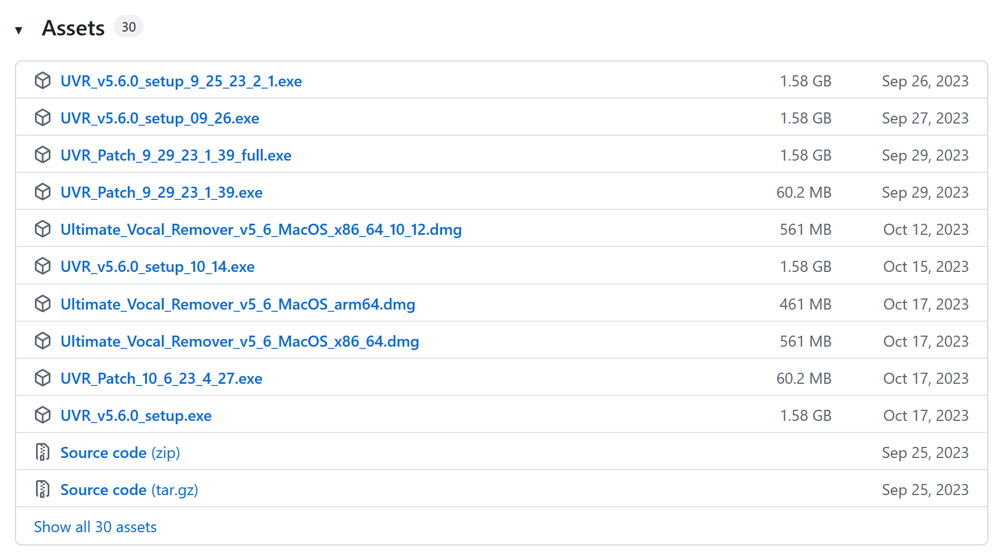
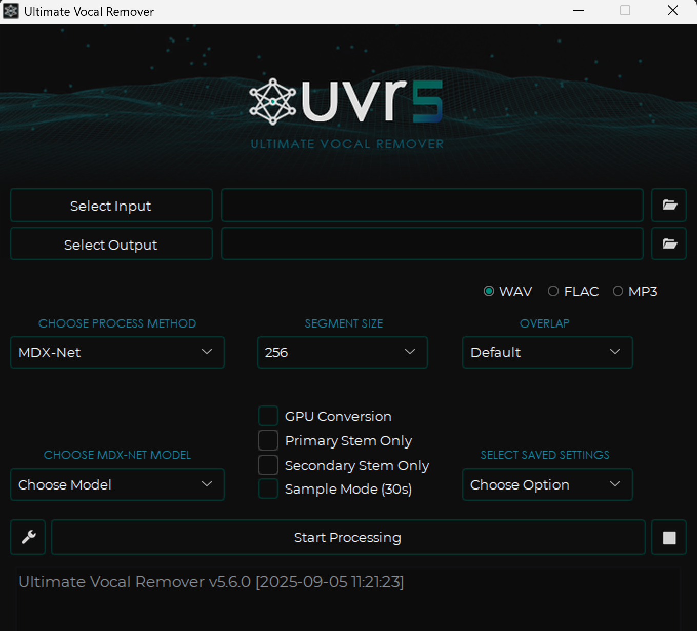
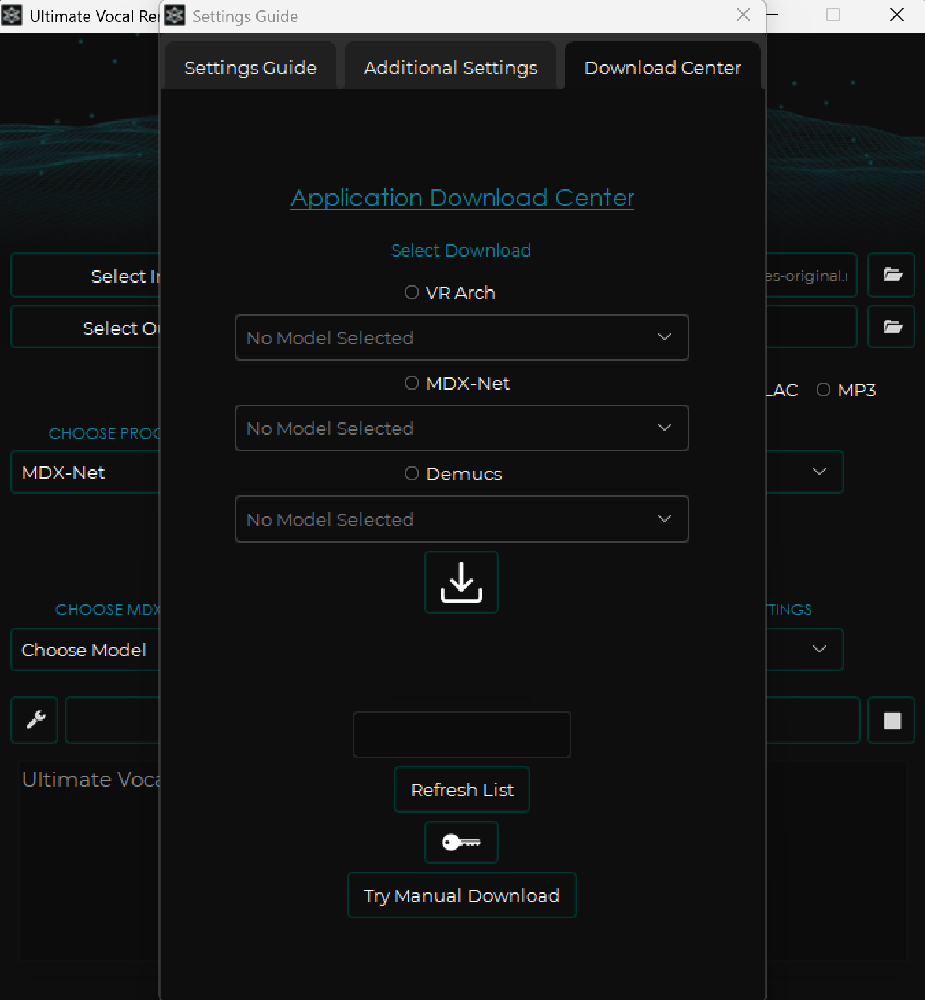
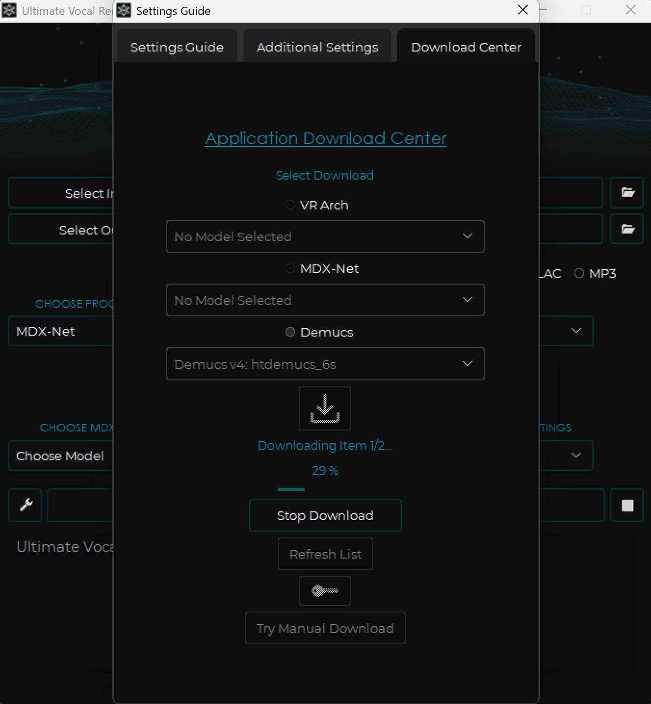
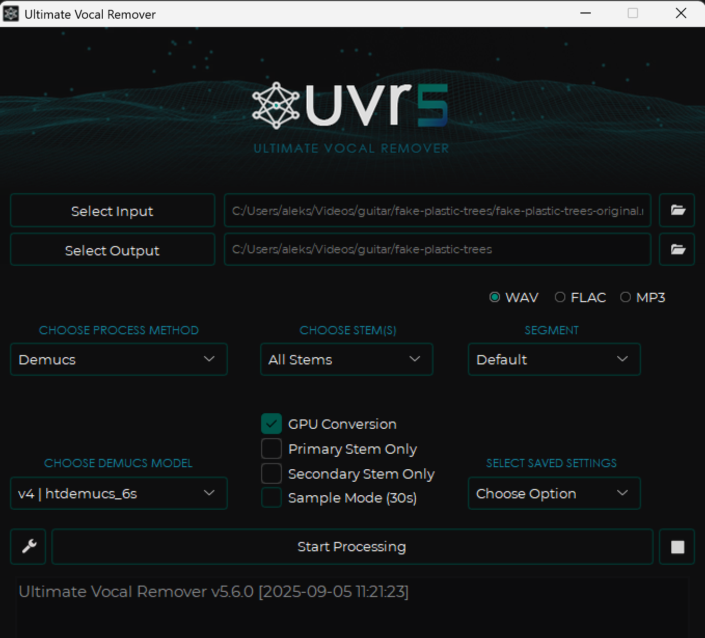

If you're covering music or trying to isolate an instrument for a practice session, you may find it helpful to use a <dfn>stem splitter</dfn>: software that takes an audio track, classifies its frequencies with machine learning, and generates separate audio files for each stem. Paid and free stem splitters have been around for a while, but one I personally like is [Ultimate Vocal Remover](https://github.com/Anjok07/ultimatevocalremovergui) (UVR) because it's free and open source, and it lets you pick from many different stem separation models that all run locally. I've used it for several of my own guitar covers, and I've been very happy with the results so far.

This is a short tutorial on how to set up and use this software, and most of it is based on [a helpful response on Reddit by u/Vizard](https://www.reddit.com/r/musicproduction/comments/1704kob/comment/ktj2y1u/?utm_source=share&utm_medium=web3x&utm_name=web3xcss&utm_term=1). I'm including screenshots and summarizing their answer here in case it ever gets deleted or I forget where to find the thread. I've also included a list of other free tools at the end.

## Using Ultimate Vocal Remover

1. Download [the latest release of Ultimate Vocal Remover from GitHub](https://github.com/Anjok07/ultimatevocalremovergui/releases).

2. Run the installer. When it finishes, open the app. You should see this:

3. Click the wrench icon to the left of the "Start Processing" button to open the settings menu. Navigate to the `Download Center` tab at the top of this window:

4. From the list of available models, click the radio button next to Demucs to select it. Then, click the dropdown and scroll until you find the model named `Demucs v4: htdemucs_6s`. Select it:


Note: [Demucs](https://github.com/facebookresearch/demucs) is just the name of an open-source stem separation model developed by researchers at Facebook (Meta). Specifically, `htdemucs_6s` was trained to extract six stems: bass, guitar, piano, drums, vocals, and other.


5. Click the Download button to download your selected model(s). You'll see a progress meter and a button to stop the download if you change your mind.

6. Once the download finishes, you can close the settings window and return to the main window. There, click the `Select Input` button to select your input file (e.g., a music video or audio file). Click `Select Output` to choose an output folder where you want UVR to save each stem. Under `Choose process method`, select `Demucs`. Under `Choose demucs model`, select the `htdemucs_6s` model you just downloaded. Finally, if your system has a GPU, consider checking that box to speed up the process.

7. Click Start Processing. Once it's finished, you'll be able to see the audio files for each stem in the output folder you selected earlier.

## Closing Remarks

Remember to use this tool ethically and responsibly. Do not use it to illegally redistribute copyrighted work or generate deepfakes.

I recommend that you upload any samples or covers you create only to YouTube since it has deals with record labels that allow it to keep your video up while also compensating the original copyright holders. See [Content ID](https://support.google.com/youtube/answer/2797370?hl=en).

If you find Ultimate Vocal Remover useful, consider [donating to the developer to support their work](https://buymeacoffee.com/uvr5). I'm not affiliated with the developer or their project, and this article wasn't sponsored.

## Other Tools

- [ISSE : An Interactive Source Separation Editor](https://isse.sourceforge.net/)
- [StemRoller](https://github.com/stemrollerapp/stemroller/) (free, open source, and also uses Demucs)
