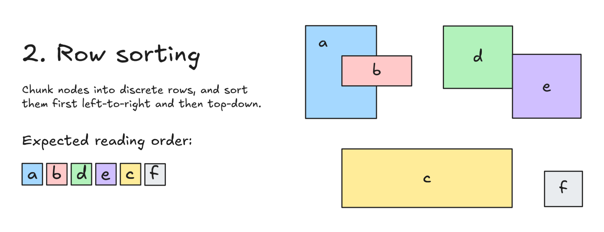
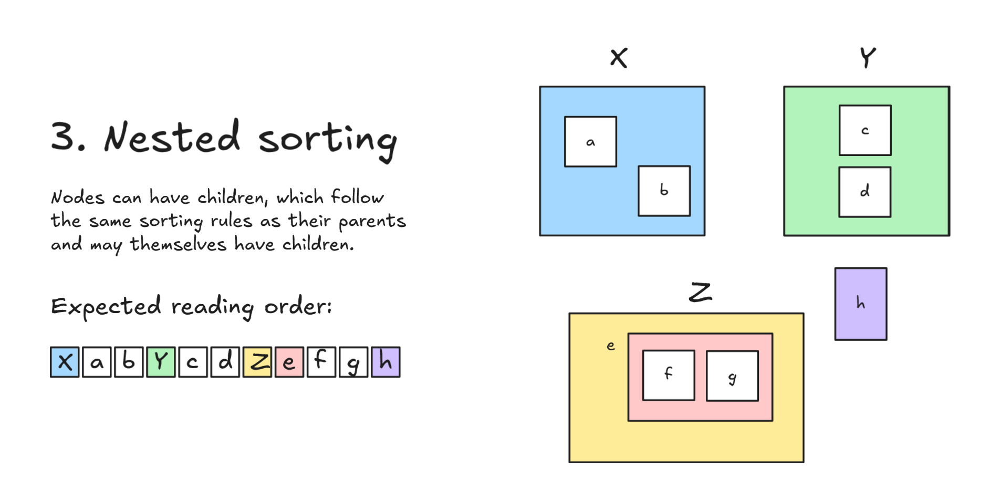

I was recently asked to complete this coding challenge, and I enjoyed it so much that I wanted to share it along with my solutions in this blog post. I can't link to the challenge since it's not publicly listed anywhere, but I've generalized the problem, rewritten the code, and created my own visuals and unit tests.

Problem: You're building an app where rectangular objects are drawn on a 2D canvas. Objects can be dropped onto the canvas in any order, anywhere. Your goal is to sort the objects by their natural reading order, given only their coordinates and dimensions and the following starter code. I'm using TypeScript for this tutorial, but you could easily port this to other languages.

```ts {data-file="sort.ts" data-copyable="true"}
// NOTE: y coordinates grow down, not up
interface Point {
  x: number;
  y: number;
}

export class RectNode {
  public id: string;
  private origin: Point;
  private width: number;
  private height: number;

  constructor(id: string, origin: Point, width: number, height: number) {
    this.id = id;
    this.origin = origin;
    this.width = width;
    this.height = height;
  }

  public get minX() {
    return this.origin.x;
  }

  public get minY() {
    return this.origin.y;
  }

  public get maxX() {
    return this.minX + this.width;
  }

  public get maxY() {
    return this.minY + this.height;
  }
}
```

A `RectNode` represents a rectangular object on the canvas; it has helper methods that return its top-left and bottom-right corners.

You're also given the following constraints:

- Objects are allowed to overlap with each other.
- There are only x and y axes (no stacking context or z axis).
- Objects may be provided to you in any arbitrary order.

The solutions to this exercise could be useful in canvas software since you might want to internally keep track of the reading order for drawn objects, maybe to assist screen readers or to sort them in a layers pane. Or maybe an AI in a game needs to visually sort entities that it sees before it does something.

## Part 1: Column sorting


The first part of the problem is mostly straightforward: Given a set of 2D objects, sort them in a left-to-right reading order and return a new array. For now, we're only going to worry about column-wise sorting and ignore "rows" of grouped objects. For example, the expected sorting order in the following diagram is `a b c d e f`. Since `b` and `c` share a left edge, we prefer the one that's closer to the top of the canvas.


Your task is to fill out the following boilerplate:

```ts {data-file="sort.ts" data-copyable="true"}
export function sortPart1(nodes: RectNode[]): RectNode[] {
  // your solution
  return [];
}
```

And here are some sample tests you can run to validate your solution:

```ts {data-file="sort.test.ts" data-copyable="true"}
import { test } from 'node:test';
import assert from 'node:assert';
import { RectNode, sortPart2 } from './sort.ts';

test('part 1', () => {
	const a = new RectNode('a', { x: 0, y: 0 }, 2, 3);
	const b = new RectNode('b', { x: 1, y: 1 }, 2, 1);
	const c = new RectNode('c', { x: 1, y: 4 }, 5, 2);
	const d = new RectNode('d', { x: 4, y: 0 }, 2, 2);
	const e = new RectNode('e', { x: 6, y: 1 }, 2, 2);
	const f = new RectNode('f', { x: 7, y: 5 }, 1, 1);
	assert.deepStrictEqual(sortPart1([]), []);
	assert.deepStrictEqual(sortPart1([a]), [a]);
	assert.deepStrictEqual(sortPart1([b, a]), [a, b]);
	assert.deepStrictEqual(sortPart1([f, e, d, c, b, a]), [a, b, c, d, e, f]);
	assert.deepStrictEqual(sortPart1([a, b, c, d, e, f]), [a, b, c, d, e, f]);
});
```


You could argue that the actual reading order should be `a b d e c f`, and you'd be right if we considered two dimensions. But this part focuses only on one dimension. We'll refine our approach in the second part, where we will group nodes into separate rows.



You may be tempted to just do this:

```ts {data-file="sort.ts" data-copyable="true"}
export function sortPart1(nodes: RectNode[]): RectNode[] {
  return nodes.sort((a, b) => a.minX - b.minX);
}
```

That's close, but it overlooks an important edge case: If two objects are perfectly left-aligned (have the same `minX`), our comparator will return zero, suggesting that the two objects should be treated equally in the sorting order when in reality they're not. In that scenario, we would actually want to return the object that's higher up on the canvas (i.e., the object with the smaller `minY`) since it would be "seen" first in a standard left-to-right, top-down writing mode. For example, in the diagram from earlier, we see that `b` and `c` have the same `x` coordinate, but we expect `b` to come first in the sorting order because it's closer to the top of the canvas.


Again, note that we are ignoring z-indexing to simplify this problem. Otherwise, we would need to consider that objects "closer" to us in the foreground should be read before objects in the background.


Here's the corrected solution:

```ts {data-file="sort.ts" data-copyable="true"}
export function sortPart1(nodes: RectNode[]): RectNode[] {
  return nodes.sort((a, b) => {
    if (a.minX < b.minX) {
      return -1;
    }
    if (a.minX > b.minX) {
      return 1;
    }
    return a.minY - b.minY;
  })
}
```

We could also simplify the code, although perhaps at the cost of readability:

```ts {data-file="sort.ts" data-copyable="true"}
export function sortPart1(nodes: RectNode[]): RectNode[] {
  return nodes.sort((a, b) => (a.minX - b.minX) || (a.minY - b.minY));
}
```


## Part 2: Row sorting

In the previous section, we saw that `c` came after `b` per the stated requirements, but this didn't feel right because it ignored the fact that we tend to read in a left-to-right, _top-to-bottom_ flow, one row at a time. So in a real document, you'd actually expect the reading order to be `a b d e c f`, as shown below:



To that end, we're now going to treat objects as if they belong to groups/rows and sort them first by row and then by column _within_ each row. Nodes belonging to rows near the top of the canvas should appear first in the reading order, while nodes belonging to rows closer to the bottom of the canvas should appear last. Your function should return a one-dimensional array of sorted nodes.

Rows won't be defined explicitly in the code; rather, rows are implicit, and a new row is created when there's a vertical gap of at least one pixel between the current node we are examining and the previous row. If the top edge of one node touches the bottom edge of another node, then the two are still treated as part of the same row for the purposes of this exercise.

```ts {data-file="sort.ts" data-copyable="true"}
export function sortPart2(nodes: RectNode[]): RectNode[] {
  // your solution
  return [];
}
```

Tests for this part:

```ts {data-file="sort.test.ts" data-copyable="true"}
import { test } from 'node:test';
import assert from 'node:assert';
import { RectNode, sortPart2 } from './sort.ts';

test('part 2', () => {
  const a = new RectNode('a', { x: 0, y: 0 }, 2, 3);
	const b = new RectNode('b', { x: 1, y: 1 }, 2, 1);
	const c = new RectNode('c', { x: 1, y: 4 }, 5, 2);
	const d = new RectNode('d', { x: 4, y: 0 }, 2, 2);
	const e = new RectNode('e', { x: 6, y: 1 }, 2, 2);
	const f = new RectNode('f', { x: 7, y: 5 }, 1, 1);
	assert.deepStrictEqual(sortPart2([]), []);
	assert.deepStrictEqual(sortPart2([a]), [a]);
	assert.deepStrictEqual(sortPart2([b, a]), [a, b]);
	assert.deepStrictEqual(sortPart2([f, e, d, c, b, a]), [a, b, d, e, c, f]);
	assert.deepStrictEqual(sortPart2([a, b, c, d, e, f]), [a, b, d, e, c, f]);
});
```


The hardest part about this problem is figuring out how to actually group the objects into rows; once you do that, the rest becomes easier.

I intuitively knew I would need to track the largest Y value seen so far and check every node against it to decide when to start a new row. Generally, this type of "largest value seen so far" logic usually produces code like this:

```ts
let largestSeenValue = -Infinity;

for (item of items) {
  if (item.value > largestSeenValue) {
    largestSeenValue = item.value;
    // do something else
  }
}
```

In our code, as soon as we see a rectangle whose origin is below the previous maximum (an imaginary horizontal line), we'll immediately start a new row by incrementing a row index. Here's the first attempt I came up with:

```ts {data-file="sort.ts" data-copyable="true"}
export function sortPart2(nodes: RectNode[]): RectNode[] {
  const rows: RectNode[][] = [];
  let rowIndex = -1;
  let largestSeenY = -Infinity;

  for (const node of nodes) {
    // This node starts a new row
    if (node.minY > largestSeenY) {
      rows[++rowIndex] = [];
      // Keep track of the bottom edge of this node
      largestSeenY = node.maxY;
    }
    // Push the node
    rows[rowIndex].push(node);
  }

  // Flatten all the rows
  return rows.flat();
}
```

Here, we create a 2D array of rows and push nodes into their respective rows. Whenever we see a node whose origin is below the largest `y` value seen so far, we start a new row by incrementing `rowIndex` and initializing that new row to an empty array. We also update the largest-seen value:

```ts
if (node.minY > largestSeenY) {
  rows[++rowIndex] = [];
  largestSeenY = node.maxY;
}
```

But a key step is missing from this solution: We also need to sort objects _within_ each row. We can do that at the end with a second pass over the array:

```ts
return rows.map((row) => sortPart1(row)).flat();
```

That _almost_ works, but there's another edge case: The incoming objects aren't guaranteed to be pre-sorted by row! For example, an object belonging to Row 3 may actually be the very first element in the `nodes` array, throwing off the "largest y seen so far" logic. This may happen if a user creates that bottom object first and then draws a couple other objects above it in the canvas. This is why the test file has two assertions with different source order but the same output order:

```ts {data-file="sort.test.ts"}
assert.deepStrictEqual(sortPart1([f, e, d, c, b, a]), [a, b, d, e, c, f]);
assert.deepStrictEqual(sortPart1([a, b, c, d, e, f]), [a, b, d, e, c, f]);
```

To fix this, we can actually use a clever trick: presorting the input array to make it easier to work with. Before we run our algorithm, we'll guarantee that the nodes we loop over are pre-sorted by their y-values so that bottommost nodes appear later in the array, and the topmost rows appear earlier:

```ts  
const presorted = nodes.sort((a, b) => a.minY - b.minY);
```

Now, we can safely resume our row-sort algorithm:

```ts {data-file="sort.ts" data-copyable="true"}
export function sortPart2(nodes: RectNode[]): RectNode[] {
  const presorted = nodes.sort((a, b) => a.minY - b.minY);
  const rows: RectNode[][] = [];
  let rowIndex = -1;
  let largestSeenY = -Infinity;

  // Run on the presorted array
  for (const node of presorted) {
    if (node.minY > largestSeenY) {
      rows[++rowIndex] = [];
      largestSeenY = node.maxY;
    }
    rows[rowIndex].push(node);
  }

  return rows.map((row) => sortPart1(row)).flat();
}
```

In terms of time complexity, we end up looping over all `n` nodes four times in total: once to presort, once to create rows, once more to sort within each row, and a final time to flatten, giving us `O(4n) = O(n)`. Maybe there's a cleaner way of doing this that avoids having to iterate over the nodes so many times, but this is the solution I came up with given limited time and help.


## Part 3: Nested sorting


In the final part of this coding challenge, we're still going to think of nodes as belonging to rows, but now nodes can also have nested children. In other words, nodes can be thought of as miniature canvases in which other nodes can be drawn.

<figure>
  
  <figcaption>It helps to visualize a line being drawn from node to node as your eyes scan the rectangles left-to-right, top-down. If a node has children, you go deeper into that node before exiting it.</figcaption>
</figure>

Here's the updated `RectNode` class, with a new public `children` property:

```ts {data-file="sort.ts" data-copyable="true"}
export class RectNode {
  public id: string;
  private origin: Point;
  private width: number;
  private height: number;
  // NEW!
  public children?: RectNode[];

  constructor(id: string, origin: Point, width: number, height: number, children?: RectNode[]) {
    this.id = id;
    this.origin = origin;
    this.width = width;
    this.height = height;
    // NEW!
    this.children = children;
  }

  // same methods as before
}
```

Note that the parent-child relationships are already provided to you explicitly, so you don't need to do any bounding-box calculations yourself. (Looking back on it now, that could be a fun bonus exercise, but it wasn't part of the original challenge I was asked to complete.)

Here are the corresponding tests for the diagram shown above:

```ts {data-file="sort.test.ts" data-copyable="true"}
import { test } from 'node:test';
import assert from 'node:assert';
import { RectNode, sortPart3 } from './sort.ts';

test('part 3', () => {
	const a = new RectNode('a', { x: 2, y: 2 }, 1, 1);
	const b = new RectNode('b', { x: 5, y: 3 }, 1, 1);
	const c = new RectNode('c', { x: 11, y: 1 }, 1, 1);
	const d = new RectNode('d', { x: 11, y: 3 }, 1, 1);
	const h = new RectNode('h', { x: 11, y: 7 }, 1, 2);
	const f = new RectNode('f', { x: 6, y: 10 }, 1, 1);
	const g = new RectNode('g', { x: 8, y: 10 }, 1, 1);
	const e = new RectNode('e', { x: 5, y: 9 }, 5, 4, [f, g]);
	const X = new RectNode('X', { x: 0, y: 0 }, 5, 5, [a, b]);
	const Y = new RectNode('Y', { x: 9, y: 0 }, 5, 5, [c, d]);
	const Z = new RectNode('Z', { x: 2, y: 8 }, 6, 5, [e]);
	assert.deepStrictEqual(sortPart3([]), []);
	assert.deepStrictEqual(sortPart3([a]), [a]);
	assert.deepStrictEqual(sortPart3([Z, X, Y, h]), [X, a, b, Y, c, d, Z, e, f, g, h]);
	assert.deepStrictEqual(sortPart3([Z, h, Y, X]), [X, a, b, Y, c, d, Z, e, f, g, h]);
});
```


The key to solving this part is recognizing that it's just recursion, with sub-problems that we've already solved. If we pretend for a second that there are no children, then this problem just collapses to a simple base case: our solution from Part 2. For the children, all we need to do is recursively sort them within each node (known as [pre-order traversal](https://en.wikipedia.org/wiki/Tree_traversal)): parents first, then their children. What's neat is that we barely have to write any code since we already wrote all the functions for sorting in the previous parts:

```ts {data-file="sort.ts" data-copyable="true"}
function sortPart3(nodes: RectNode[]): RectNode[] {
  // Sort top-most rows first
  const presorted = sortPart2(nodes);

  const sorted: RectNode[] = [];
  for (const node of presorted) {
    // Push this node (already sorted)
    sorted.push(node);
    // And then sort its children and push them
    if (node.children?.length) {
      sorted.push(...sortPart3(node.children));
    }
  }

  return sorted;
}
```

