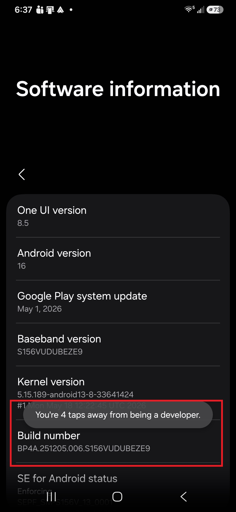
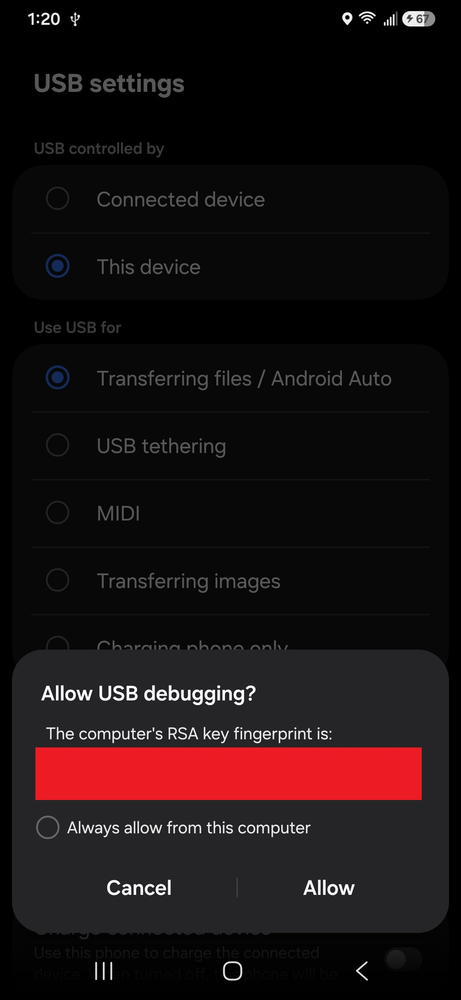
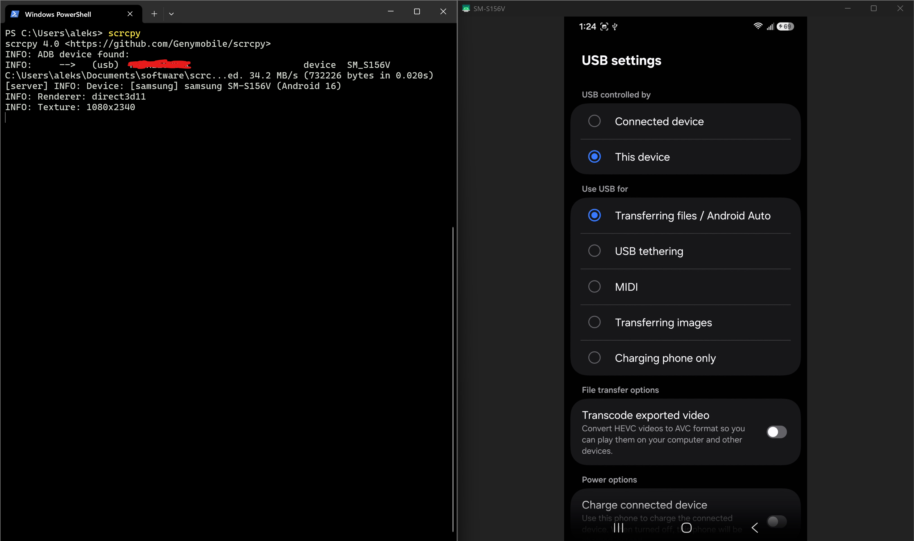

If your phone has a good mic and camera, you can just use it for recording everything. But sometimes you want to hook up an external mic for streaming audio to software like OBS. How do you then stream the video from your phone's camera? You _could_ just record the audio and video separately, but then you'd need to sync the two so they line up perfectly, and that can be annoying. Besides, most modern phones have better camera quality than comparable webcams anyway, so you may as well save some money.

It turns out that you can do this, but there are a few different options:

- On supported devices, use [Android 14+'s native USB camera feature](https://source.android.com/docs/core/camera/webcam).
- Use Windows Phone Link, DroidCam, Camo Studio, or [other third-party apps](https://obsproject.com/kb/smartphone-camera-guide).
- Use `scrcpy` to mirror your phone's camera to a dedicated window on your PC.

Unfortunately, my phone doesn't support the first option (thanks, Samsung!). Phone Link worked at first, but the video stream occasionally lagged since the app uses Bluetooth, and it eventually stopped working altogether. DroidCam is open source which is nice, but you need to pay for the pro version to remove the ads and watermark. And Cam Studio is way more than I need for something this simple.

[`scrcpy`](https://github.com/Genymobile/scrcpy) ("screen copy") is what I ended up using. It's free and open-source software that works on Windows, Mac, and Linux and allows you to mirror your phone screen to a window on your computer, which you can then record. By default it mirrors the entire device's screen, but you can also stream just the raw camera output itself so you don't see any device UI, which is perfect for my use case. I wrote this guide in case it helps other folks who want to do the same thing.

## Install `scrcpy`

Head over to the [`scrcpy` GitHub repository](https://github.com/genymobile/scrcpy#get-the-app) and follow the docs to install it for your operating system. If you download a zip archive, extract it to somewhere more permanent than just your downloads folder so you don't accidentally delete it later.


For your convenience, I'd recommend adding `scrcpy` to your shell profile so it can be invoked from anywhere. On Mac and Linux, you can do that by creating a soft link to the executable from your terminal. On Windows you'll want to [add the extracted folder to your user PATH variables](https://learn.microsoft.com/en-us/powershell/module/microsoft.powershell.core/about/about_environment_variables?view=powershell-7.6&utm_source=chatgpt.com#set-environment-variables-in-the-system-control-panel) (I couldn't get `scrcpy` to work in WSL, which is what I'd normally prefer to use instead). The instructions for doing this are beyond the scope of this tutorial as they're system dependent and mainly for power users. If you wanted to, you could always just click to run the executable from the folder every time. I prefer to have it on my shell profile so I can run it from anywhere.


Once it's installed, connect your phone to your computer via USB and run `scrcpy`. For now, you should see output like this:

```
scrcpy 4.0 <https://github.com/Genymobile/scrcpy>
ERROR: Could not find any ADB device
ERROR: Server connection failed
```

To fix this, we need to enable developer settings and USB debugging in Android so `scrcpy` can detect our phone.


Note: It's not actually `scrcpy` that is detecting your mobile device. Under the hood, it uses [ADB (Android Debug Bridge)](https://developer.android.com/tools/adb), which is part of the official Android SDK and allows you to start, stop, and debug connected devices (or even virtual devices/emulators).


## Enable Developer Settings

On Android, developer settings are hidden by default so regular users don't accidentally enable them and mess with their phone without understanding what they're doing. Here's how you can enable them:

1. On your phone, go to the Settings app.
2. Search for "About phone". You're looking for a screen that shows your Android build number. I had to go into Software Information on my Samsung.
3. Tap on the build number 7 times in a row and enter your PIN.



5. Go back to Settings and search for "Developer options". Verify that it's enabled.
6. On the same page, scroll all the way down and enable USB debugging. Tap OK.


## Mirror the Phone with `scrcpy`

With your phone still connected to your phone via USB, try running `scrcpy` again. You should see output like the following:

```
scrcpy 4.0 <https://github.com/Genymobile/scrcpy>
ERROR: Device is unauthorized:
ERROR:     -->   (usb)  [REDACTED]               unauthorized
ERROR: A popup should open on the device to request authorization.
ERROR: Check the FAQ: <https://github.com/Genymobile/scrcpy/blob/master/FAQ.md>
ERROR: Server connection failed
```

That's because most phones default to charging by USB instead of file transfer/debugging, but the latter is what we want. To change it:

1. Swipe down from the top of your phone.
2. Tap for more USB options.
2. Choose "Transferring files / Android Auto."
3. Tap Allow.



On your computer, run `scrcpy` again. You should see a new window pop up with your phone screen mirrored.



But we don't want to mirror the _entire_ phone; we just need the camera.

### Mirror Only the Camera

`scrcpy` has lots of CLI options you can use and [very detailed documentation on camera monitoring](https://github.com/Genymobile/scrcpy/blob/master/doc/camera.md). I like to invoke it with the following options:

``` {data-copyable="true"}
scrcpy 
  --video-source=camera 
  --camera-facing=front 
  --no-audio 
  --video-bit-rate=2M 
  --camera-size=1920x1080 
  --camera-fps=30
```

This basically says:

- Only use the camera output; don't record the whole screen.
- Only use the front-facing camera (check with `scrcpy --list-cameras`).
- Mute the mic (I don't need the audio, but you might).
- Use 2M for the bitrate (default can be slow).
- Set the aspect ratio to 1920x1080 for FHD (matches my phone's camera).
- Set the FPS to 30.

I saved this to a batch script to make it easier to run:

```bat {data-copyable="true"}
scrcpy --video-source=camera --camera-facing=front --no-audio --video-bit-rate=2M --camera-size=1920x1080 --camera-fps=30
pause
```

## Record the Phone Camera in OBS

Now that you're streaming your phone's camera to a window on your computer, you can record it using a window capture in OBS:

1. Click `+` under Sources to add a new source.
2. Choose Window Capture.
3. Pick the window for your mirrored phone camera.

Here's what that should look like if you did it correctly:




**Tip**: You may need to press <kbd>Ctrl/Cmd-F</kbd> to fit the video to screen. Make sure the aspect ratio of your scene matches the source video's resolution.


At this point, you could either record that video directly, or you could use OBS's virtual camera feature to use the video stream in other apps like Discord or Zoom.

That's all! I hope this helps.