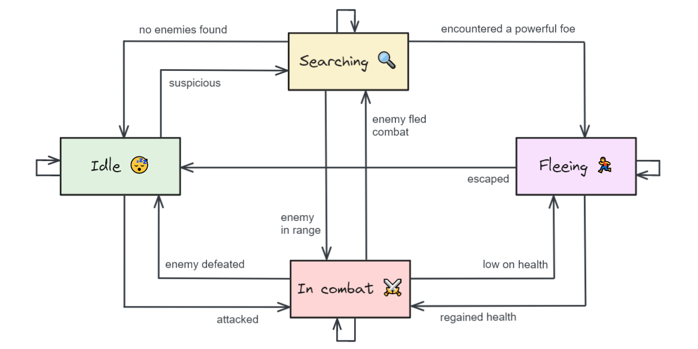

In code, we're often interested in modeling entities: agents or objects that occupy a given world or context. Entities are typically *stateful*, meaning they change their behavior based on their current state of being or mode of operation. For example, a character in a video game may be in one of several states at any given point in time: idle, searching for an enemy, fighting an enemy, or fleeing combat. If and when this entity transitions from one state to another depends on a number of factors: the character's health, whether an enemy is nearby, and so on. An entity may also choose to remain in its current state until some condition is met. We can represent these states and their associated decision-making logic with a diagram like the following, where rectangles denote states, arrows denote state transitions, and text denotes the condition that needs to be met:

<figure>

<figcaption><strong>Figure 1</strong>. A finite state machine diagram for a non-playable video game character.</figcaption>
</figure>

When translating a diagram such as this into code, switch statements and conditionals will only get us so far—as we add more states, the code complexity will balloon to a point that it will be difficult to read and maintain.

By comparison, the finite state design pattern represents each state as a class that an entity *owns*; states are capable of polling their associated entity to decide if and when to transition it to a different state. This is a widely used software design pattern that is much easier to scale for scenarios like the one described. In this tutorial, we'll learn what a finite state machine is and implement one in C++ for a toy problem.



## What Is a Finite State Machine?

In the book *Programming Game AI by Example* (2005), author Matt Buckland defines <dfn>finite state machines (FSMs)</dfn> as follows:


A finite state machine is a device, or a model of a device, which has a finite number of states it can be in at any given time and can operate on input to either make transitions from one state to another or to cause an output or action to take place. A finite state machine can only be in one
state at any moment in time.

The idea behind a finite state machine, therefore, is to decompose an object’s behavior into easily manageable “chunks” or states. The light switch on your wall, for example, is a very simple finite state machine. It has two states: on and off. Transitions between states are made by the input of your finger. By flicking the switch up it makes the transition from off to on, and by flicking the switch down it makes the transition from on to off.


A finite state "machine" (sometimes also referred to as an *automaton*) need not be a *literal* machine—in this context, *machine* merely refers to the fact that an entity's output (behavior) is a function of its input (state), much like how an actual machine produces different outputs for different inputs. It's a *finite* automaton because it has a limited (finite) number of states it can take on, and it can only ever be in one state at a time.

The finite state design pattern allows us to bundle up all the decision-making logic for an entity into a dedicated "state" class, meaning the entity no longer needs to exhaustively check all of its possible states to decide what to do. Instead, each state is aware of the entity with which it is associated as well as all other states that exist, allowing it to easily look up pertinent information about the entity and transition it to some other state if a condition is met. This design pattern leverages polymorphism and inheritance to allow an entity to have a generic `State` without concerning itself with *which* concrete state it's in—states regulate entities, rather than entities regulating themselves. One added benefit of this approach is that stateful logic can easily be shared between unrelated entities.

The idea behind FSMs will become more concrete once we start writing some code—and that's what we'll do next, borrowing Buckland's apt analogy of a light switch.

## Modeling Entity State in Code

Suppose we have a light switch that can be in one of four states:

1. Off
2. Low
3. Medium
4. High

The light is initially off. Toggling it cycles it to the next state, looping back around:

1. Off to Low
2. Low to Medium
3. Medium to High
4. High to Off

Diagrammatically, we can represent this as follows:


The simple nature of this problem makes it a useful tool for learning about the finite state design pattern without getting bogged down in irrelevant details.

There are several ways to implement this, ranging from trivial to more advanced. We'll take a look at some of the more basic approaches so we can build up our understanding of why finite state machines are useful.

### Approach 1: Array of Enums

The most basic implementation creates an array of states and takes advantage of numeric enums in C++ to simply increment the current state, wrapping it back around to the start of the array as needed:

```cpp
#include <array>

enum LightState {
    Off = 0,
    Low = 1,
    Medium = 2,
    High = 3,
};

std::array<LightState, 4> states {
    LightState::Off,
    LightState::Low,
    LightState::Medium,
    LightState::High,
};

LightState state = states[0];

void toggle() {
    state = states[(state + 1) % states.size()];
}
```

This would, in fact, be the preferred solution for a problem as simple as this one. But again, we're here to learn about finite state machines, which are widely used in practice to model more complex entity-state relationships.

### Approach 2: State Transition Table

In the array approach, state transitions are implicit and are dictated by the order in which the states are defined. Instead, we can define these transitions explicitly using a **state transition table**, mapping the current state to the next state using an actual `std::map` data structure:

```cpp {data-file="LightState.h" data-copyable=true}
#pragma once
#include <map>

enum class LightState {
	Off,
	Low,
	Medium,
	High
};

std::map<LightState, LightState> lightTransitions = {
	{LightState::Off, LightState::Low},
	{LightState::Low, LightState::Medium},
	{LightState::Medium, LightState::High},
	{LightState::High, LightState::Off}
};
```

We can then implement a basic `Light` class that toggles itself from one state to the next:

```cpp {data-file="Light.h" data-copyable=true}
#pragma once
#include "LightState.h"

class Light
{
public:
	Light() {};
	void toggle() { this->currentState = lightTransitions[this->currentState] };
};
private:
	LightState currentState { LightState::Off };
};
```

As I mentioned earlier, a Light starts in the off state. Calling the `toggle` method advances the light to its next state, using the `lightTransitions` transition lookup table.

#### State Transition Table Drawbacks

State transition tables are simple, but they have a limitation: What if we want to perform a certain action when we arrive at the next state or before we leave the current state? For example, maybe we want to change the intensity of the light, play a sound effect, or use some other effects unique to the state that we're entering or leaving. We could certainly do this—just add some code before and after the line where we're changing the state:

```cpp {data-file="Light.cpp" data-copyable=true}
void Light::toggle()
{
	// BEFORE: do something
	this->currentState = lightTransitions[this->currentState];
	// AFTER: do something
}
```

But typically, the actions we want to take before and after a state transition are *state dependent*. This means that we'll first need to check which state we're currently in so we can act accordingly, either with a `switch` statement or chained conditionals—both of which are difficult to maintain as the number of states grows.

```cpp {data-file="Light.cpp" data-copyable=true}
void Light::toggle()
{
	// BEFORE: do something
	switch (this->currentState) {
		case LightState::Off:
			break;
		case LightState::Low:
			break;
		// etc.
	}

	// DURING: transition from old state to new state
	this->currentState = lightTransitions[this->currentState];

	// AFTER: do something
	switch (this->currentState) {
		case LightState::Off:
			break;
		case LightState::Low:
			break;
		// etc.
	}
}
```

Thankfully, there's a better approach.

### Approach 3: Finite State Machine

Instead of using a state transition table and a `LightState` enum, what if we invert control and make each light state its own *class*? We can initialize state objects with a pointer to their associated Light instance, delegating the decision-making to the *current state* that a light is in. In other words, I'm proposing that we do something like this, where invoking a light's `toggle` method in turn invokes the current state's `toggle` method (because remember—we're now going to use classes instead of enums for the states):

```cpp {data-file="Light.h"}
#pragma once
#include "LightState.h"

class Light
{
public:
	Light();
	// Same as before
	inline LightState* getCurrentState() const { return currentState; }
	// In here, we'll delegate the state transition to the currentState
	void toggle();
	// This will get called by the current state
	void setState(LightState& newState);

private:
	// LightState here is now a class, not the enum that we saw earlier
	LightState* currentState;
};
```

```cpp {data-file="Light.cpp"}
#include "Light.h"

Light::Light()
{
  // TODO: set the initial state here
}

void Light::setState(LightState& newState)
{
	currentState->exit(this);  // do something before we change state
	currentState = &newState;  // change state
	currentState->enter(this); // do something after we change state
}

void Light::toggle()
{
	// Delegate the task of determining the next state to the current state!
	currentState->toggle(this);
}
```

Then, somewhere inside the current state's `toggle` method, we'll call the light's `setState` method and pass in the new state that we want to go to:

```cpp
void SomeLightState::toggle(Light* light)
{
	light->setState(SomeOtherLightState::getInstance());
}
```

Confused? Don't worry—I'm about to break it all down step by step.

This is known as the **finite state design pattern**. In this pattern, each state is modeled as a concrete class. So we'll need need the following four states for our light switch:

- `LightOff`
- `LowIntensity`
- `MediumIntensity`
- `HighIntensity`

Each class implements a common `LightState` interface (or, in C++ terms, an *abstract class*) that exposes the following three methods:

- `enter(Light*)`: What should we do upon entering this state?
- `toggle(Light*)`: What state, if any, should we transition to?
- `exit(Light*)`: What should we do upon exiting this state?

All three methods accept a pointer to the `Light` object with which the state is associated. How do they gain access to this pointer? Well, recall that we invoked `toggle` in our `Light` class like so:

```cpp
void Light::toggle()
{
	currentState->toggle(this);
}
```

In this code, a `Light` toggles its current state by passing along a pointer to itself, giving the state access to the entity that owns it. While doing so may seem like an unnecessary level of indirection, it's actually very useful. For example, in game development, this pattern allows the state to ask the entity certain questions, like how much health it currently has and so on. The state can then use that information to decide what state the entity should transition to. Health is too low? Transition to a more defensive/fleeing state. Health is high? Be more aggressive. Clearly, in the case of a light switch, there isn't really any information that we need to poll the `Light` instance that gets passed in.

One final note: Each state class typically follows the [singleton design pattern](https://refactoring.guru/design-patterns/singleton) to avoid unnecessary memory allocation and deallocation as we transition from one state to another, and then potentially back to a state that we were already in at one point. With our lights, if we didn't use singletons, we'd have to recreate our states every time we made a transition, and that would be wasteful. Plus, this design pattern is more efficient if we have multiple lights since the states are not tied to any particular instance—remember, they accept a pointer to an instance whenever any of their methods are called!

To understand how this all works in practice, we'll implement everything from scratch.

#### 1. The `LightState` Interface

Let's first define the abstract `LightState` class. You'll notice some forward declarations that are necessary to resolve circular includes that would otherwise throw off the C++ linker.

```cpp {data-file="LightState.h" data-copyable=true}
#pragma once
#include "Light.h"

// Forward declaration to resolve circular dependency/include
class Light;

class LightState
{
public:
	virtual void enter(Light* light) = 0;
	virtual void toggle(Light* light) = 0;
	virtual void exit(Light* light) = 0;
	virtual ~LightState() {}
};
```

Since this is a **pure abstract class**, we cannot create an instance of it. The `LightState` interface allows us to take advantage of polymorphism so we can refer to a generic state without having to specify the true type of state that a `Light` is currently in.


  **Note**: In practice, you would often take this a step further and create an abstract `EntityState` class that accepts a pointer to some generic `Entity` instance. `LightState` would extend `EntityState`, and `Light` would extend `Entity`.


#### 2. Concrete State Classes

Next, we'll declare all of our concrete state classes. We'll make each one a singleton by:

1. Defining a static `getInstance` method that returns a pointer to the singleton.
2. Declaring all constructors, copy constructors, and assignment operators as private.

```cpp {data-file="ConcreteLightStates.h" data-copyable=true}
#pragma once
#include "LightState.h"
#include "Light.h"

class LightOff : public LightState
{
public:
	void enter(Light* light) {}
	void toggle(Light* light);
	void exit(Light* light) {}
	static LightState& getInstance();

private:
	LightOff() {}
	LightOff(const LightOff& other);
	LightOff& operator=(const LightOff& other);
};

class LowIntensity : public LightState
{
public:
	void enter(Light* light) {}
	void toggle(Light* light);
	void exit(Light* light) {}
	static LightState& getInstance();

private:
	LowIntensity() {}
	LowIntensity(const LowIntensity& other);
	LowIntensity& operator=(const LowIntensity& other);
};

class MediumIntensity : public LightState
{
public:
	void enter(Light* light) {}
	void toggle(Light* light);
	void exit(Light* light) {}
	static LightState& getInstance();

private:
	MediumIntensity() {}
	MediumIntensity(const MediumIntensity& other);
	MediumIntensity& operator=(const MediumIntensity& other);
};

class HighIntensity : public LightState
{
public:
	void enter(Light* light) {}
	void toggle(Light* light);
	void exit(Light* light) {}
	static LightState& getInstance();

private:
	HighIntensity() {}
	HighIntensity(const HighIntensity& other);
	HighIntensity& operator=(const HighIntensity& other);
};
```

I created inlined, empty definitions for the `enter` and `exit` methods, as these are not essential for our purposes. They are merely there as placeholders, to show that you could fill those in if you wanted to. For example, you could fill these with print statements, or you could invoke some method on the light object that got passed in, such as `light->increaseGlow()`.

Let's also create definitions for all of the `toggle` and `getInstance` methods, to make things clearer:

```cpp {data-file="ConcreteLightStates.cpp" data-copyable=true}
#include "ConcreteLightStates.h"

void LightOff::toggle(Light* light)
{
	// Off -> Low
	light->setState(LowIntensity::getInstance());
}

LightState& LightOff::getInstance()
{
	static LightOff singleton;
	return singleton;
}

void LowIntensity::toggle(Light* light)
{
	// Low -> Medium
	light->setState(MediumIntensity::getInstance());
}

LightState& LowIntensity::getInstance()
{
	static LowIntensity singleton;
	return singleton;
}

void MediumIntensity::toggle(Light* light)
{
	// Medium -> High
	light->setState(HighIntensity::getInstance());
}

LightState& MediumIntensity::getInstance()
{
	static MediumIntensity singleton;
	return singleton;
}

void HighIntensity::toggle(Light* light)
{
	// High -> Low
	light->setState(LightOff::getInstance());
}

LightState& HighIntensity::getInstance()
{
	static HighIntensity singleton;
	return singleton;
}
```

I'm taking advantage of static variables to create my singletons in a legible manner. Moreover, note that I'm returning references, and not pointers, [to avoid leaking memory](https://stackoverflow.com/questions/13047526/difference-between-singleton-implemention-using-pointer-and-using-static-object).

Notice how each `toggle` method initiates the appropriate state transition by invoking `light->setState(...)` and passing in a singleton, via a call to the next state's `getInstance` method.

#### 3. The `Light` Class

The final piece of the puzzle is the `Light` class, particularly the `setState` method:

```cpp {data-file="Light.h" data-copyable=true}
#pragma once
#include "LightState.h"

// Forward declaration to resolve circular dependency/include
class LightState;

class Light
{
public:
	Light();
	inline LightState* getCurrentState() const { return currentState; }
	void toggle();
	// This is where the magic happens
	void setState(LightState& newState);

private:
	LightState* currentState;
};
```

```cpp {data-file="Light.cpp" data-copyable=true}
#include "Light.h"
#include "ConcreteLightStates.h"

Light::Light()
{
	// All lights are initially turned off
	currentState = &LightOff::getInstance();
}

void Light::setState(LightState& newState)
{
	currentState->exit(this);  // do something before we change state
	currentState = &newState;  // actually change states now
	currentState->enter(this); // do something after we change state
}

void Light::toggle()
{
	// Delegate the task of determining the next state to the current state
	currentState->toggle(this);
}
```

This is where the `enter` and `exit` methods come into play. Before we change states, we call the exit method on the previous state. Then, we set the current state to the new state and invoke the enter method. But again, since we haven't defined the behavior for these two methods, they won't really do anything; they're just here to show you that you *could* do those things if you wanted to.

And we're done! This is a pretty standard finite state machine implementation, and you can easily extend this to any other language you want.

## Further Reading

As I mentioned earlier, this was a pretty trivial use case for finite state machines. In fact, you don't really need the finite state design pattern to solve this particular problem. However, because the problem itself is so simple—a light switch that simply changes from one state to another—I felt it was a perfect way to introduce FSMs without overcomplicating things. That said, I'd like to briefly mention two other examples of when you might want to use a finite state machine:

1. [Modeling a vending machine](https://stackoverflow.com/questions/14676709/c-code-for-state-machine). This StackOverflow thread offers a pretty good discussion of some design approaches to a real-world interview problem. The accepted answer suggests using the finite state design pattern because of how extensible it is. Interestingly, the second highest rated answer suggests using a state transition table as an alternative.
2. [Modeling AI in a game](https://gameprogrammingpatterns.com/state.html). This post goes into great detail in the context of game dev and even touches on one advantage of finite state machines that I mentioned earlier in this post: the ability to query or "poll" the entity to determine what state transition should take place.

To develop a deeper understanding of finite state machines, I also encourage you to reference the book *Programming Game AI by Example* by Mat Buckland. Chapter 2 covers the state-driven agent design pattern; you can [download the companion code](https://github.com/wangchen/Programming-Game-AI-by-Example-src) and run it yourself as you work through the chapter explanations. This is how I initially learned about finite state machines.

I hope you found this tutorial helpful!
