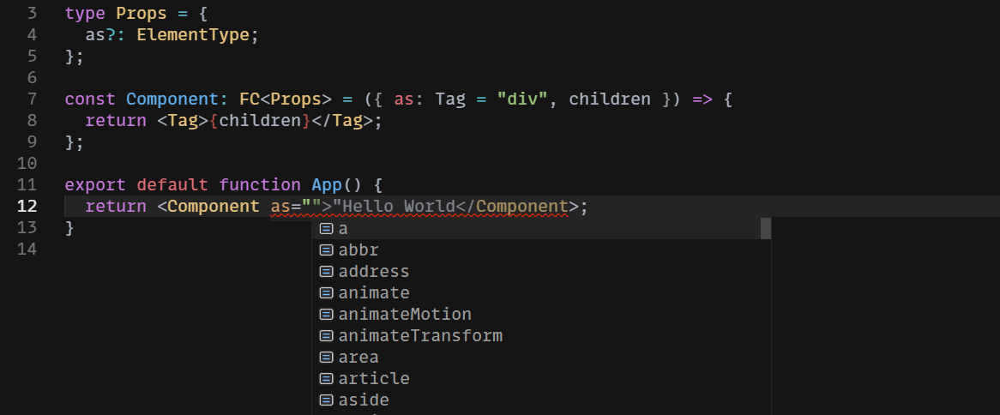

In React, you sometimes need to allow users to pass in a tag name prop to a component as a string. You may have encountered this pattern if you've ever worked with the [`react-intl` library for internationalized strings](https://formatjs.io/docs/react-intl/components/#formattedmessage), where the `FormattedMessage` component accepts an optional `tagName` prop:

```tsx
<FormattedMessage id="common.close" tagName="p" />
```

Layout components are a good real-world use case for this—they might apply some styling under the hood, but they should still be flexible enough to render any valid HTML tag. Examples include reusable grid layouts (which need not always render divs), vertical rhythm layouts, and more.

To keep this tutorial simple, I'll create a pointless demo component:

```tsx {data-file="components/Component/index.tsx" data-copyable=true}
import { FC } from 'react';
interface ComponentProps {}
const Component: FC<ComponentProps> = (props) => <div {...props} />;
```

You *could* always render a `div`, but that's inflexible—it may work well for most use cases, but there could also be situations where you need to render a different tag for semantics.

To fix this, you can use the [`ElementType` type](https://flow.org/en/docs/react/types/#toc-react-elementtype) to allow passing in a tag name as a prop:

```tsx {data-file="components/Component/index.tsx" data-copyable=true}
import { ElementType, HTMLAttributes, FC } from 'react';

interface ComponentProps extends HTMLAttributes<HTMLOrSVGElement> {
  as?: ElementType;
}

const Component: FC<ComponentProps> = ({ as: Tag = 'div', ...otherProps }) => {
  return <Tag {...otherProps} />;
};

export default Component;
```

If you're not using TypeScript, you can still use a faux-TypeScript syntax to document your component's props using jsDoc. VS Code will correctly pick up the types and still give you autocomplete intellisense. You would type your component exactly the same way as shown here, just with jsDoc syntax.

There are two things worth noting here.

First, [React expects component names to be capitalized](https://reactjs.org/docs/jsx-in-depth.html#user-defined-components-must-be-capitalized); lowercase names are reserved for built-in tags. But we want to follow the convention of using lowercase names for the tag name prop. To get around this, we destructure the `as` prop and alias it as `Tag`.

Second, our component renders a `div` by default. We do this with destructuring and default assignment in the component's signature. But you can override this behavior by passing in a custom tag name on an as-needed basis:

```tsx {data-file="components/Navbar/index.tsx" data-copyable=true}
import Component from 'components/Component';
import { FC } from 'react';

const Parent: () => {
  return <Component as="p" />
};
```

Since we've specified that the `as` prop is of type `ElementType`, we'll get auto-complete intellisense whenever we try to set this prop:



In some cases, you may want to instead use [render props](https://reactjs.org/docs/render-props.html), but they're not always needed—sometimes, all you really want is to be able to specify a tag name as a string. You typically only need to use render props if the element needs to know about the component-level state to decide how to render itself. Here, we're just telling the component what to render by passing in a plain string as a tag name prop. The syntax is shorter and easier to read.

And that's all there is to it!


